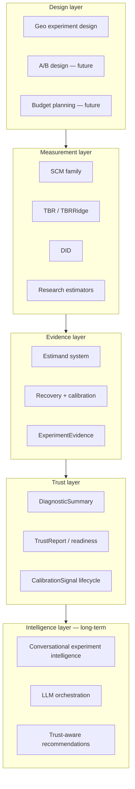

# Experimentation platform vision

**Status:** strategic architecture (not a delivery commitment)  
**Last updated:** 2026-05-26  
**Package version:** 0.2.1 (current implementation)  
**Governance context:** `docs/ROADMAP_V3.md`, `docs/OPEN_INVESTIGATIONS.md`

This document describes where `panel_exp` is heading as an **experimentation and causal measurement platform**. It does not change code, maturity labels, or calibration eligibility.

---

## Vision

Build a **world-class experimentation and causal measurement platform** where geo experiments, A/B tests, and marketing mix models share one evidence layer: explicit estimands, reproducible calibration signals, and human-governed trust — not black-box “significant effect” outputs.

**Today:** expert-review geo-experiment toolkit with validation instrumentation.  
**Tomorrow:** unified causal operating system for design, measurement, calibration exchange, and trust-aware recommendations.

**Not claimed today:** `production_safe` estimators, automated decisioning, or package-wide nominal certification.

---

## Platform philosophy

| Principle | Implication |
|-----------|-------------|
| **Evidence before promotion** | Estimator advancement policy chain (estimand → recovery → alignment → OC → failure analysis → calibration). |
| **Validation-first** | Recovery plumbing and green tests are necessary, not sufficient. |
| **Human-in-the-loop** | Readiness and cards are advisory; governance retains accountability. |
| **Deferred ≠ abandoned** | Strategic capabilities tracked in `OPEN_INVESTIGATIONS.md`. |
| **Explainability over automation** | Trust comes from documented operating characteristics, not opaque scores. |
| **No production-safe theater** | Labels and claims follow archived evidence, not marketing. |

---

## Unified experimentation architecture

**Near-term reality:** geo measurement + evidence exports are partially built; A/B convergence and intelligence layers are vision-only.

---

## GeoX + A/B convergence

| Dimension | Geo (today) | A/B (future) | Convergence |
|-----------|-------------|--------------|-------------|
| Unit of randomization | Market / geo | User / session | Shared panel abstractions |
| Estimand | `relative_att_post` path | Lift / conversion lift | Estimand registry with family mapping |
| Inference | Jackknife, bootstrap, etc. | Frequentist / Bayesian tests | Shared interval semantics |
| Validation | Recovery + Run 001 class archives | Same OC methodology | Unified calibration harness |
| Evidence export | Experiment card, bundle | Same schema family | `ExperimentEvidence` |

**Mid-term goal:** one experimentation layer with type-specific estimators but **shared contracts** for estimand, intervals, calibration status, and trust signals.

---

## ExperimentEvidence ecosystem

A portable evidence object (conceptual — not a new schema version in v0.2.1) linking:

- Declared estimand and inference mode  
- Point and interval outputs with `interval_estimand` alignment flags  
- Recovery/calibration run references (Run 001 class)  
- Failure analysis and OC characterization docs  
- Review flags and pretrend / interference metadata  
- Human review notes and waiver discipline  

**Purpose:** evidence reuse across studies, teams, and downstream systems (MMM, budget tools, recommendation engines).

---

## Estimand system

| Layer | Role |
|-------|------|
| **Declared estimand** | What the study claims (e.g. `relative_att_post`) |
| **Family export** | What each estimator actually estimates |
| **Recovery score** | What validation optimizes (`_path_relative_att`) |
| **Interval estimand** | What CIs cover (gated in `recovery_intervals.py`) |

**Open gap:** cross-family enforcement (see `OPEN_INVESTIGATIONS.md` — estimand not enforced).

**Vision:** single estimand registry consumed by design, measurement, calibration, and trust layers — without silent consensus ATT.

---

## DiagnosticSummary / TrustReport role

| Artifact | Today | Vision |
|----------|-------|--------|
| **Review flags** | Opt-in via `build_estimator_review` | Default workflow hooks for expert-review exports |
| **Readiness assessment** | Advisory profiles | Inputs to TrustReport, not auto-blockers |
| **Experiment card** | Human-readable summary | Facet of DiagnosticSummary |
| **TrustReport** | Conceptual aggregate | Single reviewer-facing trust narrative with explicit limits |

**Philosophy:** TrustReport summarizes **what is known, what is deferred, and what failed** — not a green/red production gate.

---

## CalibrationSignal lifecycle

1. **Design** — hypothesis, estimand, scenarios  
2. **Recovery** — finite metrics or typed failures  
3. **Production run** — n≥100 archive (Run 001 pattern)  
4. **Failure analysis** — mechanism doc when OC fails  
5. **Characterization** — width/power/geometry (Phase 11 SCM template)  
6. **Eligibility decision** — registry update with skip reasons  
7. **Exchange** — share calibration signals across studies (future)  

**Today:** steps 1–3 partial; step 6 = `SCM_UnitJackKnife` null monitor only.  
**Not:** automatic certification from step 2 alone.

---

## MMM calibration integration

Marketing mix models need **calibrated incrementality inputs**, not raw lift point estimates.

| Integration point | Vision |
|-------------------|--------|
| Geo lift posterior / interval | Export aligned intervals with explicit conservatism bounds |
| Calibration transfer | MMM priors informed by archived OC docs, not single runs |
| Conflict detection | Flag when MMM implied lift disagrees with experiment evidence |
| Budget feedback | Closed loop from experiment memory to spend recommendations |

**Status:** research backlog; no MMM API in v0.2.1.

---

## Conversational experiment intelligence

Long-term: natural-language interfaces over **ExperimentEvidence** — “Why is SCM power zero on this panel?”, “What skip_reason blocks BRB?”, “Compare DID cumulative vs relative estimand.”

**Constraints:** LLM outputs must cite archived runs and investigations; no unsourced promotion claims.

---

## LLM orchestration future

| Use case | Guardrail |
|----------|-----------|
| Study design assistant | Must declare estimand + interference assumptions |
| Validation runner orchestration | Read-only characterization; no threshold tuning |
| Investigation triage | Pull from `OPEN_INVESTIGATIONS.md` |
| Report drafting | Mandatory human review; advisory language only |

**Not in scope:** autonomous promotion, automated blocking gates, or unsupervised `production_safe` labeling.

---

## Recommendation systems

Trust-aware recommendations combine:

- Experiment outcomes (point + interval + estimand)  
- CalibrationSignal status (eligible / skipped / characterized)  
- DiagnosticSummary flags (pretrend, donor health)  
- Study memory (prior geo tests on overlapping markets)  

**Output:** ranked actions with **explicit uncertainty and deferred gaps** — not binary “launch / don’t launch.”

---

## Budget planning integration

| Flow | Vision |
|------|--------|
| Pre-test power / MDE | Simulation semantics aligned with recovery null worlds (open investigation) |
| Post-test update | Bayesian or frequentist update using ExperimentEvidence |
| Portfolio view | Cross-experiment calibration exchange informs spend |

**Today:** `PowerAnalysis` simulation MDE exists; alignment with recovery DGP is incomplete.

---

## Human-in-the-loop governance

| Decision | Who decides |
|----------|-------------|
| Estimator selection | Human + catalog maturity |
| Pretrend waiver | Human with documented discipline |
| Nominal eligibility | Evidence chain + governance docs |
| Production-safe label | Human committee + external benchmarks (none today) |
| TrustReport interpretation | Human reviewer |

Software provides **instrumentation**; humans retain **accountability**.

---

## Explainability philosophy

- Every interval states **interval type** and **estimand**.  
- Every calibration claim links to **archived run + failure analysis**.  
- Every deferral links to **OPEN_INVESTIGATIONS** entry.  
- Conservatism (e.g. SCM jackknife) is **documented limitation**, not hidden failure.  

Explainability beats opaque trust scores.

---

## Long-term moat

| Moat source | Why it compounds |
|-------------|------------------|
| **Calibration archive library** | Reusable OC evidence across clients and verticals |
| **Estimand discipline** | Hard to retrofit into competitors’ implicit ATT stacks |
| **Investigation ledger** | Institutional honesty builds reviewer trust |
| **Experiment memory** | Cross-study learning on geo panels |
| **Trust-aware optimization** | Recommendations that respect calibration limits |
| **Unified geo + A/B evidence** | Single causal OS vs siloed lift tools |

---

## Why experimentation is becoming a causal operating system

Experimentation is shifting from **one-off significance tests** to a **reusable causal infrastructure**:

| Shift | Platform response |
|-------|-------------------|
| **Evidence reuse** | ExperimentEvidence + calibration archives persist beyond a single deck |
| **Calibration exchange** | Run 001 class artifacts comparable across teams and time |
| **Trust-aware recommendations** | Systems must know *when not* to act (SCM null-monitor role) |
| **Experiment memory** | Prior geo tests inform design and priors for the next test |
| **Unified causal intelligence** | Geo, A/B, and MMM draw on one estimand and trust layer |

Organizations that treat experiments as isolated analyses will lose to platforms that **accumulate calibrated causal knowledge** — with humans still governing promotion and decisions.

---

## Roadmap sequencing (vision ↔ delivery)

| Horizon | Focus | Docs |
|---------|-------|------|
| **Near-term** | Estimator OC, calibration evidence, governance | `ROADMAP_V4.md` Phases 11–15 |
| **Mid-term** | Unified experimentation layer, A/B support, shared contracts, MMM hooks | This doc § GeoX + A/B, MMM |
| **Long-term** | Conversational intelligence, orchestration agents, adaptive experimentation | This doc § LLM, recommendations |

**Re-audit trigger:** after Phases 11–15 → `ROADMAP_V5.md`.

---

*Strategic vision only. Does not modify estimator code, maturity labels, inference modes, or artifact schemas.*
