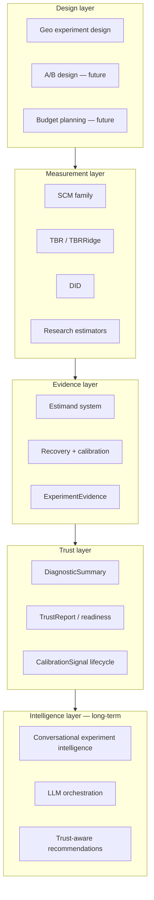

# Experimentation platform vision

**Status:** strategic architecture (not a delivery commitment)  
**Last updated:** 2026-05-28  
**Package version:** 0.2.1 (current implementation)  
**Governance context:** `docs/ROADMAP_V3.md`, `docs/ROADMAP_V4.md` (Tracks A/B/C), `docs/OPEN_INVESTIGATIONS.md`

This document describes where `panel_exp` is heading as an **experimentation and causal measurement platform**. It does not change code, maturity labels, or calibration eligibility.

**Conceptual reference (not a blueprint):** User-level conversion lift and incrementality practice — including industry methodologies such as **Google Conversion Lift** (ghost ads, exposure-opportunity logging, user-randomized designs, feasibility planning) — informs **governance semantics** for Track C. External methods are **not** copied mathematically or certified without archived operating-characteristic evidence.

---

## Vision

Build a **world-class experimentation and causal measurement platform** where geo experiments, A/B tests, conversion lift studies, and marketing mix models share one evidence layer: explicit estimands, reproducible calibration signals, and human-governed trust — not black-box “significant effect” outputs.

**Today:** expert-review geo-experiment toolkit with validation instrumentation.  
**Tomorrow:** unified **governed experimentation operating system** for design, measurement, calibration exchange, feasibility governance, and trust-aware recommendations.

**Platform identity:** Experimentation systems are **governed measurement instruments**, not generic significance-testing utilities.

**Not claimed today:** `production_safe` estimators, automated decisioning, or package-wide nominal certification.

---

## Platform philosophy

| Principle | Implication |
|-----------|-------------|
| **Evidence before promotion** | Estimator advancement policy chain (estimand → recovery → alignment → OC → failure analysis → calibration). |
| **Validation-first** | Recovery plumbing and green tests are necessary, not sufficient. |
| **Human-in-the-loop** | Readiness and cards are advisory; governance retains accountability. |
| **Deferred ≠ abandoned** | Strategic capabilities tracked in `OPEN_INVESTIGATIONS.md`. |
| **Explainability over automation** | Trust comes from documented operating characteristics, not opaque scores. |
| **No production-safe theater** | Labels and claims follow archived evidence, not marketing. |
| **Inconclusive ≠ no effect** | Trust outcomes must distinguish absence of evidence from evidence of absence. |
| **Feasibility is governance** | Experiment viability is a governed assessment — not only a power formula. |

---

## Unified experimentation architecture

**Near-term reality:** geo measurement + evidence exports are partially built; A/B convergence and intelligence layers are vision-only.

---

## GeoX + A/B convergence

| Dimension | Geo (today) | A/B (future) | Convergence |
|-----------|-------------|--------------|-------------|
| Unit of randomization | Market / geo | User / session | Shared panel abstractions |
| Estimand | `relative_att_post` path | Lift / conversion lift | Estimand registry with family mapping |
| Inference | Jackknife, bootstrap, etc. | Frequentist / Bayesian tests | Shared interval semantics |
| Validation | Recovery + Run 001 class archives | Same OC methodology | Unified calibration harness |
| Evidence export | Experiment card, bundle | Same schema family | `ExperimentEvidence` |

**Mid-term goal:** one experimentation layer with type-specific estimators and tests but **shared contracts** for estimand, intervals, calibration status, feasibility, and trust signals.

---

## Randomization-unit semantics (future)

Experiment architecture must distinguish **how** units are randomized — each maps to `ExperimentSpec`, `ExperimentEvidence`, calibration compatibility, and TrustReport boundaries.

| Randomization unit | Modality | Future contract hooks |
|--------------------|----------|------------------------|
| User / session | A/B, conversion lift | Assignment integrity, SRM (INV-025) |
| Exposure-opportunity | Ghost-ad / opportunity logging (conceptual) | Eligibility semantics (INV-026) |
| Geo / market | GeoX (today) | Panel geometry, interference review |
| Cohort / holdout | MMM incrementality holdouts | Holdout governance, replay rules |
| Aggregate replay | MMM calibration update | Calibrated contribution estimand (INV-023) |

**Not in v0.2.1:** no user-level randomization implementation — geo remains the implemented modality.

---

## Experiment feasibility governance (future)

A shared **feasibility engine** (conceptual) supports governed viability assessment across A/B, conversion lift, GeoX, and holdouts — **not** a standalone power calculator.

| Input domain | Examples |
|--------------|----------|
| Design | Baseline rate, expected lift, MDE target, duration |
| Traffic & spend | Volume, budget, conversion lag |
| Statistical | Variance, clustering, randomization unit |
| Causal | Interference assumptions, spillover risk |

| Output domain | Examples |
|---------------|----------|
| Viability | Feasibility score (advisory), run / extend / redesign recommendation |
| Precision | Expected CI width, power estimate, minimum detectable effect |
| Governance | Links to TrustReport (`underpowered`, `inconclusive`) and ExperimentSpec constraints |

**Investigation:** INV-022. **Reference:** conversion-lift feasibility practice informs governance questions — not copied formulas.

---

## ExperimentEvidence ecosystem

A portable evidence object (conceptual — not a new schema version in v0.2.1) linking:

- Declared estimand and inference mode  
- Point and interval outputs with `interval_estimand` alignment flags  
- Recovery/calibration run references (Run 001 class)  
- Failure analysis and OC characterization docs  
- Review flags and pretrend / interference metadata  
- Human review notes and waiver discipline  

**Purpose:** evidence reuse across studies, teams, and downstream systems (MMM, budget tools, recommendation engines).

---

## Estimand system

### Unified estimand philosophy

GeoX, conversion lift, A/B tests, MMM replay/calibration, and budget optimization must share **governed estimand semantics** — with explicit contracts for aggregation, transforms, and trust boundaries.

| Estimand (examples) | Modality | Governance note |
|---------------------|----------|-----------------|
| Absolute incremental lift | A/B, CLS | Declare outcome scale and lag window |
| Relative lift / `relative_att_post` | GeoX | Current best-documented geo contract |
| ATT | GeoX, DID | Map family export to recovery score explicitly |
| iROAS | MMM + lift | Requires calibration compatibility (INV-023) |
| Incremental conversions / revenue | CLS, A/B | Exposure-eligibility semantics (INV-026) |
| Calibrated contribution | MMM replay | Posterior informed by experiment OC archives |
| Δμ (mean shift) | A/B frequentist | Must map to business estimand; not silent “lift” |

### Transformation and compatibility rules (future)

| Concern | Policy direction |
|---------|------------------|
| **Allowed transformations** | CUPED, variance reduction — only when estimand contract preserved (INV-022) |
| **Aggregation semantics** | Pooled vs unit vs geo — documented; ties to INV-003, INV-020 |
| **Compatibility rules** | Which exports may feed MMM, TrustReport, eligibility registry |
| **Calibration eligibility** | n≥100 archives; aligned intervals; skip reasons when not met |
| **Trust boundaries** | TrustReport states supported / inconclusive / incompatible / stale |

| Layer | Role |
|-------|------|
| **Declared estimand** | What the study claims (e.g. `relative_att_post`, incremental conversions) |
| **Family export** | What each estimator or test actually estimates |
| **Recovery score** | What validation optimizes (`_path_relative_att` for geo today) |
| **Interval estimand** | What CIs cover (gated in `recovery_intervals.py`) |

**Open gap:** cross-family enforcement (see `OPEN_INVESTIGATIONS.md` — estimand not enforced; **INV-020** for unified contracts).

**Vision:** single estimand registry consumed by design, measurement, calibration, feasibility, and trust layers — without silent consensus ATT.

## DiagnosticSummary / TrustReport role

| Artifact | Today | Vision |
|----------|-------|--------|
| **Review flags** | Opt-in via `build_estimator_review` | Default workflow hooks for expert-review exports |
| **Readiness assessment** | Advisory profiles | Inputs to TrustReport, not auto-blockers |
| **Experiment card** | Human-readable summary | Facet of DiagnosticSummary |
| **TrustReport** | Conceptual aggregate | Single reviewer-facing trust narrative with explicit limits |

### Experiment outcome taxonomy (future TrustReport semantics)

| Outcome | Meaning |
|---------|---------|
| `supported_positive` | Evidence supports positive incremental effect under declared estimand |
| `supported_negative` | Evidence supports negative incremental effect |
| `inconclusive` | Insufficient evidence — **does not imply “no effect”** |
| `underpowered` | Feasibility / power inputs indicate design unlikely to detect stated MDE |
| `incompatible_estimand` | Measurement does not match declared estimand contract |
| `stale` | Evidence outside freshness or superseded by newer study |
| `interference_detected` | Interference / spillover diagnostics exceed review threshold |
| `calibration_unavailable` | No archived calibration path for claimed modality or config |

**Investigation:** INV-021 (user-randomized and cross-modality TrustReport semantics).

**Philosophy:** TrustReport summarizes **what is known, what is deferred, what failed, and what is inconclusive** — not a green/red production gate.

---

## CalibrationSignal lifecycle

1. **Design** — hypothesis, estimand, scenarios  
2. **Recovery** — finite metrics or typed failures  
3. **Production run** — n≥100 archive (Run 001 pattern)  
4. **Failure analysis** — mechanism doc when OC fails  
5. **Characterization** — width/power/geometry (Phase 11 SCM template)  
6. **Eligibility decision** — registry update with skip reasons  
7. **Exchange** — share calibration signals across studies (future)  

**Today:** steps 1–3 partial; step 6 = `SCM_UnitJackKnife` null monitor only.  
**Not:** automatic certification from step 2 alone.

---

## MMM calibration integration

Marketing mix models need **calibrated incrementality inputs**, not raw lift point estimates.

| Integration point | Vision |
|-------------------|--------|
| Geo lift posterior / interval | Export aligned intervals with explicit conservatism bounds |
| Conversion lift → MMM bridge | Experiment-to-MMM compatibility resolver (INV-023) |
| Calibration transfer | MMM priors informed by archived OC docs, not single runs |
| Conflict detection | Flag when MMM implied lift disagrees with experiment evidence |
| Budget feedback | Closed loop from experiment memory to spend recommendations |
| Holdout replay | Cohort holdout governance with evidence freshness rules |

**Status:** research backlog / Track C; no MMM API in v0.2.1.

---

## Conversational experiment intelligence

Long-term: natural-language interfaces over **ExperimentEvidence** and governed contracts — “Why is SCM power zero on this panel?”, “What skip_reason blocks BRB?”, “Is this A/B estimand compatible with MMM calibration?”, “Why is this study `inconclusive` rather than null?”

**Constraints:** LLM outputs must cite archived runs, investigations, and TrustReport semantics; **no unsourced promotion claims**. Orchestration operates **through** `ExperimentSpec`, estimand registry, and trust boundaries — not by bypassing governance.

**Investigations:** INV-020–INV-026 (Track C) define the contracts agents must ground on.

---

## LLM orchestration future

| Use case | Guardrail |
|----------|-----------|
| Study design assistant | Must declare estimand, randomization unit, interference assumptions |
| Feasibility assistant | Advisory outputs only; link to INV-022 semantics |
| Validation runner orchestration | Read-only characterization; no threshold tuning |
| Investigation triage | Pull from `OPEN_INVESTIGATIONS.md` |
| Report drafting | Mandatory human review; use TrustReport outcome taxonomy |
| MMM calibration assistant | Must respect INV-023 compatibility rules |

**Not in scope:** autonomous promotion, automated blocking gates, unsupervised `production_safe` labeling, or treating `inconclusive` as “no lift.”

---

## Recommendation systems

Trust-aware recommendations combine:

- Experiment outcomes (point + interval + estimand)  
- CalibrationSignal status (eligible / skipped / characterized)  
- DiagnosticSummary flags (pretrend, donor health)  
- Study memory (prior geo tests on overlapping markets)  

**Output:** ranked actions with **explicit uncertainty and deferred gaps** — not binary “launch / don’t launch.”

---

## Budget planning integration

| Flow | Vision |
|------|--------|
| Pre-test power / MDE | Simulation semantics aligned with recovery null worlds (open investigation) |
| Post-test update | Bayesian or frequentist update using ExperimentEvidence |
| Portfolio view | Cross-experiment calibration exchange informs spend |

**Today:** `PowerAnalysis` simulation MDE exists; alignment with recovery DGP is incomplete.

---

## Human-in-the-loop governance

| Decision | Who decides |
|----------|-------------|
| Estimator selection | Human + catalog maturity |
| Pretrend waiver | Human with documented discipline |
| Nominal eligibility | Evidence chain + governance docs |
| Production-safe label | Human committee + external benchmarks (none today) |
| TrustReport interpretation | Human reviewer |

Software provides **instrumentation**; humans retain **accountability**.

---

## Explainability philosophy

- Every interval states **interval type** and **estimand**.  
- Every calibration claim links to **archived run + failure analysis**.  
- Every deferral links to **OPEN_INVESTIGATIONS** entry.  
- Conservatism (e.g. SCM jackknife) is **documented limitation**, not hidden failure.  

Explainability beats opaque trust scores.

---

## Long-term moat

The moat is **trust-aware causal infrastructure** — not estimator count or statistical-method breadth.

| Moat source | Why it compounds |
|-------------|------------------|
| **Trustworthy evidence lineage** | Archived runs, failure analysis, investigation ledger |
| **Calibration governance** | Honest eligibility, skip reasons, OC libraries |
| **Estimand alignment** | Cross-modality contracts (geo, CLS, A/B, MMM) |
| **Experiment compatibility** | Feasibility + MMM resolver + randomization semantics |
| **Explainability** | TrustReport taxonomy; inconclusive ≠ no effect |
| **Causal operating-system infrastructure** | Unified ExperimentEvidence, replay, freshness |
| **Calibration archive library** | Reusable OC evidence across clients and verticals |
| **Experiment memory** | Cross-study learning on geo panels and future user-level studies |
| **Trust-aware optimization** | Recommendations that respect calibration limits |

**Not the moat:** having SCM, TBR, DID, or the widest estimator catalog without governance.

---

## Why experimentation is becoming a causal operating system

Experimentation is shifting from **one-off significance tests** to a **reusable causal infrastructure**:

| Shift | Platform response |
|-------|-------------------|
| **Evidence reuse** | ExperimentEvidence + calibration archives persist beyond a single deck |
| **Calibration exchange** | Run 001 class artifacts comparable across teams and time |
| **Trust-aware recommendations** | Systems must know *when not* to act (SCM null-monitor role) |
| **Experiment memory** | Prior geo tests inform design and priors for the next test |
| **Unified causal intelligence** | Geo, A/B, conversion lift, and MMM draw on one estimand, feasibility, and trust layer |

Organizations that treat experiments as isolated significance tests will lose to platforms that **accumulate governed causal knowledge** — with humans still governing promotion and decisions.

---

## Track C — user-level experimentation & conversion lift (future)

Extends governed architecture from geo to **user-randomized incrementality** (A/B, conversion lift, holdouts). Sequenced **after Track A stabilization and Track B shared contracts**.

| Future capability | Investigation |
|-------------------|---------------|
| Unified estimand contracts across modalities | INV-020 |
| User-randomized TrustReport semantics | INV-021 |
| Feasibility & viability engine | INV-022 |
| Experiment-to-MMM compatibility | INV-023 |
| Sequential test governance | INV-024 |
| SRM / randomization integrity | INV-025 |
| Exposure eligibility / opportunity logging | INV-026 |

See [`ROADMAP_V4.md`](ROADMAP_V4.md) § Track C. **No implementation in v0.2.1.**

---

## Roadmap sequencing (vision ↔ delivery)

| Horizon | Focus | Docs |
|---------|-------|------|
| **Near-term (Track A)** | Estimator OC, calibration evidence, governance | `ROADMAP_V4.md` Phases 11–15, `PHASE12_INVESTIGATION_PLAN.md` |
| **Mid-term (Track B)** | Unified experimentation layer, shared contracts, geo evidence exports | This doc § ExperimentEvidence, estimand registry |
| **Mid/long-term (Track C)** | A/B, conversion lift, feasibility, MMM calibration bridge | This doc § Track C; INV-020–026 |
| **Long-term** | Conversational intelligence through governed contracts | This doc § LLM, TrustReport taxonomy |

**Re-audit trigger:** after Phases 11–15 → `ROADMAP_V5.md`.

---

*Strategic vision only. Does not modify estimator code, maturity labels, inference modes, or artifact schemas.*
