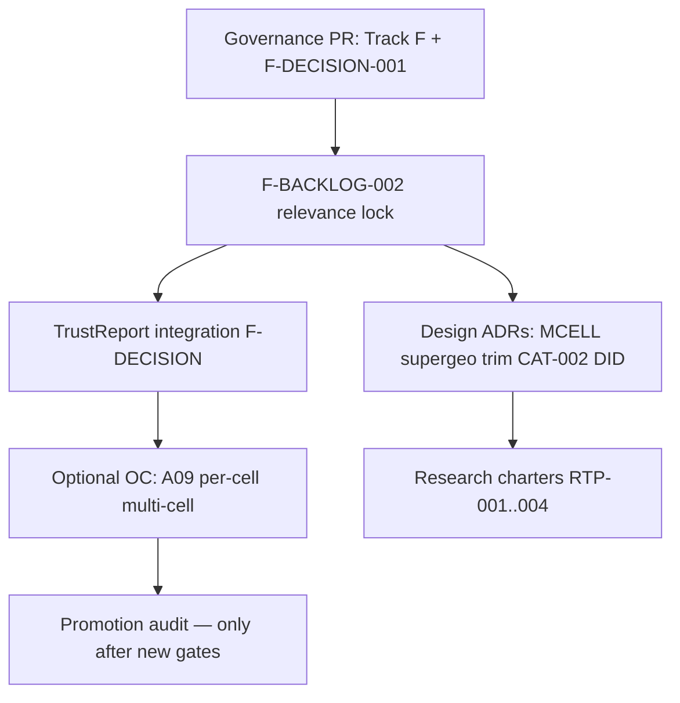

# F-BACKLOG-002 — Industry / literature backlog relevance review

**Document ID:** F-BACKLOG-002  
**Type:** Governance / research prioritization — **no implementation**  
**Status:** **complete**  
**Date:** 2026-06-03  
**Verdict:** Re-rank parked items by **investigation value**, not production promotion; **external importance does not override** AUDIT-010 / F-DECISION-001 gates  
**Prerequisites:** TRACK-F-IMPLEMENTATION-CHECKPOINT-001 · F-DECISION-001 (`637bb29`) · F-BACKLOG-001 · AUDIT-010

**Related:** [`TRACK_D_CONCEPTUAL_VALIDITY_AUDIT_001.md`](TRACK_D_CONCEPTUAL_VALIDITY_AUDIT_001.md) · [`TRACK_D_METHOD_INVENTORY_AND_ROBUSTNESS_MATRIX_001.md`](TRACK_D_METHOD_INVENTORY_AND_ROBUSTNESS_MATRIX_001.md) · [`TRACK_E_E2_METHOD_DESIGN_SUITABILITY_CARDS_001.md`](TRACK_E_E2_METHOD_DESIGN_SUITABILITY_CARDS_001.md) · [`F_DECISION_001`](F_DECISION_001_METHOD_ELIGIBILITY_AND_DECISION_POLICY.md) · [`METHOD_READINESS_AND_COMPATIBILITY_MATRIX_001`](METHOD_READINESS_AND_COMPATIBILITY_MATRIX_001.md) (layered decomposition of this review)

---

## 1. Executive summary

Track F and F-DECISION-001 made the platform **safe to assign roles** (null monitor, diagnostic comparator, falsification, excluded/blocked). F-BACKLOG-002 answers a different question:

> *Among parked or partial methods, which deserve future attention — and which should stay buried?*

| Outcome | Count (this review) |
|---------|---------------------|
| **Decision-layer candidates** (already or soon in F-DECISION surfacing) | 6 readout families |
| **OC priority** (narrow, post-governance) | 2 (A09 optional, multi-cell per-cell) |
| **Design ADR before code** | 5 (supergeo, trim, pooling, placebo taxonomy depth, AugSynth BRB) |
| **Research-to-production charter** | 2 (BayesianTBR MCMC, TROP — R&D only) |
| **Parked watch** (high industry, low readiness) | 4 (A16/A21 behavior, GeoLift parity docs, trimmed/supergeo) |
| **Keep blocked / permanent** | 8+ policy blocks |

**Binding rule (§2):** Industry standard or competitor feature parity **may elevate investigation priority**; it **does not** relax `GOVERNED_UNCERTAINTY_EXPORT_ALLOWLIST`, CalibrationSignal policy, MMM ingress, or AUDIT-010 Appendix A buckets without a **new governance PR + OC + validity review**.

---

## 2. Governance rule — external importance ≠ production use

```text
IF external_importance_score >= 4
   AND internal_readiness_score < 3
THEN recommended_lane IN (design_ADR, research_to_production_charter, parked_watch)
     — NOT promotion_candidate_later without AUDIT re-open

IF audit_010_bucket IN (blocked, invalid_by_geometry, invalid_by_interface, research_only)
THEN recommended_lane != promotion_candidate_later
     UNLESS explicit AUDIT-010 amendment + OC + conceptual validity pass

F-DECISION-001 role assignment is authoritative for production decision posture today.
F-BACKLOG-002 does not change resolver code or allowlists.
```

**Literature anchors (non-exhaustive):**

| Family | Common industry / academic reference | Platform stance |
|--------|--------------------------------------|-----------------|
| SCM + jackknife | Abadie et al. synthetic control; donor LOO uncertainty | **Null-monitor only** (A26) |
| GeoLift / geo SC | Facebook GeoLift; market-level synthetic controls | **Partial** — unit SCM+JK is reference; market designs need supergeo ADR |
| CausalImpact / BSTS | Brodersen et al.; Google CausalImpact | **Analog** to class TBR aggregate 1×1 — restricted diagnostic (A07, A10) |
| Augmented SC | Ben-Michael et al.; augmented synth | **Diagnostic comparator** (A01–A05) |
| Ridge / panel regression | Common marketing science | **TBRRidge** — unit restricted; scale ≠ SCM+JK |
| Conformal / cross-conformal | Chernozhukov et al.; conformal inference | **Diagnostic** when characterized (A05, A18) |
| Trimmed / design-based | Trimmed match designs (marketing experiments) | **Blocked** without estimand bridge (A30) |
| Diff-in-diff bootstrap | Standard panel DID | **Restricted** — relative ATT CI deferred (A25) |

---

## 3. Scoring methodology

| Field | Meaning |
|-------|---------|
| **external_importance_score** (0–5) | Industry/adoption salience; 5 = table-stakes in geo-experimentation products |
| **internal_readiness_score** (0–5) | Contracts + OC + conceptual validity; 5 = characterized_restricted or governed null-monitor |
| **product_relevance** | Fit to design×geometry×instrument product (Track E) |
| **implementation_cost** | Effort to reach next governance milestone |
| **risk_if_promoted_too_early** | Harm from MMM/CS/governed lift if promoted before gates |
| **decision_layer_role_today** | F-DECISION-001 assignment if wired today |
| **recommended_lane** | Next governance/program action — **not** production promotion |

**Composite rank (for sorting only):**  
`rank_score = external_importance + internal_readiness + product_weight − risk_penalty − cost_penalty`  
(product high=+2, med=+1; risk/cost high=−2, med=−1) — ties broken by governance safety.

---

## 4. Ranked backlog table

Sorted by **descending investigation value under governance** (not production readiness).

| Rank | Item | AUDIT / backlog ID | Ext | Int | Prod | Cost | Risk | **decision_layer_role_today** | **recommended_lane** |
|-----:|------|-------------------|----:|----:|------|------|------|------------------------------|----------------------|
| 1 | **SCM + UnitJackKnife** (001e unit panel) | A26; E5 | 5 | 5 | high | low | low | `primary_null_monitor` | **decision_layer_candidate** (active) |
| 2 | **SCM + Placebo** (single-treated falsification) | A27; PLACEBO-001 | 5 | 4 | high | low | low | `falsification_check` | **decision_layer_candidate** (active) |
| 3 | **AugSynthCVXPY + Conformal** | A05; F-INF-003 | 4 | 4 | high | low | med | `diagnostic_comparator` | **decision_layer_candidate** |
| 4 | **TBRRidge + Conformal** | A18; F-INF-002/003 | 4 | 4 | med | low | med | `diagnostic_comparator` | **decision_layer_candidate** |
| 5 | **TBRRidge + TimeSeriesKfold** | A19; F-INF-003 | 3 | 4 | med | low | med | `diagnostic_comparator` | **decision_layer_candidate** |
| 6 | **Class TBR aggregate 1×1** (CausalImpact-style) | A07, A10; TBR-001 | 5 | 3 | high | med | med | `diagnostic_comparator` | **diagnostic_only** + **parked_watch** |
| 7 | **AugSynthCVXPY point / JK / Kfold** | A01–A03 | 4 | 4 | med | low | med | `diagnostic_comparator` | **diagnostic_only** |
| 8 | **TBRRidge Kfold / BRB** | A13–A15 | 3 | 4 | med | low | med | `diagnostic_comparator` | **diagnostic_only** |
| 9 | **Placebo / falsification policy** (taxonomy, multi-cell) | A28; F-P0-005 | 4 | 4 | high | low | low | `falsification_check` / `blocked` | **decision_layer_candidate** (policy doc) |
| 10 | **DID + native bootstrap** | A25; F-P0-004 | 4 | 3 | med | med | med | `diagnostic_comparator` | **design_ADR** (relative CI) + **parked_watch** |
| 11 | **Per-cell multi-cell diagnostics** | D5-MCELL; F-P0-006 | 4 | 3 | high | med | med | `diagnostic_comparator` (per cell) | **OC_priority** (characterization) + **design_ADR** (pooling) |
| 12 | **A09 class TBR + JKP** | A09; F-INF-004 | 3 | 2 | med | low | med | `excluded` / `sensitivity_check` | **OC_priority** (optional) — not charter |
| 13 | **GeoLift / market-level SC narrative** | GEO-003; supergeo | 5 | 1 | high | high | high | `blocked` | **design_ADR** → **research_to_production_charter** |
| 14 | **Trimmed Match / trimmed population** | A30; F-GEO-004 | 4 | 1 | med | high | high | `blocked` | **design_ADR** → **research_to_production_charter** |
| 15 | **Pooled multi-cell + pooling_rule_id** | F-MCELL-001 | 4 | 1 | high | high | high | `blocked` | **design_ADR** — **keep_blocked** until rule exists |
| 16 | **A16 TBRRidge + UnitJackKnife** (high null FPR) | A16 | 2 | 2 | low | med | high | `excluded` | **parked_watch** (behavior research) |
| 17 | **A21 TBRRidge + JKP** (elevated null FPR) | A21 | 2 | 2 | low | med | high | `excluded` | **parked_watch** |
| 18 | **AugSynthCVXPY + BRB** | A04; F-CAT-002 | 3 | 1 | low | med | med | `blocked` | **design_ADR** — **keep_blocked** |
| 19 | **Registry Bayesian on TBRRidge** | A20; INV-015 | 2 | 1 | low | low | high | `blocked` | **keep_blocked** (permanent prod) |
| 20 | **BayesianTBR (MCMC / registry split)** | A22–A23 | 3 | 1 | low | high | high | `research_only` | **research_to_production_charter** (R&D) |
| 21 | **TROP** | A24 | 2 | 1 | low | high | med | `research_only` | **research_to_production_charter** (R&D) |
| 22 | **Base AugSynth (non-CVXPY)** | F-CAT-003 | 2 | 1 | low | high | med | `excluded` | **keep_blocked** / **not_worth_fixing_now** |
| 23 | **Class TBR on unit panel** | A12 | 3 | 0 | med | low | high | `blocked` | **keep_blocked** (permanent geometry) |
| 24 | **SCM+JK on supergeo / trim** | A29, A30 | 4 | 0 | med | high | high | `blocked` | **keep_blocked** until adapters |

---

## 5. Top surfaced candidates (decision + program)

These items **deserve visibility** in product/governance narratives — not MMM promotion.

| Priority | Item | Why surfaced | Next action |
|----------|------|--------------|-------------|
| **T1** | SCM+JK null monitor | Industry table-stakes; only CS-governed path | Wire TrustReport to F-DECISION `primary_null_monitor` (integration PR) |
| **T2** | AugSynth + TBRRidge **characterized_restricted** diagnostics | Competitor dashboards show multiple models | List in F-DECISION comparator panel (A05, A18, A19) — **done in policy** |
| **T3** | SCM Placebo falsification | Standard geo-experiment QA | F-DECISION `falsification_check` — document in governance PR |
| **T4** | Class TBR aggregate (CausalImpact-style) | High ask from aggregate-campaign users | **diagnostic_only** on 1×1; optional F-INF-004 sibling for JKP (A09) |
| **T5** | Per-cell multi-cell | Product multi-geo tests | OC_priority per-cell only; **design_ADR** for any pooled claim |

---

## 6. Intentionally kept blocked or buried

| Item | Reason to bury | Re-open condition |
|------|---------------|-------------------|
| **Registry Bayesian / TBRRidge+Bayesian** | INV-015 — not paper MCMC | Never for governed export; BayesianTBR charter separate |
| **TROP production** | No registry inference; immature | Research charter only |
| **Pooled multi-cell lift/null** | F-P0-006 — no `pooling_rule_id` | F-MCELL-001 ADR + AUDIT amendment |
| **SCM+JK on supergeo/trim** | Wrong estimand/geometry | F-GEO-003 / F-GEO-004 adapters + DES OC |
| **AugSynth BRB** | Not in catalog; concept unclear | F-CAT-002 block ADR |
| **Base AugSynth** | CVXPY path sufficient | Product requests non-CVXPY parity |
| **TBR on unit panel** | Fundamentally wrong geometry | Permanent — use TBRRidge or SCM |
| **MMM ingress (all tuples)** | AUDIT-010 `not_ready_continue_track_f` | New MMM readiness audit |
| **Governed uncertainty allowlist** | Empty by policy | Explicit allowlist PR + OC per tuple |

---

## 7. Feed future F-DECISION policy expansion (docs only — no code change)

Items that should appear in a **future F-DECISION-002** policy doc when product needs richer UX — **not** in F-DECISION-001 v1:

| Item | Proposed future surfacing | Guardrail |
|------|-------------------------|-----------|
| **A16 / A21** | Optional `sensitivity_check` with **mandatory warning** string and default `excluded` | Never comparator or primary |
| **Class TBR 1×1** | Auto-offer `diagnostic_comparator` when `n_treated=1`, `n_control=1` | Never on unit panel |
| **Per-cell multi-cell** | Expand candidates per `cell_key`; no cross-cell aggregation | Pooling still blocked |
| **DID bootstrap** | `diagnostic_comparator` when relative CI policy satisfied | DEF-003 ADR first |
| **Geo power readouts** | `diagnostic_context_only` — not in decision compare | POW lane ≠ instrument OC |

Cross-reference: [`F_DECISION_001`](F_DECISION_001_METHOD_ELIGIBILITY_AND_DECISION_POLICY.md) § Next steps.

---

## 8. ADR-before-code (mandatory order)

| ID | Topic | Blocks | Recommended lane |
|----|-------|--------|------------------|
| **F-MCELL-001** | `pooling_rule_id` schema + estimand for pooled multi-cell | Any pooled MMM/lift claim | **design_ADR** |
| **F-GEO-003** | Supergeo panel adapter + estimand | A29, market-level SCM+JK | **design_ADR** → charter |
| **F-GEO-004** | Trimmed population estimand bridge | A30, trimmedmatch designs | **design_ADR** → charter |
| **F-CAT-002** | AugSynthCVXPY + BRB block vs catalog add | A04 | **design_ADR** (prefer block) |
| **F-P0-004 / DEF-003** | DID relative ATT CI semantics | A25 promotion discourse | **design_ADR** |
| **F-P0-005** | Placebo taxonomy depth (inference vs estimator) | A06, A11, A17 | **design_ADR** (lightweight) |

**No code** on these until ADR accepted and linked from F-BACKLOG / AUDIT-010.

---

## 9. Research-to-production charters (R&D lane)

Charters are **not** implementation queue items — they fund bounded R&D with exit criteria.

| Charter ID | Scope | Exit criteria | Promotion? |
|------------|-------|---------------|------------|
| **RTP-001** | BayesianTBR native MCMC vs registry `Bayesian` | Reproducible NUTS path OR permanent split in catalog | No — separate from INV-015 block |
| **RTP-002** | TROP + registry inference surface | Instrument card + D5 OC on unit panel | No — research_only until AUDIT |
| **RTP-003** | Supergeo unit readout (post F-GEO-003 ADR) | D5-DES-SUPERGEO battery + adapter id | No — diagnostic only first |
| **RTP-004** | Trimmed population bridge (post F-GEO-004 ADR) | D5-DES-TRIM battery + estimand bridge | No — diagnostic pair power only (Track E) |

---

## 10. OC priority (narrow — post F-BACKLOG-002)

Only where **implementation already landed** or **cost is low**:

| Target | Battery | When |
|--------|---------|------|
| **A09** TBR + JKP | Optional spot-check | Product asks for aggregate JKP intervals |
| **Multi-cell per-cell** | D5-MCELL refresh | Product runs k=2 tests — no pooling |
| **A16 / A21** | Behavioral study only | If sensitivity role promoted in F-DECISION-002 — **not default** |

**Not OC priority:** supergeo, trim, TROP, BayesianTBR (charter first).

---

## 11. Promotion candidates later (explicitly empty)

**No tuple** qualifies for `promotion_candidate_later` under current gates.

| Gate | Status |
|------|--------|
| AUDIT-010 MMM | `not_ready_continue_track_f` |
| CalibrationSignal | A26 null_monitor_only |
| Governed uncertainty allowlist | ∅ |
| Conceptual validity | 0 MMM-ready paths (CV-001) |

Future promotion discourse must name **which gate** each tuple would need to pass — not industry rank alone.

---

## 12. Track F / F-DECISION crosswalk (today)

| AUDIT-010 bucket | Appendix A examples | F-DECISION role | F-BACKLOG-002 lane |
|------------------|---------------------|-----------------|-------------------|
| `already_characterized` | A26 SCM+JK | `primary_null_monitor` | decision_layer_candidate |
| `characterized_restricted` | A05, A18, A19, A03, A07, A10 | `diagnostic_comparator` | decision_layer_candidate / diagnostic_only |
| `callable_unverified` | A16, A21 | `excluded` | parked_watch |
| `implemented_but_unvalidated` | A09 | `excluded` | OC_priority optional |
| `invalid_by_geometry` | A12, A29, A30 | `blocked` | design_ADR |
| `research_only` | A22, A24 | `research_only` | research_to_production_charter |
| `blocked` | A08, A20, A28 | `blocked` / `falsification` | keep_blocked |

---

## 13. Recommended program order (post checkpoint)



1. **Governance PR** — package checkpoint + decision resolver + this review  
2. **TrustReport integration** — consume roles/posture (no new estimators)  
3. **ADRs** — only where product pulls supergeo / trim / pooling / DID CI  
4. **Optional F-INF-004** — A09 only on product pull  
5. **Research charters** — parallel, non-blocking  
6. **No promotion audit** until explicit executive + AUDIT-010 re-open  

---

## 14. Stop condition (met)

| Criterion | Status |
|-----------|--------|
| Each review item scored and lane-assigned | ✅ |
| High-value parked vs low-value buried | ✅ §4–§6 |
| External importance subordinate to governance | ✅ §2 |
| F-DECISION expansion candidates listed without code change | ✅ §7 |
| ADR vs charter vs OC vs block separated | ✅ §6–§10 |
| No promotion / MMM / CS expansion implied | ✅ |

---

## 15. Layered matrix (METHOD-READINESS-AND-COMPATIBILITY-MATRIX-001)

F-BACKLOG-002 ranks **investigation priority**. [`METHOD_READINESS_AND_COMPATIBILITY_MATRIX_001.md`](METHOD_READINESS_AND_COMPATIBILITY_MATRIX_001.md) separates:

- **Layer 1** — estimator conceptual strength (independent of inference)
- **Layer 2** — inference method trustworthiness by role
- **Layer 3** — combination validity (AUDIT-010 + F-DECISION + promotion gates)

Use the matrix for **strengthening** discourse; use this doc for **ranking**.

## 16. Promotion pipeline (METHOD-SELECTION-AND-PROMOTION-FRAMEWORK-001)

Investigation rank (this doc) + layered matrix → **positive promotion pipeline**: [`METHOD_SELECTION_AND_PROMOTION_FRAMEWORK_001.md`](METHOD_SELECTION_AND_PROMOTION_FRAMEWORK_001.md). Defines benchmark vs **A26 baseline**, first promotion lanes, and **METHOD-PROMOTION-AUDIT-TEMPLATE-001** as required future gate. **No promotion authorized here or in framework v1.**

---

*F-BACKLOG-002 v1.2.0 — investigation priority only; does not authorize implementation or promotion.*
