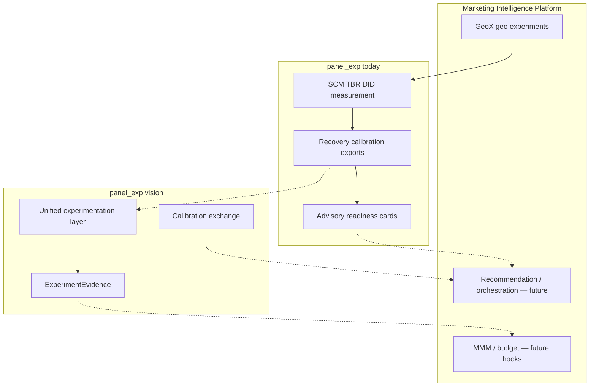

# GeoX × panel_exp — strategic checkpoint report

**Report ID:** GEOX_PANEL_EXP_STRATEGIC_CHECKPOINT_001  
**Date:** 2026-05-26  
**Package:** `panel_exp` v0.2.1  
**Branch context:** `brb-bound-ordering-fix` (governance docs + BRB fix)  
**Status:** architecture checkpoint · estimator governance snapshot · experimentation platform baseline  

**Purpose:** This is the primary strategic artifact for GeoX and the broader Marketing Intelligence Platform. It is **not** a release note or doc index. It synthesizes **current reality**, **architectural philosophy**, **roadmap evolution**, **strategic direction**, and **experimentation-system positioning** from archived evidence and governance docs.

**Audience:** platform architects, geo-experiment reviewers, future LLM orchestration agents, onboarding engineers, and MIP integration owners.

**Companion docs (authoritative detail):**

| Document | Role |
|----------|------|
| [`ROADMAP_V3.md`](ROADMAP_V3.md) | Governance model, advancement policy, shipped Phases 5–11 |
| [`ROADMAP_V4.md`](ROADMAP_V4.md) | Phases 11–15 execution, frozen priorities |
| [`OPEN_INVESTIGATIONS.md`](OPEN_INVESTIGATIONS.md) | Deferred gaps — **deferred ≠ abandoned** |
| [`EXPERIMENTATION_PLATFORM_VISION.md`](EXPERIMENTATION_PLATFORM_VISION.md) | Long-term unified experimentation architecture |
| [`VALIDATION_COVERAGE.md`](VALIDATION_COVERAGE.md) | Operational validation matrix |
| [`METHOD_VALIDATION_PLAN.md`](METHOD_VALIDATION_PLAN.md) | Per-estimator paths A–E, validation philosophy |
| [`PHASE8_ALGORITHM_AUDIT.md`](PHASE8_ALGORITHM_AUDIT.md) | Pre–Run 001 statistical mini-audit |
| [`CALIBRATION_RUN_001.md`](CALIBRATION_RUN_001.md) | Production nominal calibration archive (n=100) |
| [`CALIBRATION_FAILURE_ANALYSIS_001.md`](CALIBRATION_FAILURE_ANALYSIS_001.md) | Run 001 root-cause analysis |
| [`SCM_JACKKNIFE_CHARACTERIZATION_001.md`](SCM_JACKKNIFE_CHARACTERIZATION_001.md) | Phase 11 operating-characteristic evidence |

**Git checkpoint:** commit `96ca461` — *Consolidate experimentation governance roadmap and platform vision*

---

## 1. Checkpoint verdict

### The maturity shift

`panel_exp` has transitioned from **experimental estimator development** to **evidence-governed experimentation infrastructure**.

| Era (v0.1–v0.2 early) | Era (now) |
|------------------------|-----------|
| More estimators = progress | More **evidence** = progress |
| Smoke tests imply validity | **OC characterization** before claims |
| Implicit ATT across methods | **Estimand contracts** + interval alignment gates |
| Roadmap as feature list | **Governance ledger** + promotion policy chain |
| Artifact surface expansion | **Measurement honesty** (DGP, failures, policies) |

**The next moat is not estimator count.** It is:

- trustworthy causal evidence,
- estimator governance,
- calibration rigor,
- unified experimentation architecture,
- integration into the broader **Marketing Intelligence Platform (MIP)**.

### What we can honestly claim today

| Claim | Supported? |
|-------|------------|
| Expert-review geo-experiment toolkit with validation instrumentation | **Yes** |
| Estimand-aligned recovery scoring (`relative_att_post`) | **Yes** — with heterogeneous caveats |
| Production calibration **harness** at n≥100 | **Yes** |
| Archived Run 001 operating-characteristic evidence | **Yes** |
| SCM unit jackknife **null monitoring** on aligned configs | **Yes** — with Phase 11 role bounds |
| Package-wide nominal calibration | **No** — 2/3 Run 001 configs failed; registry = SCM only |
| `production_safe` estimators | **No** — zero by policy |
| Automated go/no-go decisioning | **No** — advisory readiness only |
| Lift detection via SCM jackknife under default recovery geometry | **No** — zero power across 144-cell Phase 11 matrix |

### One-sentence positioning

**GeoX runs on an expert-review causal measurement library that prioritizes auditable evidence over automated certification — and is evolving toward a unified experimentation operating system inside MIP.**

---

## 2. Current reality — system state

### 2.1 What is built and evidenced

**Measurement honesty (Phases 1–7 foundations + Phases 5–10):**

- Recovery scores a single declared estimand: `relative_att_post` via `_path_relative_att`.
- Interval coverage/FPR computed only when `interval_estimand == relative_att_post`.
- Typed recovery failures (`failure_type`, `failure_message`) replace silent NaN-only outcomes.
- DGP semantics: explicit missingness policies; calibration scenarios use `missingness_policy=none`; honest stagger metadata for SDID DGP.
- DID pretrend contract on results; relative-ATT interval calibration **unsupported by policy** (`did_relative_att_interval_unsupported`).
- Opt-in review flags via `build_estimator_review(..., attach_review_flags=True)`.
- Production nominal calibration harness: `run_production_nominal_calibration()`.

**Calibration evidence (Phase 9–10):**

| Run | n | Configs tested | Headline |
|-----|---|----------------|----------|
| **Run 001** | 100 × 3 seeds | SCM_UnitJackKnife, TBRRidge_Kfold, TBRRidge_BlockResidualBootstrap | SCM null pass / zero power; BRB anti-calibration; Kfold 100% failure |

**Post–Run 001 governance (Phase 10):**

- `NOMINAL_CALIBRATION_ELIGIBLE_CONFIGS` = **`SCM_UnitJackKnife` only**.
- BRB skip: `brb_bounds_inverted_run001`.
- Kfold skip: `kfold_multi_treated_unsupported_run001`.
- DID bootstrap: `did_relative_att_interval_unsupported` (policy, unchanged).

**Phase 11 (complete):**

- 144-cell SCM jackknife OC matrix documented in `SCM_JACKKNIFE_CHARACTERIZATION_001.md`.
- Conclusion: **expected conservatism + panel-geometry limitation**, not implementation defect.
- Practical role: **null monitor**, not lift detector, under tested geometries.

### 2.2 What is not built

| Gap | Status |
|-----|--------|
| Unified geo + A/B experimentation layer | Vision only (`EXPERIMENTATION_PLATFORM_VISION.md`) |
| ExperimentEvidence portable schema (vNext) | Conceptual; v0.2.1 uses card/bundle/evidence JSON |
| TrustReport / calibration exchange | Readiness advisory; no calibrated trust model |
| MMM calibration integration | Research backlog |
| LLM orchestration over evidence | Reference doc only (this report + investigations) |
| Spillover estimation in core estimators | DGP stress only |
| SDID / TROP / Bayesian / MTGP production validation | Skipped or unwired |
| Package-level nominal certification | Open investigation |

### 2.3 GeoX product coupling today

`panel_exp` is the **measurement and evidence engine** behind GeoX geo-lift workflows:

- Design → SCM / TBR / TBRRidge / DID analysis → experiment cards / bundles / readiness (advisory).
- GeoX web app integration paths exist (`panel_exp/utils/apiutils.py`, readout notebooks) but **governance docs do not auto-sync** to product UI claims.
- **Critical discipline:** product copy must not imply `production_safe` or package-wide calibration where evidence does not support it.

---

## 3. Architectural philosophy

### 3.1 Core principles

1. **Evidence before promotion** — six-step advancement policy (see §4).
2. **Validation-first** — plumbing and green tests are necessary, not sufficient.
3. **Characterization ≠ certification** — Run 001 and Phase 11 **bound roles**; they do not promote maturity.
4. **Human-in-the-loop** — software instruments; humans govern promotion and business decisions.
5. **Deferred ≠ abandoned** — open investigations persist until evidence closes them.
6. **Explainability over automation** — documented OC and skip reasons beat opaque trust scores.

### 3.2 Validation philosophy (operational)

From `METHOD_VALIDATION_PLAN.md`:

| False inference | Correct inference |
|-----------------|-------------------|
| Recovery wired ⇒ calibrated | Recovery ⇒ **observable**; calibration ⇒ **archived at n≥100** |
| Green CI ⇒ nominal validity | CI smoke ⇒ harness; production claims ⇒ Run 001 class archives |
| Eligibility default | Eligibility changed only after run + **failure analysis** |
| One good null run ⇒ lift detector | OC matrix required before role claims |

### 3.3 Explicit non-goals (frozen)

Do not schedule without roadmap amendment + re-audit:

- `production_safe` labels from smoke/recovery alone  
- New inference variants before baseline OC  
- Consensus ATT without proof  
- Automatic blocking readiness gates  
- Artifact schema v2 churn without consumers  
- DID relative-ATT intervals via cumulative scaling  
- Threshold tuning to pass calibration without mechanism docs  

---

## 4. Estimator governance snapshot

### 4.1 Advancement policy (non-negotiable)

No estimator promotion without **archived evidence** at each step:

1. Estimand definition  
2. Recovery evidence  
3. Interval alignment  
4. Operating-characteristic characterization  
5. Failure analysis (when calibration fails)  
6. Calibration evidence (n≥100)  

Skipping a step is **roadmap drift**.

### 4.2 Governance tiers (not maturity labels)

| Tier | Meaning |
|------|---------|
| **Supported** | Default validation/recovery paths with documented contracts |
| **Expert-review only** | Shipped; human review required; limited calibration evidence |
| **Research-only** | Registry + skipped/smoke validation |
| **Deferred** | Intentionally off promotion path (see investigations) |

### 4.3 Estimator × status × calibration × validation × role

| Estimator | Status | Nominal calibration | Validation | Intended role |
|-----------|--------|---------------------|------------|---------------|
| **SCM** | Expert-review | Point recovery; jackknife **null monitor only** | Batch + `scm_*` recovery | Geo-lift point estimate |
| **SCM_UnitJackKnife** | Expert-review | **Eligible** — null FPR/coverage only; Phase 11: not lift detector | Run 001 + Phase 11 OC | Conservative null monitoring |
| **TBR** | Expert-review | None | Batch alias; `tbr_*` recovery | Legacy single-treated; prefer TBRRidge |
| **TBRRidge** | Expert-review | Point recovery only | `tbrridge_*` recovery | Multi-geo ridge extrapolation |
| **TBRRidge_BlockResidualBootstrap** | Expert-review | **Removed** — `brb_bounds_inverted_run001` | Inference path exists; Run 001 failed | Phase 12 rehabilitation |
| **TBRRidge_Kfold** | Expert-review | **Removed** — `kfold_multi_treated_unsupported_run001` | Fails on default `recovery_*` | Phase 12 geometry fix or single-treated policy |
| **DID** | Expert-review | Relative-ATT intervals **unsupported** | Batch + pretrend scenarios | Pooled TWFE with pretrend contract |
| **DID_Bootstrap** | Expert-review | Ineligible (policy) | Cumulative scale only | Cumulative-att inference track |
| **SyntheticDID** | Research / deferred | None | Skipped; no RecoveryRunner | Staggered SDID research |
| **TROP** | Research-only | None | Smoke recovery; skipped batch | Sparse-donor research |
| **BayesianTBR / HorseShoe** | Research-only | None | Skipped; JAX MCMC | Full Bayesian research |
| **MTGP** | Research-only | None | Skipped | GP MCMC research |
| **AugSynth / CVXPY SCM** | Deferred / unvalidated | None | Unit tests; no recovery wiring | Phase 15 validation decision |

**Not claimed:** `production_safe` for any row.

### 4.4 Calibration registry (operational truth)

```
NOMINAL_CALIBRATION_ELIGIBLE_CONFIGS = { SCM_UnitJackKnife }
```

All other relative-ATT nominal claims require registry amendment **after** the advancement policy chain.

---

## 5. Calibration and failure evidence — narrative synthesis

### 5.1 Run 001 — what it proved and did not prove

**Proved:**

- The production harness runs at n=100 with seed aggregation.
- SCM jackknife can achieve null FPR=0, coverage=1 on `recovery_null_effect` with aligned intervals.
- TBRRidge point recovery succeeds even when inference fails (BRB/Kfold).
- Failure typing and eligibility gating work as designed.

**Did not prove:**

- Package-wide nominal calibration for aligned configs.
- SCM power for lift detection (`power=0` on positive scenario).
- TBRRidge inference modes are calibratable on default recovery DGP.

### 5.2 Failure analysis — mechanistic summary

| Config | Mechanism | Category | Process action taken |
|--------|-----------|----------|----------------------|
| **SCM_UnitJackKnife** | Intervals ~15× effect width; significance never fires | Conservatism + geometry | Keep eligible for **null only**; Phase 11 OC |
| **TBRRidge BRB** | `y_lower > y_upper` → inverted relative CI → FPR=1 | Inference defect | Removed from eligibility; bound fix on branch |
| **TBRRidge Kfold** | `(35,4)` vs `(35,)` broadcast on multi-treated | Geometry / inference | Removed from eligibility |

**Key lesson:** Run 001 was a **governance success** — it **removed** false eligibility rather than tuning thresholds to pass.

### 5.3 Phase 11 — SCM operating characteristics

Phase 11 answered: *expected conservatism or defect?*

| Question | Answer |
|----------|--------|
| Width scales with treated count? | **No** — slightly decreases |
| Power improves with larger effects? | **No** — width scales proportionally |
| Power collapse multi-treated only? | **No** — zero even at n_treated=1 |
| Null over-coverage persistent? | **Yes** — all 36 null cells |
| Stable across seeds? | **Yes** |
| Defect or conservatism? | **Conservatism + geometry** — not BRB-class bug |

**Practical usefulness of SCM jackknife inference today:**

- **Useful for:** conservative null monitoring when reviewers accept wide intervals and zero power on positive DGP.
- **Not useful for:** automated lift detection, power planning based on jackknife significance, or geometry-blind promotion.

This is **operating-characteristic characterization** — not inference redesign.

---

## 6. Roadmap evolution

### 6.1 Timeline

| Phase | Theme | Outcome |
|-------|-------|---------|
| **v1–v2** | Estimator + artifact expansion | Strong machinery; weak calibration readouts |
| **Phases 1–4** | Estimand, interval gating, DGP cleanup | Measurement honesty foundations |
| **Phases 5–8** | Production harness, DID policy, review flags, audit | Instrumentation + Phase 8 verdict: improved narrowly |
| **Phase 9** | Run 001 archive | First n=100 OC evidence |
| **Phase 10** | Failure analysis + eligibility tightening | Registry honesty |
| **Phase 11** | SCM jackknife OC | Role bounded: null monitor |
| **Phases 12–15** (next) | TBRRidge rehab, promotion decisions, DID OC, CVXPY wiring | See `ROADMAP_V4.md` |
| **Post–15** | Re-audit → `ROADMAP_V5.md` | |

### 6.2 Frozen near-term sequence (`ROADMAP_V4.md`)

| Phase | Focus | Type |
|-------|-------|------|
| **11** | SCM OC | **Complete** — characterization doc archived |
| **12** | TBRRidge inference rehabilitation (BRB Run 002, Kfold) | Evidence + optional inference fixes |
| **13** | TBRRidge promotion **decision** | Governance only — not `production_safe` |
| **14** | DID OC (cumulative vs relative) | Characterization |
| **15** | AugSynth/CVXPY validation wiring | Operational gap closure |

**Distinction that now governs all technical work:**

| Work type | Examples |
|-----------|----------|
| **Operating-characteristic characterization** | Phase 11 SCM matrix; Phase 14 DID OC |
| **Not this phase** | New estimators, inference redesign for promotion, feature work, threshold tuning |

---

## 7. Strategic direction — three horizons

### 7.1 Near-term (Phases 12–15 + governance maintenance)

**Objective:** Close the calibration honesty gap estimator-by-estimator without expanding surface area.

- TBRRidge BRB: Run 002 after bound-ordering merge; re-eligibility only with OC pass.
- TBRRidge Kfold: multi-treated fix **or** documented single-treated-only contract.
- DID: characterize cumulative-scale OC; keep relative-ATT unsupported unless new design.
- AugSynth/CVXPY: recovery wiring or permanent research guard.
- Maintain `OPEN_INVESTIGATIONS.md` as decisions arrive — **deferred ≠ abandoned**.

### 7.2 Mid-term (MIP experimentation layer)

**Objective:** Unified experimentation architecture — geo today, A/B tomorrow, shared contracts.

From `EXPERIMENTATION_PLATFORM_VISION.md`:

- **GeoX + A/B convergence** — shared estimand registry, interval semantics, calibration harness.
- **ExperimentEvidence ecosystem** — portable object linking estimand, intervals, Run 001 class archives, failure analysis, review flags, human waivers.
- **CalibrationSignal lifecycle** — design → recovery → production run → failure analysis → characterization → eligibility → exchange.
- **MMM calibration integration** — incrementality inputs with explicit conservatism bounds, not raw point lifts.

### 7.3 Long-term (causal operating system)

**Objective:** Experimentation as **reusable causal infrastructure**, not one-off tests.

- Conversational experiment intelligence (cite investigations + runs; no unsourced promotion).
- LLM orchestration agents with guardrails (read-only characterization default).
- Trust-aware recommendations that know **when not to act** (SCM null-monitor lesson).
- Adaptive experimentation and calibration exchange across studies.
- Experiment memory informing design, budget, and MMM priors.

**Why experimentation is becoming a causal operating system:**

| Shift | Platform response |
|-------|-------------------|
| Evidence reuse | Archives persist beyond single deck |
| Calibration exchange | Run 001 class artifacts comparable across teams |
| Trust-aware recommendations | Systems encode "do not claim lift" when OC forbids |
| Experiment memory | Prior geo tests inform next design |
| Unified causal intelligence | Geo, A/B, MMM share estimand + trust layer |

---

## 8. Experimentation-system positioning in MIP

### 8.1 Layer model (today vs vision)



**Today:** GeoX consumes `panel_exp` measurement + advisory exports.  
**Tomorrow:** MIP consumes **ExperimentEvidence** + **CalibrationSignal** across geo, A/B, and MMM.

### 8.2 DiagnosticSummary / TrustReport role

| Artifact | Today | Target |
|----------|-------|--------|
| Experiment card | Human-readable summary | Facet of DiagnosticSummary |
| Readiness assessment | Advisory profiles | Input to TrustReport |
| Calibration report | Run-status aggregation | Linked to Run 001 class archives |
| Review flags | Opt-in | Standard expert-review export |
| **TrustReport** | Not shipped | Single narrative: known, deferred, failed |

TrustReport must state **limits** (e.g. SCM jackknife null-only) as prominently as passes.

### 8.3 LLM orchestration reference (future agents)

When an LLM agent operates on this codebase or GeoX workflows, it **must**:

1. **Never claim** `production_safe` or package-wide nominal calibration unless registry + docs explicitly support it.
2. **Cite** `NOMINAL_CALIBRATION_ELIGIBLE_CONFIGS` and `skip_reason` codes before eligibility advice.
3. **Distinguish** characterization archives (Run 001, Phase 11) from certification.
4. **Pull deferrals** from `OPEN_INVESTIGATIONS.md` — deferred ≠ abandoned.
5. **Follow** the six-step advancement policy before suggesting maturity promotion.
6. **Prefer** operating-characteristic characterization over inference redesign when Phase 11-style questions arise.
7. **Surface** DID pretrend contract and relative-ATT unsupported policy on DID workflows.
8. **Treat** SCM jackknife as null monitor under default recovery geometry unless new OC evidence exists.

**Canonical Q&A anchors for agents:**

| User question | Grounded answer source |
|---------------|------------------------|
| "Is panel_exp production-ready?" | §1 checkpoint verdict — expert-review, not production-safe |
| "Is SCM calibrated?" | Null monitor only; Phase 11 zero power; not lift detector |
| "Why was BRB removed?" | `CALIBRATION_FAILURE_ANALYSIS_001.md` §2.2; `brb_bounds_inverted_run001` |
| "Can we compare SCM and DID ATT?" | Estimand not fully enforced — `OPEN_INVESTIGATIONS.md` critical |
| "What's next technically?" | Phase 12 TBRRidge investigation program — `ROADMAP_V4.md`, `PHASE12_INVESTIGATION_PLAN.md` |
| "Are we building A/B testing?" | Track C future architecture only — governed contracts first (Track B) |

---

## 9. Open investigations — strategic summary

Full ledger: [`OPEN_INVESTIGATIONS.md`](OPEN_INVESTIGATIONS.md).

### Critical (decision-blocking for promotion claims)

| Investigation | Status | Strategic implication |
|---------------|--------|----------------------|
| Cross-estimator estimand not enforced | Open | No silent cross-method ATT agreement |
| Package lacks demonstrated nominal calibration | Open | No package-level certification narrative |
| SCM over-coverage / zero power | Characterized | Role = null monitor; keep investigation open |

### Inference (Phase 12 drivers)

| Investigation | Status |
|---------------|--------|
| TBRRidge BRB bound ordering | Investigating — Run 002 pending |
| TBRRidge Kfold multi-treated | Open — geometry fix or policy |
| DID relative-ATT unsupported | Policy closed; path open |

### Research / deferred architecture

Spillover estimation · SDID staggered validation · TROP/Bayesian/MTGP · unified experimentation layer (Track B) · user-level / conversion-lift architecture (Track C, INV-020–026) · TrustReport evolution · automated blocking gates.

**Explicit:** every deferred item has a **revisit trigger** in the investigations doc.

---

## 10. Phase 8 audit — supersession notes

`PHASE8_ALGORITHM_AUDIT.md` (2026-05-20) stated no archived n≥100 run. **Superseded in part by:**

- Run 001 archive (`CALIBRATION_RUN_001.md`) — Phase 9  
- Eligibility tightening — Phase 10  
- Phase 11 SCM OC — Phase 11  

Phase 8 verdict **still holds** on:

- Not production-ready  
- Heterogeneous estimand aggregation open  
- DID pretrend export discipline  
- Research estimators unwired  

---

## 11. Onboarding context — how to read the doc graph

**New engineer path:**

1. This checkpoint report (strategic frame)  
2. `ROADMAP_V3.md` § governance (policy + estimator table)  
3. `VALIDATION_COVERAGE.md` (what runs in CI)  
4. `METHOD_VALIDATION_PLAN.md` (paths A–E per method)  
5. `CALIBRATION_RUN_001.md` + `CALIBRATION_FAILURE_ANALYSIS_001.md` (evidence story)  
6. `SCM_JACKKNIFE_CHARACTERIZATION_001.md` (OC characterization template)  
7. `OPEN_INVESTIGATIONS.md` (what is intentionally unresolved)  
8. `EXPERIMENTATION_PLATFORM_VISION.md` (Tracks B/C; estimand, TrustReport, feasibility)  
9. `ROADMAP_V4.md` (Tracks A/B/C; what to execute next)  
10. `PHASE12_INVESTIGATION_PLAN.md` (Phase 12 pre-execution plan)

**Reviewer path:**

1. This report §4 estimator table + §5 calibration narrative  
2. Run 001 + Phase 11 for SCM claims  
3. DID interval matrix in `VALIDATION_COVERAGE.md`  
4. Pretrend + interference metadata on experiment card  

---

## 12. Checkpoint conclusions

### Architectural checkpoint

The project has crossed a governance threshold: **evidence governs eligibility**, not implementation completeness. The doc graph (`ROADMAP_V3/V4`, investigations, vision, calibration archives) is now the **control plane** for technical work.

### Estimator governance snapshot

One config is nominally eligible for relative-ATT monitoring (`SCM_UnitJackKnife`, null only). TBRRidge inference modes were **removed** with documented skip reasons. DID relative-ATT intervals remain **unsupported by policy**. Research estimators stay off the promotion path.

### Experimentation platform baseline

`panel_exp` v0.2.1 is an **expert-review geo measurement engine** with validation instrumentation, not a certified causal decision system or generic A/B platform. The baseline for MIP integration is **honest exports + archived OC + governed estimand/trust semantics**, not automated trust or significance-test theater.

Future direction (Tracks B/C): unified `ExperimentEvidence`, conversion-lift **governance** (conceptual reference: industry CLS practice — not copied math), MMM calibration contracts, feasibility engine, TrustReport outcome taxonomy — see [`EXPERIMENTATION_PLATFORM_VISION.md`](EXPERIMENTATION_PLATFORM_VISION.md).

### Strategic direction

Execute Phases 12–15 as **characterization and investigation** — not feature expansion. Then re-audit → `ROADMAP_V5.md`.

**Roadmap tracks:**

| Track | Focus |
|-------|--------|
| **A** | Evidence / governance stabilization (Phases 11–15) |
| **B** | Unified experimentation abstractions (`ExperimentSpec`, `ExperimentEvidence`, estimand registry) |
| **C** | User-level experimentation & conversion lift (A/B, CLS, feasibility, MMM bridge) — future only |

Mid-term: Track B shared contracts. Long-term: **governed experimentation operating system** with calibration exchange, feasibility governance, TrustReport semantics, and conversational intelligence **through governed contracts** — not generic A/B utilities.

**Moat:** trustworthy evidence, calibration governance, estimand alignment, experiment compatibility, explainability, causal OS infrastructure — **not** estimator catalog breadth.

### Immediate technical next step

**Phase 12 — TBRRidge inference investigation program** (Phase 11 complete):

- Merge BRB bound-ordering fix if not already on mainline.  
- Archive **Calibration Run 002** at n≥100.  
- Resolve Kfold multi-treated geometry or document single-treated-only contract.  
- Update registry only after advancement policy chain — not after plumbing alone.

---

## 13. Non-claims registry (do not contradict in product or docs)

| Do not say | Say instead |
|------------|-------------|
| "panel_exp is production-safe" | Expert-review platform; zero `production_safe` estimators |
| "Calibrated for lift detection" (SCM jackknife) | Null monitoring only; zero power in Phase 11 |
| "All aligned configs pass calibration" | Only SCM eligible; BRB/Kfold removed after Run 001 |
| "Recovery tests prove validity" | Recovery proves **observability**; calibration requires n≥100 archives |
| "Deferred work was dropped" | Deferred ≠ abandoned — see investigations |
| "DID intervals are relative ATT" | Cumulative/bootstrap only; relative unsupported |

---

*Strategic checkpoint report. Does not modify code, maturity labels, eligibility registry, or inference behavior. Update after Phase 12–15 evidence, Track B/C milestones, or MIP architecture milestones.*
