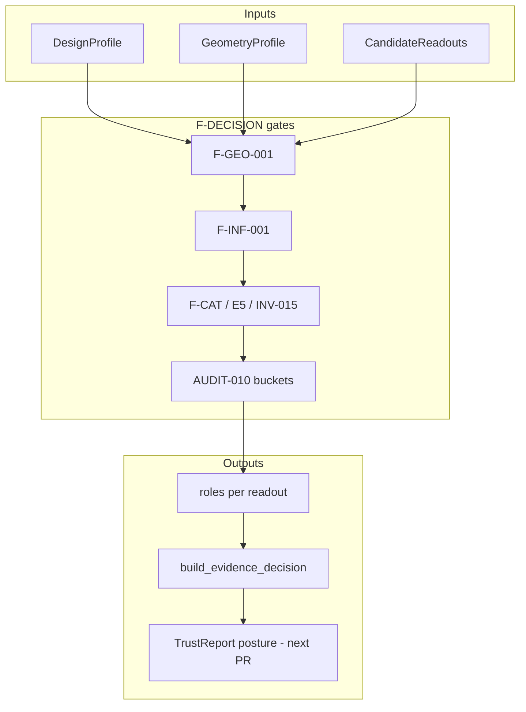

# GOVERNANCE-PR-TRACK-F-DECISION-PACKAGE-001

**Document ID:** GOVERNANCE-PR-TRACK-F-DECISION-PACKAGE-001  
**Type:** Governance PR summary — **docs only** (no product wiring in this PR)  
**Status:** **ready for review**  
**Date:** 2026-06-03  
**Branch:** `fix-kfold-multitreated-geometry`  
**Verdict:** Production-safe **decision posture** is defined and test-backed; **next authorized step = TrustReport integration** (separate PR)

---

## 1. Purpose

This package consolidates the completed Track F implementation checkpoint, F-DECISION-001 policy layer, and F-BACKLOG-002 industry relevance review into a single governance narrative for reviewers and integrators.

It answers:

1. What changed in the commit spine and why it is safe to pause implementation/OC.
2. What readout roles and decision postures are allowed today.
3. What remains blocked, excluded, or research-only.
4. What the **only** authorized next engineering step is.

**This document does not:** wire TrustReport, change estimators/inference, run OC, expand CalibrationSignal, open MMM ingress, or promote any tuple.

---

## 2. Commit spine (review order)

| Order | ID | Commit | What it delivers |
|------:|-----|--------|------------------|
| 1 | **F-INF-002** | `3993ba7` | TBRRidge pooled-CF multi-treated readout fix (JKP/JK/Conformal interfaces); tag `tbrridge_pooled_counterfactual_multi_treated` |
| 2 | **D5-INST-TBRRIDGE-003** | `9f1dba0` | Targeted OC — A16/A18/A21 post F-INF-002; A18 → `characterized_restricted`; A16/A21 → `callable_unverified` |
| 3 | **TRACK-F-IMPLEMENTATION-CHECKPOINT-001** | `9ed6b5d` | Pause default impl/OC loop; governed uncertainty ∅; MMM/CS/promotion blocked |
| 4 | **F-DECISION-001** | `637bb29` | `decision_policy.py` — eligibility resolver + `build_evidence_decision` (no silent averaging) |
| 5 | **F-BACKLOG-002** | `97e7acc` | Industry/literature re-rank of parked items; investigation lanes; **0** promotion candidates |

**Earlier P3+ spine (context):** F-INF-003 (`cf128a2`) · D5-INF-POSTFIX-001 (`d9afc2a`) — A05/A19 orientation → `characterized_restricted`.

**Authoritative artifacts:**

| Layer | Document | Code / tests |
|-------|----------|--------------|
| Contracts | F-INF-001, F-GEO-001, F-CAT-001 | `panel_exp/governance/*_contract.py` |
| Checkpoint | [`TRACK_F_IMPLEMENTATION_CHECKPOINT_001.md`](TRACK_F_IMPLEMENTATION_CHECKPOINT_001.md) | — |
| Decision policy | [`F_DECISION_001_METHOD_ELIGIBILITY_AND_DECISION_POLICY.md`](F_DECISION_001_METHOD_ELIGIBILITY_AND_DECISION_POLICY.md) | [`decision_policy.py`](../panel_exp/governance/decision_policy.py) · [`test_f_decision_001_decision_policy.py`](../tests/governance/test_f_decision_001_decision_policy.py) |
| Backlog relevance | [`F_BACKLOG_002_INDUSTRY_RELEVANCE_REVIEW.md`](F_BACKLOG_002_INDUSTRY_RELEVANCE_REVIEW.md) | — |
| MMM gate | [`audits/AUDIT-010_mmm_readiness_gap.md`](audits/AUDIT-010_mmm_readiness_gap.md) | Appendix A (30 tuples) |

---

## 3. Current decision-safe layer

### 3.1 Allowed primary null monitor

| Tuple | Estimator + inference | AUDIT-010 bucket | F-DECISION role | CalibrationSignal |
|-------|----------------------|------------------|-----------------|-------------------|
| **A26** | SCM + UnitJackKnife | `already_characterized` | `primary_null_monitor` | `null_monitor_only` (E5) |

**Scope:** Unit panel, tier-1 geo designs, single_cell / per-cell multi_cell (no pooled claim). Not platform MDE, not MMM lift, not universal GeoX readout.

### 3.2 Diagnostic comparators (characterized restricted)

| Tuple | Estimator + inference | Notes |
|-------|----------------------|-------|
| **A05** | AugSynthCVXPY + Conformal | Post F-INF-003 + POSTFIX; compare sign only |
| **A18** | TBRRidge + Conformal | Post F-INF-002 + TBRRIDGE-003 |
| **A19** | TBRRidge + TimeSeriesKfold | Post F-INF-003 + POSTFIX |
| **A03** | AugSynthCVXPY + TimeSeriesKfold | Restricted diagnostic |
| **A07, A10** | Class TBR + point / Kfold | Aggregate 1×1 only — CausalImpact-style |

**Policy:** `build_evidence_decision` uses signed point effects; diagnostic sign mismatch → `diagnostic_disagreement` + `proceed_with_caveats` / TrustReport warning. **No silent averaging.**

### 3.3 Falsification checks

| Tuple | Mechanism | F-DECISION role |
|-------|-----------|-----------------|
| **A27** | SCM + Placebo (inference on SCM estimator) | `falsification_check` |
| Failure | Placebo rejects null | `falsification_failure` → `blocked_for_decision_use` |

### 3.4 Excluded / callable-unverified (default)

| Tuple | Estimator + inference | Issue | F-DECISION role |
|-------|----------------------|-------|-----------------|
| **A16** | TBRRidge + UnitJackKnife | ~79% null interval-exclusion FPR on 001e battery | `excluded` |
| **A21** | TBRRidge + JKP | ~29% null exclusion FPR | `excluded` |
| **A09** | Class TBR + JKP (aggregate 1×1) | Callable; interval semantics unverified | `excluded` |

Optional future: F-DECISION-002 may expose A16/A21 as `sensitivity_check` with mandatory warnings — **not** in v1.

### 3.5 Blocked paths

| Category | Examples | Gate |
|----------|----------|------|
| Geometry | TBR on unit panel (A12); SCM+JK on supergeo (A29) / trim (A30) | F-GEO-001 |
| Pooling | Pooled multi-cell without `pooling_rule_id` | F-P0-006 / F-MCELL-001 ADR |
| Catalog | Registry Bayesian on TBRRidge (A20) | INV-015 |
| MMM / governed export | All non-A26 tuples | AUDIT-010 + empty allowlist |

### 3.6 Research-to-production candidates (investigation only — not promotion)

Per [F-BACKLOG-002 §9](F_BACKLOG_002_INDUSTRY_RELEVANCE_REVIEW.md):

| Charter | Scope | Production today |
|---------|-------|------------------|
| **RTP-001** | BayesianTBR native MCMC | `research_only` |
| **RTP-002** | TROP + registry inference | `research_only` |
| **RTP-003** | Supergeo adapter (post F-GEO-003 ADR) | `blocked` |
| **RTP-004** | Trimmed population bridge (post F-GEO-004 ADR) | `blocked` |

**Promotion candidates:** **0** (F-BACKLOG-002 §11).

---

## 4. Guardrails (confirmed)

| Guardrail | Status | Authority |
|-----------|--------|-----------|
| **Governed uncertainty allowlist** | **Empty** (`GOVERNED_UNCERTAINTY_EXPORT_ALLOWLIST` ∅) | F-INF-001 |
| **CalibrationSignal** | **A26 only** — `SCM_UnitJackKnife` `null_monitor_only` | E5 · F-DECISION-001 |
| **MMM ingress** | **`not_ready_continue_track_f`** | AUDIT-010 |
| **Promotion** | **Not authorized** for any Appendix A tuple | AUDIT-010 · CHECKPOINT-001 |
| **Silent averaging** | **Forbidden** — point-effect comparison only | `build_evidence_decision` |
| **External importance** | **Does not override** AUDIT-010 buckets or F-DECISION roles | F-BACKLOG-002 §2 |
| **Track F impl/OC** | **Paused** by default | CHECKPOINT-001 |
| **Optional impl** | F-INF-004 (A09) — product pull only | F-BACKLOG-002 §10 |

---

## 5. Decision posture summary (TrustReport-facing)

F-DECISION-001 emits structured outputs for integration:

| Output | Use |
|--------|-----|
| `MethodEligibilityResult.role` | Per-readout role assignment |
| `EvidenceDecision.agreement_status` | aligned / disagreement / falsification / insufficient |
| `EvidenceDecision.decision_posture` | proceed_with_confidence / proceed_with_caveats / diagnostic_only / trust_report_only / blocked / inconclusive |
| `EvidenceDecision.calibration_signal_action` | `export_calibration_signal` **only** for governed SCM+JK primary |
| `EvidenceDecision.mmm_action` | Always `exclude_from_mmm` |
| `EvidenceDecision.trust_report_action` | `emit_warning` on conflict; else safe default |

---

## 6. Next authorized integration (separate PR)

**Authorized:** TrustReport wiring of F-DECISION-001 outputs.

| In scope (integration PR) | Out of scope |
|---------------------------|--------------|
| Call `resolve_method_eligibility` / `build_evidence_decision` from TrustReport path | Estimator or inference changes |
| Surface roles, agreement status, decision posture in TrustReport UX/schema | New OC batteries |
| Emit warnings on `diagnostic_disagreement` / `falsification_failure` | Promotion or MMM feed |
| Respect `calibration_signal_action` / `mmm_action` | CalibrationSignal expansion |
| Document integration contract in Track B / E tests as needed | Governed uncertainty allowlist changes |

**Suggested integration PR title:** `Integrate F-DECISION-001 into TrustReport (read-only policy consumption)`

**Pre-integration checklist:**

- [ ] Governance PR (this package) merged or acknowledged
- [ ] TrustReport reads `DecisionProfile` + candidate readouts from existing instrument runs
- [ ] No new tuples added to `GOVERNED_UNCERTAINTY_EXPORT_ALLOWLIST`
- [ ] A16/A21 remain `excluded` unless F-DECISION-002 explicitly adopted

---

## 7. Explicit non-goals (this governance PR)

- TrustReport code changes (deferred to integration PR)
- Track F implementation or OC reopen
- F-INF-004 unless product reprioritizes after integration
- Design ADRs (F-MCELL-001, F-GEO-003/004) — parallel product lanes
- Research charters RTP-001..004 — R&D funding, not eng queue
- AUDIT-010 amendment or promotion audit

---

## 8. Reviewer checklist

| Question | Expected answer |
|----------|-----------------|
| Is any tuple newly governed uncertainty? | **No** |
| Did CalibrationSignal expand beyond A26? | **No** |
| Can MMM ingest any diagnostic tuple? | **No** |
| Does F-DECISION average point estimates? | **No** |
| Does F-BACKLOG-002 authorize promotion? | **No** — 0 candidates |
| What ships next? | **TrustReport integration PR only** |

---

## 9. Document index (this package)

| ID | Role |
|----|------|
| GOVERNANCE-PR-TRACK-F-DECISION-PACKAGE-001 | This summary |
| TRACK-F-IMPLEMENTATION-CHECKPOINT-001 | Pause gate + tuple journey |
| F-DECISION-001 | Resolver + evidence policy |
| F-BACKLOG-002 | Parked-item investigation lanes |
| F-BACKLOG-001 | Impl backlog closeout (historical queue) |
| AUDIT-010 | MMM readiness gap + Appendix A |
| TRACK_E E2 cards | Design × geometry suitability (unchanged statuses) |

---

## 10. Stop condition (met)

| Criterion | Status |
|-----------|--------|
| Commit spine documented | ✅ §2 |
| Decision-safe layer summarized | ✅ §3 |
| Guardrails confirmed | ✅ §4 |
| Next step = TrustReport integration only | ✅ §6 |
| No code/OC/promotion in this package | ✅ |

---

*GOVERNANCE-PR-TRACK-F-DECISION-PACKAGE-001 v1.0.0 — policy state locked; product wiring is the next PR.*
