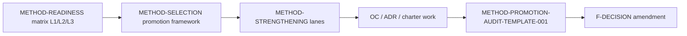

# METHOD-STRENGTHENING-LANES-001

**Document ID:** METHOD-STRENGTHENING-LANES-001  
**Type:** Strengthening / evidence-building lanes — **governance only**  
**Status:** **complete**  
**Date:** 2026-06-03  
**Verdict:** Concrete evidence work between candidate selection and promotion audit; **no production role change**  
**Upstream (source of truth):** [`METHOD_SELECTION_AND_PROMOTION_FRAMEWORK_001.md`](METHOD_SELECTION_AND_PROMOTION_FRAMEWORK_001.md)  
**Decomposition input:** [`METHOD_READINESS_AND_COMPATIBILITY_MATRIX_001.md`](METHOD_READINESS_AND_COMPATIBILITY_MATRIX_001.md)

**Related:** [`F_BACKLOG_002_INDUSTRY_RELEVANCE_REVIEW.md`](F_BACKLOG_002_INDUSTRY_RELEVANCE_REVIEW.md) · [`F_DECISION_001`](F_DECISION_001_METHOD_ELIGIBILITY_AND_DECISION_POLICY.md) · [`TRACK_D_CONCEPTUAL_VALIDITY_AUDIT_001.md`](TRACK_D_CONCEPTUAL_VALIDITY_AUDIT_001.md) · [`METHOD_PROMOTION_AUDIT_TEMPLATE_001.md`](METHOD_PROMOTION_AUDIT_TEMPLATE_001.md) (placeholder)

---

## 1. What strengthening is (and is not)

| Strengthening **is** | Strengthening **is not** |
|----------------------|---------------------------|
| Evidence-building before a future **METHOD-PROMOTION-AUDIT-TEMPLATE-001** | **Promotion** or role upgrade |
| OC batteries, ADRs, literature/implementation audits scoped to a **lane** | TrustReport, CalibrationSignal, MMM, or F-DECISION changes |
| Moving L3 tuples toward **promotion candidacy** | Declaring AugSynth or TBR **primary** today |
| Prioritizing work under [`METHOD_SELECTION_AND_PROMOTION_FRAMEWORK_001`](METHOD_SELECTION_AND_PROMOTION_FRAMEWORK_001.md) lanes | Replacing SCM as baseline without audit |

```text
METHOD-SELECTION (pipeline)  →  METHOD-STRENGTHENING (this doc)  →  OC/ADR/charter  →  PROMOTION AUDIT  →  F-DECISION amendment
                                      ↑ you are here
```

**F-DECISION-001 and TrustReport `f_decision_context` remain baseline policy** for all strengthening lanes until exit criteria allow `proceed_to_promotion_audit`.

---

## 2. Strengthening categories

Work packages apply at **estimator**, **inference**, or **combination** level. A lane may require several categories.

### 2.1 Estimator strengthening

| Work type | Delivers |
|-----------|----------|
| **Literature fidelity audit** | Paper vs implementation intent; forbidden claims |
| **Implementation fidelity audit** | Code paths, defaults, deviations (CV-001 style) |
| **Estimand clarification** | Track B / interval estimand IDs; spillover boundaries |
| **Data-geometry eligibility** | F-GEO contract; supported vs blocked geometries |
| **Model diagnostics** | Donor balance, weights, pre-fit fit, augmentation stability |
| **Failure-mode diagnostics** | Weak donors, extrapolation, negative weights, outcome dependence |
| **Baseline comparison** | Point/path vs **A26** under same DGP (combination OC) |

### 2.2 Inference strengthening

| Work type | Delivers |
|-----------|----------|
| **Uncertainty-source definition** | What randomness is represented (donor LOO, CV, conformal residual, placebo) |
| **Construction policy** | Folds, blocks, calibration split, placebo draw rules |
| **Interval semantics** | F-INF classification; orientation; governed export block |
| **Null FPR / coverage behavior** | D5 battery metrics; callable_unverified resolution |
| **Power / MDE behavior** | Where relevant; separate from geo power readouts |
| **Calibration or correction needs** | Band calibration vs point bias |
| **Failure-mode diagnostics** | Inverted bands, pooled-CF broadcast, high null FPR |

### 2.3 Combination strengthening

| Work type | Delivers |
|-----------|----------|
| **Estimator × inference × geometry compatibility** | L3 row; AUDIT-010 bucket upgrade path |
| **Known-DGP OC battery** | Track D instrument battery with archived JSON |
| **Baseline comparison vs A26** | Framework §6 dimensions |
| **Placebo / falsification behavior** | A27 pattern; failure downgrades posture |
| **Conflict / disagreement policy** | F-DECISION sign compare; no silent averaging |
| **TrustReport role proposal** | For promotion audit packet only — **not wired today** |
| **CalibrationSignal eligibility proposal** | For audit only — **empty allowlist today** |

---

## 3. Lane registry (first strengthening lanes)

Maps to framework lanes **LANE-ASCM-001**, **LANE-TBR-AGG-001**, **LANE-MCELL-001**, **LANE-SUPERGEO-001** / **LANE-TRIM-001**, **LANE-R&D-001**.

---

### 3.1 AUGSYNTH_ASCM_STRENGTHENING_001

**Framework lane:** LANE-ASCM-001  
**Goal:** Determine when AugSynth/ASCM should **challenge or replace** SCM as primary effect readout for **unit-panel geo** — especially **weak SCM pretreatment fit** — without changing roles today.

**Charter (concrete plan):** [`AUGSYNTH_ASCM_STRENGTHENING_001.md`](AUGSYNTH_ASCM_STRENGTHENING_001.md) — diagnostics, inference pairing evidence bar, promotion-audit entry criteria.  
**OC (executed):** [`D5_INST_AUGSYNTH_ASCM_002_REPORT.md`](track_d/D5_INST_AUGSYNTH_ASCM_002_REPORT.md) — `remain_diagnostic_comparator` (1/2 weak-fit MAE gain @ 8%); JK null FPR conservative; **not** promotion-eligible.

**Matrix / tuple focus:** L1 strong AugSynthCVXPY; L3 **A05** (Conformal), A01–A03; baseline **A26**.

| # | Required strengthening work | Category | Next artifact type |
|---|----------------------------|----------|-------------------|
| 1 | Literature fidelity (Ben-Michael et al.; augmentation estimand) | Estimator | `literature_fidelity_audit` |
| 2 | Implementation fidelity vs CV-001 ASCM record | Estimator | `implementation_fidelity_audit` |
| 3 | Weak pretreatment fit diagnostic spec + battery slice | Estimator | `failure_mode_investigation` |
| 4 | Donor convex-hull / extrapolation diagnostics | Estimator | `failure_mode_investigation` |
| 5 | Negative-weight / regularization policy doc | Estimator | `estimand_ADR` or design note |
| 6 | Outcome-model dependence diagnostics | Estimator | `failure_mode_investigation` |
| 7 | OC: AugSynth vs SCM under known DGPs (effect recovery, bias, null FPR) | Combination | `OC_battery` |
| 8 | Inference pairing decision: Conformal vs JK vs Placebo vs Kfold **for audit scope** | Inference | `inference_semantics_ADR` |
| 9 | If L3 stable + OC beat/improve on weak-fit: promotion charter scope | Program | `promotion_charter` → `promotion_audit` |

**Inference pairing note (decision for strengthening, not production):**

| Pairing | Role proposal (audit only) | Strengthening priority |
|---------|---------------------------|------------------------|
| **Conformal (A05)** | `diagnostic_comparator` → candidate for **supplement** audit | **P1** — already characterized_restricted |
| **UnitJackKnife on AugSynth** | Research — not SCM JK path | P2 — clarify estimand |
| **Placebo** | Falsification on SCM space, not AugSynth estimator | N/A for AugSynth primary |
| **Kfold** | Diagnostic comparator strengthen | P2 |

**Entry criteria:** F-BACKLOG-002 rank ≤5; L1 strong; L3 A05 `characterized_restricted`; product high on unit geo.  
**Exit criteria (one of):** `proceed_to_promotion_audit` | `remain_diagnostic` | `proceed_to_OC` (more cells) | `keep_restricted` if OC loses to A26 on null FPR.

---

### 3.2 TBR_AGGREGATE_STRENGTHENING_001

**Framework lane:** LANE-TBR-AGG-001  
**Goal:** Define **class TBR / CausalImpact-style aggregate 1×1** as a governed **`aggregate_only_primary`** candidate — never on unit panel.

**Matrix / tuple focus:** L1 niche strong TBR; L3 **A07**, **A10**; **A09** (JKP unverified).

| # | Required strengthening work | Category | Next artifact type |
|---|----------------------------|----------|-------------------|
| 1 | Aggregate estimand policy (sum treated vs control series) | Combination | `estimand_ADR` |
| 2 | 1×1 geometry contract (F-GEO; assert n_treated=1, n_control=1) | Combination | `geometry_ADR` |
| 3 | Inference semantics: point vs Kfold vs JKP on agg2 | Inference | `inference_semantics_ADR` |
| 4 | TBR-001 battery maintenance + optional A09 spot OC | Combination | `OC_battery` |
| 5 | Comparison vs unit-panel SCM when both available (conflict policy) | Combination | `OC_battery` |
| 6 | Promotion audit for `aggregate_only_primary` only | Program | `promotion_audit` |

**Entry criteria:** Product aggregate campaigns; A07/A10 characterized_restricted; A12 blocked on unit panel.  
**Exit criteria:** `proceed_to_promotion_audit` (aggregate role only) | `remain_diagnostic` | `proceed_to_OC` (A09 JKP).

---

### 3.3 MULTICELL_STRENGTHENING_001

**Framework lane:** LANE-MCELL-001  
**Goal:** Define **per-cell** promotion path vs **pooled** claims; no pooled lift without estimand bridge.

**Matrix / tuple focus:** A26 per cell; pooled blocked; D5-MCELL evidence.

| # | Required strengthening work | Category | Next artifact type |
|---|----------------------------|----------|-------------------|
| 1 | **F-MCELL-001** `pooling_rule_id` + pooled estimand ADR | Combination | `estimand_ADR` |
| 2 | Per-cell conflict policy (F-DECISION multi-cell expansion doc) | Combination | `inference_semantics_ADR` |
| 3 | Explicit **no pooled claim** without bridge (Track E + AUDIT-010) | Governance | `estimand_ADR` |
| 4 | D5-MCELL OC refresh (k≤2; per-cell readouts) | Combination | `OC_battery` |
| 5 | Per-cell vs pooled promotion audit (separate scopes) | Program | `promotion_audit` |

**Entry criteria:** Product multi-geo tests; per-cell A26 governed today.  
**Exit criteria:** `proceed_to_ADR` (pooling) | `proceed_to_OC` (per-cell) | `keep_blocked` (pooled until ADR).

---

### 3.4 TRIM_SUPERGEO_STRENGTHENING_001

**Framework lanes:** LANE-SUPERGEO-001 · LANE-TRIM-001  
**Goal:** Determine whether **trim** / **supergeo** can become **governed design + readout** paths (not flat-panel SCM tensor).

| Track | Required work | Next artifact type |
|-------|---------------|-------------------|
| **Supergeo** | F-GEO-003 adapter ADR; RTP-003 charter; D5-DES-SUPERGEO battery extension | `geometry_ADR` → `OC_battery` |
| **Supergeo** | Target estimand on supergeo unit panel | `estimand_ADR` |
| **Trim** | F-GEO-004 population bridge ADR; RTP-004 charter; D5-DES-TRIM battery | `estimand_ADR` → `OC_battery` |
| **Both** | SCM+JK on flat markets **keep_blocked** until adapter/bridge | `keep_blocked` until exit |

**Entry criteria:** F-BACKLOG-002 external imp ≥4; L1 blocked on 001e.  
**Exit criteria:** `proceed_to_promotion_charter` | `remain_research_only` | `keep_blocked`.

---

### 3.5 BAYESIAN_TBR_TROP_RTP_STRENGTHENING_001

**Framework lane:** LANE-R&D-001  
**Goal:** Keep **BayesianTBR** and **TROP** as **research-to-production candidates** without premature promotion.

| Method | Required work | Next artifact type |
|--------|---------------|-------------------|
| **BayesianTBR** | Literature vs registry `Bayesian`; MCMC feasibility; RTP-001 charter | `literature_fidelity_audit` → `promotion_charter` |
| **BayesianTBR** | Inference semantics (NUTS vs registry) | `implementation_fidelity_audit` |
| **TROP** | Literature + implementation; registry inference gap | `literature_fidelity_audit` |
| **TROP** | OC worlds definition; RTP-002 charter | `promotion_charter` |
| **Both** | Production-readiness blocker list | `remain_research_only` |

**Entry criteria:** L3 `research_only`; not in F-DECISION prod roles.  
**Exit criteria:** `proceed_to_promotion_charter` | `remain_research_only` | `deprecate` (if infeasible).

---

### 3.6 Supporting lanes (matrix-driven, lower promotion ambition)

| Lane ID | Target | Primary work | Typical exit |
|---------|--------|--------------|--------------|
| **TBRRIDGE_DIAG_STRENGTHENING_001** | A18/A19 comparators | Maintain OC; comparator docs | `remain_diagnostic` |
| **TBRRIDGE_JK_JKP_STRENGTHENING_001** | A16/A21 | Pooled-CF semantics; null FPR study | `failure_mode_investigation` → `remain_diagnostic` or `keep_restricted` |
| **DID_BOOTSTRAP_STRENGTHENING_001** | A25 | F-P0-004 / DEF-003 relative CI ADR | `proceed_to_ADR` |
| **PLACEBO_TAXONOMY_STRENGTHENING_001** | A27/A28 | F-P0-005 | `remain_diagnostic` (falsification) |

---

## 4. Lane → next artifact map (summary)

| Lane | Primary next artifacts (ordered) | Terminal states |
|------|-------------------------------|-----------------|
| **AUGSYNTH_ASCM_STRENGTHENING_001** | literature → implementation → failure modes → **OC_battery** → inference_semantics_ADR → promotion_charter → **promotion_audit** | audit or `remain_diagnostic` |
| **TBR_AGGREGATE_STRENGTHENING_001** | estimand_ADR → geometry_ADR → OC_battery → **promotion_audit** | `aggregate_only_primary` audit or diagnostic |
| **MULTICELL_STRENGTHENING_001** | **estimand_ADR** (pooling) → OC_battery (per-cell) → promotion_audit | pooled `keep_blocked` until ADR |
| **TRIM_SUPERGEO_STRENGTHENING_001** | geometry_ADR + estimand_ADR → OC_battery → promotion_charter | `keep_blocked` until bridge |
| **BAYESIAN_TBR_TROP_RTP_STRENGTHENING_001** | literature → implementation → **promotion_charter** | `remain_research_only` |
| **TBRRIDGE_JK_JKP_STRENGTHENING_001** | failure_mode_investigation → OC_battery | `remain_diagnostic` / excluded |
| **DID_BOOTSTRAP_STRENGTHENING_001** | estimand_ADR | `proceed_to_ADR` |

---

## 5. Entry and exit criteria (global)

### 5.1 Entry (any lane)

| Criterion | Required |
|-----------|----------|
| Listed in **F-BACKLOG-002** or **METHOD-READINESS** matrix | Yes |
| Product or literature value | Yes |
| No **universal** hard block for target data structure | Yes (per-lane blocks OK) |
| Framework lane assigned | Yes |

### 5.2 Exit (per lane)

| Exit code | Meaning | Production effect |
|-----------|---------|-----------------|
| `proceed_to_OC` | Next step is governed battery | None |
| `proceed_to_ADR` | Design/estimand/geometry ADR required first | None |
| `proceed_to_promotion_charter` | RTP-style bounded R&D scope | None |
| `proceed_to_promotion_audit` | Ready for METHOD-PROMOTION-AUDIT-TEMPLATE-001 | None until audit + amendment |
| `remain_diagnostic` | Stay `diagnostic_comparator` | F-DECISION unchanged |
| `remain_research_only` | Stay R&D | F-DECISION unchanged |
| `keep_blocked` | Policy/geometry block remains | F-DECISION unchanged |
| `deprecate` | Stop investment | None |

**Role change:** Only valid exit includes `proceed_to_promotion_audit` **and** subsequent passed promotion audit + governance PR.

---

## 6. Program bridge (roadmap position)



| Layer | Document | Question |
|-------|----------|----------|
| Decomposition | METHOD-READINESS-AND-COMPATIBILITY-MATRIX-001 | How strong is each layer? |
| Pipeline | METHOD-SELECTION-AND-PROMOTION-FRAMEWORK-001 | How could promotion work? |
| **Strengthening** | **METHOD-STRENGTHENING-LANES-001 (this doc)** | **What evidence work is required?** |
| Gate | METHOD-PROMOTION-AUDIT-TEMPLATE-001 | Did a tuple earn a role change? |

---

## 7. Non-goals

Same as promotion framework: no code, no OC execution in this doc, no promotion, no CS/MMM expansion, no TrustReport/F-DECISION change, **no AugSynth primary declaration**, **SCM not assumed permanent**.

---

## 8. Stop condition (met)

| Criterion | Status |
|-----------|--------|
| Strengthening defined vs promotion | ✅ §1 |
| Categories estimator / inference / combination | ✅ §2 |
| First lanes with required work | ✅ §3 |
| Next artifact per lane | ✅ §4 |
| Entry / exit criteria | ✅ §5 |
| Roadmap bridge | ✅ §6 |
| No production behavior change | ✅ §7 |

---

*METHOD-STRENGTHENING-LANES-001 v1.0.0 — evidence-building only; upstream METHOD-SELECTION-AND-PROMOTION-FRAMEWORK-001.*
