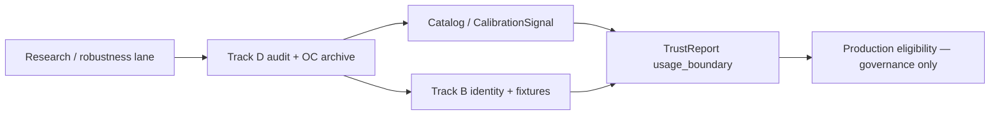

# Roadmap alignment gate

**ID:** ROADMAP-ALIGNMENT-GATE  
**Status:** active  
**Last updated:** 2026-05-28  

**Binding:** [`ROADMAP_V4.md`](ROADMAP_V4.md) · [`EXPERIMENTATION_PLATFORM_VISION.md`](EXPERIMENTATION_PLATFORM_VISION.md) · [`TRACK_B_ARCHITECTURE_PLAN.md`](TRACK_B_ARCHITECTURE_PLAN.md) · [`MIP_PERIODIC_ARCHITECTURE_AND_ROBUSTNESS_AUDIT_TEMPLATE.md`](MIP_PERIODIC_ARCHITECTURE_AND_ROBUSTNESS_AUDIT_TEMPLATE.md) · [`MIP_AUDIT_REGISTRY.md`](MIP_AUDIT_REGISTRY.md)

---

## Purpose

Ensure every Track B, Track C, Track D, MMM, planning, and LLM-interface task remains aligned to the Marketing Intelligence Platform north star.

**Dual mandate:** Every work item must either **advance the production path** or **reduce a clearly identified scientific/platform risk** under explicit non-production governance. The gate must **not** block meaningful statistical, mathematical, or conceptual development — only ungoverned promotion.

**Operating principle:**

> **Strict about production claims. Flexible about research. Unforgiving about ungoverned promotion.**

## North star

A governed causal marketing intelligence system that converts experiments, lift studies, holdouts, MMM, diagnostics, and calibration evidence into **trustworthy budget and planning decisions**.

---

## Required alignment questions

Every roadmap item **must** answer these before work starts and when status changes:

| # | Question |
|---|----------|
| 1 | Which **platform capability** does this enable? |
| 2 | Which **decision risk** does this reduce? |
| 3 | Which **governed artifact** does this create, validate, or consume? |
| 4 | Does this improve **causal validity**, **trust**, **calibration**, **planning**, **recommendation quality**, or **explainability**? |
| 5 | What is **out of scope**? |
| 6 | What would make this work **sideways** (failure mode if mis-sequenced or mis-scoped)? |
| 7 | If this is **research or robustness** work: what evidence is required before it may affect production, calibration, or decisioning? |

---

## Two lanes

| Lane | Intent | May ship to production? |
|------|--------|-------------------------|
| **Production / integration** | Governed artifacts on real paths (contracts, dual-write, adapter, TrustReport in product) | Yes — when stop conditions met |
| **Research / robustness / investigation** | Literature, math, inference, design, OC, prototypes, negative findings, ADRs | **No** — until promotion path completed |

A roadmap item may proceed **without** immediately producing production artifacts when it is **explicitly classified** as research, robustness, or investigation work and satisfies [§ Research / robustness lane](#research--robustness-lane).

Track D packages (D1–D8) are **primarily research-lane** unless paired with an approved promotion milestone.

---

## Research / robustness lane

### Valid work types

Research-lane work **includes** (not limited to):

- Literature cross-checks  
- Estimator math audits  
- Inference method investigations  
- Matching / design algorithm audits  
- Power / MDE reviews  
- Operating-characteristic simulations  
- Prototype methods  
- Negative findings  
- Method deprecation reviews  
- Conceptual ADRs  

### Required declarations (all seven)

Research-lane items **must** satisfy **all** of the following before starting:

| # | Requirement |
|---|-------------|
| 1 | State the **scientific or platform risk** being reduced. |
| 2 | Declare that outputs are **not production-, calibration-, or decision-eligible**. |
| 3 | Identify **method**, **estimand**, **design geometry**, **assumptions**, and **failure modes** under investigation. |
| 4 | Record required **literature or prior-art** grounding (cite or checklist ref — e.g. [`TRACK_D_LITERATURE_CROSSCHECK_001.md`](TRACK_D_LITERATURE_CROSSCHECK_001.md)). |
| 5 | Define **what evidence** would be needed before promotion (OC archive, audit pass, replication, etc.). |
| 6 | Name the **eventual governance path** (one or more): Track B identity mapping · Track D robustness audit · OC simulation · TrustReport `usage_boundary` update · CalibrationSignal eligibility review (if applicable). |
| 7 | Answer alignment **question 7** — promotion evidence bar explicit. |

Use the **Research lane intake** template in [§ How to use this gate](#how-to-use-this-gate).

### Research-lane prohibitions

Research-lane work **must not**:

| Prohibition | Why |
|-------------|-----|
| Change production estimator behavior **silently** | Violates investigation discipline |
| Alter **eligibility**, **maturity**, or **release gates** | Promotion is governance-gated |
| **Promote** instruments without OC evidence | Track D + catalog lifecycle |
| **Feed MMM or planning** directly | Requires TrustReport + transform path |
| **Bypass TrustReport** | Trust boundary is non-negotiable for decisions |
| Create **untracked orphan findings** | Must land in investigations ledger or DEF registry |

Core [program non-goals](#non-goals-program-wide) still apply; the research lane adds **process**, it does not relax them.

### Terminal outcomes (required close)

Every research finding **must** end as exactly one of:

| Outcome | Meaning |
|---------|---------|
| `fixed` | Defect or gap remediated; promotion path may open |
| `accepted_deviation` | Known limit documented; bounded usage |
| `rejected` | Method or claim not supported |
| `deprecated` | Wind down instrument or path |
| `blocked` | Cannot proceed without new evidence or design |
| `deferred` | Tracked in [`OPEN_INVESTIGATIONS.md`](OPEN_INVESTIGATIONS.md) or [`DEFERRED_WORK_REGISTRY.md`](DEFERRED_WORK_REGISTRY.md) |
| `escalated` | Requires governance decision (Phase memo, ADR) |
| `investigating` | Active — must have owner and next review date |

No open research item without a terminal outcome or explicit `investigating` status.

### Promotion bridge (research → production)

Research may **inform** production only through governed handoffs:



Skipping a box without documented waiver is **ungoverned promotion** (forbidden).

---

## Non-goals (program-wide)

| Non-goal | Rationale |
|----------|-----------|
| Estimator work disconnected from TrustReport or CalibrationSignal | Measurement without trust boundary is unsafe promotion |
| MMM intake without estimand compatibility | DEF-012; transform + registry IDs required |
| LLM interface before governed artifacts | Agents must ground on ExperimentEvidence, CalibrationSignal, TrustReport — not raw runs |
| Optimizer recommendations without trust context | Budget/planning must consume TrustReport outcomes |
| Tests that validate structure while ignoring causal safety | B5d guards F1–F12; golden fixtures encode semantic oracles |
| Method promotion without Track D evidence | Catalog lifecycle requires OC + audit, not contracts alone |

---

## Success criteria

1. Every **active** roadmap item in [`ROADMAP_V4.md`](ROADMAP_V4.md) has an explicit **lane** (production vs research), alignment block, and **stop condition**.  
2. New items are not added without answering the six questions **plus question 7** when research-lane.  
3. Completed items retain their alignment record (audit trail).  
4. Research items close with a **terminal outcome** or governed `investigating` status — no orphans.  

---

## Alignment registry (active & recent)

### Track B — contract pipeline

#### B5c — TrustReport composer contract tests ✅

| Dimension | Statement |
|-----------|-----------|
| **Capability** | Executable trust boundary — only TrustReport emits `alignment_verdict` / `trust_outcome` |
| **Decision risk** | Silent lift claims from null-monitor instruments; verdict leakage into adapter/evidence |
| **Artifacts** | **Validates** golden `trust_report_expected_output`; **consumes** adapter facts + CalibrationSignal binding |
| **Improves** | Trust, explainability |
| **Out of scope** | Production TrustReport UI; estimator changes; adapter resolution |
| **Sideways risk** | Composer re-implements business logic instead of reading facts → mitigated by fixture oracles |
| **Stop condition** | All GOLD-001–010 scenarios pass via `compose_trust_report`; boundary tests green — **met** (`tests/track_b/test_trust_report_composer.py`) |

#### B5d — Contract bundle validator ✅

| Dimension | Statement |
|-----------|-----------|
| **Capability** | Pre-M2 sanity gate for complete Track B bundles |
| **Decision risk** | Structurally valid but semantically unsafe contracts (placebo-as-CI, missing IDs, verdict on wrong layer) |
| **Artifacts** | **Validates** manifest, fixtures, composed TrustReport parity; **consumes** B5a oracles |
| **Improves** | Trust, causal validity (F1–F12 guards) |
| **Out of scope** | GeoX adapter implementation; numerical OC; eligibility/maturity |
| **Sideways risk** | Validator passes while composer drifts → mitigated by composition-oracle check in validator |
| **Stop condition** | `poetry run python -m tests.track_b.contract_validator` exits 0; pytest B5d green — **met** |

#### M2 — Dual-write GeoX → Track B views

| Dimension | Statement |
|-----------|-----------|
| **Capability** | Real runs emit governed `ExperimentEvidence` + sidecar on RunBundle |
| **Decision risk** | Product continues on legacy cards only; Track B contracts never touch production data |
| **Artifacts** | **Creates** `track_b_views` dual-write; **consumes** B2/B4 field map |
| **Improves** | Trust, calibration exchange, explainability |
| **Out of scope** | TrustReport composer in production path; Track C; MMM transforms |
| **Sideways risk** | Dual-write diverges from legacy without tests → stop if B5 contract tests not run on exported views |
| **Stop condition** | RunBundle carries `track_b_views.experiment_evidence` for five instrument configs; B5 adapter compare tests pass on live export |

#### Wire adapter (`resolve_adapter_output`)

| Dimension | Statement |
|-----------|-----------|
| **Capability** | B4 rules produce adapter output matching golden oracles |
| **Decision risk** | IDs inferred from estimator names (F1); wrong instrument (F2) |
| **Artifacts** | **Creates** resolved ExperimentEvidence + alignment facts; **consumes** spec + registry + catalog |
| **Improves** | Causal validity, trust |
| **Out of scope** | Trust verdicts on adapter; eligibility changes |
| **Sideways risk** | Adapter hard-codes happy-path IDs → stop if any GOLD fixture fails compare |
| **Stop condition** | `resolve_adapter_output` implemented; 12 skipped B5b compare tests pass |

---

### Track D — statistical robustness

#### D0 / D0b — Inventory & literature templates ✅

| Dimension | Statement |
|-----------|-----------|
| **Capability** | Method coverage map and audit checklists |
| **Decision risk** | Promotion without knowing what was never validated |
| **Artifacts** | **Creates** robustness matrix + literature cross-check doc |
| **Improves** | Causal validity, trust (feeds catalog) |
| **Out of scope** | Estimator fixes; contract schema changes |
| **Sideways risk** | Inventory becomes shelf-ware → D1+ must cite matrix rows |
| **Stop condition** | D0/D0b docs complete; every in-scope config has a matrix row — **met** |

#### D1+ — Design / estimator / inference audits (research lane)

| Dimension | Statement |
|-----------|-----------|
| **Lane** | **Research / robustness** — outputs not decision-eligible until promotion bridge |
| **Capability** | Evidence-backed instrument promotion/demotion (future) |
| **Decision risk** | Statistical or mathematical lies despite correct IDs |
| **Artifacts** | **Creates** audit packages, OC archives, literature checklists; **may update** catalog only via governance |
| **Improves** | Causal validity (primary); trust via catalog/TrustReport handoff |
| **Out of scope** | Silent estimator changes; eligibility/maturity; MMM/planning feed |
| **Promotion evidence** | OC archive + implementation audit + Track B `estimand_id` / `measurement_instrument_id` mapping |
| **Governance path** | Track D audit → OC → Track B fixtures → Catalog lifecycle → TrustReport `usage_boundary` → optional CalibrationSignal review |
| **Sideways risk** | Audit conclusions treated as production-ready without OC → forbidden |
| **Stop condition** | Terminal outcome per method row (`characterized`, `blocked`, `deprecated`, etc.) + matrix row updated; promotion only via separate governed milestone |

---

### Track C — user-level experimentation (future)

| Dimension | Statement |
|-----------|-----------|
| **Capability** | Cross-modality ExperimentSpec / TrustReport for A/B, CLS, holdouts |
| **Decision risk** | Geo semantics silently reused for user-randomized designs |
| **Artifacts** | **Creates** Track C contract extensions; **consumes** Track B base |
| **Improves** | Planning, recommendation quality, trust |
| **Out of scope** | Implementation before Track A Phase 15 + M2 + B5 pipeline complete |
| **Sideways risk** | CLS estimands without exposure-opportunity semantics (INV-026) |
| **Stop condition** | ADR + golden fixtures for one CLS slice; no production API until gate re-passed |

---

### MMM & planning interfaces (future)

| Dimension | Statement |
|-----------|-----------|
| **Capability** | Experiment → MMM calibration with transform evidence |
| **Decision risk** | Raw lift points enter MMM without `estimand_transform_ref` (DEF-012, GOLD-004) |
| **Artifacts** | **Consumes** TrustReport + CalibrationSignal + transform OC |
| **Improves** | Planning, calibration |
| **Out of scope** | MMM intake before B5 MMM fixtures green and transform policy archived |
| **Sideways risk** | Δμ from geo relative ATT without transform chain |
| **Stop condition** | MMM intake blocked in TrustReport until transform evidence complete — enforced in B5c/GOLD-004 |

---

### LLM / orchestration interface (future)

| Dimension | Statement |
|-----------|-----------|
| **Capability** | Grounded agents over governed artifacts |
| **Decision risk** | Unsourced promotion from run logs or estimator names |
| **Artifacts** | **Consumes** TrustReport, DiagnosticSummary, investigations ledger |
| **Improves** | Explainability |
| **Out of scope** | Any LLM surface before M2 + production TrustReport path exist |
| **Sideways risk** | Natural language overrides `trust_outcome` |
| **Stop condition** | Agent tools read-only on contract types; no write path to eligibility or verdicts |

---

## How to use this gate

### Production / integration lane

1. **Starting work** — Answer questions 1–6; classify lane as **production**.  
2. **Completing work** — Mark stop condition met with evidence (test module, doc ID, archive path).  
3. **Adding roadmap rows** — Update this registry and [`ROADMAP_V4.md`](ROADMAP_V4.md) in the same PR.

### Research lane intake (template)

Copy into investigation plan, Track D package header, or Phase memo:

```markdown
**Lane:** research / robustness / investigation
**Risk reduced:** <scientific or platform risk>
**Not eligible for:** production | calibration claims | budget/planning decisions
**Under investigation:** method=… estimand=… geometry=… assumptions=… failure_modes=…
**Literature / prior art:** <refs or TRACK_D_LITERATURE_CROSSCHECK checklist IDs>
**Promotion evidence required:** <OC n, audit pass, replication, …>
**Governance path:** Track B … | Track D … | OC … | TrustReport … | CalibrationSignal …
**Terminal outcome:** investigating | fixed | accepted_deviation | rejected | deprecated | blocked | deferred | escalated
```

### Shared rules

4. **Re-audit** — Phase 15 / ROADMAP_V5 verifies no production claim without lane + stop condition; no research orphan without terminal outcome.  
5. **Ambiguous items** — Default to research lane until promotion path is named; never default to production-eligible.  
6. **Periodic audit** — After major milestones, run [`MIP_PERIODIC_ARCHITECTURE_AND_ROBUSTNESS_AUDIT_TEMPLATE.md`](MIP_PERIODIC_ARCHITECTURE_AND_ROBUSTNESS_AUDIT_TEMPLATE.md) and update [`MIP_AUDIT_REGISTRY.md`](MIP_AUDIT_REGISTRY.md).

---

*Gate ROADMAP-ALIGNMENT-GATE. Strict on production claims; flexible on research; unforgiving on ungoverned promotion.*
