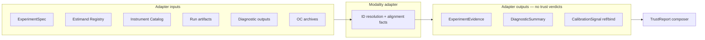
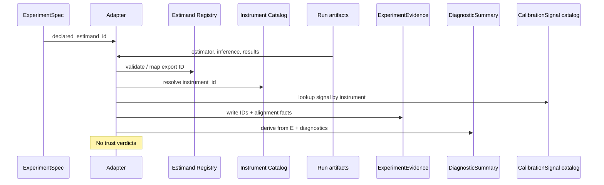

# Track B — adapter ID resolution architecture 001

**Document ID:** TRACK-B-ADAPTER-ID-RESOLUTION-001  
**Status:** architecture design — B4 deliverable  
**Last updated:** 2026-05-20  
**Package version:** 0.2.1 (current implementation)  

**Binding inputs:** [`TRACK_B_CONTRACT_SCHEMA_DRAFT_001.md`](TRACK_B_CONTRACT_SCHEMA_DRAFT_001.md) · [`TRACK_B_ESTIMAND_REGISTRY_001.md`](TRACK_B_ESTIMAND_REGISTRY_001.md) · [`TRACK_B_MEASUREMENT_INSTRUMENT_CATALOG_001.md`](TRACK_B_MEASUREMENT_INSTRUMENT_CATALOG_001.md)  

**Related:** [`TRACK_B_GEO_ADAPTER_001.md`](TRACK_B_GEO_ADAPTER_001.md) (artifact inventory, view mapping) · [`TRACK_B_ARTIFACT_CONSOLIDATION_001.md`](TRACK_B_ARTIFACT_CONSOLIDATION_001.md) · [`DEFERRED_WORK_REGISTRY.md`](DEFERRED_WORK_REGISTRY.md)

This document defines **how modality adapters resolve and attach** `estimand_id`, `measurement_instrument_id`, `estimand_transform_ref`, layered estimand IDs, and **alignment facts** when exporting Track B contracts. **Architecture only** — no code, runtime schema, APIs, eligibility, maturity, release-gate, scoring, or estimator behavior changes.

**Relationship to B1a:** [`TRACK_B_GEO_ADAPTER_001.md`](TRACK_B_GEO_ADAPTER_001.md) maps **which legacy artifacts** feed which contract facets. **B4** defines **ID resolution discipline** — the governed export rules B5 contract tests will assert.



---

## 1. Purpose and scope

### Adapter responsibility

| Adapter **does** | Adapter **does not** |
|------------------|----------------------|
| Resolve registry **estimand_id** layers from spec + export semantics | Decide `supported` / `unsupported` trust outcomes |
| Resolve **measurement_instrument_id** from modality × estimator × inference × geometry × interval semantics | Change estimator algorithms or `results` keys |
| Copy **declared** IDs from ExperimentSpec | Invent declarative intent from runtime config |
| Record **alignment facts** (boolean, typed) on ExperimentEvidence | Emit TrustReport narratives |
| Attach **CalibrationSignal** references by instrument lookup | Compose OC from a single live run |
| Block or qualify export when IDs cannot be resolved | Override eligibility registry or maturity labels |
| Surface `estimand_transform_ref` and transform-completion facts | Execute MMM transforms |

**Core discipline:** Turn contract architecture (B2, B3a, B3b) into **governed export hygiene** so B5 tests have concrete rules.

### Modality scope

| Adapter | Status in B4 |
|---------|--------------|
| **Geo** (`panel_exp` / GeoX) | **Normative** — full resolution tables |
| **A/B, Conversion Lift, Holdout** | **Structural** — same rules; registry placeholders until Track C OC |
| **Calibration replay** | Inherits underlying modality + pins `scored_estimand_id` |

### Identity axes (recap)

| Axis | Question | Authority |
|------|----------|-----------|
| **`estimand_id`** | What causal quantity is claimed / exported? | Estimand Registry |
| **`measurement_instrument_id`** | How was it measured? | Instrument Catalog |

Together they block **estimator-name inference** and **causal-quantity drift** (e.g. geo relative ATT → MMM Δμ without transform).

---

## 2. Inputs

### 2.1 ExperimentSpec (required for business export)

| Input field | Resolution use |
|-------------|----------------|
| `declared_estimand_id` | Copied to evidence; anchor for `declared_exported_aligned` |
| `interval_estimand_expectation_id` | Compared to resolved `interval_estimand_id` |
| `scored_estimand_expectation_id` | Calibration runs only |
| `estimand_transform_ref` | MMM intake; compared to evidence transform facts |
| `mmm_calibration_intent` | Gates transform validation |
| `measurement_instrument_id_expected` | Plan-violation detection |
| `geometry_class` | Instrument resolution segment |
| `modality` | Namespace for all IDs |

**Missing `declared_estimand_id`:** adapter **must not** emit decision-grade ExperimentEvidence (§5).

### 2.2 Estimand Registry (binding)

Static architecture doc [`TRACK_B_ESTIMAND_REGISTRY_001.md`](TRACK_B_ESTIMAND_REGISTRY_001.md) — adapter treats as **lookup authority**:

- Valid ID exists for modality + aggregation + scale  
- `unsafe_comparisons` inform diagnostic facets — not adapter blocks  
- Layer defaults (e.g. geo family export → pooled path B)

**Transition:** `TargetEstimand` / `relative_att_post` strings map through **explicit translation table** (§4.1) — never direct passthrough as canonical ID.

### 2.3 Measurement Instrument Catalog (binding)

[`TRACK_B_MEASUREMENT_INSTRUMENT_CATALOG_001.md`](TRACK_B_MEASUREMENT_INSTRUMENT_CATALOG_001.md) — adapter treats as **instrument authority**:

- Full `measurement_instrument_id` per governed config  
- `config_alias` → ID (e.g. `SCM_UnitJackKnife`)  
- Trust boundaries, `usage_boundary`, known exclusions — **copied to signal reference**, not re-derived

### 2.4 Run artifacts (modality-specific)

**Geo (`panel_exp` today):**

| Artifact | ID resolution use |
|----------|-------------------|
| Estimator class / registry name | `instrument_family` segment |
| `inference` mode string | `inference_method` segment |
| `InferenceResult.interval_type` | `interval_semantics` segment |
| `panel_data` treated count | `geometry_class` at run vs spec |
| `results` path shape | `exported_estimand_id` (family export rules) |
| `DesignSpec.target_estimand` | Legacy → registry mapping only |
| `did_interval_policy` | DID interval estimand branch |
| Recovery context flag | Sets `scored_estimand_id` |

### 2.5 Diagnostic outputs

| Source | Use |
|--------|-----|
| `review_flags`, `did_pretrend_contract` | DiagnosticSummary facets — **no ID invention** |
| Alignment flags pre-computed on evidence | DiagnosticSummary references same facts |
| `classify_review_flag_support` unavailable reasons | Informational facets |

### 2.6 OC / historical characterization records

| Source | Use |
|--------|-----|
| Track A archives (Run 001/002, Phase 11–15) | Pre-composed **CalibrationSignal** entries keyed by `measurement_instrument_id` |
| Governance decisions | `usage_boundary`, `prohibited_claims` on signal |
| DEF registry | `def_refs` on signal — read-only mirror |

**Live run does not create CalibrationSignal** — adapter **binds** existing signal ID + version.

---

## 3. Outputs

### 3.1 ExperimentEvidence (primary adapter product)

Minimum export per [`TRACK_B_CONTRACT_SCHEMA_DRAFT_001.md`](TRACK_B_CONTRACT_SCHEMA_DRAFT_001.md) Appendix A:

| Field | Source |
|-------|--------|
| `declared_estimand_id` | Spec copy |
| `exported_estimand_id` | §4.2 resolution |
| `scored_estimand_id` | §4.2 when calibration/recovery |
| `interval_estimand_id` | §4.3 |
| `measurement_instrument_id` | §4.4 |
| `interval_semantics` | From instrument + inference |
| `instrument_family`, `inference_method`, `geometry_class` | Denormalized facets |
| Alignment facts | §4.6 |
| `calibration_signal_id`, `calibration_signal_version` | §4.5 lookup |
| `spec_ref`, `evidence_id`, provenance | Generated |

**Optional dual-write (M2):** `track_b_views.experiment_evidence` on RunBundle — same fields; legacy keys unchanged ([`TRACK_B_ARTIFACT_CONSOLIDATION_001.md`](TRACK_B_ARTIFACT_CONSOLIDATION_001.md)).

### 3.2 DiagnosticSummary

| Field | Source |
|-------|--------|
| `primary_context_estimand_id` | Evidence `declared_estimand_id` |
| `diagnostic_estimand_id` | When facet is estimand-specific (§4.6) |
| `measurement_instrument_id` | Evidence copy |
| `estimand_diagnostic_facets` | Derived from evidence flags + review outputs |
| `export_status` | `complete` · `partial` · `blocked` |

**No trust outcomes.** Modifiers reference evidence facts — TrustReport composes.

### 3.3 CalibrationSignal (bind, not compute)

| Action | Detail |
|--------|--------|
| **Lookup** | `measurement_instrument_id` → static signal catalog entry |
| **Attach to evidence** | `calibration_signal_id`, `signal_version` |
| **Validate** | Instrument exists in catalog; signal not `retired` |
| **Do not** | Recompute FPR/power from live run |

CalibrationSignal composition remains **offline archive job** (B7 / governance); adapter only **references**.

### 3.4 Alignment facts (on evidence only)

| Fact | Computed when |
|------|---------------|
| `declared_exported_aligned` | `declared_estimand_id` == `exported_estimand_id` |
| `declared_interval_aligned` | interval == spec expectation |
| `exported_interval_aligned` | interval compatible with family export |
| `scored_exported_aligned` | scored == exported (calibration) |
| `scale_compatible` | registry scale segments match |
| `aggregation_divergence_detected` | A vs B mismatch detected (DEF-009) |
| `instrument_plan_violation` | resolved ID ≠ spec expected |
| `geometry_within_scope` | run geometry ∈ instrument scope |
| `interval_semantics_compatible` | placebo ≠ CI conflation |
| `transform_declared` | spec has `estimand_transform_ref` |
| `transform_evidence_complete` | adapter recorded transform chain facts (future) |
| `mmm_intake_blocked` | intent true but transform incomplete |

**Verdicts are not facts.** `trust_outcome`, `alignment_verdict` → TrustReport only.

---

## 4. Resolution rules

### 4.1 Declared estimand (from Spec)

```
declared_estimand_id := ExperimentSpec.declared_estimand_id
```

| Rule | Detail |
|------|--------|
| **R1** | Adapter never overwrites declared ID from runtime |
| **R2** | Legacy spec without registry ID → adapter maps via table or **blocks export** |
| **R3** | `study_purpose: calibration` requires `scored_estimand_expectation_id` on spec |

**Legacy translation (geo — illustrative):**

| Legacy | Registry ID (default business geo) |
|--------|-----------------------------------|
| `TargetEstimand.RELATIVE_ATT_POST` + pooled path policy | `geo.relative_att_post.pooled_path.relative` |
| `TargetEstimand.RELATIVE_ATT_POST` + cell-mean policy | `geo.relative_att_post.cell_mean.relative` |
| `TargetEstimand.CUMULATIVE_ATT` | `geo.cumulative_att.full_post.absolute` |
| `TargetEstimand.ABSOLUTE_ATT_POST` | `geo.mean_post_period_att.post_window.absolute` |
| `UNKNOWN` | **Block** — no `exported_estimand_id` fallback |

### 4.2 Exported estimand (from estimator family / export semantics)

```
exported_estimand_id := resolve_export(estimator_family, results_shape, design_spec_policy)
```

| Estimator family | Default export ID (geo) | Override |
|------------------|---------------------------|----------|
| SyntheticControl, TBRRidge, AugSynthCVXPY (path) | `geo.relative_att_post.pooled_path.relative` | Spec declares `cell_mean` → export resolver must use A or set `declared_exported_aligned: false` |
| DID (point path) | `geo.relative_att_post.pooled_path.relative` or policy-specific point | `did_interval_policy` for intervals |
| DID (bootstrap interval) | Point may differ from `geo.cumulative_att.did_bootstrap.absolute` for **interval** layer only |

| Rule | Detail |
|------|--------|
| **R4** | Export resolver uses **family table** — not SCM/TBR class name alone |
| **R5** | If export cannot be expressed as registry ID → `exported_estimand_id: unknown` + **block decision-grade export** |
| **R6** | Scored layer: recovery context → `scored_estimand_id` = `geo.relative_att_post.pooled_path.relative` (current contract) |

### 4.3 Interval estimand (from inference method)

```
interval_estimand_id, interval_semantics := resolve_interval(inference_mode, InferenceResult, estimator_family)
```

| Inference | `interval_semantics` | `interval_estimand_id` (geo) |
|-----------|----------------------|------------------------------|
| UnitJackKnife, BRB, KFold | `confidence_interval` | `geo.relative_att_post.pooled_path.relative` when paths aligned |
| Placebo | `placebo_band` | `geo.placebo_null_envelope.pooled_path.relative` |
| Point-only / none | `none` | `null` or omitted |
| DID bootstrap | `cumulative_att_interval` | `geo.cumulative_att.did_bootstrap.absolute` |

| Rule | Detail |
|------|--------|
| **R7** | `InferenceResult.interval_type` → `interval_semantics` — preserve `PLACEBO_BAND` |
| **R8** | `interval_estimand_id` may **differ** from `exported_estimand_id` (DID) — set `exported_interval_aligned` per policy |
| **R9** | Never set `interval_semantics: confidence_interval` when type is placebo |

### 4.4 Measurement instrument (from five dimensions)

```
measurement_instrument_id := lookup_catalog(
  modality=geo,
  estimator_family,
  inference_method,
  geometry_class,
  interval_semantics
)
```

**Canonical format** ([`TRACK_B_MEASUREMENT_INSTRUMENT_CATALOG_001.md`](TRACK_B_MEASUREMENT_INSTRUMENT_CATALOG_001.md)):

```
geo.{estimator_family}.{inference_method}.{point_estimand_family}.{geometry_class}.{interval_type}
```

**Geo config alias → instrument (normative table):**

| Config alias | `measurement_instrument_id` |
|--------------|---------------------------|
| `SCM_UnitJackKnife` | `geo.synthetic_control.unit_jackknife.relative_att_post.multi_treated_default.confidence_interval` |
| `SCM_Placebo` | `geo.synthetic_control.placebo.relative_att_post.single_treated_only.placebo_band` |
| `TBRRidge_BlockResidualBootstrap` | `geo.tbrridge.block_residual_bootstrap.relative_att_post.multi_treated_default.confidence_interval` |
| `TBRRidge_Kfold` | `geo.tbrridge.kfold.relative_att_post.multi_treated_default.confidence_interval` |
| `AugSynthCVXPY_Point` | `geo.augsynth_cvxpy.point_only.relative_att_post.multi_treated_default.none` |
| `AugSynthCVXPY_UnitJackKnife` | `geo.augsynth_cvxpy.unit_jackknife.relative_att_post.multi_treated_default.confidence_interval` |
| DID + bootstrap | `geo.did.bootstrap.relative_att_post.multi_treated_default.cumulative_att_interval` |

| Rule | Detail |
|------|--------|
| **R10** | `geometry_class` from **run** `n_treated` + spec: single (1) vs multi (≥2) |
| **R11** | Placebo on multi-treated → instrument may resolve but evidence records `geometry_within_scope: false` |
| **R12** | Unknown config → `measurement_instrument_id: unknown` — block calibration-backed export |

### 4.5 CalibrationSignal binding

```
(calibration_signal_id, version) := catalog_lookup(measurement_instrument_id)
```

| Rule | Detail |
|------|--------|
| **R13** | Signal must exist for instrument or evidence records `calibration_signal_missing: true` |
| **R14** | Evidence pins `calibration_signal_version` — TrustReport detects stale |
| **R15** | Signal `calibration_estimand_id` is **not** substituted for `declared_estimand_id` on evidence |

### 4.6 Alignment facts (compute after resolution)

```
FOR each pair (declared, exported, interval, scored):
  record boolean fact; DO NOT emit verdict
IF declared aggregation == cell_mean AND export default == pooled_path:
  aggregation_divergence_detected := compare_if_heterogeneous_context
IF mmm_calibration_intent AND NOT transform_evidence_complete:
  mmm_intake_blocked := true
```

| Rule | Detail |
|------|--------|
| **R16** | Facts are **total** — prefer explicit `false` over omission |
| **R17** | `incompatible interval semantics` recorded as fact; TrustReport interprets |

### 4.7 Transform reference (MMM intake)

```
IF Spec.mmm_calibration_intent:
  REQUIRE Spec.estimand_transform_ref
  Evidence.transform_source_estimand_id := exported_estimand_id
  Evidence.transform_target_estimand_id := resolve from transform_ref (e.g. mmm.delta_mu.simulated_response.absolute)
  Evidence.transform_evidence_complete := false until transform pipeline attests (future)
```

| Rule | Detail |
|------|--------|
| **R18** | Adapter **blocks MMM-ready export flag** when transform incomplete — not business evidence export |
| **R19** | Direct `exported_estimand_id` geo relative → MMM target without ref → `mmm_intake_blocked: true` |

---

## 5. Failure behavior

Export policy tiers:

| Tier | Meaning | Consumer impact |
|------|---------|-----------------|
| **`complete`** | All required IDs resolved; facts recorded | TrustReport may run |
| **`partial`** | Evidence exported; gaps explicit (unknown secondary, missing diagnostics) | TrustReport `not_assessable` for some claim types |
| **`blocked`** | Required ID missing — no decision-grade evidence | TrustReport `not_assessable` |

### Failure matrix

| Condition | Adapter action | Evidence markers | TrustReport (downstream) |
|-----------|----------------|------------------|------------------------|
| Missing `declared_estimand_id` on spec | **Block** business export | `export_status: blocked` | `not_assessable` |
| Unresolvable `exported_estimand_id` | **Block** | `exported_estimand_id: unknown` | `not_assessable` |
| Missing `measurement_instrument_id` | **Block** calibration-backed export; partial otherwise | `instrument_id: unknown` | `not_assessable` for cal claims |
| Unknown instrument (no catalog entry) | Partial + fact | `calibration_signal_missing: true` | `not_assessable` for cal claims |
| Incompatible interval semantics (placebo labeled CI) | **Record fact** on evidence | `interval_semantics_compatible: false` | `unsupported` (TrustReport) |
| Declared ≠ exported (no waiver) | **Record fact** | `declared_exported_aligned: false` | `unsupported` / `inconclusive` |
| Aggregation A vs B drift | **Record fact** | `aggregation_divergence_detected: true` | `inconclusive` |
| MMM intent, no `estimand_transform_ref` | **Record fact** | `mmm_intake_blocked: true` | `unsupported` |
| Transform ref present, incomplete evidence | **Record fact** | `transform_evidence_complete: false` | `not_assessable` for MMM |
| Stale `calibration_signal_version` | **Warn** on evidence | `calibration_signal_stale: true` | `not_assessable` or qualified |
| Retired instrument / signal | **Warn or exclude** per policy | `instrument_retired: true` | `not_assessable` |
| Catalog doc version ≠ pin | **Warn** | `catalog_pin_mismatch` | Informational |

**Principle:** Adapter **fails closed** on missing **identity**; adapter **fails open on facts** for semantic mismatches — TrustReport judges.

### Export blocking vs TrustReport-only

| Issue | Adapter | TrustReport |
|-------|---------|-------------|
| Missing estimand ID | **Block** | — |
| Missing instrument ID | **Block** (calibration scope) | — |
| Placebo vs CI semantic error | Fact | **unsupported** |
| Lift claim on null-monitor instrument | Fact + signal ref | **inconclusive** |
| Heterogeneous A/B drift | Fact | **inconclusive** |

---

## 6. Worked examples

### 6.1 SCM + UnitJackKnife — null monitor

**Context:** Multi-treated geo business study; null-screening intent; Phase 13 governed config.

| Resolution step | Value |
|-----------------|-------|
| `declared_estimand_id` | `geo.relative_att_post.pooled_path.relative` |
| `exported_estimand_id` | `geo.relative_att_post.pooled_path.relative` |
| `interval_estimand_id` | `geo.relative_att_post.pooled_path.relative` |
| `interval_semantics` | `confidence_interval` |
| `measurement_instrument_id` | `geo.synthetic_control.unit_jackknife.relative_att_post.multi_treated_default.confidence_interval` |
| `calibration_signal_id` | `cs-geo-scm-jk-001` (planning placeholder) |
| Alignment facts | `declared_exported_aligned: true`, `declared_interval_aligned: true` |
| Signal `usage_boundary` | `null_monitor_only` |

**Adapter:** `export_status: complete`.  
**TrustReport (downstream):** Null-screen claim → may `support` within scope; **lift launch** → `inconclusive` (DEF-013, signal boundary) — **not** adapter logic.

### 6.2 TBRRidge + KFold — restricted evidence

**Context:** Multi-treated panel post-fix; runnable but not trusted for calibration claims.

| Resolution step | Value |
|-----------------|-------|
| `measurement_instrument_id` | `geo.tbrridge.kfold.relative_att_post.multi_treated_default.confidence_interval` |
| `exported_estimand_id` | `geo.relative_att_post.pooled_path.relative` |
| Signal `usage_boundary` | `research_only` / `runnable_not_trusted` |
| Alignment facts | `geometry_within_scope: true` (post-fix), `calibration_signal_missing: false` |

**Adapter:** `export_status: complete` — evidence is valid **measurement record**.  
**TrustReport:** Calibration-backed lift → `not_assessable` or `inconclusive` per signal `known_exclusions` (DEF-001).

### 6.3 AugSynthCVXPY point — recovery OK, not calibration-eligible

**Context:** Point-only expert-review path; no aligned interval for lift.

| Resolution step | Value |
|-----------------|-------|
| `measurement_instrument_id` | `geo.augsynth_cvxpy.point_only.relative_att_post.multi_treated_default.none` |
| `exported_estimand_id` | `geo.relative_att_post.pooled_path.relative` |
| `interval_estimand_id` | *(omitted / null)* |
| `interval_semantics` | `none` |
| `scored_estimand_id` | *(set only in recovery context)* |
| Registry eligibility mirror | **Excluded** (DEF-019) |

**Adapter:** `export_status: complete` for point evidence; `declared_interval_aligned: false` if spec expected CI.  
**TrustReport:** Interval-backed lift claim → `unsupported`; point directional read → expert-review scope only.

### 6.4 Geo relative ATT → MMM intake (transform required)

**Context:** Spec declares `mmm_calibration_intent: true`; exported geo relative path.

| Resolution step | Value |
|-----------------|-------|
| `declared_estimand_id` | `geo.relative_att_post.pooled_path.relative` |
| `exported_estimand_id` | `geo.relative_att_post.pooled_path.relative` |
| `estimand_transform_ref` | `transform.geo_pooled_relative_to_mmm_delta_mu.v1` (planning ID) |
| `transform_target_estimand_id` | `mmm.delta_mu.simulated_response.absolute` |
| Without transform ref | `mmm_intake_blocked: true` |

**Adapter:** Emits evidence + transform facts; sets `transform_evidence_complete: false` until transform pipeline exists. **Blocks** `mmm_export_ready: true`.  
**TrustReport:** MMM intake → `unsupported` without complete transform; geo signal does **not** license MMM alone (DEF-012).

---

## 7. Adapter pipeline (conceptual)



**Ordered steps:**

1. Load spec — abort if `declared_estimand_id` missing (business export).  
2. Resolve run config → instrument candidates.  
3. Resolve `measurement_instrument_id` via catalog.  
4. Resolve `exported_estimand_id`, `interval_estimand_id`, `scored_estimand_id`.  
5. Bind CalibrationSignal reference.  
6. Compute alignment facts.  
7. Evaluate MMM transform gates.  
8. Emit ExperimentEvidence.  
9. Build DiagnosticSummary from evidence + raw diagnostics.  

---

## 8. B5 contract test hooks (planning)

B5 should assert adapter rules without production code — **golden fixtures**:

| Test case | Assert |
|-----------|--------|
| SCM JK multi-treated | Instrument ID + declared/exported alignment + signal bound |
| SCM Placebo single-treated | `placebo_band` semantics; interval estimand ≠ ATT CI |
| TBRRidge KFold | Complete evidence + signal `runnable_not_trusted` |
| AugSynth point | `interval_semantics: none`; interval alignment false if spec expects CI |
| MMM intent without transform | `mmm_intake_blocked: true` |
| Missing declared estimand | `export_status: blocked` |
| Legacy `TargetEstimand` map | Correct registry ID or block |

---

## 9. Non-goals

| Non-goal | Notes |
|----------|-------|
| **Implement adapter module** | B4 implementation follow-on |
| **Runtime JSON schema** | B2 OQ-B2-1 |
| **APIs** | No endpoints |
| **Eligibility / maturity / release gates** | Read-only mirrors |
| **New recovery scoring** | `scored_estimand_id` documents current contract |
| **Estimator behavior / results keys** | Unchanged |
| **TrustReport composer** | Separate B7 |
| **Replace B1a artifact inventory** | B1a remains; B4 adds ID discipline |

---

## Appendix A — Resolution dependency graph

```
declared_estimand_id (Spec)
    ├── copied → ExperimentEvidence.declared_estimand_id
    └── compared ← exported_estimand_id (run resolver)

measurement_instrument_id (Catalog lookup)
    ├── binds → CalibrationSignal
    ├── scopes → DiagnosticSummary
    └── constrains → interval_semantics

interval_estimand_id (Inference resolver)
    └── compared ← interval_estimand_expectation_id (Spec)

estimand_transform_ref (Spec, MMM only)
    └── gates → mmm_intake_blocked (Evidence fact)
```

---

## Appendix B — Success criterion

**B4 succeeds when:**

1. Adapter scope is **ID resolution and export hygiene** — not trust.  
2. **Resolution rules** cover declarared, exported, interval, instrument, signal binding, transforms.  
3. **Failure behavior** distinguishes block vs fact vs TrustReport judgment.  
4. **Four geo worked examples** are normative for B5 fixtures.  
5. B2/B3a/B3b bindings are explicit.  
6. B1a artifact mapping is complemented, not duplicated.

**Conclusion:**

> B4 turns Track B contract architecture into **governed export discipline** — giving B5 concrete rules to test before any runtime schema or adapter module ships.

**Suggested next artifacts:** B5 contract test plan · M2 dual-write field map · geo adapter module implementation (post-architecture).

---

*Planning artifact TRACK-B-ADAPTER-ID-RESOLUTION-001. B4 complete. Architecture only.*
