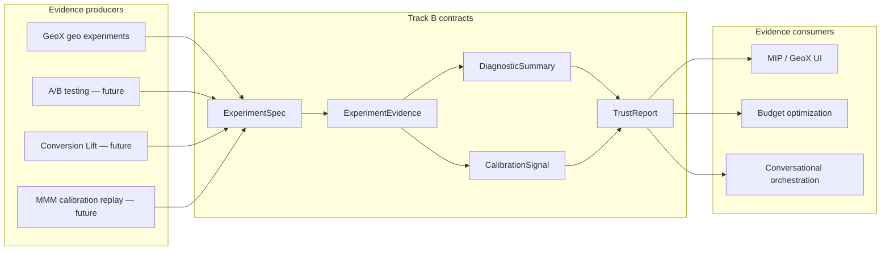

# Track B architecture plan

**Status:** roadmap amendment — architecture planning only  
**Last updated:** 2026-05-28  
**Package version:** 0.2.1 (current implementation)  

**Related:** [`ROADMAP_V4.md`](ROADMAP_V4.md) · [`EXPERIMENTATION_PLATFORM_VISION.md`](EXPERIMENTATION_PLATFORM_VISION.md) · [`GEOX_PANEL_EXP_STRATEGIC_CHECKPOINT.md`](GEOX_PANEL_EXP_STRATEGIC_CHECKPOINT.md) · [`PHASE13_GOVERNANCE_DECISION_001.md`](PHASE13_GOVERNANCE_DECISION_001.md) · [`DEFERRED_WORK_REGISTRY.md`](DEFERRED_WORK_REGISTRY.md)

This document defines **shared experimentation contracts** for the mid-term platform layer. It is a **planning artifact**, not an implementation spec. It does **not** change code, schemas, APIs, eligibility, maturity, or roadmap sequencing until formally adopted in `ROADMAP_V5.md`.

---

## 1. Why Track B now

### Track A foundation is sufficient

Track A has delivered the governance substrate required to define cross-modality contracts honestly:

| Track A deliverable | What it enables for Track B |
|---------------------|----------------------------|
| Estimand alignment (`relative_att_post`, `_path_relative_att`) | A concrete geo estimand to map into a registry |
| Recovery + interval alignment gates | Pattern for `CalibrationSignal` and interval contracts |
| Nominal calibration framework + Run 001/002 archives | Lifecycle template for evidence-linked trust |
| DGP hardening + diagnostics separation | Inputs to `DiagnosticSummary` without conflating measurement and review |
| Phase 11–13 OC + governance decisions | Bounded claims per config (SCM null monitor; BRB/Kfold restricted) |
| [`DEFERRED_WORK_REGISTRY.md`](DEFERRED_WORK_REGISTRY.md) | Institutional memory for limits that TrustReport must surface |
| [`PHASE13_GOVERNANCE_DECISION_001.md`](PHASE13_GOVERNANCE_DECISION_001.md) | Formal closure of estimator investigation program |

**The platform risk profile has shifted.** The dominant failure mode is no longer “we lack one more DID operating-characteristic table.” It is:

> **GeoX, A/B testing, Conversion Lift, and MMM will each produce evidence — but without shared contracts, those evidences cannot compose, transfer calibration, or support governed trust.**

### Why not another month of estimator characterization first

Phase 14 (DID OC) and Phase 15 (CVXPY/AugSynth wiring) remain **valuable but bounded**:

| Phase | Value | Why it does not unblock the platform moat alone |
|-------|-------|--------------------------------------------------|
| **Phase 14 — DID OC** | Clarifies cumulative-scale intervals and pretrend discipline | DID already has policy closure on relative-ATT intervals; geo MIP integration does not wait on DID OC |
| **Phase 15 — CVXPY validation** | Closes research/expert-review wiring gap | AugSynth is not on GeoX critical path today |

Additional estimator OC **does not**:

- Unify estimand semantics across geo and user-level modalities (DEF-009, DEF-011)  
- Define how ExperimentEvidence feeds MMM calibration (DEF-012)  
- Prevent silent “lift” labels across product surfaces  
- Enable TrustReport, feasibility governance, or conversational orchestration grounded in evidence  

**Recommendation (this plan):** **Prioritize Track B contract definition** before further estimator-specific characterization. Phase 14–15 may run **in parallel at low intensity** or be **re-sequenced** in `ROADMAP_V5.md` — they should not block Track B planning.

### Highest leverage next work

Define the **shared evidence contracts** that all modalities will implement — then implement GeoX against them first (backward-compatible bridge from today’s cards/bundles).

---

## 2. Shared experimentation model

All modalities are **evidence producers** feeding one governed stack. They differ in randomization unit, estimand, and measurement family — not in whether they produce auditable evidence.



### Modality roles

| Modality | Randomization unit | Primary estimands (examples) | Evidence producer today? |
|----------|-------------------|------------------------------|------------------------|
| **GeoX** | Geo / market panel | `relative_att_post`, ATT, absolute incremental revenue | **Yes** — `panel_exp` measurement + exports |
| **A/B testing** | User / session | Δμ, absolute lift, conversion rate delta | **No** — Track C; contracts first in Track B |
| **Conversion Lift** | User + exposure opportunity | Incremental conversions, iROAS, ghost-ad eligible lift | **No** — Track C; INV-026 exposure semantics |
| **MMM calibration** | Cohort / holdout / aggregate replay | Calibrated contribution, posterior incrementality | **No** — consumes ExperimentEvidence; does not replace experiments |

### Shared principles

1. **Every modality declares an estimand before measurement runs.**  
2. **Every evidence object states what was measured vs what was claimed.**  
3. **Calibration claims link to archived runs — not to green CI.**  
4. **Trust is narrative + limits — not a single score or auto-approve.**  
5. **Deferred gaps surface in TrustReport via [`DEFERRED_WORK_REGISTRY.md`](DEFERRED_WORK_REGISTRY.md).**

---

## 3. ExperimentSpec

**Conceptual responsibility:** the **declarative contract for what the study is** — before any estimator runs.

### Owns (conceptual)

| Domain | Examples |
|--------|----------|
| **Study identity** | Study ID, modality (`geo`, `ab`, `conversion_lift`, `holdout`), version |
| **Design** | Treatment assignment, duration, pre/post windows, holdout rules |
| **Randomization unit** | Geo, user, session, exposure-opportunity, cohort |
| **Declared estimand** | Business-facing quantity (e.g. relative lift on revenue, incremental conversions) |
| **Aggregation semantics** | Cell ATT vs pooled path vs aggregate-relative — ties to INV-003 / DEF-009 |
| **Interference assumptions** | SUTVA, spillover review level, partial interference flags |
| **Feasibility constraints** | MDE target, minimum duration, budget — inputs to future feasibility engine (DEF-010) |
| **Measurement plan** | Allowed estimator families, inference modes, waiver requirements (e.g. DID pretrend) |
| **Freshness / supersession** | Prior studies that this spec replaces or conflicts with |

### Does not own

- Point estimates, intervals, or p-values  
- Calibration run results  
- Trust outcomes  

### GeoX mapping (today → target)

| Today | Maps to ExperimentSpec field |
|-------|------------------------------|
| Treatment geos, dates, panel config | Design + randomization unit |
| Implicit `relative_att_post` in recovery | Declared estimand (must become explicit) |
| Estimator choice in notebook/API | Measurement plan |
| Missing explicit aggregation mode | **Gap** — DEF-009; must be declared in spec |

---

## 4. ExperimentEvidence

**Conceptual responsibility:** the **portable, immutable-ish evidence record** produced after measurement — the unit of reuse across MIP, MMM, and agents.

### Owns (conceptual)

| Domain | Examples |
|--------|----------|
| **Provenance** | Link to ExperimentSpec version, execution timestamp, package version |
| **Scored estimand** | What validation/recovery optimized (today: `_path_relative_att` / B) |
| **Declared estimand alignment** | Whether family export matches spec (flags misalignment) |
| **Point + interval** | Values with `interval_estimand`, `interval_scale`, alignment flags |
| **Measurement outputs** | Estimator-specific paths, weights, counterfactuals (by reference) |
| **Recovery / calibration refs** | Pointers to Run 001 class archives, OC docs, skip reasons |
| **Failure metadata** | Typed failures, ineligible configs, geometry class (single- vs multi-treated) |
| **Human review** | Waiver notes, pretrend override discipline |
| **Evidence tier** | Smoke vs characterization vs production calibration (INV-017) |

### Does not own

- Final trust verdict (→ TrustReport)  
- Aggregated diagnostics narrative (→ DiagnosticSummary)  
- Promotion or eligibility registry state (→ CalibrationSignal + governance docs)  

### GeoX mapping (today → target)

| Today | Maps to ExperimentEvidence |
|-------|---------------------------|
| Experiment card / bundle / evidence JSON | Facets of one logical evidence object |
| `est.results` + review flags | Measurement outputs + diagnostic inputs |
| Implicit recovery estimand | Scored estimand field (must be explicit) |
| No unified archive pointers | **Gap** — must link CALIBRATION_RUN_*, PHASE11/12/13 docs |

**Design direction:** consolidate overlapping export layers (six artifact types noted in OPEN_INVESTIGATIONS) into **one evidence contract with multiple views** — not six competing sources of truth.

---

## 5. DiagnosticSummary

**Conceptual responsibility:** **reviewer-facing diagnostic aggregate** — what a human (or agent) needs to assess study quality **without** replacing the estimand or calibration lifecycle.

### Owns (conceptual)

| Domain | Examples |
|--------|----------|
| **Pretrend / balance** | DID parallel trends, pre-period fit, placebo comparisons |
| **Donor / weight health** | SCM weight dispersion, collinearity warnings |
| **Interference signals** | Spillover stress flags (DGP-level today; estimator-level deferred DEF-004) |
| **Review flags** | Opt-in `build_estimator_review` outputs — pretrend fail, residual drift, etc. |
| **Geometry context** | n_treated, donor count, panel shape — links to INV-007 / Phase 11 |
| **Data quality** | Missingness policy, stale data, assignment integrity (future SRM — INV-025) |
| **Expert-review checklist** | What passed, what warn/fail, what requires waiver |

### Does not own

- Business estimand declaration (→ ExperimentSpec)  
- Nominal calibration eligibility (→ CalibrationSignal)  
- Go/no-go decision (→ human governance; ReleaseGate advisory only)  

### GeoX mapping (today → target)

| Today | Maps to DiagnosticSummary |
|-------|--------------------------|
| Review flags (opt-in) | Core diagnostic facets |
| DID pretrend contract on results | Pretrend facet |
| Experiment card narrative sections | Human-readable view of DiagnosticSummary |
| Readiness assessment inputs | Partial diagnostic inputs — must not conflate with TrustReport |

---

## 6. CalibrationSignal

**Conceptual responsibility:** **lifecycle state of calibration evidence** for a config × scenario × estimand — not a boolean “calibrated yes/no.”

### Owns (conceptual)

| Stage | Signal content |
|-------|----------------|
| **Recovery** | Finite metrics or typed failure on standard battery |
| **Interval alignment** | `interval_estimand == declared/scored estimand` |
| **Production run** | n≥100 archive exists (Run 001 pattern) |
| **Failure analysis** | Mechanism doc when OC fails |
| **OC characterization** | Width, power, geometry sensitivity (Phase 11 template) |
| **Eligibility** | In / out of `NOMINAL_CALIBRATION_ELIGIBLE_CONFIGS` + skip reason |
| **Usage boundary** | e.g. SCM null-monitor-only; BRB positive OC insufficient (DEF-002) |
| **Exchange metadata** | Sharable across studies / clients (future calibration exchange) |

### Signal states (conceptual — not enum finalization)

Examples: `recovery_passed` · `interval_aligned` · `null_oc_passed` · `positive_oc_failed` · `ineligible_skip` · `characterization_only` · `usage_restricted`

### Does not own

- Trust narrative for business decisions (→ TrustReport)  
- Raw measurement tensors (→ ExperimentEvidence)  

### GeoX mapping (today → target)

| Today | Maps to CalibrationSignal |
|-------|--------------------------|
| `nominal_calibration.py` eligibility + skip reasons | Eligibility facet |
| Run 001 / Run 002 / Phase 11 archives | Production run + OC facets |
| `production_nominal_calibration` pass/warn/fail | Advisory status — not auto-promotion |
| Per-config Phase 13 decisions | Usage boundary facet |

**Critical rule (from Phase 13):** null OC pass **does not** imply lift-detection calibration. CalibrationSignal must encode **scenario class** (null vs positive) separately.

---

## 7. TrustReport

**Conceptual responsibility:** the **single reviewer-facing trust narrative** — what is supported, inconclusive, incompatible, deferred, or stale — with limits as prominent as passes.

### Owns (conceptual)

| Domain | Examples |
|--------|----------|
| **Outcome taxonomy** | `supported_positive`, `inconclusive`, `incompatible_estimand`, `underpowered`, `calibration_unavailable`, etc. (INV-021) |
| **Estimand alignment verdict** | Declared vs scored vs interval estimand consistency |
| **Calibration scope** | What calibration archives support (null monitor only vs full lift claims) |
| **Diagnostic highlights** | Top warnings from DiagnosticSummary |
| **Deferred gaps** | Links to DEF-xxx entries — “known limitation, not hidden failure” |
| **Freshness** | Stale / superseded evidence boundaries |
| **Human governance footer** | Explicit: advisory only; no automated decisioning |

### Does not own

- Raw estimator outputs (→ ExperimentEvidence)  
- Study design parameters (→ ExperimentSpec)  
- Registry implementation (→ code + governance docs — unchanged by this plan)  

### TrustReport inputs (composition)

```
ExperimentSpec (declared claim)
    + ExperimentEvidence (measurement)
    + DiagnosticSummary (quality)
    + CalibrationSignal (calibration scope)
    + DEFERRED_WORK_REGISTRY (known limits)
    → TrustReport (narrative outcome)
```

### GeoX mapping (today → target)

| Today | Gap |
|-------|-----|
| Readiness assessment (advisory) | Partial trust input — over-indexes on pass/fail tone |
| Experiment card conclusions | Must distinguish inconclusive ≠ no effect |
| No DEF-xxx surfacing | TrustReport must cite deferred registry |
| Product copy vs evidence | TrustReport becomes canonical honesty layer for MIP UI |

---

## 8. Release-gate architecture

**Conceptual responsibility:** **human-governed promotion checkpoints** — not automated blockers.

### Principles

| Principle | Implication |
|-----------|-------------|
| **Advisory by default** | Gates inform; humans decide (Phase 13, DEF-008) |
| **Evidence-linked** | Each gate checks archived artifacts, not smoke tests |
| **Modality-aware** | Geo gate ≠ A/B gate; shared contract, different CalibrationSignal requirements |
| **Non-promotion of production_safe** | No gate auto-assigns `production_safe` (frozen policy) |

### Conceptual gate chain (extends Track A promotion policy)

1. **Estimand declared** in ExperimentSpec  
2. **Evidence produced** as ExperimentEvidence with alignment flags  
3. **Diagnostics reviewed** via DiagnosticSummary  
4. **CalibrationSignal** scope documented for claimed use case  
5. **TrustReport** outcome acceptable for intended business action  
6. **Governance record** updated (investigation disposition / DEF registry)  
7. **Registry change** (if any) — last, with archived citation  

### ReleaseGate object (conceptual)

| Field | Role |
|-------|------|
| **Gate ID** | e.g. `geo_expert_review_export`, `mmm_calibration_input` |
| **Required artifacts** | ExperimentEvidence + CalibrationSignal minimums |
| **Blocking policy** | Default: **non-blocking**; enterprise may opt into soft blocks later |
| **Override discipline** | Human waiver with audit trail |

**Not in scope:** implementing gate middleware, CI enforcement, or product feature flags.

---

## 9. Compatibility requirements

Track B contracts must keep **GeoX and MIP stable** while enabling future modalities.

### MIP / GeoX compatibility (backward compatible)

| Requirement | Rationale |
|-------------|-----------|
| **Existing card/bundle/evidence exports remain valid** during transition | GeoX product must not break on contract introduction |
| **View layer, not rewrite** | ExperimentEvidence wraps today’s JSON facets initially |
| **Explicit estimand on geo exports** | Closes DEF-009 / DEF-014 without changing scoring yet |
| **SCM null-monitor boundary visible** | Phase 13 decision must flow to TrustReport |
| **Skip reasons preserved** | `brb_bounds_inverted_run001`, `kfold_multi_treated_unsupported_run001`, `did_relative_att_interval_unsupported` |
| **No silent maturity promotion** | MIP UI must not outrun VALIDATION_COVERAGE + Phase 13 |

### Future A/B testing compatibility

| Requirement | Rationale |
|-------------|-----------|
| **User/session randomization unit in ExperimentSpec** | Distinct from geo panel |
| **Estimand registry entry for Δμ, conversion lift** | INV-020; no silent mapping to `relative_att_post` |
| **Separate CalibrationSignal paths** | A/B OC archives independent of geo Run 001 |
| **SRM / assignment integrity in DiagnosticSummary** | INV-025 |

### Future Conversion Lift compatibility

| Requirement | Rationale |
|-------------|-----------|
| **Exposure-opportunity semantics in ExperimentSpec** | Ghost-ad / eligibility — INV-026; conceptual only |
| **TrustReport distinguishes CLS estimands from geo ATT** | Prevents cross-modality false equivalence |
| **Feasibility inputs linked to spec** | DEF-010; viability before run |

### MMM calibration compatibility

| Requirement | Rationale |
|-------------|-----------|
| **Experiment-to-MMM resolver (conceptual)** | DEF-012 — raw lift ≠ calibrated contribution |
| **CalibrationSignal + OC archives as MMM inputs** | Not single-run point estimates |
| **Holdout / replay rules in ExperimentSpec** | Cohort randomization semantics |
| **`incompatible_estimand` when transform missing** | TrustReport blocks silent MMM feed |

### Cross-cutting compatibility matrix

| Contract field | GeoX | A/B | CLS | MMM |
|----------------|------|-----|-----|-----|
| Randomization unit | ✅ geo | user/session | exposure-opportunity | cohort/holdout |
| Declared estimand | ✅ partial | required | required | calibrated contribution |
| Scored vs declared alignment | ✅ required | required | required | required |
| CalibrationSignal | ✅ partial | future | future | consumes geo/CLS |
| TrustReport | target | target | target | target |

---

## 10. Transition plan

### Track A outputs → Track B contracts

| Track A artifact / capability | Track B contract | Transition action |
|------------------------------|------------------|-------------------|
| Recovery runner + `SCORED_TARGET_ESTIMAND` | ExperimentEvidence.scored_estimand | Document explicitly; no scoring change |
| `recovery_intervals` alignment gates | ExperimentEvidence.interval fields + CalibrationSignal | Map existing flags |
| Experiment card / bundle / evidence JSON | ExperimentEvidence views | Define canonical vs supplementary roles |
| Review flags + DID pretrend | DiagnosticSummary | Standardize opt-in → export policy (later) |
| Run 001 / 002 / Phase 11–13 docs | CalibrationSignal archive refs | Pointer schema in evidence (conceptual) |
| `nominal_calibration` eligibility | CalibrationSignal.eligibility | Read-only mirror; no registry change |
| Phase 13 config decisions | TrustReport + CalibrationSignal.usage_boundary | Encode SCM/BRB/Kfold roles |
| OPEN_INVESTIGATIONS + DEF registry | TrustReport.deferred_gaps | Link DEF-xxx in narrative |
| READINESS / advisory profiles | TrustReport inputs | Demote readiness as primary truth |
| POWER analysis | ExperimentSpec.feasibility (partial) | Align DGPs later — DEF open item |

### Phased transition (planning — not schedule commitment)

| Phase | Focus | Deliverable type |
|-------|-------|------------------|
| **B0 — Contract spec** | This document + contract responsibility matrix | Planning docs only |
| **B1 — Geo evidence bridge** | Map existing exports → ExperimentEvidence conceptual model | Doc + adapter spec (no schema v2 yet) |
| **B2 — Trust composition** | TrustReport taxonomy grounded in Phase 13 + DEF registry | Doc + GeoX copy guidelines |
| **B3 — Estimand registry draft** | INV-020 / DEF-011 conceptual registry | Doc; ties to INV-003 A vs B |
| **B4 — MIP integration spec** | How GeoX UI consumes TrustReport | Product/architecture doc |
| **Track C gate** | A/B + CLS implementation | Only after B1–B3 stable |

### Phase 14–15 during Track B

| Option | Description |
|--------|-------------|
| **Parallel (recommended)** | Low-intensity DID/CVXPY characterization while B0–B2 proceed — no blocker |
| **Defer** | Pause Phase 14–15 until B1 complete — acceptable if resourced for platform work |
| **Sequential (ROADMAP_V4 default)** | Finish 14–15 first — **lower platform leverage per §1** |

Formal priority change requires **`ROADMAP_V5.md`** adoption — this plan is the input to that decision.

---

## 11. Non-goals

This Track B architecture plan **does not**:

| Non-goal | Notes |
|----------|-------|
| Implement schemas or APIs | Conceptual responsibilities only |
| Finalize JSON/protobuf field names | Deferred to B1+ implementation specs |
| Generate code | No modules, classes, or migrations |
| Change estimator, inference, or recovery code | Track A code frozen for this phase |
| Change `NOMINAL_CALIBRATION_ELIGIBLE_CONFIGS` | Remains `SCM_UnitJackKnife` only |
| Change maturity labels or assign `production_safe` | Promotion policy unchanged |
| Expand release gates to auto-block | Advisory culture preserved |
| Replace [`ROADMAP_V4.md`](ROADMAP_V4.md) | Amendment input until ROADMAP_V5 |
| Implement A/B, Conversion Lift, or MMM | Track C — gated on Track B contracts |
| Close DEF registry items | Characterized gaps remain deferred until triggers fire |

This plan **does**:

- Argue for **Track B contract definition** as highest-leverage next work  
- Define **conceptual responsibilities** for six core abstractions + ReleaseGate  
- Specify **compatibility** with GeoX, MIP, and future modalities  
- Provide a **transition map** from Track A evidence to Track B contracts  
- Enable an informed **ROADMAP_V5** decision on Phase 14–15 vs Track B priority  

---

## Appendix A — Contract responsibility matrix

| Question | ExperimentSpec | ExperimentEvidence | DiagnosticSummary | CalibrationSignal | TrustReport |
|----------|----------------|-------------------|-------------------|-------------------|-------------|
| What did we intend to measure? | **Owns** | References | — | — | Summarizes alignment |
| What did we measure? | — | **Owns** | — | — | Summarizes |
| Was measurement quality acceptable? | — | Flags | **Owns** | — | Highlights |
| What calibration evidence exists? | — | References | — | **Owns** | Summarizes scope |
| Can we act on this evidence? | Constraints | Inputs | Inputs | Inputs | **Owns narrative** |
| What is deferred / unknown? | Assumptions | Failures | Warnings | Skip reasons | **Owns DEF links** |

---

## Appendix B — Deferred work registry cross-links

| DEF ID | Track B contract primarily affected |
|--------|-------------------------------------|
| DEF-008 | CalibrationSignal, TrustReport, ReleaseGate |
| DEF-009 | ExperimentSpec, ExperimentEvidence, TrustReport |
| DEF-010 | ExperimentSpec, TrustReport |
| DEF-011 | ExperimentSpec, ExperimentEvidence, TrustReport |
| DEF-012 | ExperimentEvidence, TrustReport, MMM compatibility |
| DEF-013 | CalibrationSignal, TrustReport (SCM null monitor) |
| DEF-002 | CalibrationSignal (BRB positive OC) |
| DEF-001 | ExperimentSpec geometry, DiagnosticSummary |
| DEF-018 | TrustReport (`incompatible_estimand`) |

---

## Appendix C — Success criterion

**Architecture bridge achieved when:**

1. A reader can trace **GeoX today → ExperimentEvidence + TrustReport tomorrow** without ambiguity.  
2. **A/B, CLS, and MMM** have defined hook points — not ad hoc lift fields.  
3. **Phase 13 boundaries** (SCM null monitor, BRB/Kfold restricted) are first-class in trust composition.  
4. **ROADMAP_V5** can choose parallel, defer, or prioritize Track B with explicit tradeoffs.  

---

*Planning artifact only. Does not modify code, eligibility, maturity, or schemas.*
