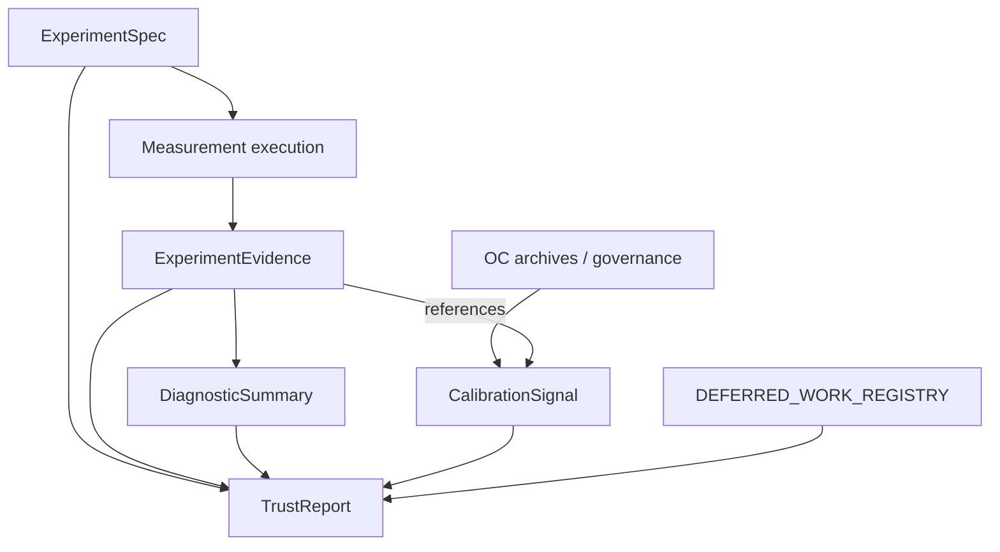

# Track B architecture review 001

**Review ID:** TRACK-B-ARCHITECTURE-REVIEW-001  
**Status:** active architecture checkpoint  
**Last updated:** 2026-05-20  
**Package version:** 0.2.1 (current implementation)  

**Related:** [`TRACK_B_EXPERIMENT_SPEC_001.md`](TRACK_B_EXPERIMENT_SPEC_001.md) · [`TRACK_B_EXPERIMENT_EVIDENCE_001.md`](TRACK_B_EXPERIMENT_EVIDENCE_001.md) · [`TRACK_B_DIAGNOSTIC_SUMMARY_001.md`](TRACK_B_DIAGNOSTIC_SUMMARY_001.md) · [`TRACK_B_CALIBRATION_SIGNAL_001.md`](TRACK_B_CALIBRATION_SIGNAL_001.md) · [`TRACK_B_TRUST_REPORT_001.md`](TRACK_B_TRUST_REPORT_001.md) · [`TRACK_B_ARCHITECTURE_PLAN.md`](TRACK_B_ARCHITECTURE_PLAN.md) · [`TRACK_A_COMPLETION_REVIEW_001.md`](TRACK_A_COMPLETION_REVIEW_001.md) · [`EXPERIMENTATION_PLATFORM_VISION.md`](EXPERIMENTATION_PLATFORM_VISION.md) · [`OPEN_INVESTIGATIONS.md`](OPEN_INVESTIGATIONS.md) · [`DEFERRED_WORK_REGISTRY.md`](DEFERRED_WORK_REGISTRY.md)

**Scope:** Critical review of the completed Track B **B0 contract stack** before schema, API, or implementation work. **No code, schema, API, contract, governance, eligibility, maturity, release-gate, or trust-score changes** in this review.

---

## 1. Executive assessment

### Verdict: **Coherent and internally consistent; modality-neutral in structure with geo vocabulary leakage in detail**

The five-contract stack (ExperimentSpec → ExperimentEvidence → DiagnosticSummary + CalibrationSignal → TrustReport) forms a **coherent experimentation evidence architecture**. Responsibilities are documented repeatedly and **mostly align** across documents. Phase 13/15 trust boundaries, DEF registry links, and “inconclusive ≠ no effect” philosophy are **consistent** from Track A through TrustReport.

| Criterion | Assessment |
|-----------|------------|
| **Coherent** | **Yes** — each layer has a distinct question; composition into TrustReport is explicit |
| **Internally consistent** | **Mostly yes** — minor terminology drift (see §2, §8) |
| **Modality-neutral** | **Structurally yes; practically geo-forward** — taxonomy and adapters are neutral; field examples and default estimand stack are geo-specific |

### Major issues?

**No architecture-breaking issues.** There are **moderate refinements** recommended before schema finalization:

1. **Dependency diagram clarity** — CalibrationSignal is **not** downstream of DiagnosticSummary (§3).  
2. **Estimand registry gap** — DEF-011 / INV-020 deferred; geo subset (`relative_att_post`) used as implicit default (§2).  
3. **Outcome taxonomy harmonization** — Vision (`supported_positive`) vs TrustReport doc (`supported` + qualifiers) (§8).  
4. **Geo vocabulary in neutral field names** — `geometry_class`, donor facets, path interval types (§4).  
5. **Six-artifact consolidation** — direction clear; canonical-vs-view rules not yet in one adapter spec (§10).

### Recommended conclusion

> **Architecture approved with minor refinements; implementation planning may begin.**  
> B0 (concept documents) is **complete**. Schema and code work should proceed through **B1+** with the refinements below — not by redesigning the stack.

---

## 2. Contract responsibility review

### Summary matrix

| Contract | Core responsibility | Overlaps | Gaps | Ambiguity |
|----------|---------------------|----------|------|-----------|
| **ExperimentSpec** | Study intent before measurement | Measurement plan vs CalibrationSignal instrument scope | Formal **Estimand registry** (DEF-011) | `geometry_class` geo-centric naming for all modalities |
| **ExperimentEvidence** | Immutable measurement record | Alignment flags vs DiagnosticSummary vs TrustReport dimensions | Canonical merge of **six export artifacts** | `eligibility_mirror` — mirror vs authoritative source |
| **DiagnosticSummary** | This-run quality aggregate | Estimand/interval facets vs evidence alignment flags | Default **diagnostics opt-in** policy for exports | When calibration-run DiagnosticSummary ends and signal begins |
| **CalibrationSignal** | Historical instrument OC state | Overlap with Calibration ExperimentEvidence | **Instrument ID** naming convention unset | Lifecycle state vs registry eligibility vs usage_boundary |
| **TrustReport** | Trust synthesis + outcome category | Re-interprets all layers — by design | **INV-021** user-randomized refinements | `calibration_unavailable` mapping to `not_assessable` vs `inconclusive` |

### ExperimentSpec

**Responsibilities (clear):** identity, modality, randomization unit, treatment/control, estimands, windows, measurement plan, feasibility hints, MMM intent flags.

**Overlaps:** `measurement_families_allowed` / inference constraints overlap **CalibrationSignal** scope — appropriate (spec = plan; signal = historical proof).

**Gaps:** Until B3 estimand registry, geo implementations will anchor on `relative_att_post` + `relative_att_post_path_mean` — documented but not registry-backed.

**Ambiguity:** `geometry_class` is **required for geo** but optional elsewhere — implementers need a modality adapter matrix (B1).

### ExperimentEvidence

**Responsibilities (clear):** point/interval, four-layer estimand record, inference execution, provenance, calibration refs, raw diagnostic inputs, tier.

**Overlaps:** Owns alignment **facts** that DiagnosticSummary and TrustReport **interpret** — acceptable if rebuild-from-evidence is deterministic (stated in DiagnosticSummary §6).

**Gaps:** No single doc defines **primary vs supplementary** roles for card / bundle / evidence JSON / recovery JSON (OPEN_INVESTIGATIONS — six layers).

**Ambiguity:** `lift_detection_calibrated` on evidence vs `positive_oc_*` on signal — both needed; relationship is stated but easy to duplicate in schema.

### DiagnosticSummary

**Responsibilities (clear):** facet taxonomy, severity, checklist, waiver visibility, no trust outcomes.

**Overlaps:** `estimand_mismatch` / `interval_alignment` facets parallel evidence flags — DiagnosticSummary should **reference** evidence flags, not re-derive (stated; enforce in B1).

**Gaps:** Future A/B facets (SRM, balance) sketched; no facet ID registry yet.

**Ambiguity:** `characterized_limit_refs` (INV-030/031) blur line with CalibrationSignal narrative — acceptable as **citation**, not OC storage.

### CalibrationSignal

**Responsibilities (clear):** instrument-level historical OC, lifecycle, usage_boundary, DEF refs, scenario-class separation.

**Overlaps:** Calibration **ExperimentEvidence** (Run 001 raw) vs composed **signal** — relationship described; schema must not collapse them.

**Gaps:** No published **instrument catalog** listing all Track A signals as first-class IDs (content exists across archives).

**Ambiguity:** `lifecycle_state: governed` vs `nominal_eligibility_mirror: excluded` (Placebo) — both valid; TrustReport must read **usage_boundary** first.

### TrustReport

**Responsibilities (clear):** synthesis, dimensions (unscored), outcome category, narrative, DEF citations, governance footer.

**Overlaps:** By design consumes all layers — no inappropriate overlap if lower layers do not emit outcomes (they do not).

**Gaps:** Intended-use (`trust_report_profile`) on spec not fully wired to outcome selection worked examples — one dimension of B2/B4.

**Ambiguity:** Vision specialized outcomes vs core five categories — mappable but needs a **single implementation enum doc** in B2.

---

## 3. Dependency review

### Stated linear chain (review checklist)

```
ExperimentSpec → ExperimentEvidence → DiagnosticSummary → CalibrationSignal → TrustReport
```

### Actual dependency graph (correct)



### Findings

| Finding | Severity |
|---------|----------|
| **CalibrationSignal is not derived from DiagnosticSummary** | Documentation nuance — some diagrams imply `Ev → CS`; signal is **archive-composed**, referenced by evidence |
| **No circular dependencies** | **Confirmed** — TrustReport never feeds back into evidence/spec |
| **CalibrationSignal ∥ live run path** | Parallel lifetimes — correct architecture |
| **TrustReport also reads Spec directly** | Valid — declared claim anchor not fully recoverable from evidence alone |
| **DEF registry is read-only input to TrustReport** | Not a sixth contract — correct |

**Recommendation (minor refinement):** Standardize stack diagram across all five docs to the graph above; remove any implication that DiagnosticSummary **produces** CalibrationSignal.

---

## 4. GeoX leakage review

### Assessment: **Structural neutrality with significant geo vocabulary in field concepts**

The taxonomy (geo, A/B, CLS, calibration, holdout) is modality-neutral. **Leakage** appears in default field semantics and examples — expected given Track A geo focus, but **schema authors must not encode geo-only constraints as universal required fields**.

| Geo-specific concept | Where it appears | Risk | Mitigation (B1+) |
|---------------------|------------------|------|------------------|
| **`relative_att_post`** | Default estimand stack across Evidence, Signal, Trust examples | A/B/CLS forced into geo estimand | Estimand registry; modality-specific required fields |
| **`geometry_class`** (single/multi-treated) | Spec, Evidence, Signal, Trust boundaries | User-level studies mislabeled | Rename to neutral `assignment_geometry` or modality-specific extension |
| **Donor / SCM weight diagnostics** | DiagnosticSummary facets, review_flags | N/A for A/B | Facet adapter: unavailable with reason |
| **`path_interval_type`, path pooling** | Evidence, Placebo/JK semantics | Frequentist A/B uses different uncertainty | Modality-specific uncertainty facet |
| **Pretrend / DID policy** | DiagnosticSummary, Trust boundaries | Geo/DID-specific | Keep as facet; not core schema |
| **Interference / spillover review** | Spec, DiagnosticSummary | Geo-relevant; CLS has exposure interference | Shared design-review facet with modality extensions |
| **Instrument ID examples** (`geo.SCM.…`) | CalibrationSignal | Namespace ok if modality prefix mandatory | Document naming convention in B1 |

### Conclusion

GeoX leakage **does not prevent broader adoption** at the architecture level. It **will** leak into schemas if B1 maps GeoX exports literally without an **adapter layer**. **B1 must be adapter-first**, not card-schema-first.

---

## 5. A/B compatibility review

### Would the stack support classical A/B, CUPED, SRM, sequential testing **without modification**?

| Capability | Without contract modification? | Notes |
|------------|-------------------------------|-------|
| **Classical A/B** | **Partial** — slots exist; **extensions required** | User/session unit, arm stats, Δμ estimand in Spec/Evidence; separate CalibrationSignal path |
| **CUPED** | **Partial** | INV-022 — transform declaration on Spec; evidence must record adjusted estimand |
| **SRM** | **Partial** | INV-025 — DiagnosticSummary facet + optional diagnostic instrument signal |
| **Sequential testing** | **Partial** | INV-024 — Spec design params + TrustReport boundary rules |

**Architecture:** **Compatible** — no redesign needed.  
**Contracts as written:** **Insufficient** for production A/B without **B3+ modality extensions** and Track C characterization.

TrustReport outcome taxonomy **extends** via INV-021 without breaking synthesis architecture.

---

## 6. Conversion Lift compatibility review

### Would the stack support Google Conversion Lift style studies **without modification**?

| Concept | Architecture support | Modification needed? |
|---------|---------------------|----------------------|
| **Exposure opportunity randomization** | Spec taxonomy + randomization unit | **Yes** — INV-026 fields on Spec treatment definition |
| **Ghost ads / PSA controls** | Not detailed in B0 docs | **Yes** — treatment/control definition extensions |
| **Incremental conversions / revenue** | Estimand examples in Spec/Vision | **Yes** — registry entries, not `relative_att_post` |
| **Lift measurement studies** | TrustReport + Evidence slots | **Yes** — CLS CalibrationSignal archives (Track C) |
| **External methodology semantics** | Vision disclaimer | **Yes** — governed interpretation text on signals |

**Architecture:** **Compatible** — CLS is first-class in taxonomy.  
**B0 contracts:** **Conceptually ready**; **operational CLS requires Track C** extensions and OC — not schema-only work.

---

## 7. MMM compatibility review

### Would the stack support calibration experiments, holdouts, replay, budget evidence **without modification**?

| Use case | Architecture support | Modification needed? |
|----------|---------------------|----------------------|
| **Calibration experiments** | Spec `study_purpose: calibration` | Minor — B1 calibration adapter |
| **Holdout evidence** | Holdout modality in Spec taxonomy | **Yes** — upstream evidence refs, replay lineage (Evidence §8) |
| **Replay studies** | Evidence lineage fields sketched | **Yes** — holdout Evidence + Signal chain |
| **MMM calibrated contribution** | Spec `mmm_calibration_intent`; Trust boundary DEF-012 | **Yes** — INV-023 resolver not specified in B0 |
| **Budget-planning evidence** | Spec feasibility fields; Vision budget flows | **Yes** — link to PowerAnalysis / feasibility engine (INV-022) |

**Architecture:** **Compatible** — MMM consumes TrustReport + Evidence; does not replace experiments.  
**B0:** **Holdout and calibration experiment shells exist**; **MMM bridge is explicitly deferred** (DEF-012, INV-023) — TrustReport correctly marks MMM feed `not_assessable` without resolver.

---

## 8. Trust architecture review

### Separation: DiagnosticSummary · CalibrationSignal · TrustReport

| Layer | Time scope | Question | Emits outcomes? |
|-------|------------|----------|-----------------|
| **DiagnosticSummary** | This run | Is this run interpretable? | **No** |
| **CalibrationSignal** | Historical archives | What does OC permit for this instrument? | **No** |
| **TrustReport** | Synthesis for intended use | What should reviewer conclude? | **Yes** (categories only) |

**Assessment: sufficiently separated** — Phase 13/15 rules correctly land on Signal (scope) and TrustReport (outcome), not DiagnosticSummary alone.

### Residual blur (minor)

| Blur | Risk | Mitigation |
|------|------|------------|
| Alignment flags on Evidence + diagnostic facets | Duplicate schema fields | B1: diagnostic facets **reference** evidence flag IDs |
| `characterized_limit_refs` on DiagnosticSummary | Duplicates signal DEF refs | Allow citations; do not duplicate OC metrics |
| Vision `supported_positive` vs TrustReport `supported` | Product/implementation drift | B2: single outcome enum mapping table |
| Readiness assessment → TrustReport | Legacy pass/fail tone | Already demoted — enforce in MIP B4 |

**No trust scores** in any B0 doc — **confirmed**.

---

## 9. Remaining blockers

### Architecture blockers (before schema finalization)

| ID | Blocker | Severity | Resolution phase |
|----|---------|----------|------------------|
| **AB-1** | Estimand registry unset (DEF-011, INV-020) | Medium | **B3** — geo subset acceptable for B1 schema MVP |
| **AB-2** | Instrument ID + signal catalog convention | Medium | **B1** appendix |
| **AB-3** | Outcome enum harmonization (Vision vs TrustReport) | Low | **B2** mapping doc |
| **AB-4** | Six-artifact canonical vs view roles | Medium | **B1** geo adapter spec |
| **AB-5** | Correct dependency diagrams in all docs | Low | Editorial PR (optional) |

**None are blockers to beginning B1 implementation planning.**

### Implementation blockers (before code)

| ID | Blocker | Severity | Resolution |
|----|---------|----------|------------|
| **IB-1** | No JSON/protobuf schema | Expected | B1 schema draft |
| **IB-2** | INV-031 synthesis not executed | Medium for **CalibrationSignal/TrustReport runtime** | Parallel Track A; not blocking schema draft |
| **IB-3** | GeoX adapter unspecified | High for code | B1 adapter spec |
| **IB-4** | Opt-in diagnostics default | Medium | Product policy in B4 — DiagnosticSummary completeness |
| **IB-5** | No TrustReport composer | Expected | B2/B5 after schemas |

### Governance blockers (unchanged by B0)

| ID | Blocker | Notes |
|----|---------|-------|
| **GB-1** | Eligibility frozen (`SCM_UnitJackKnife`) | Architecture mirrors only — **correct** |
| **GB-2** | No `production_safe` | Architecture excludes — **correct** |
| **GB-3** | DEF registry editorial drift (DEF-001 post-fix, DEF-020 post-Phase 15) | Editorial PR; signals should cite current text |
| **GB-4** | ROADMAP_V5 not published | Formal priority adoption — parallel to B1 |

**No governance blocker prevents implementation planning.**

---

## 10. Recommended implementation sequence

B0 is **complete** with this review. Recommended phases (extends [`TRACK_B_ARCHITECTURE_PLAN.md`](TRACK_B_ARCHITECTURE_PLAN.md) §10):

| Phase | Focus | Deliverables | Depends on |
|-------|-------|--------------|------------|
| **B0** | Contract architecture | Five TRACK_B_*_001 docs + **this review** | Track A completion review ✅ |
| **B1a** | Geo adapter + schema **draft** | `TRACK_B_GEO_ADAPTER_001.md`; ExperimentSpec + ExperimentEvidence field draft (geo subset) | B0 ✅ |
| **B1b** | Artifact consolidation spec | Primary vs supplementary roles for card/bundle/evidence/recovery | B1a |
| **B2a** | DiagnosticSummary builder spec | Facet ID registry; mapping from review_flags + DID + interference | B1a |
| **B2b** | Trust outcome enum | Vision ↔ TrustReport mapping; intended-use matrix | B0 TrustReport |
| **B3a** | CalibrationSignal catalog | Instrument IDs + composed signals from Track A archives (doc/registry) | B0 CalibrationSignal |
| **B3b** | Estimand registry draft | DEF-011 / INV-020 geo-first registry doc | INV-003 archives |
| **B4** | TrustReport composer spec | Deterministic synthesis rules (doc-only pseudocode) | B2a, B2b, B3a |
| **B5** | Schema MVP | Versioned schema for geo business path (spec + evidence + diagnostic summary refs) | B1a, B2a, B3a |
| **B6** | MIP / GeoX integration spec | TrustReport views; copy guidelines; readiness demotion | B4, B5 |
| **B7** | Runtime implementation | Modules/adapters — **CalibrationSignal + TrustReport logic after INV-031 archive** | B5, B6, INV-031 |
| **Track C gate** | A/B, CLS OC + adapters | Separate instrument signals | B5–B6 stable |

### Parallel Track A (non-blocking for B1–B5 planning)

- INV-031 synthesis (priority before B7)  
- INV-030 execution  
- DEF registry editorial  
- Optional ROADMAP_V5 re-audit after B5 schema MVP  

### Critical path for GeoX value

**B1a → B3a → B5 → B6** delivers schema-backed evidence + signal refs + MIP honesty layer without waiting for full estimand registry or TrustReport runtime.

---

## 11. Non-goals

This review **does not**:

- Redesign the five-contract stack  
- Implement code, schemas, or APIs  
- Change eligibility, maturity, release gates, or governance policy  
- Introduce trust scores or automated approvals  
- Close DEF or INV items  
- Publish ROADMAP_V5  

This review **does**:

- Record an honest B0 checkpoint  
- Identify **minor refinements**, not architectural rework  
- Authorize **implementation planning** to begin at B1  

---

## Appendix A — Contract responsibility matrix (reviewed)

| Question | ExperimentSpec | ExperimentEvidence | DiagnosticSummary | CalibrationSignal | TrustReport |
|----------|----------------|-------------------|-------------------|-------------------|-------------|
| What did we intend? | **Owns** | References | — | — | Summarizes |
| What did we measure? | — | **Owns** | — | — | Summarizes |
| This-run quality? | — | Raw inputs | **Owns** | — | Highlights |
| Historical instrument OC? | Plan hints | References | Limit refs only | **Owns** | Summarizes scope |
| Can we act on this? | Constraints | Facts | Modifiers | Boundaries | **Owns outcome** |
| Platform limits? | Assumptions | Failures | Warnings | def_refs | **Owns DEF narrative** |

**Review finding:** Matrix is **sound** — no responsibility reassignment needed.

---

## Appendix B — Documents reviewed

| Document | Role in review |
|----------|----------------|
| TRACK_B_EXPERIMENT_SPEC_001 | Spec layer |
| TRACK_B_EXPERIMENT_EVIDENCE_001 | Evidence layer |
| TRACK_B_DIAGNOSTIC_SUMMARY_001 | Diagnostic layer |
| TRACK_B_CALIBRATION_SIGNAL_001 | Calibration layer |
| TRACK_B_TRUST_REPORT_001 | Trust layer |
| EXPERIMENTATION_PLATFORM_VISION | Vision alignment |
| TRACK_A_COMPLETION_REVIEW_001 | Foundation adequacy |
| OPEN_INVESTIGATIONS | INV-020–026, INV-021, artifact churn |
| DEFERRED_WORK_REGISTRY | Blocker and boundary cross-check |

---

## Appendix C — Success criterion

**Review succeeds if:**

1. An honest answer is given on **coherence, consistency, and modality neutrality**.  
2. Each contract’s **responsibilities, overlaps, gaps, and ambiguities** are assessed.  
3. **Dependencies** are verified — no circularity; CalibrationSignal path corrected.  
4. **Geo, A/B, CLS, MMM** compatibility is assessed without redesign.  
5. **Trust layer separation** is validated.  
6. **Blockers** and **B1+ sequence** are explicit.  

**Conclusion:**

> **Architecture approved with minor refinements; implementation planning may begin.**

B0 contract stack is **ready to move from concept documents to schemas and implementation planning**, starting with **B1a geo adapter + schema draft**, not with TrustReport runtime or eligibility changes.

---

*Review TRACK-B-ARCHITECTURE-REVIEW-001. B0 complete. No code, schema, or policy changes.*
