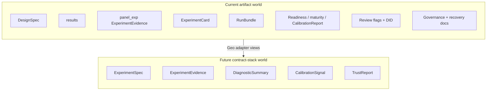

# Track B — artifact consolidation design 001

**Document ID:** TRACK-B-ARTIFACT-CONSOLIDATION-001  
**Status:** architecture and migration planning — B1b deliverable  
**Last updated:** 2026-05-20  
**Package version:** 0.2.1 (current implementation)  

**Related:** [`TRACK_B_GEO_ADAPTER_001.md`](TRACK_B_GEO_ADAPTER_001.md) · [`TRACK_B_EXPERIMENT_SPEC_001.md`](TRACK_B_EXPERIMENT_SPEC_001.md) · [`TRACK_B_EXPERIMENT_EVIDENCE_001.md`](TRACK_B_EXPERIMENT_EVIDENCE_001.md) · [`TRACK_B_DIAGNOSTIC_SUMMARY_001.md`](TRACK_B_DIAGNOSTIC_SUMMARY_001.md) · [`TRACK_B_CALIBRATION_SIGNAL_001.md`](TRACK_B_CALIBRATION_SIGNAL_001.md) · [`TRACK_B_TRUST_REPORT_001.md`](TRACK_B_TRUST_REPORT_001.md) · [`TRACK_A_COMPLETION_REVIEW_001.md`](TRACK_A_COMPLETION_REVIEW_001.md) · [`TRACK_B_ARCHITECTURE_REVIEW_001.md`](TRACK_B_ARCHITECTURE_REVIEW_001.md) · [`OPEN_INVESTIGATIONS.md`](OPEN_INVESTIGATIONS.md)

This document defines how the **current GeoX / `panel_exp` artifact ecosystem** transitions into the **Track B contract stack**. **Architecture and migration planning only** — no implementation, artifact deletion, schema definitions, APIs, governance changes, or migration execution.

---

## 1. Executive purpose

### Why artifact consolidation exists

GeoX today produces **many valid exports** for the same logical experiment — design specs, estimator tensors, evidence JSON, human cards, portable bundles, advisory readiness blocks, maturity summaries, and validation reports — plus **external governance archives** (Run 001, Phase 11–15). Each layer solved a real problem at a point in time. Together they create:

| Problem | Consequence |
|---------|-------------|
| **Duplicated concepts** | Estimand, intervals, calibration, and “pass/fail” tone repeated with different semantics |
| **Duplicated lineage** | `spec_hash`, assignment hashes, timestamps in multiple shapes |
| **Reviewer fatigue** | Six overlapping summary layers ([`OPEN_INVESTIGATIONS.md`](OPEN_INVESTIGATIONS.md)) |
| **Conflicting narratives** | Card “significant” vs TrustReport `inconclusive` vs readiness “go” |
| **Implicit contracts** | `relative_att_post` assumed without declaration on every surface |

**Artifact consolidation** is the **migration plan** to collapse these into **one logical contract stack** with **many backward-compatible views** — not a big-bang delete of working exports.

### Current artifact world vs future contract-stack world



| World | Truth model | Primary audience |
|-------|-------------|------------------|
| **Current** | Each artifact is **partially authoritative** for its domain; no single composer | Notebook users, bundle exporters, human card readers |
| **Future** | Track B contracts are **canonical** for platform semantics; legacy artifacts are **views** | MIP, agents, MMM intake, governed review |

**Consolidation does not mean fewer files on disk in M1–M3.** It means **one semantic owner per concern** and explicit **primary vs supplementary** roles ([`TRACK_B_GEO_ADAPTER_001.md`](TRACK_B_GEO_ADAPTER_001.md) §9).

---

## 2. Current artifact inventory

Artifacts grouped by **purpose** — not by file format.

### A. Design and study intent

| Artifact | Module / doc | Purpose |
|----------|--------------|---------|
| **`DesignSpec`** | `panel_exp.spec` | Typed geo design: periods, assignment method, `TargetEstimand`, `UncertaintyContract`, interference |
| **Geo experiment configuration** | `GeoExperimentDesign`, geo runner | Panel, whitelists, treatment probability, validation gate |
| **Assignment output** | Design randomizer | Treatment/control unit lists |

### B. Measurement and inference (runtime)

| Artifact | Module | Purpose |
|----------|--------|---------|
| **Estimator `results`** | Analyzer after `run_analysis` | Paths, effects, CIs, DID contracts attached to run |
| **`InferenceResult`** | `panel_exp.inference_result` | Typed interval semantics (`IntervalType`, incl. `PLACEBO_BAND`) |
| **`InferenceEvidence`** | `panel_exp.evidence` | Inference facet when split from design |

### C. Auditable evidence exports

| Artifact | Module | Purpose |
|----------|--------|---------|
| **`panel_exp ExperimentEvidence`** | `panel_exp.evidence` | Combined design (+ optional inference) JSON; `EVIDENCE_VERSION` 1.0 |
| **`DesignEvidence`** | `panel_exp.evidence` | Assignment + validation snapshot embedded in above |
| **Validation summary** | On design/evidence payloads | Post-assignment validation checks |

### D. Human-readable and portable readouts

| Artifact | Module | Purpose |
|----------|--------|---------|
| **`ExperimentCard`** | `panel_exp.artifacts.experiment_card` | Markdown/card summary for humans |
| **`RunBundle`** | `panel_exp.artifacts.run_bundle` | Single JSON export: evidence, card, calibration, readiness, interference (`BUNDLE_VERSION` 1.0) |

### E. Advisory policy and catalog linkage

| Artifact | Module | Purpose |
|----------|--------|---------|
| **`readiness_assessment`** | `panel_exp.policy.readiness` | Non-blocking decision readiness profiles |
| **`maturity_evidence`** | `panel_exp.validation.maturity_evidence` | Links catalog maturity to measured metrics |
| **`EstimatorMetadata` / registry** | `method_metadata`, registry | Catalog maturity labels — not OC archives |

### F. Run-level validation and calibration reports (live)

| Artifact | Module | Purpose |
|----------|--------|---------|
| **`CalibrationReport`** | `panel_exp.validation.calibration_report` | A/A and recovery metrics for **this reporting context** |
| **Validation reports / metadata** | Various validation modules | Scenario runs attached to maturity or readiness |
| **Nominal calibration checks** | `nominal_calibration.py` | Eligibility evaluation — **governance code**, not export |

### G. Diagnostics (opt-in)

| Artifact | Module | Purpose |
|----------|--------|---------|
| **Review flags** | `panel_exp.diagnostics.review_flags` | Donor, residual, fold, pretrend levels |
| **`build_estimator_review`** | `panel_exp.diagnostics.review` | Opt-in diagnostics + flags (`DIAGNOSTICS_VERSION` 1.0) |
| **DID pretrend contract** | `results["did_pretrend_contract"]` | Parallel trends discipline |
| **DID interval policy** | `results["did_interval_policy"]` | Relative ATT interval unsupported |
| **Interference review** | `build_interference_review` | Design-level spillover metadata |

### H. Governance and recovery archives (external to single run)

| Artifact | Location | Purpose |
|----------|----------|---------|
| **Recovery archives** | RecoveryRunner JSON (local), recovery outputs | Synthetic battery metrics for validation |
| **Calibration Run 001/002** | `docs/CALIBRATION_RUN_*.md` | Production-tier OC evidence |
| **Phase 11–15 characterization** | `docs/PHASE*.md`, SCM JK archive | Instrument OC matrices |
| **Governance decisions** | Phase 13/15 docs | Usage boundaries, eligibility posture |
| **DEF / OPEN registries** | `docs/DEFERRED_WORK_REGISTRY.md`, etc. | Platform limits |

### I. Six overlapping summary layers (product)

From [`OPEN_INVESTIGATIONS.md`](OPEN_INVESTIGATIONS.md) — maps to groups above:

| Layer | Primary artifacts |
|-------|-------------------|
| 1 | Estimator `results` |
| 2 | `panel_exp ExperimentEvidence` |
| 3 | `ExperimentCard` |
| 4 | `RunBundle` |
| 5 | Readiness + maturity blocks |
| 6 | Recovery / calibration **docs** + bundle calibration sections |

---

## 3. Artifact redundancy analysis

### Duplicated concepts

| Concept | Appears in | Classification |
|---------|------------|----------------|
| **Declared estimand** | `DesignSpec.target_estimand`, inference metadata merge, card text, maturity block | **Accidental** partial duplication — should single-source from Spec view |
| **Interval semantics** | `InferenceResult`, `UncertaintyContract`, results paths, card narrative | **Intentional** at runtime + declaration; **accidental** if card omits `placebo_band` |
| **Calibration / FPR / coverage / power** | `CalibrationReport`, `maturity_evidence`, readiness, card maturity section, Phase docs | **Intentional** live vs archive; **accidental** if bundle implies Run 001 scope |
| **Trust / go tone** | Readiness, card conclusions, implicit “significant” | **Accidental** — must demote to TrustReport |
| **Maturity label** | Registry, card, maturity_evidence | **Intentional** catalog display — not CalibrationSignal |
| **Diagnostics** | `results` (opt-in), evidence artifacts, card sections | **Intentional** raw vs summary; **migration-only** until DiagnosticSummary |

### Duplicated metadata

| Metadata | Copies | Classification |
|----------|--------|----------------|
| `experiment_id` | Spec, evidence, card, bundle | **Intentional** — must stay consistent |
| `spec_hash` / `assignment_hash` | Evidence, bundle lineage, inference | **Intentional** |
| `package_version`, timestamps | Evidence, bundle, card footer | **Intentional** |
| Estimator name + inference mode | Results, evidence, card, maturity | **Intentional** — adapter dedupes in views |
| Warnings / errors | Evidence, bundle top-level, card | **Accidental** merge semantics — bundle aggregates |

### Duplicated lineage

| Lineage | Where | Classification |
|---------|-------|----------------|
| Design → inference chain | Evidence nested `design` + `inference` | **Intentional** |
| Bundle `lineage` block | Duplicates evidence hashes | **Intentional** denormalization for portability |
| Recovery run → business run | Usually **none** today | **Gap** — consolidation must not merge |

### Duplicated diagnostics

| Diagnostic | Copies | Classification |
|------------|--------|----------------|
| Pretrend | `did_pretrend_contract`, review flag, card prose | **Migration-only** until DiagnosticSummary owns narrative |
| Donor health | Review flags, optional card | **Opt-in intentional** |
| Interference | Spec, interference_review, validation_summary | **Intentional** design vs run |

### Summary classification

| Type | Meaning | Action in consolidation |
|------|---------|-------------------------|
| **Intentional** | Serves distinct consumer (human vs JSON vs audit) | Keep as **view** |
| **Accidental** | Same semantics, conflicting emphasis | **Single owner** in contract stack; legacy demoted |
| **Migration-only** | Exists until adapter + composer land | Document; remove from “truth” role in M3+ |

---

## 4. Future contract stack

### Primary owner matrix

| Track B contract | Primary owner (canonical semantics) | Legacy views (projections) | Migration responsibility |
|------------------|-------------------------------------|----------------------------|-------------------------|
| **ExperimentSpec** | Declarative study intent | `DesignSpec`, geo config, assignment summary on evidence | Adapter maps design → spec view; **never** infer estimand from results |
| **ExperimentEvidence** | Measurement + alignment facts | `results`, `panel_exp ExperimentEvidence`, bundle `evidence` | Adapter extracts point/interval/flags; **rename collision** handled in B2 |
| **DiagnosticSummary** | This-run quality aggregate | Review flags, DID contracts, interference review, card diagnostic sections | Deterministic builder from evidence; card **stops** owning diagnostic truth in M4 |
| **CalibrationSignal** | Historical instrument OC | Phase docs, Run 001/002, governance decisions | Static catalog (B3a); **not** `CalibrationReport` or readiness |
| **TrustReport** | Trust synthesis + outcome category | ExperimentCard conclusions, readiness tone (demoted) | Composer (B4+); card becomes rendered view in M4–M5 |

### Artifacts that are **not** primary owners of any contract

| Artifact | Role after consolidation |
|----------|-------------------------|
| **`RunBundle`** | **Container** — holds legacy + `track_b_views` sidecar (M2+) |
| **`readiness_assessment`** | **Supplementary** TrustReport input hint — never canonical |
| **`maturity_evidence`** | **Display** linking catalog to metrics — not CalibrationSignal |
| **`CalibrationReport`** (live) | **Supplementary** recovery/A/A context for a run or estimator |
| **Registry / nominal_calibration code** | **Governance** — authoritative eligibility; contracts **mirror** only |
| **Recovery JSON (local)** | **Calibration ExperimentEvidence** input — feeds signal catalog, not business evidence |

### Naming collision resolution (planning)

| Name | Track B contract | `panel_exp` artifact | B2 resolution |
|------|------------------|----------------------|---------------|
| ExperimentEvidence | Platform measurement contract | Design+inference export | Legacy: `legacy_experiment_evidence` or `panel_exp_evidence_v1` in schema docs |

### Cross-contract flow (target)

```
ExperimentSpec  ←── DesignSpec / geo config
       │
       ▼ (measurement)
ExperimentEvidence  ←── results + inference + alignment
       │
       ├──► DiagnosticSummary  ←── raw diagnostic inputs on evidence
       │
       └──► references CalibrationSignal  ←── static catalog (archives)

ExperimentSpec + ExperimentEvidence + DiagnosticSummary + CalibrationSignal + DEF
       └──► TrustReport  ←── composer (not adapter)

ExperimentCard / RunBundle  ←── views of above (M2+)
```

---

## 5. Consolidation stages

Stages define **platform maturity**, not package version. Aligned with [`TRACK_B_GEO_ADAPTER_001.md`](TRACK_B_GEO_ADAPTER_001.md) §9 — **renumbered** for migration clarity.

| Geo adapter doc stage | This document |
|----------------------|---------------|
| M0 Today | **M0** |
| M1 Adapter spec (B1a) | **M1** |
| M2 Optional sidecar (B3) | **M2** |
| M3 Schema (B2) | **M3** (expanded) |
| M4 Composer tests | Part of **M3–M4** |
| M5 MIP / M6 deprecation | **M4–M5** |

### M0 — Current state

| Attribute | Detail |
|-----------|--------|
| **Truth** | Six layers each partially authoritative |
| **Track B** | B0 contracts + B1a adapter spec + **this B1b doc** |
| **Code** | No adapter module |
| **User impact** | None |
| **Exit** | Consolidation design approved |

### M1 — Adapter-only

| Attribute | Detail |
|-----------|--------|
| **Truth** | Legacy artifacts remain authoritative |
| **Track B** | Read-only **view mappers** (optional CLI/notebook); no persistence requirement |
| **Deliverables** | B3a instrument catalog doc; B2 schema **draft** |
| **User impact** | None by default |
| **Rule** | Adapter output not written to bundle unless explicitly requested |

### M2 — Dual-write

| Attribute | Detail |
|-----------|--------|
| **Truth** | Legacy still authoritative; Track B views **published alongside** |
| **Mechanism** | Optional `track_b_views` namespace on RunBundle (or separate sidecar file) |
| **Contents** | `experiment_spec_view`, `experiment_evidence_view`, `diagnostic_summary_view`, `calibration_signal_ref`, `trust_report_inputs` (no outcomes yet) |
| **User impact** | Opt-in export; existing consumers ignore new keys |
| **Rule** | Dual-write must be **consistent** — same hashes, no conflicting estimand |

### M3 — Contract-native

| Attribute | Detail |
|-----------|--------|
| **Truth** | Track B contracts **primary** for platform semantics (MIP, agents, tests) |
| **Legacy** | Cards/bundle/evidence remain **required** for backward compatibility |
| **Deliverables** | B2 schema MVP, B4 contract tests, TrustReport composer |
| **User impact** | MIP shows TrustReport narrative; card synced from composer |
| **Rule** | Legacy exports generated **from** contract views where feasible (view-first generation) |

### M4 — Legacy deprecation

| Attribute | Detail |
|-----------|--------|
| **Truth** | TrustReport + contracts primary; legacy **demoted** |
| **Mechanism** | Deprecation warnings in docs; readiness not surfaced as go/no-go; card labeled “legacy summary” |
| **User impact** | Product copy changes; JSON keys still present |
| **Rule** | **No removal** of bundle keys without major version bump |

### M5 — Archive-only

| Attribute | Detail |
|-----------|--------|
| **Truth** | Legacy artifacts **audit/read-only** — not for new integrations |
| **Mechanism** | New consumers must use Track B APIs/schemas only |
| **Timeline** | **Future** — requires product + major version commitment |
| **Rule** | Historical bundles remain parseable indefinitely |

---

## 6. Backward compatibility

### Must continue to work (all stages through M4)

| Capability | Reason |
|------------|--------|
| **`run_analysis` default `results` keys** | Estimator contract frozen unless major bump |
| **`panel_exp ExperimentEvidence.build` / JSON** | Audit trails, geo runner pipeline |
| **`build_run_artifact_bundle` shape and key order** | Downstream tooling |
| **`build_experiment_card` markdown** | Human workflows |
| **`evidence_version` 1.0**, **`bundle_version` 1.0** | Compatibility promise |
| **Opt-in review flags** | Default off — unchanged |
| **RecoveryRunner and Run 001 harness** | Track A governance unchanged |
| **All existing tests without adapter flag** | CI stability |

### May become views (M2+)

| Artifact | View of |
|----------|---------|
| `ExperimentCard` | TrustReport + DiagnosticSummary (+ Evidence highlights) |
| Bundle `evidence` | Track B ExperimentEvidence legacy projection |
| Bundle `readiness_assessment` | Demoted supplementary input |
| Bundle `maturity_evidence` | Catalog + live metrics display |
| Bundle `calibration_report` | Live run context — not CalibrationSignal |
| Card maturity / inference sections | CalibrationSignal ref + DiagnosticSummary |

### Must never silently change

| Property | Guard |
|----------|-------|
| **Point estimates and paths** | Adapter read-only |
| **Interval type (`placebo_band` vs CI)** | No relabeling |
| **`NOMINAL_CALIBRATION_ELIGIBLE_CONFIGS`** | Mirror only |
| **Maturity catalog labels** | Display only |
| **DID interval policy** | Policy facts preserved |
| **Skip reasons** | Historical strings preserved |
| **Estimand when `UNKNOWN`** | Must not upgrade to `relative_att_post` |
| **Phase 13/15 usage boundaries** | TrustReport/composer rules |

---

## 7. Risks

| Risk | Description | Mitigation |
|------|-------------|------------|
| **Naming collisions** | Two `ExperimentEvidence` types | B2 explicit naming; adapter module namespace |
| **Evidence duplication** | Same metrics in evidence + bundle + track_b_views | M2: views reference hashes; dedupe in composer |
| **Trust duplication** | Readiness + card + future TrustReport conflict | Demote readiness; single composer outcome |
| **Calibration duplication** | Bundle calibration block vs Run 001 vs CalibrationSignal | Document primary owner; signal from archives only |
| **Version drift** | `evidence_version`, contract version, adapter version | B2 version policy; bundle records all three in M2 |
| **Partial adapter adoption** | Some runs with views, some without | `track_b_views_present: bool`; TrustReport `not_assessable` if incomplete |
| **Geo field leakage in schema** | Universal required `geometry_class` | Modality-specific extensions in B2 |
| **Premature deprecation** | Removing card keys before M5 | M4 warnings only; no deletion |
| **False equivalence** | Readiness pass → lift claim | TrustReport boundaries; training/docs |

---

## 8. Open questions

| ID | Question | Owner phase | Notes |
|----|----------|-------------|-------|
| **OQ-1** | **Instrument catalog** — static JSON, doc, or generated from archives? | B3a | Blocks signal ref in dual-write |
| **OQ-2** | **Estimand registry** — enum extension vs string registry | B3b | DEF-011, INV-020 |
| **OQ-3** | **Schema ownership** — one mega-schema vs per-contract schemas | B2 | Favor per-contract + bundle envelope |
| **OQ-4** | **Sidecar vs embedded** — `track_b_views` inside bundle vs `.track_b.json` | B2/B3 | Embedded preferred for portability |
| **OQ-5** | **View-first card generation** — composer before card rewrite? | M3/M4 | Reduces drift |
| **OQ-6** | **Recovery JSON in bundle** | B1b | Keep **out** of business RunBundle by default; link by ID |
| **OQ-7** | **Cross-modality evidence** | Track C | Same envelope, different adapters |
| **OQ-8** | **Major version bump trigger** | M5 planning | Breaking bundle key removal only |
| **OQ-9** | **INV-031 timing** vs TrustReport runtime | B7 | Architecture allows; narrative richer after synthesis |
| **OQ-10** | **OPEN_INVESTIGATIONS closure** for six layers | After M3 | Close when README roles documented |

---

## 9. Recommended implementation order

| Step | Phase | Deliverable | Consolidation milestone |
|------|-------|-------------|------------------------|
| 1 | **B1b** | **This document** | M0 complete |
| 2 | **B3a** | Instrument catalog + CalibrationSignal IDs | M1 |
| 3 | **B2** | Contract schema draft (geo subset) | M1 |
| 4 | **B3b** | Estimand registry draft (geo-first) | M1 |
| 5 | **B4** | Adapter prototype + dual-write sidecar shape | **M2** |
| 6 | **B5** | Contract tests (golden fixtures, five instruments) | M2 validation |
| 7 | B2a | DiagnosticSummary builder spec | M2 |
| 8 | B2b | Trust outcome enum mapping | M3 prep |
| 9 | B4 composer | TrustReport composer spec + tests | **M3** |
| 10 | B5 schema MVP | Implemented dataclasses / JSON schema | **M3** |
| 11 | B6 | MIP integration, view-first card | **M4** |
| 12 | B7 | Runtime after INV-031 | M4+ |

**Parallel allowed:** B3a + B2 + B3b after B1b.

**Critical path to M2 dual-write:** B1b → B3a → B4 adapter → B5 contract tests.

---

## 10. Non-goals

This document **does not**:

| Non-goal | Notes |
|----------|-------|
| **Implement code** | No adapter, no dual-write yet |
| **Delete artifacts** | All layers preserved through M4 |
| **Define final schemas** | B2 separate |
| **Create APIs** | Export endpoints out of scope |
| **Execute migration** | Stages are planning targets |
| **Modify governance** | Eligibility, maturity, gates unchanged |
| **Resolve OPEN_INVESTIGATIONS** | Closes when roles documented + M3 reached |
| **Redesign Track B contracts** | Uses B0 stack as-is |

This document **does**:

- Explain **why** consolidation exists  
- Inventory and classify **redundancy**  
- Assign **primary owners** and **legacy views**  
- Define **M0–M5** migration stages  
- State **compatibility** guarantees and **risks**  
- Sequence **B1b → B5** work  

---

## Appendix A — Primary vs supplementary (authoritative for M2+)

| Artifact | Role | Canonical for |
|----------|------|---------------|
| `DesignSpec` | Supplementary → Spec **view** | Design audit (legacy) |
| Track B **ExperimentSpec** view | **Primary** | Declared intent |
| `results` | Supplementary | Raw tensors |
| Track B **ExperimentEvidence** view | **Primary** | Measurement semantics |
| Review flags / DID | Supplementary inputs | Raw diagnostics |
| Track B **DiagnosticSummary** | **Primary** | This-run quality narrative |
| Phase 11–15 docs | **Primary source** for catalog | OC facts |
| Track B **CalibrationSignal** | **Primary** | Instrument historical scope |
| `CalibrationReport` (live) | Supplementary | Ad hoc run metrics |
| `readiness_assessment` | Supplementary | Hints only |
| Track B **TrustReport** | **Primary** | Trust outcome + narrative |
| `ExperimentCard` | **View** | Human rendering |
| `RunBundle` | **Container** | Portability |

---

## Appendix B — Dual-write envelope (conceptual, M2)

```json
{
  "bundle_version": "1.0",
  "evidence": { "... legacy unchanged ..." },
  "experiment_card": { "... legacy unchanged ..." },
  "track_b_views": {
    "contract_stack_version": "0.1-draft",
    "adapter_version": "0.0-planning",
    "experiment_spec_view": { },
    "experiment_evidence_view": { },
    "diagnostic_summary_view": { },
    "calibration_signal_ref": {
      "measurement_instrument_id": "geo.SyntheticControl.UnitJackKnife.relative_att_post.multi_treated_default",
      "signal_id": "cs-scm-jk-001",
      "signal_version": "1"
    },
    "trust_report_inputs": {
      "intended_use": "null_screen",
      "composer_version": null
    }
  }
}
```

**Not in M2:** `trust_report_outcome` — composer is M3+.

---

## Appendix C — Success criterion

**B1b succeeds when:**

1. Consolidation **purpose** and **worlds** (current vs future) are clear.  
2. **Full artifact inventory** is grouped by purpose.  
3. **Redundancy** is classified intentional / accidental / migration-only.  
4. **Primary owners** and **views** are assigned for all five contracts.  
5. **M0–M5 stages** define a migration path without package disruption.  
6. **Compatibility, risks, and open questions** are explicit.  
7. **Implementation order** through B5 is actionable.

**Conclusion:**

> The migration plan from the current GeoX artifact ecosystem to the Track B contract stack is **defined and safe to execute incrementally**. **M1 adapter-only work and B2/B3a planning may proceed** without removing or breaking any existing artifact.

---

*Planning artifact TRACK-B-ARTIFACT-CONSOLIDATION-001. B1b complete. No implementation, deletion, or policy changes.*
