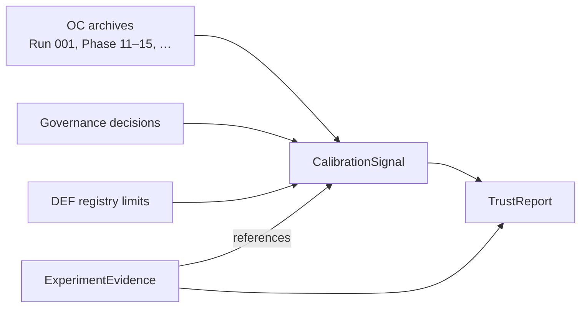
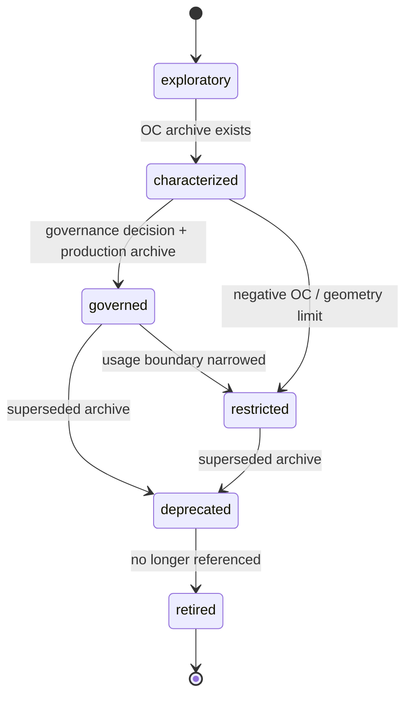
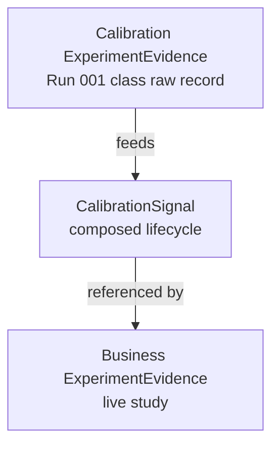

# Track B — CalibrationSignal architecture 001

**Document ID:** TRACK-B-CALIBRATION-SIGNAL-001  
**Status:** architecture design — planning artifact only  
**Last updated:** 2026-05-20  
**Package version:** 0.2.1 (current implementation)  

**Related:** [`TRACK_B_EXPERIMENT_SPEC_001.md`](TRACK_B_EXPERIMENT_SPEC_001.md) · [`TRACK_B_EXPERIMENT_EVIDENCE_001.md`](TRACK_B_EXPERIMENT_EVIDENCE_001.md) · [`TRACK_B_DIAGNOSTIC_SUMMARY_001.md`](TRACK_B_DIAGNOSTIC_SUMMARY_001.md) · [`TRACK_B_ARCHITECTURE_PLAN.md`](TRACK_B_ARCHITECTURE_PLAN.md) · [`TRACK_A_COMPLETION_REVIEW_001.md`](TRACK_A_COMPLETION_REVIEW_001.md) · [`PHASE13_GOVERNANCE_DECISION_001.md`](PHASE13_GOVERNANCE_DECISION_001.md) · [`PHASE15_GOVERNANCE_DECISION_001.md`](PHASE15_GOVERNANCE_DECISION_001.md) · [`DEFERRED_WORK_REGISTRY.md`](DEFERRED_WORK_REGISTRY.md) · [`INV031_INFERENCE_CONSERVATISM_PLAN.md`](INV031_INFERENCE_CONSERVATISM_PLAN.md)

This document defines the **CalibrationSignal contract** — the historical operating-characteristic and validation evidence layer consumed by TrustReport. It is **architecture design only**. It does **not** implement code, APIs, schemas, eligibility changes, maturity changes, release gates, estimator behavior, or trust scores.

---

## 1. Executive purpose

### What CalibrationSignal is

**CalibrationSignal** is the **composed, reusable record of how a measurement instrument has behaved** under archived validation — recovery batteries, production-tier calibration runs, OC characterization matrices, failure analyses, and governance decisions. It answers:

> **“What does historical evidence permit us to say about this instrument’s reliability — and where are the boundaries?”**

It is **not** the outcome of a business experiment, **not** a reviewer trust verdict, and **not** a production-safe or maturity label.



### What CalibrationSignal is not

| Not this | Why |
|----------|-----|
| **Business experiment result** | Live study outcomes live in ExperimentEvidence |
| **Trust verdict** | `supported_*`, `inconclusive`, etc. → TrustReport only |
| **`production_safe` label** | Frozen policy — human committee + external benchmarks |
| **Estimator maturity catalog row** | VALIDATION_COVERAGE maturity is separate governance surface |
| **Boolean “calibrated yes/no”** | Multi-faceted lifecycle + scenario-class separation |
| **Green CI or smoke pass** | Requires archived n≥100 evidence where claimed |
| **Trust score** | No numeric composite health index |

### Platform role

CalibrationSignal makes **Track A evidence reusable** across studies, teams, MMM workflows, and TrustReport composition — without re-running Run 001 class batteries for every geo test. Business ExperimentEvidence **references** the applicable signal for its measurement instrument; TrustReport **interprets** signal scope against the live claim.

**INV-031 note:** Cross-mode conservatism synthesis should inform **usage_boundary** and **governed_interpretation** text on signals — recommended before **implementation** of CalibrationSignal runtime logic, not before this architecture artifact ([`TRACK_A_COMPLETION_REVIEW_001.md`](TRACK_A_COMPLETION_REVIEW_001.md) §7).

**Critical rule (Phase 13):** null OC pass **does not** imply lift-detection calibration. CalibrationSignal must encode **scenario class** (null vs positive) separately.

---

## 2. Measurement instrument concept

### Definition

A **measurement instrument** is the **smallest governed unit** of calibration evidence — the combination of:

| Dimension | Description |
|-----------|-------------|
| **Experiment modality** | Geo, calibration/replay, future A/B, Conversion Lift, holdout |
| **Estimator** | SCM, TBRRidge, AugSynthCVXPY, DID, … |
| **Inference method** | UnitJackKnife, BRB, KFold, Placebo, bootstrap, frequentist test, … |
| **Geometry assumptions** | Single-treated, multi-treated default DGP, user-level, exposure-opportunity |
| **Estimand / interval semantics** | Point estimand, interval estimand, interval **type** (CI vs `placebo_band`) |

**Instrument ID (conceptual):** stable key such as `geo.SCM.UnitJackKnife.relative_att_post.default_multi_treated` — exact naming deferred to implementation.

### Why instrument granularity matters

OC archives are **not interchangeable** at estimator-family level alone:

- TBRRidge **BRB** and **KFold** share an estimator but differ in geometry support, failure modes, and governed role (Phase 13).  
- SCM **UnitJackKnife** and **Placebo** share SCM weights but differ in uncertainty semantics (Phase 15).  
- AugSynthCVXPY **Point** vs **UnitJackKnife** differ in interval availability and usage boundary (Phase 14).

TrustReport must scope claims to the **exact instrument** used in the live run — not “SCM in general.”

### Examples (geo — characterized today)

| Instrument (conceptual) | Modality | Estimator | Inference | Geometry | Interval semantics |
|-------------------------|----------|-----------|-----------|----------|------------------|
| **SCM + UnitJackKnife** | geo | SyntheticControl | UnitJackKnife | default multi-treated | CI · `relative_att_post` |
| **TBRRidge + BRB** | geo | TBRRidge | BlockResidualBootstrap | default multi-treated | CI · `relative_att_post` |
| **TBRRidge + KFold** | geo | TBRRidge | KFold | multi-treated runnable post-fix; OC mixed | CI · `relative_att_post` when aligned |
| **AugSynthCVXPY + Point** | geo | AugSynthCVXPY | none | default multi-treated | no aligned interval |
| **AugSynthCVXPY + UnitJackKnife** | geo | AugSynthCVXPY | UnitJackKnife | default multi-treated | CI · `relative_att_post` |
| **SCM + Placebo** | geo | SyntheticControl | Placebo | **single-treated only** | `placebo_band` · null-envelope |
| **DID + Bootstrap** | geo | DID | bootstrap | panel TWFE | cumulative ATT — relative unsupported (DEF-003) |

### Examples (future modalities)

| Instrument (conceptual) | Notes |
|-------------------------|-------|
| **A/B + frequentist test + CUPED** | Variance reduction only when estimand contract preserved (INV-022) |
| **A/B + SRM diagnostic bundle** | Assignment integrity instrument — separate from lift estimator |
| **Conversion Lift + exposure-randomized lift** | Exposure-opportunity geometry (INV-026) |
| **Holdout + MMM replay incrementality** | Calibrated contribution estimand (DEF-012, INV-023) |
| **Sequential test + alpha spending** | Governance instrument (INV-024) — not geo OC transferable |

Future instruments require **independent CalibrationSignal paths** — no silent inheritance from geo Run 001.

---

## 3. Signal sources

CalibrationSignal is **composed from authoritative sources** — not invented at read time from live runs.

### Primary sources

| Source type | Examples | What it contributes |
|-------------|----------|---------------------|
| **Calibration runs** | [`CALIBRATION_RUN_001.md`](CALIBRATION_RUN_001.md), [`CALIBRATION_RUN_002.md`](CALIBRATION_RUN_002.md) | n≥100 null/positive metrics, failure rates, interval alignment |
| **OC characterization archives** | Phase 11 SCM JK matrix, Phase 14 AugSynth, Phase 15 Placebo, KFold fix validation | Width, power, geometry sensitivity, cell-level failure surfaces |
| **Failure analyses** | [`CALIBRATION_FAILURE_ANALYSIS_001.md`](CALIBRATION_FAILURE_ANALYSIS_001.md) | Mechanism docs when OC fails — not threshold tuning |
| **Governance decisions** | Phase 13, Phase 15, KFold reconciliation addendum | Governed role, usage boundary, eligibility posture |
| **Synthetic DGP recovery runs** | RecoveryRunner batteries, investigation harnesses | Scored estimand behavior, typed failures |
| **Calibration governance framework** | [`PHASE12_INV017_CALIBRATION_GOVERNANCE_001.md`](PHASE12_INV017_CALIBRATION_GOVERNANCE_001.md) | Archive lifecycle, evidence tier conventions |

### Secondary / future sources

| Source type | Status | Role |
|-------------|--------|------|
| **Online experiment replay** | Future | Refresh OC on production traffic shapes — new signal version |
| **MMM calibration compatibility checks** | Future (DEF-012, INV-023) | Whether instrument OC supports MMM bridge transforms |
| **Cross-client calibration exchange** | Future | Sharable signal metadata across verticals |
| **INV-031 synthesis archive** | Planned execution | Cross-mode conservatism narrative on usage boundaries |
| **INV-030 jackknife family inventory** | Planned execution | Refines UnitJackKnife governed interpretation — not promotion |

### Source precedence

When sources conflict, **governance decision > newer archive > older archive > code registry mirror**. CalibrationSignal **mirrors** `NOMINAL_CALIBRATION_ELIGIBLE_CONFIGS` — it does **not** override it in this architecture phase.

### Evidence tier mapping

| Tier | Typical source | Signal confidence |
|------|----------------|-------------------|
| **Smoke** | Dev/CI, small n | Exploratory lifecycle only |
| **Characterization** | n=30 matrices, Phase 11-style cells | Characterized — restricted scope |
| **Production** | n≥100 Run 001/002 pattern | Governed when + governance decision |

---

## 4. Signal lifecycle

Lifecycle describes **calibration evidence maturity for an instrument** — **not** estimator maturity in [`VALIDATION_COVERAGE.md`](VALIDATION_COVERAGE.md).



### Lifecycle states (conceptual)

| State | Meaning | Typical sources |
|-------|---------|-----------------|
| **exploratory** | Smoke or partial runs; no governance claim | Unit tests, small-n probes |
| **characterized** | OC archive exists; scope documented | Phase 11 n=30 cells, TBRRidge Placebo characterization tier |
| **governed** | Production-tier archive + formal governance decision | SCM_UnitJackKnife Phase 13; SCM Placebo Phase 15 |
| **restricted** | Usable under explicit boundary — not full calibration | BRB post Run 002; KFold post-fix; AugSynth point-only |
| **deprecated** | Superseded by newer archive or fix | Run 001 BRB pre-bound-fix interpretation |
| **retired** | Removed from active TrustReport references | Obsolete configs after explicit governance |

### Lifecycle ≠ maturity

| Concept | Owner | Example |
|---------|-------|---------|
| **CalibrationSignal lifecycle** | Track B contract | `governed` + `usage_boundary: null_monitor_only` |
| **Estimator maturity** | VALIDATION_COVERAGE | `expert_review`, `research_only` |
| **Nominal eligibility** | Code registry + governance | In/out of `NOMINAL_CALIBRATION_ELIGIBLE_CONFIGS` |

An instrument may be **`expert_review` maturity** and **`restricted` calibration lifecycle** simultaneously (TBRRidge BRB). **`governed` lifecycle does not imply eligible** (SCM Placebo is governed + restricted + excluded from registry).

### Scenario-class sub-states (orthogonal to lifecycle)

Within characterized/governed instruments, track **independently**:

| Sub-state (conceptual) | Meaning |
|------------------------|---------|
| `null_oc_passed` | Null coverage/FPR within archived thresholds |
| `null_oc_failed` | Anti-calibration or high FPR |
| `positive_oc_passed` | Lift-detection thresholds met — **rare today** |
| `positive_oc_failed` | Zero power, under-coverage, or null-envelope semantics |
| `execution_blocked` | Geometry or implementation failure surface |
| `interval_aligned` | Interval estimand matches scored/declared contract |
| `interval_unavailable` | Policy or scale mismatch (DID relative ATT) |

---

## 5. Signal contents

Conceptual fields only — **no schema implementation**.

### Identity and instrument binding

| Field (conceptual) | Description |
|--------------------|-------------|
| `signal_id` | Platform-unique CalibrationSignal identifier |
| `signal_version` | Monotonic version as archives update |
| `measurement_instrument_id` | Stable instrument key (§2) |
| `modality` | geo · ab · conversion_lift · holdout · calibration_replay |
| `package_version_at_archive` | Package version when primary archive produced |
| `lifecycle_state` | exploratory · characterized · governed · restricted · deprecated · retired |
| `supersedes` / `superseded_by` | Lineage between signal versions |

### Source provenance

| Field (conceptual) | Description |
|--------------------|-------------|
| `source_artifacts` | Doc IDs: CALIBRATION_RUN_001, PHASE11, PHASE15, … |
| `source_run_ids` | Run 001, Run 002, investigation IDs |
| `governance_decision_refs` | PHASE13-GOV-001, PHASE15-GOV-001, … |
| `evidence_tier` | smoke · characterization · production |
| `archive_generated_at` | Timestamp of primary archive |

### Scenario / geometry scope

| Field (conceptual) | Description |
|--------------------|-------------|
| `scenario_battery` | e.g. recovery_null_effect, recovery_positive_effect, geometry matrix cells |
| `geometry_class` | single_treated · multi_treated_default · donor_tier variants |
| `dgp_ids` | Synthetic world identifiers |
| `n_simulations` | Per cell replication count |
| `seed_policy` | Seeds used in archive |

### Estimand and interval semantics

| Field (conceptual) | Description |
|--------------------|-------------|
| `point_estimand` | e.g. `relative_att_post` |
| `scored_estimand` | Recovery scoring target |
| `interval_estimand` | When applicable |
| `interval_type` | confidence_interval · placebo_band · cumulative_att · none |
| `interval_scale` | e.g. `path_period_relative_mean` |
| `aggregation_mode` | INV-003 mode when relevant |

### Metrics observed (by scenario class)

| Field (conceptual) | Description |
|--------------------|-------------|
| `null_metrics` | coverage, FPR, failure_rate, width |
| `positive_metrics` | coverage, power, width/effect ratio |
| `point_recovery_metrics` | bias, recovery success rate |
| `execution_metrics` | failure rate, failure types, NotImplemented rate |
| `geometry_sensitivity` | Donor tier, n_treated breakdowns when archived |

### Failure modes and limits

| Field (conceptual) | Description |
|--------------------|-------------|
| `failure_modes` | Typed mechanisms: bound inversion (historical), under-coverage, geometry broadcast, … |
| `failure_analysis_refs` | CALIBRATION_FAILURE_ANALYSIS_001 sections |
| `known_exclusions` | What archive explicitly does **not** cover |
| `skip_reason_mirror` | Registry skip reason when ineligible — read-only |
| `def_refs` | Linked DEF-xxx when validity limited (§9) |

### Scope of validity and governed interpretation

| Field (conceptual) | Description |
|--------------------|-------------|
| `scope_of_validity` | Human-readable boundary: DGPs, geometries, scenario classes covered |
| `usage_boundary` | null_monitor_only · null_reference_diagnostic · point_only · expert_review · research_only |
| `lift_detection_calibrated` | **false** unless explicit positive OC + governance — default false |
| `nominal_eligibility_mirror` | in_registry · excluded + skip_reason |
| `governed_interpretation` | What reviewers may say — e.g. “null screening only, not lift detector” |
| `prohibited_claims` | Explicit negations — e.g. “not package-wide calibration” |
| `inv031_mechanism_class` | Optional: jackknife_over_width · brb_under_width · placebo_null_envelope |

### Exchange metadata (future)

| Field (conceptual) | Description |
|--------------------|-------------|
| `sharable` | Whether signal may export to calibration exchange |
| `vertical_tags` | Industry/context when applicable |

---

## 6. Relationship to ExperimentEvidence

### Division of labor

| Layer | Time horizon | Content |
|-------|--------------|---------|
| **ExperimentEvidence** | **This measurement run** | Point, interval, paths, alignment flags, raw diagnostic inputs |
| **CalibrationSignal** | **Historical instrument behavior** | Archived OC, governed scope, usage boundaries |



### Reference pattern

Business ExperimentEvidence carries:

| Reference (conceptual) | Purpose |
|------------------------|---------|
| `calibration_signal_id` | Instrument signal active at evidence generation |
| `calibration_signal_version` | Pin version for stale detection |
| `measurement_instrument_id` | Must match signal binding |
| `usage_boundary_mirror` | Read-only copy for export views |
| `lift_detection_calibrated` | **false** default on business evidence |

Calibration ExperimentEvidence (Run 001 class) **feeds signal composition** — it is the raw archival input, not the business result.

### Non-duplication rules

| Rule | Rationale |
|------|-----------|
| CalibrationSignal **does not store** live business point estimates | → ExperimentEvidence |
| Business evidence **does not re-aggregate** full OC matrices | → signal + archive refs |
| Signal **does not replace** calibration run JSON/docs | Points to them |
| Mismatch instrument ID → TrustReport input | `calibration_unavailable` — TrustReport decides outcome |

---

## 7. Relationship to DiagnosticSummary

| Concern | DiagnosticSummary | CalibrationSignal |
|---------|-------------------|-------------------|
| **Time** | This run | Prior characterization |
| **Pretrend fail on live DID** | Yes | No |
| **Run 001 null OC for SCM JK** | Optional limit ref | **Yes — core content** |
| **Fold instability this run** | Yes | No |
| **KFold positive OC failed on battery** | Limit ref | **Yes** |
| **Placebo export discipline this run** | Yes | Placebo null-reference scope |
| **Zero power on recovery battery** | Informational context (INV-031) | **positive_oc_failed** sub-state |

DiagnosticSummary may cite CalibrationSignal via **`characterized_limit_refs`** when live diagnostics intersect archived boundaries (e.g. wide JK intervals — expected per Phase 11).

CalibrationSignal **does not include** reviewer checklist narrative or per-run pretrend status.

---

## 8. Relationship to TrustReport

TrustReport **consumes** CalibrationSignal to scope **what historical evidence supports** relative to the live claim. CalibrationSignal **does not** emit trust outcomes.

### Composition

```
ExperimentSpec + ExperimentEvidence + DiagnosticSummary
    + CalibrationSignal + DEFERRED_WORK_REGISTRY
    → TrustReport
```

### What TrustReport derives from CalibrationSignal

| TrustReport input | CalibrationSignal fields |
|-------------------|-------------------------|
| **Calibration scope** | `usage_boundary`, `scope_of_validity`, scenario sub-states |
| **Lift claim feasibility** | `lift_detection_calibrated`, `positive_oc_failed` |
| **`calibration_unavailable`** | Missing signal, wrong instrument, exploratory-only tier |
| **Limit narrative** | `governed_interpretation`, `prohibited_claims`, `def_refs` |
| **Stale calibration** | `signal_version` vs evidence pin |

### What CalibrationSignal must not emit

| Prohibited on CalibrationSignal | Owner |
|----------------------------------|-------|
| `supported_positive` / `supported_negative` | TrustReport |
| `inconclusive` | TrustReport |
| Trust **scores** or composite grades | **Prohibited everywhere in this contract** |
| Go/no-go recommendation | Human governance |
| Release-gate pass/fail | Out of scope |

**Phase 15 rule:** Placebo `positive_oc` coverage = 1 lives on signal as **`positive_oc_failed` for lift** (power = 0) + **`null_reference_diagnostic`** usage — TrustReport must not treat coverage alone as lift support.

---

## 9. Relationship to Deferred Work Registry

When instrument validity is **limited by known platform gaps**, CalibrationSignal **must link** relevant DEF entries — not hide them behind pass metrics.

### Linking rules

| Condition | Required on signal |
|-----------|-------------------|
| Known exclusion documented in DEF | `def_refs` includes DEF-xxx |
| Accepted limitation (no near-term fix) | `governed_interpretation` cites accepted boundary |
| Deferred fix pending | `lifecycle_state: restricted` + DEF revisit trigger in scope notes |
| Governance decision routed finding to DEF | Cross-ref Phase 13/15 disposition |

### Instrument → DEF mapping (geo examples)

| Instrument | Primary DEF links | Signal implication |
|------------|-------------------|-------------------|
| **SCM_UnitJackKnife** | DEF-013, DEF-015 | Null monitor; zero positive power accepted |
| **TBRRidge_BRB** | DEF-002 | Null viable post Run 002; positive under-coverage deferred |
| **TBRRidge_KFold** | DEF-001, DEF-002 pattern | Runnable post-fix; not trusted/eligible on default DGP |
| **DID_Bootstrap** | DEF-003, DEF-016 | Relative interval unsupported — policy accepted |
| **AugSynthCVXPY_*** | DEF-004, DEF-019 | Spillover DGP bias; RecoveryRunner wiring deferred |
| **SCM_Placebo** | DEF-020, DEF-013 (cross-mode) | Single-treated only; not lift calibrated |
| **All geo lift claims** | DEF-015 | Package-wide nominal calibration not demonstrated |
| **Jackknife semantics** | DEF-021, INV-030 | Alternative families deferred — not current path defect |

TrustReport surfaces DEF narrative; CalibrationSignal ensures **scope_of_validity** and **known_exclusions** reference the same IDs.

---

## 10. Examples

Illustrative composed signals from existing Track A work — conceptual summaries, not runtime objects.

### SCM_UnitJackKnife — null-monitor only

| Field | Value |
|-------|--------|
| **lifecycle_state** | governed |
| **source_artifacts** | CALIBRATION_RUN_001, SCM_JACKKNIFE_CHARACTERIZATION_001, PHASE13-GOV-001 |
| **evidence_tier** | production |
| **geometry_class** | default multi-treated |
| **null_metrics** | coverage = 1, FPR = 0 (Run 001 + Phase 11 matrix) |
| **positive_metrics** | power = 0 — **positive_oc_failed** |
| **usage_boundary** | **null_monitor_only** |
| **lift_detection_calibrated** | **false** |
| **nominal_eligibility_mirror** | **in_registry** — sole eligible config |
| **governed_interpretation** | Conservative null screening on relative ATT; accurate points; not lift detector |
| **def_refs** | DEF-013, DEF-015 |
| **prohibited_claims** | Package-wide calibration; positive-scenario nominal claims |

### TBRRidge_BlockResidualBootstrap — restricted after Run 002

| Field | Value |
|-------|--------|
| **lifecycle_state** | restricted |
| **source_artifacts** | CALIBRATION_RUN_001 (historical), CALIBRATION_RUN_002, PHASE13-GOV-001 |
| **supersedes** | Pre-Run-002 anti-calibration interpretation (deprecated sub-version) |
| **null_metrics** | post-fix: coverage = 1, FPR = 0 |
| **positive_metrics** | coverage = 0, power = 0 — narrow intervals — **positive_oc_failed** |
| **failure_modes** | Run 001 bound inversion **fixed**; positive under-coverage persists |
| **usage_boundary** | **expert_review** — null-viable; not lift-calibrated |
| **nominal_eligibility_mirror** | **excluded** — `brb_bounds_inverted_run001` (historical skip) |
| **def_refs** | DEF-002 |
| **governed_interpretation** | Null monitoring sane after bound fix; do not re-eligible without positive OC |

### TBRRidge_KFold — runnable post-fix, not calibration eligible

| Field | Value |
|-------|--------|
| **lifecycle_state** | restricted |
| **source_artifacts** | CALIBRATION_RUN_001, PHASE12_INV007_KFOLD_GEOMETRY_001, KFOLD_FIX_VALIDATION, PHASE13-GOV-001 |
| **execution_metrics** | Run 001: 100% failure multi-treated; post-fix: 0% failure n=100 characterization |
| **positive_metrics** | power = 0, coverage = 0 on positive — **positive_oc_failed** |
| **geometry_class** | multi-treated runnable; **not trusted** on default DGP OC |
| **usage_boundary** | **research_only** / runnable-not-trusted |
| **nominal_eligibility_mirror** | **excluded** — `kfold_multi_treated_unsupported_run001` |
| **def_refs** | DEF-001 |
| **known_exclusions** | Production-tier n≥100 OC not archived; eligibility unchanged post-fix |
| **governed_interpretation** | Runnable ≠ trusted; single-treated exploratory only per Phase 13 |

### AugSynthCVXPY — point expert-review; spillover warning

**AugSynthCVXPY_Point:**

| Field | Value |
|-------|--------|
| **lifecycle_state** | characterized |
| **source_artifacts** | PHASE14_AUGSYNTH_CHARACTERIZATION_001 |
| **point_recovery_metrics** | recovery success 100% on battery |
| **interval_type** | **none** (point-only path) |
| **usage_boundary** | **point_only_expert_review** |
| **def_refs** | DEF-004, DEF-019 |
| **known_exclusions** | Spillover DGP material bias (~−0.034 vs 0.10); no spillover term in estimator |

**AugSynthCVXPY_UnitJackKnife** (same archive, separate instrument):

| Field | Value |
|-------|--------|
| **lifecycle_state** | characterized |
| **null_metrics** | FPR = 0, coverage = 1 |
| **positive_metrics** | power = 0 — mirrors SCM JK |
| **usage_boundary** | **null_monitor_style** — not registry eligible |
| **def_refs** | DEF-013 pattern, DEF-004 |

### SCM + Placebo — single-treated null-reference diagnostic

| Field | Value |
|-------|--------|
| **lifecycle_state** | governed |
| **source_artifacts** | PHASE15_PLACEBO_CHARACTERIZATION_001, PHASE15-GOV-001 |
| **geometry_class** | **single_treated_only** |
| **interval_type** | **placebo_band** |
| **null_metrics** | FPR = 0, coverage = 1 (production n=100) |
| **positive_metrics** | coverage = 1, power = 0 — null-envelope semantics |
| **execution_metrics** | multi-treated: 100% NotImplemented |
| **usage_boundary** | **null_reference_diagnostic** — not CI |
| **lift_detection_calibrated** | **false** |
| **nominal_eligibility_mirror** | **excluded** |
| **def_refs** | DEF-020 |
| **prohibited_claims** | Treat as jackknife CI; default DGP multi-geo Placebo claims; lift detection |

---

## 11. Future A/B and Conversion Lift compatibility

CalibrationSignal generalizes by **instrument identity + modality-specific OC archives** — not by reusing geo Run 001 metrics.

### A/B testing instruments

| Future instrument | Signal sources (conceptual) | Distinct facets |
|-------------------|----------------------------|-----------------|
| **A/B + Δμ frequentist** | Dedicated recovery/OC battery on user-randomized DGPs | User/session geometry; not geo ATT |
| **A/B + CUPED** | OC with/without CUPED — estimand contract preserved (INV-022) | Transform declared on instrument ID |
| **SRM diagnostic bundle** | Assignment integrity characterization (INV-025) | Separate signal from lift estimator — diagnostic instrument |
| **Sequential testing** | Alpha-spending OC (INV-024) | `usage_boundary` for peeking discipline |

Geo CalibrationSignal **must not** satisfy A/B TrustReport scope without A/B-specific archives.

### Conversion Lift instruments

| Future instrument | Signal facets |
|-------------------|---------------|
| **Exposure-randomized lift** | Exposure-opportunity geometry (INV-026) |
| **Ghost-ad eligible incrementality** | Eligibility logging contract in scope_of_validity |
| **Google Conversion Lift style studies** | External methodology informs **semantics only** — signal requires archived OC, not vendor certification |
| **iROAS path** | Secondary instrument or transform instrument linked to DEF-012 |

### Holdout and MMM calibration

| Future instrument | Role |
|-------------------|------|
| **Holdout replay incrementality** | Links upstream geo/CLS signal IDs — lineage field |
| **MMM calibrated contribution** | Consumes experiment instrument signals + transform OC (INV-023) |
| **Compatibility check instrument** | Future: verifies experiment estimand → MMM estimand transform has OC backing |

### Cross-modality rules

1. **Separate `measurement_instrument_id` namespace per modality.**  
2. **Separate lifecycle** — A/B `exploratory` does not downgrade geo `governed`.  
3. **TrustReport resolves** modality + instrument match before applying scope.  
4. **DEF-012 / INV-023** gate MMM-facing signals — raw lift signals insufficient.

---

## 12. Non-goals

This document **does not**:

| Non-goal | Notes |
|----------|-------|
| **Trust scoring** | No numeric calibration grade or health index |
| **Release gates** | Advisory gate chain out of scope |
| **`production_safe` designations** | Frozen — not assignable via signal |
| **Estimator promotion** | Maturity labels unchanged |
| **Eligibility registry changes** | Remains `SCM_UnitJackKnife` only — mirror only |
| **Implementation schema** | Field names conceptual |
| **Storage design** | No DB/blob layout |
| **APIs** | No endpoints |
| **Code changes** | No `nominal_calibration.py` or RecoveryRunner changes |
| **Trust outcomes** | No `supported_*`, `inconclusive` on signal |
| **Threshold tuning** | Archives frozen — no retroactive pass edits |
| **Close DEF or INV items** | Links only |

This document **does**:

- Define CalibrationSignal as **historical OC + validation evidence layer**  
- Specify **measurement instrument** granularity and **lifecycle** (≠ maturity)  
- Document **signal sources**, **contents**, and **relationships** to Evidence, DiagnosticSummary, TrustReport, DEF registry  
- Provide **worked geo examples** from Track A archives  
- Sketch **A/B, Conversion Lift, MMM** generalization  
- Enable **TrustReport architecture** as the natural next artifact  

---

## Appendix A — Signal composition flow (conceptual)

```
1. Calibration / OC run completes → Calibration ExperimentEvidence
2. Failure analysis when OC fails → mechanism doc
3. Governance decision (when ready) → usage_boundary + lifecycle promotion
4. DEF registry links attached → known_exclusions
5. CalibrationSignal composed → signal_id published
6. Business ExperimentEvidence references signal_id
7. TrustReport consumes signal + live evidence + diagnostics
```

Re-composition triggers: new n≥100 archive, governance amendment, superseding fix, DEF disposition change affecting scope.

---

## Appendix B — Track A archive index → instruments

| Archive | Instruments covered |
|---------|---------------------|
| CALIBRATION_RUN_001 | SCM_UnitJackKnife, TBRRidge_BRB, TBRRidge_KFold |
| CALIBRATION_RUN_002 | TBRRidge_BRB (post-fix) |
| SCM_JACKKNIFE_CHARACTERIZATION_001 | SCM_UnitJackKnife (144-cell) |
| PHASE12_INV007_* | TBRRidge_KFold geometry |
| PHASE14_AUGSYNTH_CHARACTERIZATION_001 | AugSynthCVXPY_Point, AugSynthCVXPY_UnitJackKnife |
| PHASE15_PLACEBO_CHARACTERIZATION_001 | SCM_Placebo, TBRRidge_Placebo (partial) |
| PHASE13 / PHASE15 governance | All above — usage boundaries |

---

## Appendix C — Success criterion

**Architecture achieved when:**

1. A reader understands CalibrationSignal as **historical instrument evidence** — not business results, trust verdicts, or production-safe labels.  
2. **Measurement instrument** granularity is defined and exemplified across geo and future modalities.  
3. **Lifecycle** is distinct from estimator maturity and encodes scenario-class separation.  
4. Relationships to **ExperimentEvidence**, **DiagnosticSummary**, **TrustReport**, and **DEF registry** are unambiguous.  
5. **Track A examples** (SCM JK, BRB, KFold, AugSynth, Placebo) map cleanly to conceptual signals.  
6. Implementers can proceed to **`TRACK_B_TRUST_REPORT_001.md`** without re-deciding calibration scope.

**Suggested next artifact:** [`TRACK_B_TRUST_REPORT_001.md`](TRACK_B_TRUST_REPORT_001.md) — trust outcome taxonomy composing all Track B contracts.

---

*Planning artifact TRACK-B-CALIBRATION-SIGNAL-001. Architecture design only — no code, schemas, eligibility, maturity, release gates, or trust scores.*
