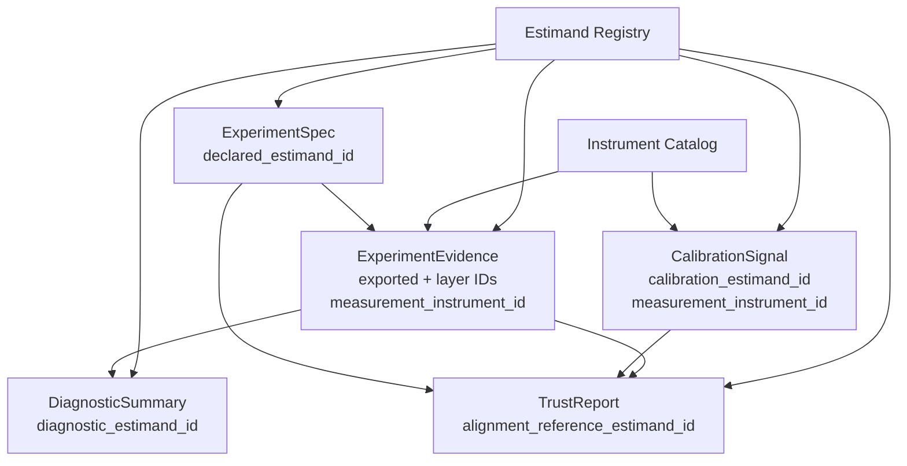
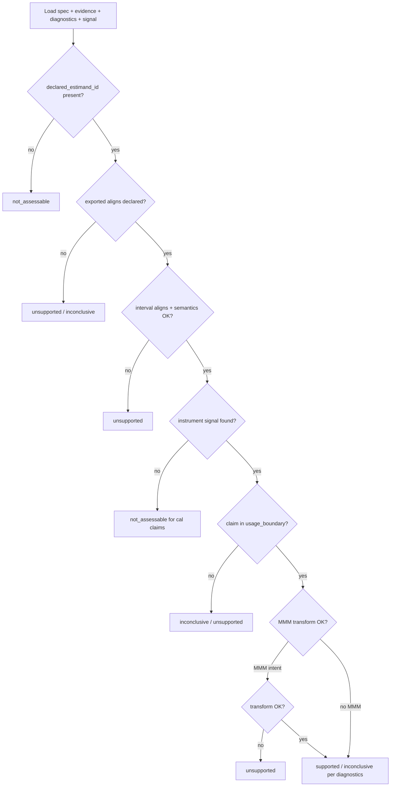

# Track B — contract schema draft 001

**Document ID:** TRACK-B-CONTRACT-SCHEMA-DRAFT-001  
**Status:** architecture design — B2 deliverable (contract tightening pass)  
**Last updated:** 2026-05-20  
**Package version:** 0.2.1 (current implementation)  

**Binding inputs:** [`TRACK_B_ESTIMAND_REGISTRY_001.md`](TRACK_B_ESTIMAND_REGISTRY_001.md) · [`TRACK_B_MEASUREMENT_INSTRUMENT_CATALOG_001.md`](TRACK_B_MEASUREMENT_INSTRUMENT_CATALOG_001.md)  

**Contract sources:** [`TRACK_B_EXPERIMENT_SPEC_001.md`](TRACK_B_EXPERIMENT_SPEC_001.md) · [`TRACK_B_EXPERIMENT_EVIDENCE_001.md`](TRACK_B_EXPERIMENT_EVIDENCE_001.md) · [`TRACK_B_DIAGNOSTIC_SUMMARY_001.md`](TRACK_B_DIAGNOSTIC_SUMMARY_001.md) · [`TRACK_B_CALIBRATION_SIGNAL_001.md`](TRACK_B_CALIBRATION_SIGNAL_001.md) · [`TRACK_B_TRUST_REPORT_001.md`](TRACK_B_TRUST_REPORT_001.md) · [`TRACK_B_GEO_ADAPTER_001.md`](TRACK_B_GEO_ADAPTER_001.md) · [`DEFERRED_WORK_REGISTRY.md`](DEFERRED_WORK_REGISTRY.md)

This document is a **field-level architecture draft** that tightens Track B contracts by requiring **`estimand_id`** and **`measurement_instrument_id`** references across the evidence chain. It is **not** a runtime schema, protobuf definition, API specification, or implementation plan.

**Design principle:**

> **Contracts carry identity, not interpretation.**  
> **ExperimentSpec** declares intent.  
> **ExperimentEvidence** exports observed evidence.  
> **DiagnosticSummary** aggregates run-quality facts.  
> **CalibrationSignal** carries historical instrument evidence.  
> **TrustReport** performs interpretation.

---

## 1. Purpose

### What B2 does

B2 is a **contract tightening pass** — not a new product feature. It binds the five Track B contracts to:

| Binding authority | Role |
|-------------------|------|
| [**Estimand Registry**](TRACK_B_ESTIMAND_REGISTRY_001.md) | Canonical **what** — causal quantity IDs |
| [**Measurement Instrument Catalog**](TRACK_B_MEASUREMENT_INSTRUMENT_CATALOG_001.md) | Canonical **how** — instrument IDs |

Without explicit IDs on every contract:

- CalibrationSignal cannot key OC archives unambiguously.  
- ExperimentEvidence cannot prove alignment to declared intent.  
- TrustReport must **infer** estimands from estimator names — **forbidden** (§5).  
- MMM intake cannot detect missing transform chains (DEF-012).

### What B2 prevents

| Silent failure | B2 mitigation |
|----------------|---------------|
| Geo “lift %” compared to A/B “lift %” | Modality-prefixed `estimand_id` |
| SCM point compared to TBRRidge point as “the ATT” | `exported_estimand_id` + instrument ID |
| Placebo band treated as lift CI | `interval_semantics` on instrument + `interval_estimand_id` on evidence |
| Recovery pass → business lift claim | Separate `calibration_estimand_id` on signal vs `declared_estimand_id` on spec |
| Geo path fed to MMM | `estimand_transform_ref` on spec + TrustReport check |

### Scope boundary

| In scope | Out of scope |
|----------|--------------|
| Conceptual field names, cardinality, propagation | JSON Schema, protobuf, Pydantic models |
| Alignment **facts** on Evidence / DiagnosticSummary | Alignment **verdicts** (TrustReport only) |
| Reference to registry/catalog IDs | Runtime registry implementation |
| Geo default worked example | Adapter code, dual-write (B4) |

---

## 2. Contract field additions

### Naming convention

| Pattern | Meaning |
|---------|---------|
| `*_estimand_id` | Full registry ID from Estimand Registry (§3 of TRACK-B-ESTIMAND-REGISTRY-001) |
| `measurement_instrument_id` | Full catalog ID from Measurement Instrument Catalog |
| `*_ref` | Foreign key to another contract object (`spec_version`, `signal_id`, …) |
| `*_aligned` | Boolean **fact** recorded by producer — not TrustReport outcome |

Legacy coarse names (`relative_att_post`, `TargetEstimand`) may appear as **`estimand_family_legacy`** during transition — **not** sufficient alone for alignment checks.

### Cross-contract identity map



---

### 2.1 ExperimentSpec

**Role:** Declare intent — **no measured values**.

| Field | Required | Description |
|-------|----------|-------------|
| **`declared_estimand_id`** | **Yes** | Primary registry ID — e.g. `geo.relative_att_post.pooled_path.relative` |
| `secondary_estimand_ids` | No | List of registry IDs; each tagged `priority: secondary` |
| `scored_estimand_expectation_id` | Conditional | Required when `study_purpose: calibration` — expected validation target |
| `interval_estimand_expectation_id` | Conditional | Required when spec allows inference producing bands |
| `business_facing_estimand_label` | No | Display only — must map to `declared_estimand_id` |
| **`estimand_transform_ref`** | Conditional | Required when `mmm_calibration_intent: true` — registry transform chain ID (DEF-012) |
| **`measurement_instrument_id_expected`** | No | Optional pin to planned instrument; enables plan-violation detection |
| `measurement_instrument_family_allowlist` | Conditional | When not pinning exact instrument — allowed catalog families |

**Deprecation mapping (transition):**

| Legacy field | Maps to |
|--------------|---------|
| `primary_estimand` | `declared_estimand_id` |
| `primary_estimand_aggregation` | Encoded in registry ID segment — redundant if ID canonical |

**Spec does not contain:** `exported_estimand_id`, point estimates, alignment verdicts, CalibrationSignal refs as authority.

---

### 2.2 ExperimentEvidence

**Role:** Export what was measured — **facts only**.

#### Estimand identity (layered)

| Field | Required | Description |
|-------|----------|-------------|
| **`declared_estimand_id`** | **Yes** | Copy from ExperimentSpec at run time (audit immutability) |
| **`exported_estimand_id`** | **Yes** | Registry ID of estimator/test **primary export** (family export layer) |
| **`scored_estimand_id`** | Conditional | When validation/recovery scoring ran |
| **`interval_estimand_id`** | Conditional | Quantity uncertainty bands target; `none` when point-only |
| `business_facing_estimand_ref` | No | Copy of spec label if present |

**Layer alignment facts (boolean, producer-recorded):**

| Field | Meaning |
|-------|---------|
| `declared_exported_aligned` | `declared_estimand_id` == `exported_estimand_id` |
| `declared_interval_aligned` | `interval_estimand_id` matches declared expectation |
| `exported_interval_aligned` | Interval matches export layer contract |
| `scored_exported_aligned` | Scored matches exported when both present |
| `scale_compatible` | Registry scale segment consistent across layers |
| `aggregation_divergence_detected` | A vs B drift flagged — DEF-009 |

#### Instrument identity

| Field | Required | Description |
|-------|----------|-------------|
| **`measurement_instrument_id`** | **Yes** | Resolved catalog ID for this run |
| `measurement_instrument_id_resolved_from` | Yes | `config_hash` · `explicit_override` · `adapter_inference` — provenance only |
| `instrument_plan_violation` | No | True when resolved ID ∉ spec allowlist / expected pin |

#### References (not interpretation)

| Field | Required | Description |
|-------|----------|-------------|
| `calibration_signal_id` | No | Active signal version used for scope lookup |
| `calibration_signal_version` | No | Pin for TrustReport staleness checks |
| `spec_ref` | Yes | `study_id` + `spec_version` |

**Evidence does not contain:** Trust outcomes (`supported`, `unsupported`), human narratives, or recomputed OC metrics.

---

### 2.3 DiagnosticSummary

**Role:** Aggregate run-quality and validity signals — **modifiers for TrustReport**, not verdicts.

| Field | Required | Description |
|-------|----------|-------------|
| **`diagnostic_estimand_id`** | Conditional | Registry ID under diagnostic scrutiny when estimand-specific — e.g. aggregation review targets `geo.relative_att_post.cell_mean.relative` vs `geo.relative_att_post.pooled_path.relative` |
| `primary_context_estimand_id` | Yes | Usually copy of evidence `declared_estimand_id` — anchors diagnostic narrative |
| **`measurement_instrument_id`** | Yes | Copy from evidence — diagnostics are instrument-scoped |
| `estimand_diagnostic_facets` | No | List of `{facet_id, severity, estimand_id?, modifier_class}` |

**When `diagnostic_estimand_id` is required:**

| Diagnostic class | Example | `diagnostic_estimand_id` |
|------------------|---------|--------------------------|
| Aggregation semantics | INV-003 pooled vs cell | Non-primary layer under review |
| Interval alignment | Interval ≠ declared | `interval_estimand_id` from evidence |
| Scale incompatibility | Absolute DGP vs relative score | `scored_estimand_id` vs truth reference |
| Placebo semantics | Band mislabeled | `geo.placebo_null_envelope.pooled_path.relative` |

**DiagnosticSummary does not contain:** `alignment_reference_estimand_id`, trust outcomes, or substituted `declared_estimand_id`.

---

### 2.4 CalibrationSignal

**Role:** Historical OC and governed scope for one **measurement instrument**.

| Field | Required | Description |
|-------|----------|-------------|
| **`measurement_instrument_id`** | **Yes** | Catalog key — signal is 1:1 with instrument (versioned) |
| **`calibration_estimand_id`** | **Yes** | Primary estimand ID the archive characterizes (usually scored layer) |
| `point_estimand_id` | Yes | Point target for instrument |
| `scored_estimand_id` | Yes | Recovery/validation optimization target |
| `interval_estimand_id` | Conditional | Interval target when applicable |
| `truth_reference_estimand_id` | Conditional | Validation truth when archived (geo: often cell-mean A) |
| `mmm_consumable_estimand_ids` | No | List of downstream IDs this signal **does not** license alone |

**Transition mapping:**

| Legacy signal field | Registry ID field |
|---------------------|-------------------|
| `point_estimand` | `point_estimand_id` |
| `scored_estimand` | `scored_estimand_id` |
| `interval_estimand` | `interval_estimand_id` |

**Signal does not:** reinterpret live evidence, override `declared_estimand_id`, or emit TrustReport outcomes.

---

### 2.5 TrustReport

**Role:** Interpret identity facts into governed trust outcomes.

| Field | Required | Description |
|-------|----------|-------------|
| **`alignment_reference_estimand_id`** | **Yes** | Estimand ID used as **verdict anchor** — normally spec `declared_estimand_id`; calibration studies may use `scored_estimand_id` when purpose is validation |
| `declared_estimand_id` | Yes | Copy from spec |
| `exported_estimand_id` | Yes | Copy from evidence |
| `interval_estimand_id` | Conditional | Copy from evidence |
| **`measurement_instrument_id`** | Yes | Copy from evidence |
| `calibration_signal_id` + `version` | Conditional | Required for calibration-backed claims |
| `alignment_verdict` | Yes | `aligned` · `divergent` · `incompatible` · `not_assessable` |
| `trust_outcome` | Yes | `supported` · `inconclusive` · `unsupported` · `not_assessable` |
| `trust_modifiers` | No | From DiagnosticSummary — composed, not duplicated as facts |

**TrustReport owns interpretation.** It reads alignment **facts** from evidence; it does not re-derive estimands from estimator names.

---

### 2.6 Field propagation matrix

| Field | Spec | Evidence | Diagnostic | Signal | TrustReport |
|-------|:----:|:--------:|:----------:|:------:|:-----------:|
| `declared_estimand_id` | **D** | C | C | — | C + anchor |
| `exported_estimand_id` | — | **E** | — | — | C |
| `scored_estimand_id` | expect | E | diag | **S** | C |
| `interval_estimand_id` | expect | E | diag | S | C |
| `measurement_instrument_id` | opt expect | **E** | C | **S** | C |
| `calibration_estimand_id` | — | — | — | **S** | ref |
| `alignment_reference_estimand_id` | — | — | — | — | **T** |

**Legend:** **D** = declare · **E** = export/observe · **C** = copy for audit · **S** = signal archive · **T** = interpret · **diag** = conditional diagnostic scope

---

## 3. Instrument identity fields

Instrument fields appear on **ExperimentEvidence** (this run), **CalibrationSignal** (historical scope), and **TrustReport** (interpretation context). Spec may optionally constrain them.

### Required instrument facets

| Field | Contract(s) | Description |
|-------|-------------|-------------|
| **`measurement_instrument_id`** | Evidence, Signal, TrustReport | Full catalog ID |
| **`instrument_family`** | Evidence, Signal | Estimator family segment — e.g. `synthetic_control`, `tbrridge` — **denormalized for query, not identity** |
| **`inference_method`** | Evidence, Signal | e.g. `unit_jackknife`, `placebo`, `point_only` |
| **`geometry_class`** | Evidence, Signal, Spec (geo) | e.g. `multi_treated_default`, `single_treated_only` |
| **`interval_semantics`** | Evidence, Signal | `confidence_interval` · `placebo_band` · `cumulative_att_interval` · `none` |
| `interval_type_legacy` | Evidence | Maps to `interval_semantics` during transition |

### Optional instrument facets (evidence)

| Field | Description |
|-------|-------------|
| `config_alias` | Recovery key e.g. `SCM_UnitJackKnife` — **alias only** |
| `package_version_at_run` | Reproducibility |
| `geometry_observed` | Actual `n_treated`, donor count at run |

### Instrument ↔ estimand coupling

| Rule | Detail |
|------|--------|
| Instrument ID embeds **estimand family** segment | Not full aggregation — spec/evidence supply resolved `estimand_id` |
| Same instrument + different `declared_estimand_id` | Valid — triggers alignment facts, not adapter failure |
| Different instruments + same `declared_estimand_id` | Valid — TrustReport picks signal per `measurement_instrument_id` |

**Example pair (geo):**

```
measurement_instrument_id: geo.synthetic_control.unit_jackknife.relative_att_post.multi_treated_default.confidence_interval
declared_estimand_id:       geo.relative_att_post.pooled_path.relative
exported_estimand_id:       geo.relative_att_post.pooled_path.relative
interval_estimand_id:       geo.relative_att_post.pooled_path.relative
calibration_estimand_id:    geo.relative_att_post.pooled_path.relative  (on signal)
truth_reference_estimand_id: geo.relative_att_post.cell_mean.relative     (on signal, validation only)
```

---

## 4. Alignment rules

Alignment is **checked**, not **assumed**. Producers record facts; TrustReport judges.

### 4.1 ExperimentSpec vs ExperimentEvidence

| Check | Condition | Evidence fact | TrustReport if fail |
|-------|-----------|---------------|---------------------|
| **Declaration present** | Spec has `declared_estimand_id` | — | `not_assessable` |
| **Declaration copied** | Evidence `declared_estimand_id` == spec | always copy | `not_assessable` if spec_version mismatch |
| **Export matches declaration** | `exported_estimand_id` == `declared_estimand_id` | `declared_exported_aligned` | `unsupported` if false and no waiver |
| **Interval matches declaration** | `interval_estimand_id` == spec expectation | `declared_interval_aligned` | `unsupported` |
| **Instrument plan** | Resolved ID in allowlist / expected pin | `instrument_plan_violation` | `inconclusive` or `unsupported` by severity |
| **Geometry** | Run geometry ∈ instrument + spec class | `geometry_within_scope` | `unsupported` if run failed |

**Heterogeneous geo (DEF-009):** `declared_exported_aligned` may be false while `aggregation_divergence_detected` true — TrustReport → `inconclusive` with qualifier, not silent `supported`.

### 4.2 ExperimentEvidence vs CalibrationSignal

| Check | Condition | TrustReport if fail |
|-------|-----------|---------------------|
| **Instrument match** | Evidence `measurement_instrument_id` == signal binding | `not_assessable` for calibration-backed claims |
| **Signal version pin** | Evidence pin matches active or documented stale | `stale` → `not_assessable` |
| **Scored alignment** | `scored_estimand_id` == signal `calibration_estimand_id` when calibration run | `inconclusive` for validation claims |
| **Interval semantics** | Evidence `interval_semantics` compatible with signal archive | `unsupported` if placebo treated as CI |
| **Claim vs scope** | Intended use ∈ signal `usage_boundary` | `inconclusive` / `unsupported` — e.g. lift on null-monitor instrument |

**Evidence run today, signal history forever:** Evidence must not embed OC matrices; it **references** signal by ID + version.

### 4.3 CalibrationSignal vs MMM intake

| Check | Condition | TrustReport if fail |
|-------|-----------|---------------------|
| **Transform declared** | Spec `estimand_transform_ref` present when `mmm_calibration_intent` | `unsupported` — DEF-012 |
| **Transform evidence** | Evidence records transform chain completion facts | `not_assessable` |
| **Target estimand** | MMM target ID e.g. `mmm.delta_mu.simulated_response.absolute` | `unsupported` if direct geo relative export only |
| **Signal does not license MMM alone** | `mmm_consumable_estimand_ids` empty or transform OC missing | `inconclusive` |

CalibrationSignal lists **what instrument OC permits** — not whether a specific business run may enter MMM (TrustReport + spec transform).

### 4.4 TrustReport alignment judgment

**Algorithm (conceptual):**



| `alignment_verdict` | Meaning |
|---------------------|---------|
| `aligned` | All required checks pass for `alignment_reference_estimand_id` |
| `divergent` | Known DEF-009-style drift — qualified inconclusive |
| `incompatible` | Scale, modality, interval semantics, or transform failure |
| `not_assessable` | Missing IDs, stale signal, or total measurement failure |

---

## 5. Forbidden behavior

These are **architectural prohibitions** — implementers must not encode them in adapters, UI defaults, or TrustReport shortcuts.

| # | Forbidden | Correct pattern |
|---|-----------|-----------------|
| **F1** | Infer `declared_estimand_id` from estimator name (`SCM` → `relative_att_post`) | Resolve via adapter mapping table → registry ID |
| **F2** | Infer `measurement_instrument_id` from estimator alone | Include inference + geometry + interval_semantics |
| **F3** | Compare `placebo_band` to `confidence_interval` for lift significance | Separate `interval_estimand_id` + semantics check |
| **F4** | Treat `geo.cumulative_att.*` and `geo.relative_att_post.*` as interchangeable | Distinct registry IDs; DEF-003 |
| **F5** | Use recovery pass as business lift claim | `study_purpose` + `usage_boundary` + positive OC |
| **F6** | MMM intake of `exported_estimand_id` without `estimand_transform_ref` | DEF-012 transform chain |
| **F7** | DiagnosticSummary emit `supported` / `unsupported` | TrustReport only |
| **F8** | CalibrationSignal override live `declared_estimand_id` | Signal is historical; spec/evidence own declaration |
| **F9** | TrustReport redefine estimand IDs | Use `alignment_reference_estimand_id` from spec/scored rule |
| **F10** | Collapse A vs B aggregation when ID says `cell_mean` vs `pooled_path` | Distinct IDs; record `aggregation_divergence_detected` |
| **F11** | Cross-modality OC inheritance (geo signal → A/B claim) | Separate instrument namespace |
| **F12** | Use `config_alias` as canonical identity | `measurement_instrument_id` only |

---

## 6. Open issues and deferred items

| ID | Topic | B2 stance | Owner doc |
|----|-------|-----------|-----------|
| **OQ-B2-1** | JSON Schema vs protobuf vs Pydantic — field naming | Deferred to implementation spike post-B4 | B2 impl follow-on |
| **OQ-B2-2** | Single `estimand_id` vs layered fields on Evidence | **Layered** — `exported_estimand_id` required; layers mandatory for calibration | This doc §2.2 |
| **OQ-B2-3** | `alignment_reference_estimand_id` for dual-purpose studies | Business → declared; calibration validation → scored | TrustReport policy |
| **INV-020** | A/B registry finalization | Placeholder IDs on spec; `not_assessable` until characterized | Estimand Registry §6 |
| **INV-026** | Conversion Lift exposure-opportunity semantics | `declared_estimand_id` requires exposure segment; evidence records eligibility counts | Track C |
| **INV-023** | Holdout persistence windows | `holdout.*` IDs + `upstream_evidence_refs` — window on spec | Holdout adapter |
| **DEF-012** | MMM transform policy | `estimand_transform_ref` required; transform OC TBD | Estimand Registry §7 |
| **DEF-009** | A vs B aggregation | `aggregation_divergence_detected` fact; no auto-resolve | Estimand Registry |
| **DEF-011** | Unified contracts | **Addressed at architecture level** by B2 + B3b | This doc |
| **Legacy naming** | `panel_exp.evidence.ExperimentEvidence` vs contract | B4 disambiguation (`legacy_experiment_evidence`) | Geo adapter |
| **M2 dual-write** | Optional `track_b_views` on RunBundle | Fields in §2 map into view | Artifact consolidation |

---

## 7. Responsibility boundaries (summary)

| Contract | Carries identity | Performs interpretation | Carries historical OC |
|----------|------------------|-------------------------|------------------------|
| **ExperimentSpec** | `declared_estimand_id`, transform ref, optional instrument expect | No | No |
| **ExperimentEvidence** | All layer IDs, instrument ID, alignment **facts** | No | Ref only |
| **DiagnosticSummary** | Context + diagnostic estimand scope | No | No |
| **CalibrationSignal** | `calibration_estimand_id`, instrument ID | No | **Yes** |
| **TrustReport** | Copies + `alignment_reference_estimand_id` | **Yes** | Consumes signal |

---

## 8. Geo worked example (normative illustration)

**Study:** Multi-treated geo test, business readout on pooled path lift, SCM UnitJackKnife.

| Contract | Key fields |
|----------|------------|
| **ExperimentSpec** | `declared_estimand_id: geo.relative_att_post.pooled_path.relative` · `interval_estimand_expectation_id: geo.relative_att_post.pooled_path.relative` · `geometry_class: multi_treated_default` |
| **ExperimentEvidence** | `measurement_instrument_id: geo.synthetic_control.unit_jackknife.relative_att_post.multi_treated_default.confidence_interval` · `exported_estimand_id: geo.relative_att_post.pooled_path.relative` · `interval_estimand_id: geo.relative_att_post.pooled_path.relative` · `interval_semantics: confidence_interval` · `declared_exported_aligned: true` |
| **CalibrationSignal** (ref) | `calibration_estimand_id: geo.relative_att_post.pooled_path.relative` · `truth_reference_estimand_id: geo.relative_att_post.cell_mean.relative` · `usage_boundary: null_monitor_only` |
| **TrustReport** | `alignment_reference_estimand_id: geo.relative_att_post.pooled_path.relative` · lift launch claim → `inconclusive` (null-monitor scope) · null screen → `supported` within scope |

---

## 9. Non-goals

| Non-goal | Notes |
|----------|-------|
| Implement code or storage | B4 adapter, B5 contract tests |
| Publish machine-readable schema | OQ-B2-1 |
| Runtime registry or resolver APIs | Catalog/registry remain docs-first |
| Change eligibility, maturity, release gates | Unchanged |
| Change estimator or recovery behavior | IDs document current semantics |
| Close DEF/INV items | Cited, not resolved |

---

## Appendix A — Minimal valid object checklist

| Contract | Minimum for downstream trust |
|----------|------------------------------|
| ExperimentSpec | `declared_estimand_id`, `modality`, `spec_version` |
| ExperimentEvidence | `declared_estimand_id`, `exported_estimand_id`, `measurement_instrument_id`, `spec_ref` |
| CalibrationSignal (referenced) | `measurement_instrument_id`, `calibration_estimand_id`, `signal_version` |
| TrustReport | All evidence copies + `alignment_reference_estimand_id` + `alignment_verdict` |

---

## Appendix B — Success criterion

**B2 succeeds when:**

1. Every Track B contract has explicit **`estimand_id`** and/or **`measurement_instrument_id`** fields defined.  
2. **Identity propagation** from Spec → Evidence → TrustReport is documented.  
3. **Alignment rules** span Spec/Evidence, Evidence/Signal, Signal/MMM, and TrustReport judgment.  
4. **Forbidden implicit mappings** are enumerated.  
5. **Interpretation boundary** is clear — TrustReport only.  
6. Binding to **Estimand Registry** and **Instrument Catalog** is normative.

**Conclusion:**

> B2 tightens Track B contracts so downstream calibration and trust checks **cannot silently compare incompatible evidence** — ready for B4 adapter mapping and B5 contract tests without premature runtime schema commitment.

**Suggested next artifacts:** B4 Geo adapter prototype (resolve IDs on export) · B5 contract test plan · optional JSON Schema spike (OQ-B2-1).

---

*Planning artifact TRACK-B-CONTRACT-SCHEMA-DRAFT-001. B2 complete. Architecture only.*
