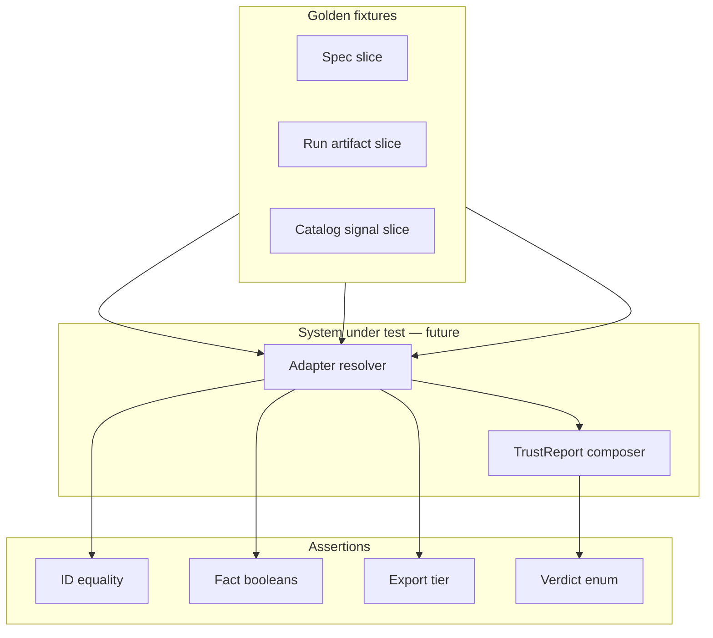

# Track B — contract test plan 001

**Document ID:** TRACK-B-CONTRACT-TEST-PLAN-001  
**Status:** architecture design — B5 deliverable (test plan only)  
**Last updated:** 2026-05-20  
**Package version:** 0.2.1 (current implementation)  

**Binding inputs:** [`TRACK_B_CONTRACT_SCHEMA_DRAFT_001.md`](TRACK_B_CONTRACT_SCHEMA_DRAFT_001.md) · [`TRACK_B_MEASUREMENT_INSTRUMENT_CATALOG_001.md`](TRACK_B_MEASUREMENT_INSTRUMENT_CATALOG_001.md) · [`TRACK_B_ESTIMAND_REGISTRY_001.md`](TRACK_B_ESTIMAND_REGISTRY_001.md) · [`TRACK_B_ADAPTER_ID_RESOLUTION_001.md`](TRACK_B_ADAPTER_ID_RESOLUTION_001.md)  

**Related:** [`TRACK_B_GEO_ADAPTER_001.md`](TRACK_B_GEO_ADAPTER_001.md) · [`TRACK_B_TRUST_REPORT_001.md`](TRACK_B_TRUST_REPORT_001.md) · [`TRACK_B_DIAGNOSTIC_SUMMARY_001.md`](TRACK_B_DIAGNOSTIC_SUMMARY_001.md) · [`TRACK_B_CALIBRATION_SIGNAL_001.md`](TRACK_B_CALIBRATION_SIGNAL_001.md) · [`DEFERRED_WORK_REGISTRY.md`](DEFERRED_WORK_REGISTRY.md)

This document defines the **normative contract test plan** for Track B — what must be proven so the stack preserves **identity** and blocks **unsafe comparisons**. **Architecture and test specification only.** No test implementation, production code, runtime schemas, APIs, eligibility, maturity, release-gate, or estimator behavior changes.

---

## 1. Purpose

### What B5 proves

Track B now has two identity axes ([`TRACK_B_CONTRACT_SCHEMA_DRAFT_001.md`](TRACK_B_CONTRACT_SCHEMA_DRAFT_001.md)):

| Axis | Prevents |
|------|----------|
| **`estimand_id`** | Causal quantity drift (e.g. relative ATT consumed as MMM Δμ) |
| **`measurement_instrument_id`** | Estimator-name inference (“SCM says X” without instrument + estimand) |

B5 defines **contract-level tests** that implementations (adapter, composer, future validators) must satisfy — independent of statistical correctness of point estimates.

### What B5 is not

| B5 is | B5 is not |
|-------|-----------|
| Normative pass/fail expectations on **IDs, facts, export tiers** | Unit tests for estimator numerical accuracy |
| Golden **fixture specifications** | Live recovery battery re-runs |
| Boundary tests (adapter vs TrustReport) | OC archive regeneration |
| Regression catalog for forbidden mappings | CI wiring (implementation follow-on) |

### Success criterion

> After B5 implementation, violating B2/B3/B4 identity or alignment rules requires **failing an explicit named test** — not an undocumented product behavior.

---

## 2. Test philosophy

### Principles

| # | Principle |
|---|-----------|
| **P1** | Tests assert **identity and facts**, not business outcomes. |
| **P2** | **Adapter** tests stop at `export_status` and alignment facts — no `trust_outcome`. |
| **P3** | **TrustReport** tests assert verdicts only on composed inputs — never re-derive IDs. |
| **P4** | Golden fixtures are **minimal contract slices** — not full RunBundle JSON. |
| **P5** | Every forbidden mapping in B2 §5 has ≥1 **regression test**. |
| **P6** | Catalog/registry doc IDs are **expected values** in fixtures — not loaded at runtime in architecture phase. |

### Export tiers (normative)

Aligned with [`TRACK_B_ADAPTER_ID_RESOLUTION_001.md`](TRACK_B_ADAPTER_ID_RESOLUTION_001.md) §5:

| Tier | Adapter tests expect | TrustReport tests expect |
|------|----------------------|--------------------------|
| **`complete`** | All required IDs; facts populated | May produce any verdict class |
| **`partial`** | Evidence object exists; explicit gaps | `not_assessable` for affected claim types |
| **`blocked`** | No decision-grade evidence | `not_assessable` (no composition) |

### Fact vs verdict discipline

| Assert on adapter/evidence tests | Assert only on TrustReport tests |
|----------------------------------|----------------------------------|
| `declared_exported_aligned: false` | `alignment_verdict: incompatible` |
| `mmm_intake_blocked: true` | `trust_outcome: unsupported` |
| `interval_semantics: placebo_band` | `trust_outcome: supported` (when applicable) |
| `export_status: blocked` | — |

---

## 3. Test harness model (planning)

### Layers



| Component | Test target |
|-----------|-------------|
| **Adapter resolver** (future) | B4 rules → ExperimentEvidence + DiagnosticSummary |
| **Signal catalog fixture** | Static CalibrationSignal entries per B3a |
| **TrustReport composer** (future) | B2 alignment algorithm → verdicts |
| **Contract validator** (optional) | Field presence per B2 Appendix A |

### Fixture file convention (implementation hint — non-normative)

```
tests/contract_fixtures/track_b/
  spec_scm_jk_null_monitor.json
  run_scm_jk_multi_treated.json
  expected_evidence_scm_jk.json
  expected_trust_scm_jk_null_vs_lift.json
```

Architecture phase: fixtures described **in this doc**; files created when tests are implemented.

---

## 4. Core test families

### Family 1 — Spec identity tests

**Binding:** B2 §2.1, B4 §4.1, B2 forbidden F1/F10.

| Test ID | Description | Input | Expected |
|---------|-------------|-------|----------|
| **SPEC-001** | Missing `declared_estimand_id` blocks export | Spec without primary estimand | Adapter `export_status: blocked`; no decision-grade evidence |
| **SPEC-002** | Valid declared ID copied to evidence | Spec with `geo.relative_att_post.pooled_path.relative` | Evidence `declared_estimand_id` identical |
| **SPEC-003** | Legacy `TargetEstimand.RELATIVE_ATT_POST` maps via table | Legacy spec + pooled path policy | `declared_estimand_id` = pooled path registry ID |
| **SPEC-004** | Legacy `UNKNOWN` does not infer export | `TargetEstimand.UNKNOWN` | **Block** — no default to pooled path |
| **SPEC-005** | No estimator-name estimand inference | Spec missing estimand; run has SCM | Export **blocked** — not `declared_estimand_id` from class name |
| **SPEC-006** | Cell-mean vs pooled-path distinct IDs | Spec declares `cell_mean` | `declared_estimand_id` ends with `cell_mean.relative` — not pooled |
| **SPEC-007** | MMM intent requires `estimand_transform_ref` | `mmm_calibration_intent: true`, no transform ref | Evidence `mmm_intake_blocked: true` (after adapter) |
| **SPEC-008** | Calibration spec requires scored expectation | `study_purpose: calibration`, no `scored_estimand_expectation_id` | Block or validation error per policy |

---

### Family 2 — Evidence export tests

**Binding:** B2 §2.2, B4 §4.2–4.3, Estimand Registry §5, B2 F3/F4.

| Test ID | Description | Input | Expected |
|---------|-------------|-------|----------|
| **EV-001** | Exported estimand from family table | TBRRidge path export | `exported_estimand_id: geo.relative_att_post.pooled_path.relative` |
| **EV-002** | Scored layer only when calibration context | Business run vs recovery run | `scored_estimand_id` present iff recovery flag |
| **EV-003** | Interval layer distinct from point | DID bootstrap | `interval_estimand_id: geo.cumulative_att.did_bootstrap.absolute` ≠ relative ATT |
| **EV-004** | Placebo band semantics | SCM Placebo success | `interval_semantics: placebo_band`; `interval_estimand_id: geo.placebo_null_envelope.pooled_path.relative` |
| **EV-005** | Placebo not CI | Placebo run | `interval_semantics` ≠ `confidence_interval`; fact `interval_semantics_compatible` per labeling |
| **EV-006** | Point-only omits interval | AugSynth point | `interval_semantics: none`; no fake `interval_estimand_id` for CI |
| **EV-007** | Cumulative ≠ relative interchange | Export cumulative scalar vs relative primary | `scale_compatible: false` if compared without transform |
| **EV-008** | Required evidence fields present | Complete geo export | `declared`, `exported`, `measurement_instrument_id`, `spec_ref` per B2 Appendix A |
| **EV-009** | Legacy string insufficient | Evidence with only `relative_att_post` string | Validator fail — registry ID required |

---

### Family 3 — Instrument resolution tests

**Binding:** B3a catalog, B4 §4.4, B2 F2/F12.

| Test ID | Description | Input | Expected |
|---------|-------------|-------|----------|
| **INST-001** | SCM JK instrument resolution | Config `SCM_UnitJackKnife`, multi-treated | `geo.synthetic_control.unit_jackknife.relative_att_post.multi_treated_default.confidence_interval` |
| **INST-002** | Placebo single-treated geometry | SCM Placebo, n_treated=1 | `...single_treated_only.placebo_band` |
| **INST-003** | Inference dimension required | Same estimator, JK vs Placebo | **Different** instrument IDs |
| **INST-004** | Missing catalog match | Unknown config hash | `measurement_instrument_id: unknown`; cal-backed export blocked or partial |
| **INST-005** | Alias is not canonical | Evidence with only `config_alias` | Validator fail — full instrument ID required |
| **INST-006** | Signal bound by instrument | Valid SCM JK ID | `calibration_signal_id` present; matches catalog fixture |
| **INST-007** | Missing signal for instrument | Unknown instrument | `calibration_signal_missing: true` |
| **INST-008** | Restricted instrument exports evidence | TBRRidge KFold | `export_status: complete`; signal `usage_boundary` ≠ governed lift |
| **INST-009** | Restricted ≠ trusted calibration | KFold signal | TrustReport must not use signal for **lift calibration claims** |
| **INST-010** | Plan violation fact | Spec expects SCM JK; run uses BRB | `instrument_plan_violation: true` |

---

### Family 4 — Alignment fact tests

**Binding:** B2 §4, B4 §4.6, B2 F6/F10.

| Test ID | Description | Input | Expected |
|---------|-------------|-------|----------|
| **ALIGN-001** | Adapter emits facts not verdicts | Any complete export | No `trust_outcome`, `alignment_verdict` on evidence |
| **ALIGN-002** | Declared = exported aligned | Matching spec and export | `declared_exported_aligned: true` |
| **ALIGN-003** | Declared cell_mean vs export pooled | Spec A, export B default | `declared_exported_aligned: false`; `aggregation_divergence_detected: true` when het context |
| **ALIGN-004** | Interval aligned to spec | Matching interval expectation | `declared_interval_aligned: true` |
| **ALIGN-005** | MMM blocked without transform | MMM intent, no ref | `mmm_intake_blocked: true` |
| **ALIGN-006** | Transform declared not complete | Transform ref, no pipeline attestation | `transform_evidence_complete: false` |
| **ALIGN-007** | Geometry scope fact | Placebo on multi-treated | `geometry_within_scope: false` (run may fail or partial) |
| **ALIGN-008** | All facts explicit | Complete export | No omitted required booleans (prefer false over absent) |
| **ALIGN-009** | DiagnosticSummary references facts | Evidence flags | Diagnostic facets cite evidence — no recompute of alignment |

---

### Family 5 — TrustReport boundary tests

**Binding:** B2 §2.5, B2 §4.4, TrustReport doc §4–6, B2 F7/F9.

| Test ID | Description | Input | Expected |
|---------|-------------|-------|----------|
| **TR-001** | TrustReport copies IDs from evidence | Composed bundle | `declared`, `exported`, `instrument_id` match evidence |
| **TR-002** | `alignment_reference_estimand_id` from spec | Business study | Equals `declared_estimand_id` |
| **TR-003** | Calibration study anchor | `study_purpose: calibration` | May use `scored_estimand_id` as reference per OQ-B2-3 |
| **TR-004** | Aligned → supported (scoped) | All facts true; null-monitor; null claim | `alignment_verdict: aligned`; `trust_outcome: supported` (null scope) |
| **TR-005** | Incompatible estimand | `declared_exported_aligned: false`, no waiver | `alignment_verdict: incompatible`; `trust_outcome: unsupported` |
| **TR-006** | Divergent aggregation | `aggregation_divergence_detected: true` | `alignment_verdict: divergent`; `trust_outcome: inconclusive` |
| **TR-007** | Missing spec estimand | Blocked export | `trust_outcome: not_assessable` |
| **TR-008** | Missing calibration signal | `calibration_signal_missing: true` | `not_assessable` for calibration-backed claims |
| **TR-009** | Diagnostic modifiers do not override IDs | DiagnosticSummary with `estimand_mismatch` facet | TrustReport still uses evidence `declared_estimand_id` — modifier adjusts verdict only |
| **TR-010** | TrustReport does not invent IDs | Evidence `exported: unknown` | `not_assessable` — not inferred from estimator |
| **TR-011** | Lift on null-monitor instrument | SCM JK signal + lift launch profile | `inconclusive` or `unsupported` — not `supported` for lift |
| **TR-012** | Placebo band as lift CI | `interval_semantics_compatible: false` | `unsupported` |

---

### Family 6 — Golden fixture tests (end-to-end contract slices)

Each golden test composes Families 1–5 for a **named scenario**. Fixture IDs are stable for implementation.

| Golden ID | Scenario | Primary test IDs | Adapter tier | TrustReport (claim-type dependent) |
|-----------|----------|------------------|--------------|-----------------------------------|
| **GOLD-001** | SCM + JK null monitor | SPEC-002, INST-001, EV-001, ALIGN-002, TR-004/011 | `complete` | Null screen: `supported`; lift launch: `inconclusive` |
| **GOLD-002** | TBRRidge + KFold restricted | INST-008/009, EV-001, TR-008/011 | `complete` | Cal-backed lift: `not_assessable`/`inconclusive` |
| **GOLD-003** | AugSynth point, no fake interval | INST-001 variant, EV-006, TR-012 | `complete` | Interval lift: `unsupported` |
| **GOLD-004** | MMM intake needs transform | SPEC-007, ALIGN-005/006, TR-005 | `complete` | MMM intake: `unsupported` until transform complete |
| **GOLD-005** | Placebo semantics | EV-004/005, INST-002, TR-012 | `complete` or `partial` | Lift via placebo band: `unsupported` |
| **GOLD-006** | Missing declared estimand | SPEC-001, TR-007 | `blocked` | `not_assessable` |
| **GOLD-007** | Legacy mapping | SPEC-003/004 | `complete` or `blocked` | Per mapping table |
| **GOLD-008** | DID cumulative vs relative | EV-003, EV-007, TR-005 | `complete` | Relative lift via DID interval: `unsupported` |
| **GOLD-009** | Heterogeneous A vs B drift | SPEC-006, ALIGN-003, TR-006 | `complete` | Business with cell declare + pooled export: `inconclusive` |
| **GOLD-010** | SCM Placebo multi-treated failure | INST-002, ALIGN-007 | `partial` | `unsupported` or `not_assessable` |

---

## 5. Golden fixture specifications

### GOLD-001 — SCM + UnitJackKnife null monitor

**Spec slice:**

```yaml
declared_estimand_id: geo.relative_att_post.pooled_path.relative
interval_estimand_expectation_id: geo.relative_att_post.pooled_path.relative
geometry_class: multi_treated_default
modality: geo
```

**Run slice:** `SCM_UnitJackKnife`, n_treated≥2, inference UnitJackKnife, CI present.

**Expected evidence:**

| Field | Value |
|-------|-------|
| `measurement_instrument_id` | `geo.synthetic_control.unit_jackknife.relative_att_post.multi_treated_default.confidence_interval` |
| `exported_estimand_id` | `geo.relative_att_post.pooled_path.relative` |
| `interval_semantics` | `confidence_interval` |
| `declared_exported_aligned` | `true` |
| `export_status` | `complete` |

**Expected TrustReport:**

| Intended use | `alignment_verdict` | `trust_outcome` |
|--------------|---------------------|-----------------|
| Null screen | `aligned` | `supported` (within null-monitor scope) |
| Lift launch | `aligned` | `inconclusive` (DEF-013; signal `null_monitor_only`) |

---

### GOLD-002 — TBRRidge + KFold restricted

**Expected evidence:** `export_status: complete`; instrument `geo.tbrridge.kfold...`.

**Expected signal fixture:** `usage_boundary` ∈ {`research_only`, `runnable_not_trusted`}; `lift_detection_calibrated: false`.

**Expected TrustReport:** Strong lift claim → `not_assessable` or `inconclusive` — **not** `supported` citing Run 001 alone.

---

### GOLD-003 — AugSynth point, no fake interval

**Expected evidence:**

| Field | Value |
|-------|-------|
| `measurement_instrument_id` | `geo.augsynth_cvxpy.point_only...none` |
| `interval_semantics` | `none` |
| `interval_estimand_id` | absent |

**Negative assertion:** `interval_semantics` ≠ `confidence_interval`; no synthetic `y_lower`/`y_upper` labeled as CI in contract view.

---

### GOLD-004 — MMM intake requires transform

**Spec:** `mmm_calibration_intent: true`.

| Variant | Expected |
|---------|----------|
| No `estimand_transform_ref` | `mmm_intake_blocked: true`; TrustReport MMM → `unsupported` |
| With `transform.geo_pooled_relative_to_mmm_delta_mu.v1`, incomplete pipeline | `transform_evidence_complete: false`; MMM → `not_assessable` |
| Complete transform attestation (future) | `mmm_intake_blocked: false`; verdict per transform OC |

**Negative assertion:** `exported_estimand_id` alone does not set MMM-ready flag.

---

### GOLD-005 — Placebo semantics

**Run:** SCM Placebo, single-treated, success.

| Field | Value |
|-------|-------|
| `interval_semantics` | `placebo_band` |
| `interval_estimand_id` | `geo.placebo_null_envelope.pooled_path.relative` |

**Regression:** Labeling `path_interval_type` as `confidence_interval` → `interval_semantics_compatible: false` → TR-012 `unsupported` for lift.

---

### GOLD-006 — Missing declared estimand

**Spec:** no `declared_estimand_id`.

**Expected:** `export_status: blocked`; TrustReport composition skipped or `not_assessable`.

---

### GOLD-007 — Legacy mapping

| Legacy input | Expected `declared_estimand_id` | Export |
|--------------|--------------------------------|--------|
| `RELATIVE_ATT_POST` + pooled policy | `geo.relative_att_post.pooled_path.relative` | `complete` |
| `UNKNOWN` | — | `blocked` |

---

### GOLD-008 — DID cumulative vs relative

**Run:** DID bootstrap.

| Layer | ID |
|-------|-----|
| Point/export | `geo.relative_att_post.pooled_path.relative` (if policy) |
| Interval | `geo.cumulative_att.did_bootstrap.absolute` |

**Regression:** Applying relative ATT lift semantics to cumulative interval → `unsupported`.

---

## 6. Forbidden implicit mappings — regression suite

Every B2 §5 prohibition maps to tests:

| Forbidden | Test IDs |
|-----------|----------|
| **F1** Estimator → estimand | SPEC-005, TR-010 |
| **F2** Estimator → instrument | INST-003, INST-005 |
| **F3** Placebo as CI | EV-005, GOLD-005, TR-012 |
| **F4** Cumulative ↔ relative | EV-007, GOLD-008 |
| **F5** Recovery → business lift | TR-011, GOLD-001 (lift row) |
| **F6** MMM without transform | SPEC-007, ALIGN-005, GOLD-004 |
| **F7** Diagnostic → verdict | ALIGN-009, TR-009 |
| **F8** Signal overrides declared | TR-002 (spec anchor) |
| **F9** TrustReport reinvents IDs | TR-010 |
| **F10** Collapse A/B aggregation | SPEC-006, ALIGN-003, GOLD-009 |
| **F11** Cross-modality OC | INST-009 (extend when Track C fixtures exist) |
| **F12** Alias as canonical | INST-005 |

---

## 7. CalibrationSignal contract tests

**Binding:** B3a, B2 §2.4, CalibrationSignal doc.

| Test ID | Description | Expected |
|---------|-------------|----------|
| **CS-001** | Signal carries `measurement_instrument_id` | Required; matches catalog |
| **CS-002** | `calibration_estimand_id` present | Matches B3a instrument OC scope |
| **CS-003** | Evidence instrument matches signal | `evidence.instrument_id == signal.instrument_id` |
| **CS-004** | Stale version flagged | Evidence pin < active → `calibration_signal_stale: true` |
| **CS-005** | Retired signal | TrustReport `not_assessable` for strong claims |
| **CS-006** | Signal does not contain trust outcomes | No `trust_outcome` on signal object |
| **CS-007** | `prohibited_claims` respected | Lift detection test fails when signal says `lift_detection_calibrated: false` |

---

## 8. DiagnosticSummary contract tests

| Test ID | Description | Expected |
|---------|-------------|----------|
| **DIAG-001** | Carries `measurement_instrument_id` from evidence | Copy only |
| **DIAG-002** | `diagnostic_estimand_id` when aggregation facet | Points at cell_mean vs pooled_path under review |
| **DIAG-003** | No trust outcomes | No `supported`/`unsupported` enums |
| **DIAG-004** | Export status mirrors evidence | `blocked` evidence → DiagnosticSummary `blocked` or absent |

---

## 9. Traceability matrix

| Architecture doc | Test families |
|------------------|---------------|
| **B2** Contract Schema | All families; field presence EV-008; forbidden §6 |
| **B3a** Instrument Catalog | INST-*, CS-*, GOLD-001/002/005 |
| **B3b** Estimand Registry | SPEC-006, EV-001/007, ALIGN-003, GOLD-008/009 |
| **B4** Adapter ID Resolution | ALIGN-*, export tiers, GOLD-001–010 |
| **TrustReport 001** | TR-* |
| **DiagnosticSummary 001** | DIAG-* |

---

## 10. Implementation sequencing (post-architecture)

| Phase | Deliverable | Tests unlocked |
|-------|-------------|----------------|
| **B5a** | Fixture JSON files for GOLD-001–007 | Golden tests |
| **B5b** | Adapter resolver unit tests | Families 1–4 |
| **B5c** | TrustReport composer tests | Family 5 |
| **B5d** | Contract validator CLI | EV-008, INST-005, CS-001 |
| **M2** | Dual-write on RunBundle | Integration: `track_b_views` keys |

**No phase changes eligibility, maturity, or estimator code.**

---

## 11. Non-goals

| Non-goal | Notes |
|----------|-------|
| Implement pytest modules | Follow-on |
| Numerical OC assertions | Track A archives separate |
| Schema validation library choice | OQ-B2-1 |
| Performance / load tests | Out of scope |
| GeoX UI tests | Adapter contract only |
| Modify governance or DEF status | Tests cite DEF; do not close |

---

## Appendix A — Test ID index

| Prefix | Count | Family |
|--------|-------|--------|
| SPEC- | 8 | Spec identity |
| EV- | 9 | Evidence export |
| INST- | 10 | Instrument resolution |
| ALIGN- | 9 | Alignment facts |
| TR- | 12 | TrustReport boundary |
| CS- | 7 | CalibrationSignal |
| DIAG- | 4 | DiagnosticSummary |
| GOLD- | 10 | End-to-end golden |

**Total named tests:** 69 (excluding variant rows within golden scenarios).

---

## Appendix B — Pass/fail summary card

| Condition | Adapter | TrustReport |
|-----------|---------|-------------|
| Missing `declared_estimand_id` | **FAIL** blocked | **FAIL** not_assessable |
| Unknown instrument, business export | partial/complete | not_assessable for cal claims |
| Placebo labeled CI | complete + fact | **FAIL** unsupported (lift) |
| MMM intent, no transform | complete + blocked fact | **FAIL** unsupported |
| KFold + lift claim | complete | **FAIL** not_assessable/inconclusive |
| SCM JK + null screen | complete | **PASS** supported (scoped) |
| Adapter emits `supported` | **FAIL** | — |
| TrustReport infers estimand | — | **FAIL** |

---

## Appendix C — Success criterion

**B5 succeeds when:**

1. **Six core test families** cover Spec, Evidence, Instrument, Alignment, TrustReport, Golden fixtures.  
2. Every **B2 forbidden mapping** has a regression test.  
3. **Golden fixtures** GOLD-001–010 specify expected IDs, facts, export tiers, and verdicts.  
4. **Fact vs verdict** boundary is testable and explicit.  
5. **B3a/B3b/B4** traceability matrix links architecture to tests.  
6. Implementation sequencing is clear without committing code in this phase.

**Conclusion:**

> B5 completes Track B **test discipline** — the contract stack now has specification (B0–B3), export rules (B4), and normative tests (B5). Implementations that violate identity or safe-comparison boundaries must fail a **named test**, not a silent product regression.

**Suggested next artifacts:** B5a fixture JSON · adapter module + B5b · TrustReport composer + B5c · M2 dual-write integration tests.

---

*Planning artifact TRACK-B-CONTRACT-TEST-PLAN-001. B5 complete. Test plan only — no implementation.*
