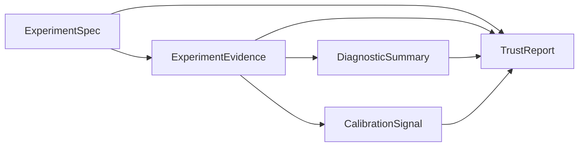
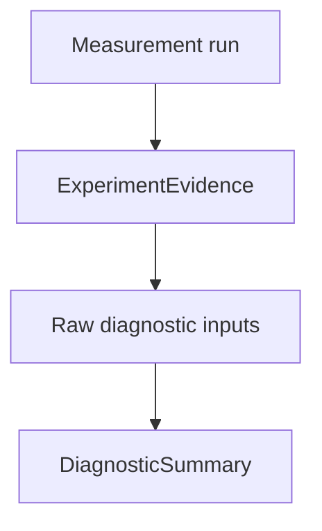

# Track B — DiagnosticSummary architecture 001

**Document ID:** TRACK-B-DIAGNOSTIC-SUMMARY-001  
**Status:** architecture design — planning artifact only  
**Last updated:** 2026-05-20  
**Package version:** 0.2.1 (current implementation)  

**Related:** [`TRACK_B_EXPERIMENT_SPEC_001.md`](TRACK_B_EXPERIMENT_SPEC_001.md) · [`TRACK_B_EXPERIMENT_EVIDENCE_001.md`](TRACK_B_EXPERIMENT_EVIDENCE_001.md) · [`TRACK_B_ARCHITECTURE_PLAN.md`](TRACK_B_ARCHITECTURE_PLAN.md) · [`TRACK_A_COMPLETION_REVIEW_001.md`](TRACK_A_COMPLETION_REVIEW_001.md) · [`PHASE13_GOVERNANCE_DECISION_001.md`](PHASE13_GOVERNANCE_DECISION_001.md) · [`PHASE15_GOVERNANCE_DECISION_001.md`](PHASE15_GOVERNANCE_DECISION_001.md) · [`PHASE12_INV003_AGGREGATION_SEMANTICS_001.md`](PHASE12_INV003_AGGREGATION_SEMANTICS_001.md) · [`INV030_JACKKNIFE_FAMILY_CHARACTERIZATION_PLAN.md`](INV030_JACKKNIFE_FAMILY_CHARACTERIZATION_PLAN.md) · [`INV031_INFERENCE_CONSERVATISM_PLAN.md`](INV031_INFERENCE_CONSERVATISM_PLAN.md) · [`DEFERRED_WORK_REGISTRY.md`](DEFERRED_WORK_REGISTRY.md)

This document defines the **canonical diagnostic layer** between `ExperimentEvidence` and `TrustReport`. It is **architecture design only**. It does **not** define scoring formulas, trust outcomes, release gates, APIs, storage, or implementation code.

---

## 1. What is a DiagnosticSummary?

### Definition

**DiagnosticSummary** is the **reviewer-facing aggregate of study-quality and validity signals** — what a human (or governed agent) needs to assess whether measurement outputs are **interpretable and responsibly usable**, without replacing estimand declaration, calibration lifecycle state, or final trust verdicts.



### Conceptual responsibility

| DiagnosticSummary **owns** | DiagnosticSummary **does not own** |
|----------------------------|-------------------------------------|
| Aggregated diagnostic checklist | Raw measurement tensors (→ ExperimentEvidence) |
| Severity ordering and reviewer narrative | Point estimates and intervals as primary facts |
| Expert-review export facets | Business estimand declaration (→ ExperimentSpec) |
| Interpretation of diagnostic inputs | Nominal eligibility (→ CalibrationSignal + governance) |
| Waiver / override visibility | Trust outcome taxonomy (→ TrustReport) |
| Modality-neutral diagnostic taxonomy | Release-gate pass/fail (advisory gates out of scope) |
| Links to characterized limits (INV-030/031 context) | Go/no-go business decision |

### Platform-level scope

DiagnosticSummary is **not** an experiment card, readiness assessment, or pass/fail score. It is the **structured diagnostic layer** those surfaces may **view** — alongside evidence, not instead of TrustReport.

**Today (geo):** partial inputs exist — opt-in `build_estimator_review` review flags ([`panel_exp/diagnostics/review_flags.py`](../panel_exp/diagnostics/review_flags.py)), DID pretrend contract, DID interval policy, interference review metadata, geometry facts on evidence. DiagnosticSummary **unifies** them into one modality-neutral contract.

**Design principle:** Diagnostics **inform** trust; they do **not** substitute for calibration scope, estimand alignment policy, or human governance ([`EXPERIMENTATION_PLATFORM_VISION.md`](EXPERIMENTATION_PLATFORM_VISION.md) — inconclusive ≠ no effect).

---

## 2. Which diagnostics belong here?

Diagnostics belong in DiagnosticSummary when they answer: **“Is this measurement responsibly interpretable for the declared study?”** They are grouped into **facets** — not a flat bag of flags.

### Facet taxonomy

| Facet | Examples | Primary sources (geo today) |
|-------|----------|----------------------------|
| **Pretrend / parallel trends** | DID pretrend contract status, waiver discipline | `did_pretrend_contract`, `pretrend_violation` review flag |
| **Placebo / null-reference** | Placebo band vs point comparison, `placebo_band` labeling | Phase 15 OC semantics; evidence uncertainty facet |
| **Donor / weight health** | Concentration, active donor count, instability | `high_donor_concentration`, `donor_instability` review flags |
| **Residual / fit drift** | Pre-period slope, post/pre RMSE ratio | `residual_drift` review flag |
| **Fold / inference stability** | KFold pre-period CI width instability | `fold_instability` (TBRRidge + KFold only) |
| **Coefficient / model stability** | Ridge dominance | `coefficient_instability` (TBR/TBRRidge) |
| **Spillover / interference** | Design-level spillover review, contamination risk | `build_interference_review`, DEF-004 limits |
| **Geometry warnings** | Single- vs multi-treated, donor tier, panel shape | INV-007, Phase 11; evidence geometry facet |
| **Estimand mismatch** | Declared vs family export misalignment | Evidence alignment flags |
| **Aggregation mismatch** | A vs B drift, undeclared pooling | INV-003; evidence + spec cross-check |
| **Interval alignment** | Interval estimand vs declared/scored; interval **type** | Evidence inference facet; DID policy |
| **Assignment integrity** | SRM, balance (future A/B) | INV-025 — future facet |
| **Data quality** | Missingness, stale data | Future facet |
| **Bayesian / MCMC health** | Divergence, R-hat | `posterior_divergence`, `mcmc_convergence` (research estimators) |
| **Expert-review checklist** | What ran, what unavailable, what waived | Composed from facets + support metadata |

### Example diagnostics — placement

| Diagnostic | Facet | Notes |
|------------|-------|-------|
| **Pretrend** | Pretrend / parallel trends | DID-only contract today; warn/fail/unavailable levels |
| **Placebo** | Placebo / null-reference | Diagnostic comparison only — **not** lift detection ([`PHASE15_GOVERNANCE_DECISION_001.md`](PHASE15_GOVERNANCE_DECISION_001.md)) |
| **Donor concentration** | Donor / weight health | SCM/SDID weight vectors; unavailable for TBR/DID |
| **Residual drift** | Residual / fit drift | Path `y` vs `y_hat` pre-period; counterfactual families |
| **Fold instability** | Fold / inference stability | TBRRidge + KFold inference only |
| **Spillover indicators** | Spillover / interference | **Design review** metadata — no spillover **estimation** (DEF-004) |
| **Geometry warnings** | Geometry warnings | n_treated, donor count, unsupported Placebo/KFold geometry |
| **Estimand mismatch** | Estimand mismatch | Scale or registry misalignment (DEF-018) |
| **Aggregation mismatch** | Aggregation mismatch | Heterogeneous multi-treated B vs A (DEF-009) |
| **Interval alignment** | Interval alignment | `relative_att_post` vs cumulative DID; `placebo_band` vs CI |

### Review flags architecture (geo reference)

Today’s review flags ([`review_flags.py`](../panel_exp/diagnostics/review_flags.py)) embody core DiagnosticSummary inputs:

| Flag | Value domain | Estimator support |
|------|--------------|-------------------|
| `residual_drift` | ok / warn / fail / unavailable | Path counterfactual families with pre-period |
| `high_donor_concentration` | bool / unavailable | SCM, SDID (not AugSynth simplex export, not TBR/DID) |
| `donor_instability` | bool / unavailable | Same as concentration |
| `coefficient_instability` | ok / warn / fail / unavailable | TBR, TBRRidge |
| `fold_instability` | ok / warn / fail / unavailable | TBRRidge + KFold inference |
| `pretrend_violation` | ok / warn / fail / unavailable | DID pretrend contract only |
| `pretrend_assessment_unavailable` | bool | DID when contract cannot run |
| `weak_donor_pool` | bool / unavailable | TROP only |
| `posterior_divergence`, `mcmc_convergence` | ok / warn / unavailable | Bayesian MCMC paths |

**Support metadata is mandatory:** `review_flag_support.supported` and `unsupported` with reasons — flags not computed must appear as **unavailable**, not omitted ([`classify_review_flag_support`](../panel_exp/diagnostics/review_flags.py)).

**Opt-in discipline:** Default `run_analysis` does not attach flags; DiagnosticSummary records **`diagnostics_requested: true/false`** and builds from evidence-stored inputs when present ([`build_estimator_review`](../panel_exp/diagnostics/review.py)).

### DID policy diagnostics

DID contributes **two policy-bound facets** distinct from generic review flags:

| Facet | Content | Policy source |
|-------|---------|---------------|
| **Pretrend contract** | warn / fail / ok / unavailable; waiver flag | [`DID.py`](../panel_exp/methods/DID.py) `_build_did_pretrend_contract` |
| **Interval policy** | Relative ATT interval **unsupported**; cumulative scale documented | [`did_interval_policy.py`](../panel_exp/validation/did_interval_policy.py) — `did_relative_att_interval_unsupported` |

DiagnosticSummary **surfaces** pretrend status and interval-policy facts for reviewers; it does **not** re-derive ATT or bootstrap intervals.

### INV-003 aggregation semantics

Aggregation diagnostics belong when **declared primary estimand aggregation** (ExperimentSpec) diverges from **operational scoring** (Evidence):

| Signal | Condition | Diagnostic facet |
|--------|-----------|------------------|
| `aggregation_coherent` | Homogeneous relative; A ≈ B | Informational OK |
| `aggregation_divergence_detected` | Heterogeneous multi-treated; small B vs A drift | Trust modifier — may warrant `inconclusive` input to TrustReport |
| `scale_incompatible` | Absolute DGP vs relative recovery scoring | Trust modifier — strong `incompatible_estimand` input |
| `aggregation_undeclared` | Spec missing aggregation mode on multi-geo | Trust modifier — DEF-009 gap |

### INV-030 / INV-031 contextual diagnostics

These investigations supply **characterized limits** referenced in diagnostic narrative — not new runtime computations in this contract:

| Investigation | DiagnosticSummary role |
|---------------|------------------------|
| **INV-030** (jackknife family) | Explain **donor-sensitivity / width semantics** when UnitJackKnife intervals are wide — informational + trust modifier for **lift claims** |
| **INV-031** (inference conservatism) | Cross-mode **zero power** and distinct mechanisms (JK over-width, BRB under-width, placebo null-envelope) — informs reviewer checklist; **not** a single “failed calibration” flag |

DiagnosticSummary may include **`characterized_limit_refs`** pointing to INV-030/031 archives when relevant inference modes ran — without defining trust outcomes.

### Modality extensions (future)

| Modality | Additional facets |
|----------|-------------------|
| **A/B** | Balance, SRM, sequential test peeking discipline (INV-024/025) |
| **Conversion Lift** | Exposure eligibility rate, ghost-ad arm integrity (INV-026) |
| **Holdout** | Replay window fit, model vs holdout divergence |
| **Calibration** | Battery coverage, cell failure rate — distinct from business study diagnostics |

---

## 3. Which diagnostics are informational?

**Informational diagnostics** provide **context** for expert review. They **do not alone** restrict business interpretation or imply failure when characterized behavior is expected.

| Diagnostic | Why informational |
|------------|-------------------|
| **Geometry context** (n_treated, n_donors, panel shape) | Describes study setting; wide panels are not inherently invalid |
| **Donor concentration OK** | High weight may be expected in sparse donor pools |
| **Placebo band width vs point** (Phase 15) | Expected null-envelope behavior; power = 0 is characterized |
| **UnitJackKnife width/effect ratio** (Phase 11) | Expected conservatism — null monitor role (INV-030) |
| **Review flags at `ok`** | Confirms checks ran clean |
| **`pretrend_violation: ok`** | Parallel trends satisfied |
| **`residual_drift: ok`** | Pre-period fit stable |
| **DID interval policy attached** | Documents cumulative-scale intervals — policy transparency |
| **Interference assumption declared** | SUTVA / partial interference documented |
| **Diagnostics not requested** | Records opt-in gap — not automatic failure |
| **Evidence tier = characterization** | Scope label for reviewer |
| **Secondary estimand outputs** | Exploratory context |

**Informational does not mean “ignore.”** Reviewers should read informational facets — they must not **auto-pass** a study or **auto-block** without TrustReport composition.

---

## 4. Which diagnostics are trust modifiers?

**Trust modifiers** are diagnostics that **materially constrain** how evidence may be interpreted in TrustReport — they supply **inputs** to trust composition, not final outcomes.

| Diagnostic | Modifier role | Typical TrustReport input (TrustReport owns outcome) |
|------------|---------------|-----------------------------------------------------|
| **`pretrend_violation: fail`** (no waiver) | Questions parallel trends validity for DID | Pretrend override required; may block `supported_*` for DID point claims |
| **`pretrend_violation: warn`** | Caution on DID interpretation | Highlight + waiver discipline |
| **`residual_drift: fail` / `warn`** | Counterfactual fit unstable | Diagnostic highlight; may contribute to `inconclusive` |
| **`high_donor_concentration` / `donor_instability`** | Donor pool fragility | Expert-review caution on SCM/SDID |
| **`fold_instability: warn/fail`** | KFold pre-period CI unstable | Reinforces KFold **runnable-not-trusted** (Phase 13) |
| **`coefficient_instability: fail`** | Ridge dominance | TBRRidge expert-review caution |
| **`unsupported_geometry`** | Placebo/KFold on wrong geometry | `calibration_unavailable` / scope restriction input |
| **`estimand_mismatch`** (evidence flags) | Declared ≠ measured | `incompatible_estimand` input |
| **`aggregation_divergence_detected`** | B vs A under heterogeneity | `inconclusive` input (DEF-009) |
| **`scale_incompatible`** | Absolute vs relative | `incompatible_estimand` input (DEF-018) |
| **`interval_misaligned`** | Interval estimand ≠ declared | `incompatible_estimand` or calibration scope limit |
| **`placebo_band_labeled_as_ci`** | Semantic export violation | `incompatible_estimand` input (Phase 15) |
| **`plan_violation`** | Inference outside ExperimentSpec plan | Governance highlight |
| **Interference `contamination_risk: high`** (design review) | Spillover plausibility | May contribute to interference narrative — **not** `interference_detected` without estimator backing (DEF-004) |
| **INV-031 zero lift-detection context** | Intervals not lift detectors | Reinforces `inconclusive` for positive claims — not defect flag |

**Trust modifiers require composition:** DiagnosticSummary **never** emits `supported_positive`, `incompatible_estimand`, or other TrustReport outcomes — it records **modifier facets** and **severity** for TrustReport to interpret under governance policy.

---

## 5. Which diagnostics are prohibited from becoming decision-grade alone?

The following must **not** serve as **sole** basis for launch, budget, or model-update decisions — with or without a numeric score (this document defines **no scoring**):

| Diagnostic / signal | Prohibition rationale |
|---------------------|----------------------|
| **Any single review flag** | Advisory, family-specific, threshold-based; opt-in |
| **Review flag `ok`** | Absence of warn/fail ≠ positive lift |
| **Placebo null-envelope including zero on positive** | Characterized behavior; power = 0 by design (Phase 15, INV-031 H7) |
| **Null FPR = 0 / coverage = 1 on null** | Null-monitor scope only — not lift certification (Phase 13) |
| **Zero power on recovery battery** | Universal among characterized modes (INV-031) — not hidden failure |
| **Donor concentration alone** | May reflect valid SCM geometry |
| **Geometry warnings alone** | Multi-treated runnable KFold ≠ trusted |
| **Pretrend pass alone** | Does not certify intervals or lift |
| **DID point estimate under pretrend fail** | Policy exports point with contract — **decision requires waiver + TrustReport** |
| **Readiness assessment profile** | Demoted from canonical truth — input only |
| **Experiment card narrative** | View layer — not authoritative |
| **DiagnosticSummary aggregate “pass”** | **No aggregate pass/fail score defined** — checklist only |
| **Interference design review alone** | No spillover estimation in core estimators (DEF-004) |
| **Informational INV-030 width tables** | Explains conservatism — does not certify narrower intervals |

**Governance rule:** Decision-grade claims require **TrustReport** composing Spec + Evidence + DiagnosticSummary + CalibrationSignal + DEF registry — with **human accountability** ([`PHASE13_GOVERNANCE_DECISION_001.md`](PHASE13_GOVERNANCE_DECISION_001.md) §7).

---

## 6. Relationship to ExperimentEvidence

### Division of labor

| Layer | Role |
|-------|------|
| **ExperimentEvidence** | Immutable measurement record + **raw diagnostic inputs** |
| **DiagnosticSummary** | **Aggregation, severity, narrative, checklist** over those inputs |



### What evidence supplies

| Evidence facet | DiagnosticSummary use |
|----------------|----------------------|
| Alignment flags | Estimand / aggregation / interval facets |
| `path_interval_type` | Placebo vs CI discipline facet |
| Geometry class | Geometry warnings facet |
| Review flags (when requested) | Mapped into facets with support metadata |
| `did_pretrend_contract`, `did_interval_policy` | DID facets |
| Interference review packet | Spillover facet |
| Failure / skip metadata | Unsupported geometry, plan violation facets |
| `diagnostics_requested` | Checklist completeness |

### What DiagnosticSummary adds

| Addition | Not stored redundantly on evidence |
|----------|-----------------------------------|
| Facet-level severity rollup | Ordered checklist |
| Cross-facet consistency notes | e.g. pretrend fail + interval unsupported |
| Reviewer-facing narrative stubs | Human-readable section titles |
| Waiver visibility | Links to human review on evidence |
| **`characterized_limit_refs`** | INV-030/031, Phase 11–15 doc pointers |
| Expert-review checklist completion | Which facets ran vs unavailable |

**Rule:** DiagnosticSummary is **derived** from evidence (+ spec for declaration cross-check). Rebuilding DiagnosticSummary from the same evidence + spec version must be **deterministic** — no hidden state.

**No re-estimation:** DiagnosticSummary does not re-run `run_analysis`, bootstrap, or jackknife.

---

## 7. Relationship to CalibrationSignal

CalibrationSignal owns **lifecycle state** of calibration evidence (recovery, OC, eligibility, usage boundary). DiagnosticSummary owns **study-run quality** for a **specific business or calibration execution**.

### Separation

| Concern | DiagnosticSummary | CalibrationSignal |
|---------|-------------------|-------------------|
| Pretrend fail on live DID study | **Yes** — study quality | No |
| Run 001 null OC passed for SCM_UnitJackKnife | Reference via limit refs | **Yes** — lifecycle state |
| KFold fold instability on live panel | **Yes** | No |
| KFold positive OC failed on battery | Limit ref only | **Yes** |
| Placebo band semantics on live run | **Yes** — export discipline | Null-monitor viable (single-treated) |
| `lift_detection_calibrated` | **No** — evidence fact; signal interprets | **Yes** — usage boundary |
| Eligibility registry | **No** | **Yes** (authoritative) |

### Interaction pattern

1. **Business study:** DiagnosticSummary assesses **this run’s** interpretability; CalibrationSignal (referenced from evidence) scopes **what calibration archives permit** for the config.  
2. **Calibration study:** DiagnosticSummary includes **battery execution quality** (failure rates, cell completeness); CalibrationSignal **is the output artifact** of that calibration pipeline — not duplicated inside DiagnosticSummary.  
3. **Null pass ≠ lift claim:** DiagnosticSummary may note “null checks sane” as **informational**; CalibrationSignal carries **scenario-class separation** (null vs positive OC) per Phase 13.

DiagnosticSummary **must not** mirror or override `NOMINAL_CALIBRATION_ELIGIBLE_CONFIGS`.

---

## 8. Relationship to TrustReport

TrustReport is the **single reviewer-facing trust narrative** with outcome taxonomy. DiagnosticSummary is its **primary quality input** — not its substitute.

### Composition flow

```
ExperimentSpec
    + ExperimentEvidence
    + DiagnosticSummary  ← this document
    + CalibrationSignal
    + DEFERRED_WORK_REGISTRY
    → TrustReport
```

### What TrustReport takes from DiagnosticSummary

| TrustReport element | DiagnosticSummary input |
|--------------------|-------------------------|
| **Diagnostic highlights** | Top trust modifiers by severity |
| **Expert-review checklist** | Facets run / unavailable / waived |
| **Pretrend / DID discipline** | Pretrend facet + waiver visibility |
| **Export discipline** | Placebo vs CI facet |
| **Interference narrative** | Design review facet (bounded by DEF-004) |
| **Deferred limit context** | INV-030/031 refs when conservatism relevant |

### What DiagnosticSummary must not contain

| Excluded | Owner |
|----------|-------|
| `supported_positive`, `supported_negative` | TrustReport |
| `inconclusive`, `underpowered`, `stale` | TrustReport |
| `incompatible_estimand` (outcome) | TrustReport — may use same **facts** as diagnostics |
| `calibration_unavailable` (outcome) | TrustReport |
| DEF-xxx narrative paragraphs | TrustReport |
| Human governance footer | TrustReport |
| Composite trust **score** | **Prohibited** in both layers |

**Phase 15 rule:** DiagnosticSummary may report placebo coverage = 1 on positive as **informational**; TrustReport **must not** treat that alone as lift support.

**Readiness assessment:** Partial diagnostic input today — **demoted**; must not appear as DiagnosticSummary’s primary output shape.

---

## 9. Governance rules

### Advisory-only diagnostics

| Rule | Source |
|------|--------|
| Review flags **do not block** runs or change estimates | [`review_flags.py`](../panel_exp/diagnostics/review_flags.py) module docstring |
| Diagnostics **do not promote** maturity or eligibility | Phase 13/15 non-claims |
| **Opt-in default** preserved until product policy changes | ROADMAP_V3 Phase 7 |
| Missing diagnostics ≠ passing diagnostics | Record `diagnostics_requested: false` explicitly |

### Family and modality discipline

| Rule | Implication |
|------|-------------|
| **Unsupported flags → unavailable with reason** | Never silently omit |
| **Estimator-family-specific interpretation** | DID pretrend ≠ SCM donor flags |
| **Inference-mode-specific interpretation** | Placebo ≠ jackknife CI |
| **Modality-neutral facet IDs** | Same facet taxonomy; adapter fills content |

### Estimand and aggregation governance

| Rule | Implication |
|------|-------------|
| INV-003 aggregation must be declared on spec | DiagnosticSummary flags `aggregation_undeclared` |
| Absolute vs relative mismatch | Trust modifier — DEF-018 |
| DID relative intervals unsupported | Informational policy facet — not “bug” |
| Heterogeneous multi-treated | `aggregation_divergence_detected` when applicable |

### Inference conservatism governance (INV-031)

| Rule | Implication |
|------|-------------|
| Zero power is **characterized**, not diagnostic “fail” | Informational + trust modifier for **lift claims** only |
| Distinct mechanisms documented | JK vs BRB vs Placebo — no single “inference broken” flag |
| INV-031 synthesis ref recommended before CalibrationSignal **implementation** | DiagnosticSummary may cite plan/archive when ready |

### Jackknife family governance (INV-030)

| Rule | Implication |
|------|-------------|
| Width/effect ratios **expected** for UnitJackKnife | Informational explainers — not tuning triggers |
| Alternative families **not** characterized unless archived | unavailable + DEF-021 ref |

### Export and product discipline

| Rule | Implication |
|------|-------------|
| **`placebo_band` ≠ confidence interval** | Mandatory facet when Placebo ran (Phase 15) |
| Experiment card sections | Views of DiagnosticSummary — not source of truth |
| LLM / agent outputs | Must cite diagnostic facets + archives — no unsourced promotion |

### Waiver discipline

| Rule | Implication |
|------|-------------|
| Pretrend fail may proceed with waiver | DiagnosticSummary **shows fail + waiver** — does not erase fail |
| Waivers on evidence, visible in summary | Audit trail for TrustReport |

### Deferred work surfacing

DiagnosticSummary may **link** DEF-xxx when a diagnostic touches a known platform limit (e.g. DEF-004 spillover, DEF-009 aggregation) — **full narrative** remains TrustReport’s responsibility.

---

## 10. Non-goals

This document **does not**:

| Non-goal | Notes |
|----------|-------|
| **Define scoring** | No numeric health score, pass rate, or weighted index |
| **Define trust outcomes** | No `supported_*`, `inconclusive`, etc. |
| **Define release gates** | Advisory gate chain out of scope |
| **Design APIs** | No endpoints or SDK |
| **Design storage** | No schema or DDL |
| **Implement code** | No changes to `review_flags`, DID, or exports |
| **Change review flag thresholds** | Existing constants unchanged |
| **Change governance** | Eligibility, maturity, Phase 13/15 unchanged |
| **Replace ExperimentEvidence or TrustReport** | Companion contracts |
| **Close DEF or INV items** | References only |
| **Certify estimators** | Characterization limits cited, not overridden |
| **Require diagnostics by default** | Opt-in policy preserved unless future product decision |

This document **does**:

- Define **modality-neutral DiagnosticSummary** purpose and facet taxonomy  
- Classify diagnostics as **informational**, **trust modifiers**, or **prohibited alone for decisions**  
- Specify relationships to **ExperimentEvidence**, **CalibrationSignal**, and **TrustReport**  
- Encode **governance rules** from review flags, DID policy, INV-003, INV-030/031, Phase 13/15  
- Enable **CalibrationSignal** or **TrustReport** architecture as next artifacts  

---

## Appendix A — Conceptual facet record (not a schema)

Each diagnostic facet entry (conceptual):

| Field | Description |
|-------|-------------|
| `facet_id` | Stable ID (e.g. `pretrend`, `donor_health`, `interval_alignment`) |
| `status` | ok · warn · fail · unavailable · not_requested |
| `severity` | informational · trust_modifier |
| `summary` | Short reviewer-facing text |
| `source_refs` | Evidence paths, review flag names, policy IDs |
| `waiver_applied` | Optional bool + note |
| `characterized_limit_refs` | Optional doc IDs (Phase 11, INV-031, …) |
| `modality` | geo · ab · conversion_lift · calibration · holdout |

DiagnosticSummary document (conceptual):

| Field | Description |
|-------|-------------|
| `summary_id` | Unique ID |
| `evidence_id` | Source evidence |
| `spec_version` | For cross-check |
| `diagnostics_requested` | bool |
| `facets` | List of facet records |
| `expert_review_checklist` | Facet completion matrix |
| `diagnostics_version` | Contract version (analogous to `DIAGNOSTICS_VERSION = "1.0"`) |

---

## Appendix B — GeoX today → DiagnosticSummary mapping

| Today | DiagnosticSummary facet |
|-------|-------------------------|
| `build_estimator_review` → review_flags | Donor, residual, fold, pretrend, MCMC facets |
| `did_pretrend_contract` on results | Pretrend facet |
| `did_interval_policy` on results | Interval alignment + policy transparency |
| `build_interference_review` | Spillover / interference facet |
| Evidence alignment flags | Estimand + aggregation + interval facets |
| Experiment card diagnostic sections | **View** of DiagnosticSummary |
| Readiness assessment | TrustReport input — **not** DiagnosticSummary core |

---

## Appendix C — Governance cross-links

| Source | DiagnosticSummary implication |
|--------|------------------------------|
| Phase 13 | KFold/BRB conservatism as trust modifiers for lift claims |
| Phase 15 | Placebo facet; export discipline; single-treated geometry |
| INV-003 | Aggregation mismatch facets |
| INV-030 | Jackknife width informational / lift trust modifier |
| INV-031 | Cross-mode zero-power context |
| DEF-004 | Interference design only — no estimator spillover pass |
| DEF-009 | Undeclared aggregation trust modifier |
| DEF-018 | Scale incompatible trust modifier |
| TRACK_A_COMPLETION_REVIEW_001 | Plan-ready — aggregate existing diagnostics |

---

## Appendix D — Success criterion

**Architecture achieved when:**

1. A reader understands **what DiagnosticSummary is** and how it differs from evidence, calibration, and trust.  
2. **Facet taxonomy** covers listed examples (pretrend through interval alignment) with modality extensions sketched.  
3. **Informational vs trust-modifier vs decision-prohibited** classification is explicit.  
4. **Relationships** to ExperimentEvidence, CalibrationSignal, and TrustReport are unambiguous.  
5. **Governance rules** align with review flags, DID policy, INV-003, INV-030/031, Phase 13/15 — without scoring or trust outcomes.  
6. Implementers can proceed to **CalibrationSignal** or **TrustReport** architecture without re-deciding diagnostic scope.

**Suggested next artifact:** `TRACK_B_CALIBRATION_SIGNAL_001.md` or `TRACK_B_TRUST_REPORT_001.md`.

---

*Planning artifact TRACK-B-DIAGNOSTIC-SUMMARY-001. Architecture design only — no scoring, trust outcomes, release gates, APIs, storage, or code.*
