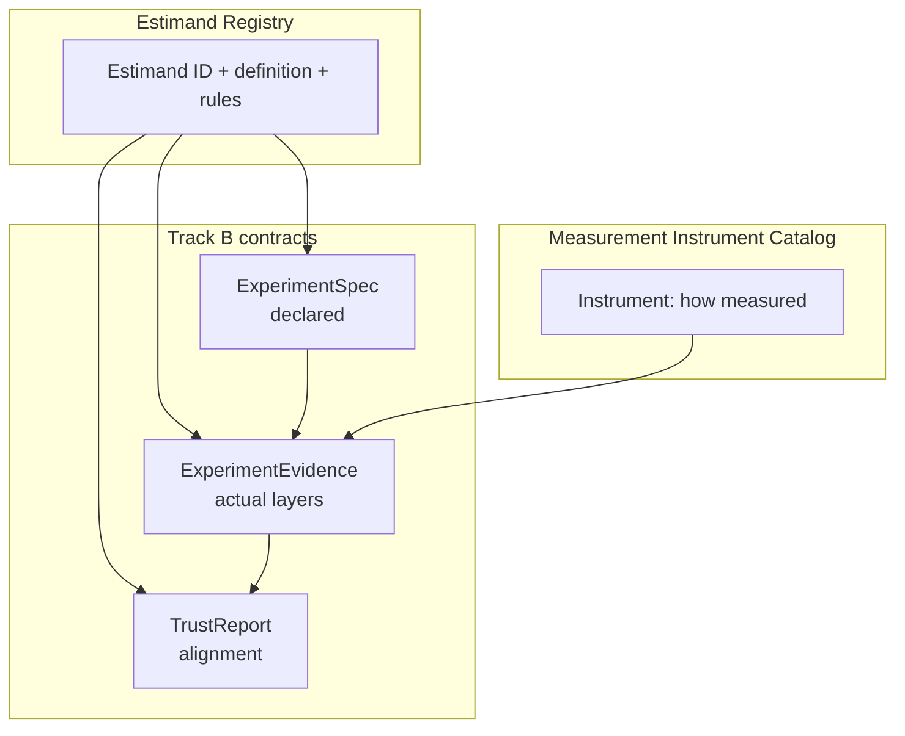
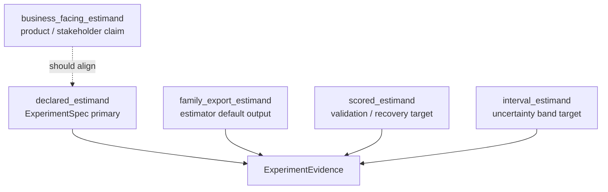
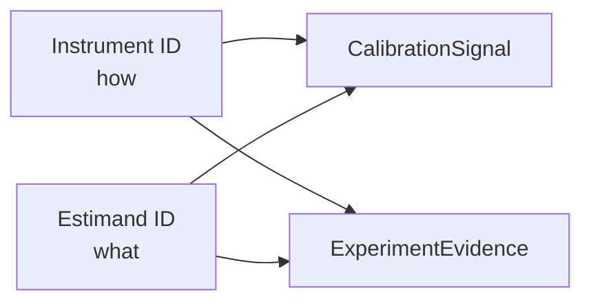

# Track B — estimand registry architecture 001

**Document ID:** TRACK-B-ESTIMAND-REGISTRY-001  
**Status:** architecture design — B3b deliverable  
**Last updated:** 2026-05-20  
**Package version:** 0.2.1 (current implementation)  

**Related:** [`TRACK_B_EXPERIMENT_SPEC_001.md`](TRACK_B_EXPERIMENT_SPEC_001.md) · [`TRACK_B_EXPERIMENT_EVIDENCE_001.md`](TRACK_B_EXPERIMENT_EVIDENCE_001.md) · [`TRACK_B_CALIBRATION_SIGNAL_001.md`](TRACK_B_CALIBRATION_SIGNAL_001.md) · [`TRACK_B_TRUST_REPORT_001.md`](TRACK_B_TRUST_REPORT_001.md) · [`TRACK_B_MEASUREMENT_INSTRUMENT_CATALOG_001.md`](TRACK_B_MEASUREMENT_INSTRUMENT_CATALOG_001.md) · [`PHASE12_INV003_AGGREGATION_SEMANTICS_001.md`](PHASE12_INV003_AGGREGATION_SEMANTICS_001.md) · [`TRACK_A_COMPLETION_REVIEW_001.md`](TRACK_A_COMPLETION_REVIEW_001.md) · [`EXPERIMENTATION_PLATFORM_VISION.md`](EXPERIMENTATION_PLATFORM_VISION.md) · [`DEFERRED_WORK_REGISTRY.md`](DEFERRED_WORK_REGISTRY.md)

This document defines the **canonical Estimand Registry architecture** — the modality-neutral layer of **governed causal quantity definitions** shared by GeoX, A/B tests, Conversion Lift, holdouts, calibration studies, and MMM integration. **Architecture design only.** No code, schema, API, runtime registry, estimator behavior, recovery scoring, eligibility, maturity, release-gate, or automatic transformation changes in this phase.

---

## 1. Executive purpose

### Why an Estimand Registry exists

Platforms fail when **metric names** and **estimator outputs** stand in for causal quantities. GeoX reports “lift,” recovery scores `relative_att_post`, DID exports cumulative ATT, and product copy says “incremental revenue” — often without recording **which causal quantity** each number represents, **over which population**, **with which aggregation order**, or **on which scale**.

The **Estimand Registry** is the **stable vocabulary of what is measured** — independent of **how** it is measured (Measurement Instrument Catalog) and independent of **whether** a specific run succeeded (ExperimentEvidence).

| Without registry | Failure mode |
|------------------|--------------|
| “Compare SCM and TBRRidge lift” | Cross-family exports may be different estimands (DEF-014) |
| “Recovery passed — study is calibrated” | Scored estimand B vs business declarative A under heterogeneity (DEF-009) |
| “DID interval covers lift” | Cumulative scale ≠ relative ATT (DEF-003) |
| “Feed geo lift to MMM” | Relative path mean ≠ calibrated contribution without transform (DEF-012) |
| “A/B lift = geo lift” | User-level Δμ ≠ geo `relative_att_post` (DEF-011) |

The registry answers:

> **What causal quantity does this study claim, validate against, and report — and which comparisons are forbidden?**

### Estimands are not metric names and not estimator outputs

| Concept | What it is | What it is not |
|---------|------------|----------------|
| **Metric name** | Dashboard label (“Lift %”, “iROAS”) | May hide aggregation, scale, or population |
| **Estimator output** | Algorithm export (path, weights, arm means) | Default export estimand varies by family |
| **Registry estimand** | **Governed causal quantity** with definition, population, contrast, aggregation, window, scale, unit | Not tied to one estimator or inference mode |

**Example:** `relative_att_post` in recovery code is a **family of operational quantities** until aggregation mode is fixed — cell-mean (A) vs pooled-path (B) diverge under heterogeneous multi-treated panels ([`PHASE12_INV003_AGGREGATION_SEMANTICS_001.md`](PHASE12_INV003_AGGREGATION_SEMANTICS_001.md)). The registry splits these into **distinct entries** with explicit comparison rules.



**Success criterion:** A modality-neutral architecture that **prevents silent comparison** of incompatible causal quantities across studies, modalities, and MMM boundaries.

---

## 2. Estimand definition

A **registry estimand** is a **governed specification of a causal quantity** — not a runtime value. Every catalog entry is defined by seven required dimensions:

| Dimension | Description | Geo example |
|-----------|-------------|-------------|
| **Causal quantity** | Target parameter or functional of potential outcomes | Average treatment effect on treated (ATT) on outcome \(Y\) |
| **Population** | Who or what the quantity generalizes to | Treated geos in post period; national rollout cohort if declared |
| **Treatment contrast** | Treated vs control definition | Treated geo assignment vs donor-weighted synthetic control |
| **Aggregation rule** | How units and time combine into one scalar | Cell mean over treated×post; path pool then relative mean |
| **Time window** | Pre, post, lag, cumulative span | Post-period path mean; full post cumulative sum |
| **Scale** | Relative, absolute, count, rate, currency | `relative` (ratio to counterfactual); `absolute` (level difference) |
| **Unit of analysis** | Randomization / inference unit | Geo-period cell; pooled treated market path; user |

### Optional registry metadata (non-definition)

| Field | Purpose |
|-------|---------|
| `display_name` | Human label for MIP / reports |
| `modality` | `geo`, `ab`, `conversion_lift`, `holdout`, `mmm_replay`, `calibration` |
| `inv_refs`, `def_refs` | Evidence and deferred-work linkage |
| `allowed_uses` | Business launch, null monitor, MMM intake, diagnostic only |
| `unsafe_comparisons` | Explicit list of registry IDs that must not be equated |
| `transform_rules_ref` | Pointer to compatibility matrix (§7) |

### Relationship to legacy `TargetEstimand`

Today `panel_exp.spec.TargetEstimand` enumerates coarse families (`relative_att_post`, `cumulative_att`, …). The registry **refines** these with **aggregation segment** and **modality prefix** — e.g. `geo.relative_att_post.pooled_path` vs `geo.relative_att_post.cell_mean`. Legacy enums remain implementation aliases until B2 schema migration; **registry ID is canonical** for Track B contracts.

---

## 3. Registry identity

### Conceptual ID format

```
{modality}.{quantity_family}.{aggregation_or_contrast}.{scale}
```

| Segment | Rules |
|---------|--------|
| **modality** | Required — prevents geo OC from licensing A/B claims |
| **quantity_family** | Stable snake name — not product marketing |
| **aggregation_or_contrast** | Required when multiple definitions share a family |
| **scale** | `relative`, `absolute`, `count`, `rate`, `currency`, `dimensionless` |

**Suffix conventions (optional, planning):**

- `@v1` — definition clarification without changing quantity family  
- `.diagnostic` — non-primary estimand tier  
- `.null_reference` — placebo-band target, not ATT CI

### Worked registry IDs

| Human name | Registry ID |
|------------|---------------|
| Canonical cell relative ATT (A) | `geo.relative_att_post.cell_mean.relative` |
| Pooled-path relative ATT (B) | `geo.relative_att_post.pooled_path.relative` |
| Aggregate-relative ATT (C) | `geo.relative_att_post.aggregate_pooled.relative` |
| Cumulative absolute ATT (D) | `geo.cumulative_att.full_post.absolute` |
| Mean post-period absolute ATT (E) | `geo.mean_post_period_att.post_window.absolute` |
| DID cumulative interval target | `geo.cumulative_att.did_bootstrap.absolute` |
| Placebo null-reference band | `geo.placebo_null_envelope.pooled_path.relative` |
| A/B relative lift (ATE) | `ab.ate.relative_lift.relative` |
| A/B absolute lift | `ab.ate.absolute_lift.absolute` |
| CUPED-adjusted ATE | `ab.ate.cuped_adjusted.relative` |
| Conversion Lift incremental conversions | `cls.incremental_conversions.exposure_opportunity.count` |
| Conversion Lift iROAS | `cls.incremental_roas.exposure_opportunity.rate` |
| Holdout incremental revenue | `holdout.incremental_revenue.cohort_window.currency` |
| MMM simulated Δμ | `mmm.delta_mu.simulated_response.absolute` |

**Shorthand in cross-doc tables:** `geo.relative_att_post.pooled_path` when scale `relative` is implied by family policy.

### Identity rules

1. **Different aggregation → different ID** when INV-003 shows material divergence risk.  
2. **Different scale → different ID** — relative vs absolute never share one entry.  
3. **Different population or unit → different ID** — user ATE ≠ geo ATT.  
4. **Diagnostic estimands** use distinct IDs — not aliases of primary.  
5. **IDs are immutable** — semantic change requires new ID or version suffix.  
6. **Instrument catalog references estimand family** — full registry ID resolves aggregation on spec/evidence ([`TRACK_B_MEASUREMENT_INSTRUMENT_CATALOG_001.md`](TRACK_B_MEASUREMENT_INSTRUMENT_CATALOG_001.md) §2).

---

## 4. Layered estimand model

Track A alignment lessons ([`PHASE12_INV003_AGGREGATION_SEMANTICS_001.md`](PHASE12_INV003_AGGREGATION_SEMANTICS_001.md), [`EXPERIMENTATION_PLATFORM_VISION.md`](EXPERIMENTATION_PLATFORM_VISION.md) § Unified estimand philosophy) require **five explicit layers**. They **may differ** on a single run; each layer must be **recorded** — never inferred from defaults.



| Layer | Owner | Meaning | Geo operational example |
|-------|-------|---------|-------------------------|
| **Business-facing estimand** | Product / stakeholder language | What decision-makers believe they bought | “National incremental revenue %” |
| **Declared estimand** | ExperimentSpec | Platform-registered primary claim | `geo.relative_att_post.pooled_path.relative` |
| **Family export estimand** | Estimator implementation | What the method’s primary export encodes | TBRRidge path → B-like `relative_att_post` |
| **Scored estimand** | Calibration / recovery | What validation optimizes against truth | B vs truth A on relative DGP ([`recovery_runner.py`](../panel_exp/validation/recovery_runner.py) contract) |
| **Interval estimand** | Inference mode | What uncertainty bands cover | `relative_att_post` CI; or `placebo_band` null envelope |

### Why layers may differ

| Situation | Typical pattern | Trust implication |
|-----------|-----------------|-------------------|
| Homogeneous relative geo DGP | Declared = family ≈ scored ≈ interval (B) | Alignment `supported` when instrument permits claim |
| Heterogeneous multi-treated geo | Declared A, scored B | Small structured residual; `aggregation_divergence` flag (DEF-009) |
| Absolute DGP + relative scoring | Declared absolute, scored relative | **`incompatible_estimand`** — hard scale mismatch (DEF-018) |
| Placebo inference | Interval = null envelope, not ATT CI | Lift claims **`unsupported`** if band treated as CI |
| DID bootstrap | Interval = cumulative absolute | Relative primary **`unsupported`** without transform (DEF-003) |
| CUPED A/B | Declared ATE; family export variance-reduced | Valid only if transform preserves estimand (INV-022) |
| MMM intake | Business revenue; declared geo relative | Requires **`mmm.delta_mu.simulated_response`** transform path (DEF-012) |

**Rule:** Business-facing language **must map** to a declared registry ID before TrustReport issues `supported_*`. Unmapped business claim → `not_assessable` or `inconclusive`.

### Layer recording requirements (conceptual)

| Contract | Layers recorded |
|----------|-----------------|
| **ExperimentSpec** | Declared (+ optional secondary); business-facing ref optional |
| **ExperimentEvidence** | All five where applicable; alignment flags per pair |
| **CalibrationSignal** | Scored + interval + truth reference for OC archive |
| **TrustReport** | Verdict on declared vs evidence layers; does not redefine quantities |

---

## 5. GeoX estimand catalog

All entries below are **geo modality**. Characterization source: INV-003, Phase 11–15 archives, DEF-003/009/014/018.

### `geo.relative_att_post.cell_mean.relative` — canonical cell relative ATT (A)

| Field | Value |
|-------|--------|
| **Definition** | Mean of \((Y - Y(0)) / Y(0)\) over all **treated × post** cells |
| **Population** | Treated geos, post-period cells |
| **Aggregation** | Cell-first — equal weight per geo-period |
| **Role** | **Validation truth** on relative DGPs (`world.truth["true_effect"]`) |
| **Allowed use** | Calibration truth reference; heterogeneous panel review; secondary reporting when declared primary |
| **Unsafe comparisons** | Pooled-path B without divergence note; absolute D/E; cumulative DID; cross-estimator point equality |

### `geo.relative_att_post.pooled_path.relative` — pooled-path relative ATT (B)

| Field | Value |
|-------|--------|
| **Definition** | Pool treated units per period → relative lift on pooled series → mean over post periods (`_path_relative_att`) |
| **Population** | Pooled treated market path |
| **Aggregation** | Time-first geo-mean, then relative, then post mean |
| **Role** | **Operational prediction**, recovery scoring, aligned CI target |
| **Allowed use** | Primary declared estimand when spec declares `pooled_path`; null-monitor interpretation with SCM JK |
| **Unsafe comparisons** | Cell-mean A under heterogeneous multi-treated (material drift); absolute business lift; placebo_band as CI |

**INV-003 note:** A ≈ B on homogeneous default recovery DGP; B − A up to ~0.07% of lift under heterogeneous multi-treated matrix.

### `geo.relative_att_post.aggregate_pooled.relative` — aggregate-relative ATT (C)

| Field | Value |
|-------|--------|
| **Definition** | Sum geos per period → single aggregate series → relative ATT (`canonical_pooled_relative_att_post`) |
| **Role** | Diagnostic; collapses to B for TBRRidge-shaped path exports in INV-003 matrix |
| **Allowed use** | Cross-check vs B; DID family comparisons with explicit waiver |
| **Unsafe comparisons** | Assumed equal to A without geometry check; MMM intake without transform |

### `geo.cumulative_att.full_post.absolute` — cumulative absolute ATT (D)

| Field | Value |
|-------|--------|
| **Definition** | Sum of absolute increments over post period |
| **Scale** | Absolute (level units of outcome) |
| **Role** | **Diagnostic**; DID cumulative interval branch |
| **Allowed use** | DID bootstrap interval target; scale sanity checks |
| **Unsafe comparisons** | Any relative ATT (A/B/C); recovery relative score; “% lift” product copy |

### `geo.mean_post_period_att.post_window.absolute` — mean post-period absolute ATT (E)

| Field | Value |
|-------|--------|
| **Definition** | Mean absolute ATT over post window |
| **Role** | Absolute-effect DGP truth reference; expert-review absolute reporting |
| **Allowed use** | Secondary when absolute effect declared; validation on absolute scenarios |
| **Unsafe comparisons** | Relative recovery scoring (hard incompatibility — bias O(100+) in spot checks) |

### `geo.cumulative_att.did_bootstrap.absolute` — DID cumulative ATT interval target

| Field | Value |
|-------|--------|
| **Definition** | Cumulative ATT covered by DID bootstrap intervals |
| **Role** | **Family-specific interval estimand** — only interval scale DID supports today |
| **Allowed use** | DID + bootstrap instrument path; pretrend-gated reporting |
| **Unsafe comparisons** | `relative_att_post` CI claims; SCM/TBR interval widths; recovery FPR on relative battery |

**Policy:** `did_relative_att_interval_unsupported` (DEF-003) — relative ATT interval is **not** a registry entry for DID.

### `geo.placebo_null_envelope.pooled_path.relative` — placebo-band null reference

| Field | Value |
|-------|--------|
| **Definition** | Null-reference uncertainty envelope from placebo replicates — **not** coverage of ATT |
| **Role** | **Diagnostic / null-reference** (Phase 15 SCM Placebo, TBRRidge Placebo characterization) |
| **Allowed use** | Expert-review null screen; single-treated geometry only |
| **Unsafe comparisons** | Confidence intervals for lift; cross-mode “calibration pass” (DEF-013); multi-treated default DGP |

### Geo catalog summary

| Registry ID | INV-003 | Primary? | MMM-ready? |
|-------------|---------|----------|------------|
| `cell_mean` (A) | Truth | Secondary / validation | No — transform required |
| `pooled_path` (B) | Operational | **Default geo primary** | No — transform required |
| `aggregate_pooled` (C) | Diagnostic | No | No |
| `cumulative_att` (D) | Diagnostic | No | No |
| `mean_post_period_att` (E) | Absolute truth | No | No |
| `did_bootstrap` cumulative | DID only | No | No |
| `placebo_null_envelope` | Diagnostic | No | No |

---

## 6. Cross-modality estimands

Track C entries are **placeholders** — registered for contract design, **not** governed by geo OC. Each requires modality-specific OC before `characterized` or `governed` catalog state (parallel to instrument catalog Tier rules).

### User-level A/B

| Registry ID | Definition (conceptual) | Status |
|-------------|-------------------------|--------|
| `ab.ate.relative_lift.relative` | ATE on outcome scale relative to control mean | Placeholder — INV-020 |
| `ab.ate.absolute_lift.absolute` | Absolute mean difference between arms | Placeholder |
| `ab.ate.cuped_adjusted.relative` | ATE after CUPED adjustment preserving estimand contract | Placeholder — INV-022 |
| `ab.conversion_rate_delta.arm_mean.rate` | Difference in conversion rates | Placeholder |
| `ab.revenue_per_user.delta.currency` | Δ revenue per assigned user | Placeholder |

**Exclusions until OC:** Silent mapping to `geo.relative_att_post.*`; lift claims from smoke tests only.

### Conversion Lift

| Registry ID | Definition (conceptual) | Status |
|-------------|-------------------------|--------|
| `cls.incremental_conversions.exposure_opportunity.count` | Incremental conversions vs counterfactual at exposure opportunity | Placeholder — INV-026 |
| `cls.incremental_revenue.exposure_opportunity.currency` | Incremental revenue at eligible exposure | Placeholder |
| `cls.incremental_roas.exposure_opportunity.rate` | Incremental ROAS — bridge estimand to MMM | Placeholder — INV-023 |

**Requirements:** Exposure-opportunity logging contract; ghost-ad / PSA eligibility semantics — not assignment alone.

### Holdout and MMM replay

| Registry ID | Definition (conceptual) | Status |
|-------------|-------------------------|--------|
| `holdout.incremental_revenue.cohort_window.currency` | Observed holdout cohort vs model prediction | Placeholder — INV-023 |
| `holdout.lift_vs_forecast.relative` | Relative lift vs forecast path | Placeholder |
| `mmm.delta_mu.simulated_response.absolute` | Model state change from simulated treatment input | Placeholder — DEF-012 |

**Rule:** MMM estimands consume **transformed** experiment evidence — never raw geo B path alone.

### Calibration modality overlay

Calibration studies **inherit** underlying modality estimands but declare `study_purpose: calibration`. Scored layer pinned to archive contract (geo: B vs truth A). **No business lift claims** without separate business spec.

---

## 7. Compatibility and transformation rules

### When estimands can be compared

| Condition | Comparison permitted |
|-----------|---------------------|
| **Same registry ID** | Yes — subject to evidence quality and instrument scope |
| **Same family + same aggregation + same scale + same window** | Yes — e.g. two runs both `geo.relative_att_post.pooled_path.relative` |
| **A vs B on homogeneous relative DGP** | Approximate equality documented — flag if heterogeneous |
| **Cross-run, same spec** | Yes for monitoring — TrustReport handles calibration scope |
| **Cross-estimator, same registry ID** | Only if both family exports declare alignment to that ID (DEF-014) |

### When estimands can be transformed

| Transform | From → To | Requirement |
|-----------|-----------|-------------|
| **Geo relative path → MMM Δμ** | `geo.relative_att_post.pooled_path` → `mmm.delta_mu.simulated_response` | Explicit **transform contract** with OC or governance waiver (DEF-012) |
| **CUPED variance reduction** | Raw ATE → `ab.ate.cuped_adjusted` | INV-022 proof — estimand preserved, not replaced |
| **Count → rate** | Conversions → ROAS | Declared denominator and exposure window |
| **Cell mean ↔ pooled path** | A ↔ B | **Not** automatic — heterogeneous panels require declared primary |

Transforms are **declared on ExperimentSpec** (`estimand_transform_ref`) and **verified on ExperimentEvidence** — never silent defaults.

### When transformation is forbidden

| Forbidden | Reason |
|-----------|--------|
| Relative ↔ absolute without declared transform | Scale mismatch (DEF-018) |
| Placebo band → ATT confidence interval | Uncertainty semantics (Phase 15) |
| DID cumulative interval → relative lift % | DEF-003 |
| Recovery relative score → absolute business KPI | INV-003 absolute DGP |
| Geo ATT → CLS incremental conversions | Modality population mismatch |
| Calibration null pass → positive lift claim | DEF-013 |
| Any transform for **strong MMM claim** without archived OC on transform path | DEF-012 |

### When MMM calibration can consume them

| Source estimand | MMM consumption |
|-----------------|-----------------|
| `geo.relative_att_post.pooled_path` | **Blocked** direct intake — requires `mmm.delta_mu.simulated_response` transform |
| `cls.incremental_roas` | Allowed **only** with CLS OC + transform registry entry |
| `holdout.incremental_revenue` | Holdout governance + freshness rules (INV-023) |
| Diagnostic / placebo | **Never** primary MMM driver |

**TrustReport** emits `incompatible_estimand` when `mmm_calibration_intent` is set but transform chain is missing or failed validation.

---

## 8. Relationship to Measurement Instrument Catalog

| Catalog | Question answered |
|---------|-------------------|
| **Measurement Instrument** | **How** was it measured? (modality, estimator, inference, geometry, interval type) |
| **Estimand Registry** | **What** was measured? (causal quantity, aggregation, scale, population) |

**Both are required** for CalibrationSignal scope and TrustReport claims.



| Linkage | Rule |
|---------|------|
| Instrument **references** default point/interval estimand **family** | e.g. SCM JK → `relative_att_post` family + CI |
| Instrument **does not subsume** aggregation | Spec must pick `cell_mean` vs `pooled_path` |
| CalibrationSignal OC | Archived per **instrument**; scored estimand ID explicit on signal |
| Mismatch | Instrument supports CI on B but spec declares A → evidence flags divergence |

See [`TRACK_B_MEASUREMENT_INSTRUMENT_CATALOG_001.md`](TRACK_B_MEASUREMENT_INSTRUMENT_CATALOG_001.md) §2 — `estimand family` is one of six instrument dimensions; registry supplies **resolved IDs**.

---

## 9. Relationship to ExperimentSpec

ExperimentSpec **declares intent** via registry references:

| Spec field (conceptual) | Registry binding |
|---------------------------|------------------|
| `primary_estimand_id` | Required — e.g. `geo.relative_att_post.pooled_path.relative` |
| `primary_estimand_aggregation` | Redundant with ID if ID encodes aggregation — prefer ID canonical |
| `secondary_estimand_ids` | Explicit list; `priority: secondary` |
| `scored_estimand_expectation` | Required for calibration specs |
| `interval_estimand_expectation` | Required when inference produces uncertainty |
| `business_facing_estimand_label` | Optional display — must map to primary ID |
| `estimand_transform_ref` | When MMM or CUPED transform applies |

**Incomplete spec:** missing `primary_estimand_id` → downstream TrustReport `not_assessable` (DEF-018).

ExperimentSpec does **not** contain measured values — only **declared** registry IDs and aggregation policy. See [`TRACK_B_EXPERIMENT_SPEC_001.md`](TRACK_B_EXPERIMENT_SPEC_001.md) §5.

---

## 10. Relationship to ExperimentEvidence

ExperimentEvidence records **what was actually measured** — all layers from §4:

| Evidence field (conceptual) | Content |
|-----------------------------|---------|
| `declared_estimand_id` | Copy from spec for immutability |
| `family_export_estimand_id` | Resolved from estimator export |
| `scored_estimand_id` | Recovery / validation target |
| `interval_estimand_id` | Band target; may be `placebo_null_envelope` |
| `business_facing_estimand_ref` | Optional audit trail |
| `alignment_flags` | Per-layer pairwise compatibility |

**Alignment flags (facts, not verdicts):**

| Flag | Meaning |
|------|---------|
| `declared_family_aligned` | Family export matches declared ID |
| `declared_interval_aligned` | Interval estimand matches declared |
| `scored_declared_aligned` | Scored matches declared (calibration runs) |
| `scale_compatible` | Relative / absolute / count consistent |
| `aggregation_divergence_detected` | A vs B drift on heterogeneous panel |

See [`TRACK_B_EXPERIMENT_EVIDENCE_001.md`](TRACK_B_EXPERIMENT_EVIDENCE_001.md) §3.

---

## 11. Relationship to TrustReport

TrustReport **checks consistency** across spec, evidence, instrument scope, and CalibrationSignal — it **does not** redefine estimands.

| Check | Input | Outcome |
|-------|-------|---------|
| Declared present? | Spec | Missing → `not_assessable` |
| Declared = family? | Evidence flags | No → `unsupported` / `incompatible_estimand` |
| Declared = interval? | Evidence + interval type | Placebo as CI → `unsupported` |
| Scored vs declared (calibration) | Evidence | Mismatch → `inconclusive` or `unsupported` |
| Instrument permits claim type? | CalibrationSignal + catalog | Null monitor ≠ lift detection |
| MMM transform present? | Spec transform ref + evidence | Missing → `incompatible_estimand` |
| Heterogeneous geo panel | `aggregation_divergence_detected` | `inconclusive` or qualified `supported` per policy |

**Verdict mapping** ([`TRACK_B_TRUST_REPORT_001.md`](TRACK_B_TRUST_REPORT_001.md)):

| Condition | Verdict |
|-----------|---------|
| Full alignment + signal permits | `supported` / `supported_positive` |
| Aggregation drift only | `inconclusive` with DEF-009 qualifier |
| Scale or modality mismatch | `unsupported` — `incompatible_estimand` |
| Missing declarative layer | `not_assessable` |

TrustReport narrative cites **registry IDs**, not raw metric names.

---

## 12. Relationship to Deferred Work Registry

| DEF ID | Title | Registry resolution |
|--------|-------|---------------------|
| **DEF-009** | Multi-treated aggregation semantics evolution | Split A vs B into distinct registry entries; `unsafe_comparisons`; TrustReport rules for heterogeneous panels — **no silent scoring change** |
| **DEF-011** | Unified experimentation estimand contracts | **This document** is the architecture anchor; implementation deferred to B2/B4 |
| **DEF-012** | Experiment-to-MMM compatibility resolver | Transform rules in §7; `mmm.delta_mu.simulated_response` placeholder; `estimand_transform_ref` on spec |

**Related (not closed by this doc):**

| ID | Interaction |
|----|-------------|
| DEF-003 | DID relative interval excluded from registry |
| DEF-014 | Cross-estimator comparison requires matching `family_export_estimand_id` |
| DEF-018 | Absolute vs relative TrustReport rules |
| INV-020 | Unified registry — satisfied at architecture level |
| INV-022 | CUPED estimand preservation |
| INV-023 | MMM holdout + calibrated contribution |

---

## 13. Non-goals

This document **does not**:

| Non-goal | Notes |
|----------|-------|
| **Implement code** | No `estimand_registry.py`, no JSON files in repo |
| **Create schema** | B2 contract schema separate |
| **Create APIs** | No endpoints |
| **Create runtime registry** | Architecture only — DEF-011 implementation later |
| **Automatic transformations** | Rules declared; execution deferred |
| **Change recovery scoring** | `_path_relative_att` / truth A unchanged |
| **Change estimator behavior** | Export semantics documented, not modified |
| **Change eligibility / maturity / release gates** | Out of scope |
| **Emit production claims** | No TrustReport outputs |

This document **does**:

- Define **why** the registry exists and how it differs from metrics and estimator outputs  
- Specify **estimand definition**, **identity**, and **five-layer model**  
- Catalog **geo estimands** with roles, allowed use, and unsafe comparisons  
- Placeholder **Track C** entries  
- Define **compatibility and transformation** rules including MMM intake  
- Relate registry to **Instrument Catalog**, **ExperimentSpec**, **Evidence**, **TrustReport**, and **DEF-009/011/012**

---

## Appendix A — Registry entry template (conceptual)

| Field | Required |
|-------|----------|
| `estimand_id` | Yes |
| `display_name` | Yes |
| `modality` | Yes |
| `causal_quantity`, `population`, `treatment_contrast` | Yes |
| `aggregation_rule`, `time_window`, `scale`, `unit_of_analysis` | Yes |
| `layer_defaults` | Optional hints for family exports |
| `allowed_uses`, `unsafe_comparisons` | Yes for characterized entries |
| `def_refs`, `inv_refs` | When applicable |
| `characterization_status` | registered · characterized · governed |

---

## Appendix B — Layer alignment matrix (geo default stack)

| Layer | Registry ID | Aligns with |
|-------|-------------|-------------|
| Declared (recommended) | `geo.relative_att_post.pooled_path.relative` | Product primary on geo |
| Family export | `geo.relative_att_post.pooled_path.relative` | SCM/TBR path exports |
| Scored | `geo.relative_att_post.pooled_path.relative` | `_path_relative_att` |
| Interval | `geo.relative_att_post.pooled_path.relative` | JK/BRB/KFold when aligned |
| Truth (calibration) | `geo.relative_att_post.cell_mean.relative` | Relative DGP scalar truth |
| Business-facing | *(mapped)* | Must resolve to declared |

**Heterogeneous panel:** truth A vs scored B — document divergence; do not claim exact equality.

---

## Appendix C — Success criterion

**B3b succeeds when:**

1. **Estimand Registry** purpose and distinction from metrics/outputs are clear.  
2. **Seven-dimension definition** and **identity rules** support geo and Track C placeholders.  
3. **Five-layer model** explains why layers differ and must be recorded.  
4. **Geo catalog** covers A–E, DID cumulative, placebo envelope with unsafe comparisons.  
5. **Compatibility rules** block silent cross-scale and MMM intake without transform.  
6. **Instrument vs estimand** split is explicit — both required.  
7. **ExperimentSpec / Evidence / TrustReport / DEF** linkages are documented.

**Conclusion:**

> The Estimand Registry architecture is **defined and ready** to prevent silent comparison of incompatible causal quantities — pairing with the Measurement Instrument Catalog as the dual anchor for CalibrationSignal and TrustReport.

**Suggested next artifacts:** B2 contract schema draft (estimand ID fields) · B4 adapter prototype (resolve layers on geo export) · DEF-009 governance note when A vs B primary is chosen product-wide.

---

*Planning artifact TRACK-B-ESTIMAND-REGISTRY-001. B3b complete. No implementation, registry, scoring, or policy changes.*
