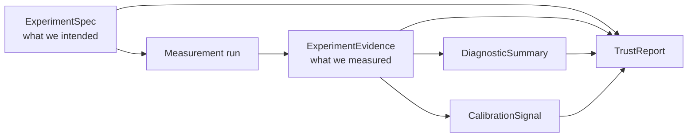
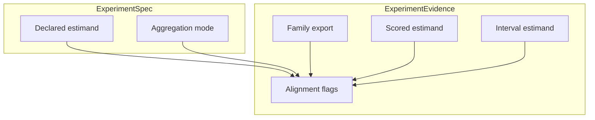
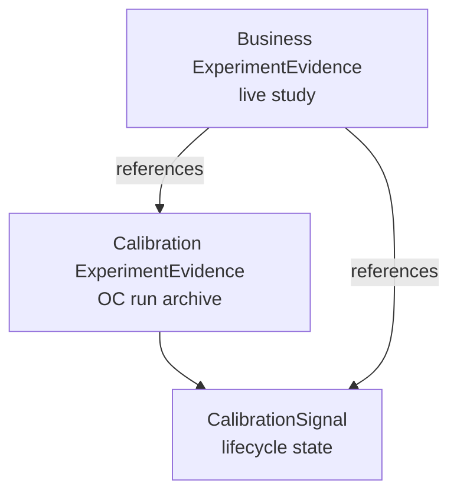
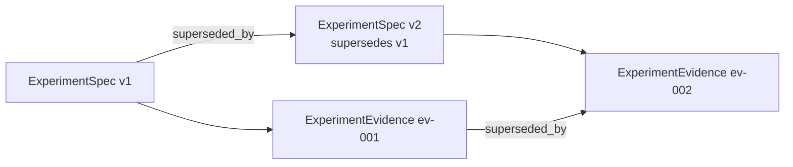

# Track B — ExperimentEvidence architecture 001

**Document ID:** TRACK-B-EXPERIMENT-EVIDENCE-001  
**Status:** architecture design — planning artifact only  
**Last updated:** 2026-05-20  
**Package version:** 0.2.1 (current implementation)  

**Related:** [`TRACK_B_EXPERIMENT_SPEC_001.md`](TRACK_B_EXPERIMENT_SPEC_001.md) · [`TRACK_B_ARCHITECTURE_PLAN.md`](TRACK_B_ARCHITECTURE_PLAN.md) · [`EXPERIMENTATION_PLATFORM_VISION.md`](EXPERIMENTATION_PLATFORM_VISION.md) · [`TRACK_A_COMPLETION_REVIEW_001.md`](TRACK_A_COMPLETION_REVIEW_001.md) · [`PHASE13_GOVERNANCE_DECISION_001.md`](PHASE13_GOVERNANCE_DECISION_001.md) · [`PHASE15_GOVERNANCE_DECISION_001.md`](PHASE15_GOVERNANCE_DECISION_001.md) · [`DEFERRED_WORK_REGISTRY.md`](DEFERRED_WORK_REGISTRY.md)

This document defines the **canonical evidence contract** produced after measurement by any experimentation modality. It is **architecture design only**. It does **not** design APIs, storage schemas, or implementation code.

---

## 1. What is ExperimentEvidence?

### Definition

**ExperimentEvidence** is the **portable, immutable-ish record of what was measured** — the unit of reuse across MIP, MMM, budget tools, agents, and calibration exchange. It is produced **after** a measurement run completes and **references** the ExperimentSpec version that governed the study design.



### Conceptual responsibility

| ExperimentEvidence **owns** | ExperimentEvidence **does not own** |
|------------------------------|-------------------------------------|
| Measurement outcomes (point, interval, paths) | Study design intent (→ ExperimentSpec) |
| Estimand alignment facts (family, scored, interval layers) | Final trust verdict (→ TrustReport) |
| Inference mode execution record | Aggregated diagnostic narrative (→ DiagnosticSummary) |
| Provenance and lineage | Nominal eligibility registry state (→ CalibrationSignal + governance) |
| Failure and skip metadata | Go/no-go business decision |
| Pointers to calibration archives | OC lifecycle state machine (→ CalibrationSignal) |
| Raw diagnostic inputs (review flags, pretrend outputs) | Human-readable trust narrative |
| Evidence tier and geometry context | Promotion or maturity labels |

### Platform-level scope

ExperimentEvidence is **not** a GeoX experiment card, bundle JSON, or recovery JSON file with a new name. It is the **modality-neutral evidence object** that those artifacts become **views of** during transition — one logical contract, multiple presentation layers ([`OPEN_INVESTIGATIONS.md`](OPEN_INVESTIGATIONS.md) — six overlapping artifact summary layers).

**Design direction:** consolidate overlapping export layers into **one evidence contract with multiple views** — not six competing sources of truth.

### Why it exists

| Problem | How ExperimentEvidence addresses it |
|---------|--------------------------------------|
| Evidence trapped in product exports | Portable object reusable by MMM, agents, and cross-study memory |
| Silent estimand drift | Records family export, interval type, and alignment flags vs spec |
| Calibration claims without archives | Requires pointers to Run 001 class docs — not green CI |
| Cross-modality lift confusion | Modality-specific facets under one contract shape |
| Trust conflated with measurement | Separates raw evidence from TrustReport narrative |

**Track A foundation:** [`TRACK_A_COMPLETION_REVIEW_001.md`](TRACK_A_COMPLETION_REVIEW_001.md) confirms OC archives, interval semantics (`placebo_band` vs CI), geometry classes, and inference trust boundaries are documented sufficiently to **draft** ExperimentEvidence for geo — with `lift_detection_calibrated: false` as default.

---

## 2. What evidence can be represented?

Every modality produces ExperimentEvidence through an **adapter** that populates shared conceptual facets plus modality-specific extensions. The contract shape is unified; content differs.

### Evidence facet model (conceptual)

| Facet | All modalities | Modality-specific extensions |
|-------|----------------|------------------------------|
| **Provenance** | study_id, spec_version, evidence_id, timestamps, package version | Adapter ID, execution environment |
| **Measurement config** | Estimator/test family, inference mode, config hash | Geo panel shape, A/B assignment hash, CLS exposure rule |
| **Estimand record** | Family export, alignment flags | Aggregation mode, scale, lag window |
| **Point estimate** | Primary estimand value + scale | Per-arm breakdowns (A/B), per-geo paths (geo) |
| **Uncertainty** | Interval/band + type + estimand | p-value, posterior interval, placebo p-value |
| **Diagnostic inputs** | Raw review outputs (by reference) | SRM stats (A/B), pretrend (DID), donor weights (SCM) |
| **Failure metadata** | Typed failures, partial runs | Geometry unsupported, NotImplementedError class |
| **Archive refs** | Links to OC/calibration docs | Run 001 class, Phase 11–15 archives |
| **Human review** | Waiver notes, override discipline | Expert-review export stamp |
| **Evidence tier** | smoke · characterization · production | n, seed policy, battery ID |

### GeoX

| Aspect | ExperimentEvidence content |
|--------|---------------------------|
| **Status today** | **Partially represented** — experiment card, bundle, evidence JSON, `est.results` |
| **Measurement outputs** | Point ATT / relative lift, path-level `y`, `y_hat`, `y_lower`, `y_upper`, SCM weights, counterfactuals |
| **Inference record** | UnitJackKnife, BRB, KFold, Placebo — with `path_interval_type`, `interval_estimand`, `interval_scale` |
| **Geometry** | `n_treated`, donor count, single- vs multi-treated class |
| **Alignment** | Declared vs family vs scored vs interval estimand flags |
| **Archive refs** | CALIBRATION_RUN_001/002, PHASE11–15 OC docs, skip reasons |
| **Governance** | Phase 13/15 boundaries encoded as facts — not verdicts |

**Transition mapping (today → target):**

| Today | ExperimentEvidence role |
|-------|--------------------------|
| Experiment card | Human-readable **view** |
| Bundle / evidence JSON | Structured **view** |
| `est.results` | Measurement outputs facet |
| Review flags (opt-in) | Diagnostic inputs facet |
| Implicit recovery estimand | Scored estimand field — **must become explicit** |
| No unified archive pointers | **Gap** — archive refs facet required |

### User-level A/B

| Aspect | ExperimentEvidence content |
|--------|---------------------------|
| **Status today** | **Not implemented** — Track C |
| **Measurement outputs** | Arm means, conversion rates, lift delta, sample sizes |
| **Inference record** | Frequentist test, Bayesian posterior, sequential test metadata (INV-024) |
| **Assignment integrity** | Observed vs expected assignment fractions — inputs to DiagnosticSummary (INV-025) |
| **Estimand record** | Δμ, conversion rate delta — **not** silent `relative_att_post` |
| **Evidence tier** | Smoke vs registered OC when Track C characterization exists |

A/B evidence must declare **intent-to-treat vs per-protocol** population in the estimand record, matching ExperimentSpec target population.

### Conversion Lift

| Aspect | ExperimentEvidence content |
|--------|---------------------------|
| **Status today** | **Not implemented** — Track C |
| **Measurement outputs** | Incremental conversions, incremental revenue, iROAS when computed |
| **Exposure semantics** | Eligible exposure count, ghost-ad arm outcomes (INV-026) |
| **Lag attribution** | Conversions within declared attribution window |
| **Inference record** | CLS-specific test or Bayesian lift model |
| **MMM bridge flags** | Whether transform to calibrated contribution is defined (DEF-012) — fact only, not transform execution |

Conversion Lift evidence is **not interchangeable** with geo ATT evidence — modality and estimand facets must differ even when numeric “lift” appears similar.

### Calibration studies

| Aspect | ExperimentEvidence content |
|--------|---------------------------|
| **Status today** | **Partial** — Run 001/002, Phase 11–15 archives exist as docs, not unified object |
| **Study purpose** | `calibration` — not business hypothesis |
| **Scored estimand** | Explicit B-like prediction target for recovery |
| **Scenario battery** | Null / positive / geometry cells, DGP ID, n, seeds |
| **OC metrics** | Coverage, FPR, power, width/effect ratio — per cell |
| **Failure analysis refs** | CALIBRATION_FAILURE_ANALYSIS_001, mechanism docs |
| **Config identity** | Estimator × inference mode hash (e.g. `SCM_UnitJackKnife`) |
| **Eligibility facts** | In/out of registry + skip reason — **mirrored from governance, not authoritative** |

Calibration ExperimentEvidence **feeds** CalibrationSignal construction; it does not **replace** the signal lifecycle object.

### Holdout studies

| Aspect | ExperimentEvidence content |
|--------|---------------------------|
| **Status today** | **Not implemented** — conceptual; DEF-012 |
| **Measurement outputs** | Holdout lift, model prediction error, replay incrementality |
| **Upstream refs** | Links to geo/CLS ExperimentEvidence IDs that informed the model |
| **Replay discipline** | Holdout cohort ID, replay window, model version |
| **Estimand record** | Calibrated contribution, holdout vs posterior delta |
| **Freshness** | Model version, evidence supersession chain |

Holdout evidence **consumes** upstream experiment evidence by reference — it does not duplicate full geo measurement tensors unless required for audit.

### Modality summary

| Modality | Producible today | Primary evidence facets |
|----------|------------------|-------------------------|
| GeoX | Yes (fragmented) | Paths, intervals, weights, geometry, archive refs |
| A/B | No | Arm stats, test outputs, SRM inputs |
| Conversion Lift | No | Incremental outcomes, exposure eligibility |
| Calibration | Partial (archives) | OC matrices, scored estimand, config identity |
| Holdout | No | Replay lift, upstream refs, model version |

---

## 3. Relationship to estimands

ExperimentEvidence is where **three of four estimand layers** become factual — the declared layer remains on ExperimentSpec.

### Four-layer model



| Layer | Source | ExperimentEvidence fields (conceptual) |
|-------|--------|----------------------------------------|
| **Declared** | ExperimentSpec (referenced) | `declared_estimand_ref`, `declared_aggregation_ref` — copied for audit immutability |
| **Family export** | Estimator/test output | `family_estimand`, `family_scale`, `export_path` |
| **Scored** | Validation/recovery | `scored_estimand` (today: `relative_att_post` / B), `scored_value` when calibration run |
| **Interval** | Inference mode | `interval_estimand`, `interval_scale`, `interval_type` |

### Alignment flags

ExperimentEvidence records **alignment verdicts as facts**, not TrustReport narratives:

| Flag (conceptual) | Meaning |
|-------------------|---------|
| `declared_family_aligned` | Family export matches spec primary estimand within declared aggregation |
| `declared_interval_aligned` | Interval estimand matches declared primary |
| `scored_interval_aligned` | Interval estimand matches scored estimand (recovery contract) |
| `scale_compatible` | Relative vs absolute vs count — no silent transform |
| `aggregation_declared` | Spec declared aggregation mode present — closes DEF-009 gap |

**Misalignment is recorded, not hidden.** TrustReport interprets flags; evidence stores them.

### Aggregation semantics (INV-003)

Geo evidence must record:

| Field (conceptual) | Value examples |
|--------------------|----------------|
| `aggregation_mode` | `cell_relative_a`, `pooled_path_b`, `cumulative_d` |
| `truth_reference` | When validation run: A-like truth scalar |
| `heterogeneity_context` | Homogeneous vs heterogeneous multi-treated flag |

On heterogeneous multi-treated panels, evidence may show small B vs A drift — flag as `aggregation_divergence_detected` without resolving governance (DEF-009).

### Secondary estimands

ExperimentEvidence may contain **multiple measurement records** — one primary, zero or more secondary:

| Record | Requirements |
|--------|--------------|
| Primary | Exactly one; drives TrustReport business claim |
| Secondary | Explicit `priority: secondary`; must not feed MMM unless flagged compatible |
| Diagnostic | Per-geo effects, cumulative DID — labeled non-primary |

### Default geo operational stack (today)

| Field | Operational value |
|-------|-------------------|
| `family_estimand` | `relative_att_post` (path mean) |
| `scored_estimand` | `relative_att_post` via `_path_relative_att` |
| `interval_estimand` | `relative_att_post` when aligned |
| `interval_scale` | `path_period_relative_mean` |

This stack is **geo-specific** — not the default for A/B or CLS adapters.

---

## 4. Relationship to inference

ExperimentEvidence records **which inference procedure ran** and **what uncertainty means** — governed by Phase 13/15 trust boundaries.

### Inference execution record

| Field (conceptual) | Description |
|--------------------|-------------|
| `inference_mode` | UnitJackKnife, BlockResidualBootstrap, KFold, Placebo, frequentist_test, … |
| `inference_config_hash` | Reproducibility anchor |
| `geometry_class_at_run` | single_treated, multi_treated, user_level, … |
| `run_status` | success, partial, failed, skipped |
| `failure_type` | Typed error class when failed |

### Uncertainty semantics

| Field (conceptual) | Description |
|--------------------|-------------|
| `point_estimate` | Scalar or structured primary point |
| `interval_lower` / `interval_upper` | Uncertainty bounds when present |
| `path_interval_type` | **`confidence_interval`** · **`placebo_band`** · **`credible_interval`** · **`none`** |
| `interval_estimand` | Quantity the band covers |
| `interval_scale` | e.g. `path_period_relative_mean` |
| `ci_via_inversion` | Boolean — relevant for Placebo (Phase 15) |
| `significance_at_alpha` | Optional; **not** synonymous with lift detection |
| `lift_detection_calibrated` | **`false` by default** — explicit `true` only with archived positive OC |

### Phase 13/15 governed modes (geo)

| Mode | Evidence requirements | Trust boundary (fact on evidence) |
|------|----------------------|-----------------------------------|
| **UnitJackKnife** | CI aligned to `relative_att_post` | `null_monitor_scope: eligible_config_only` |
| **BRB** | CI aligned; post Run 002 bound fix | `null_viable: true`, `positive_oc_passed: false` |
| **KFold** | Runnable multi-treated post-fix; OC fails | `trusted_for_calibration: false`, `geometry_note: runnable_not_trusted` |
| **Placebo** | **`placebo_band` required** on success | `single_treated_only`, `uncertainty_semantics: placebo_null_envelope` |
| **DID** | Point path; relative CI unsupported | `interval_available: false` for relative ATT |

**Export discipline:** Evidence must never label `placebo_band` as `confidence_interval` ([`PHASE15_GOVERNANCE_DECISION_001.md`](PHASE15_GOVERNANCE_DECISION_001.md) §6).

### Inference vs ExperimentSpec measurement plan

| Situation | Evidence behavior |
|-----------|-------------------|
| Mode in spec allowed list | Record normally |
| Mode outside plan | Record with `plan_violation: true` — TrustReport input |
| Mode fails on geometry | `run_status: failed`, typed failure — not silent fallback |
| Mode skipped (ineligible) | `skip_reason` from registry mirror (e.g. `kfold_multi_treated_unsupported_run001`) |

Inference semantics tests ([`tests/test_inference_result_semantics.py`](../tests/test_inference_result_semantics.py)) inform the contract — this document does not change them.

---

## 5. Relationship to diagnostics

ExperimentEvidence and DiagnosticSummary are **adjacent, not duplicate**.

### Division of responsibility

| Concern | ExperimentEvidence | DiagnosticSummary |
|---------|-------------------|-------------------|
| Raw pretrend statistic | Stores value + pass/fail if computed | Interprets for reviewer narrative |
| SCM donor weights | Reference or embedded summary stats | Health assessment, dispersion warnings |
| Review flags from `build_estimator_review` | Raw flag objects / IDs | Aggregated checklist, severity ordering |
| Geometry context | `n_treated`, `n_donors`, panel shape | Links to INV-007 / Phase 11 context |
| SRM p-value (future A/B) | Raw observed vs expected counts | Assignment integrity verdict |
| Placebo band width | Numeric facet on uncertainty record | Diagnostic comparison to point |

**Rule:** ExperimentEvidence holds **measurement-adjacent diagnostic inputs** produced during the same run. DiagnosticSummary **aggregates and narrates** them for human review — it does not re-run estimation.

### Diagnostic input facets (conceptual)

| Facet | Examples |
|-------|----------|
| `pretrend` | DID parallel trends result, waiver flag |
| `balance` | Pre-period standardized differences (A/B future) |
| `donor_health` | Weight entropy, max weight, collinearity proxy |
| `residual_drift` | Post-period fit degradation |
| `interference_signals` | Spillover stress from DGP diagnostics — estimator backing deferred (DEF-004) |
| `data_quality` | Missingness rate, stale data flag |
| `unsupported_geometry` | Placebo on multi-treated — execution failure fact |

### What evidence excludes

- Expert-review **checklist narrative** (→ DiagnosticSummary)  
- **Top warnings** selection for business reader (→ TrustReport highlights from DiagnosticSummary)  
- **Go/no-go** recommendation  

GeoX today: review flags opt-in → evidence should record **whether diagnostics were requested** and **raw outputs when present**, so DiagnosticSummary can be built deterministically later.

---

## 6. Relationship to CalibrationSignal

CalibrationSignal is the **lifecycle state of calibration evidence** for a config × scenario × estimand. ExperimentEvidence **supplies inputs**; it does not own the signal.

### Separation



| Object | Role |
|--------|------|
| **Calibration ExperimentEvidence** | Immutable record of a calibration/OC run (Run 001 class) |
| **Business ExperimentEvidence** | Live study measurement; **references** applicable CalibrationSignal by config |
| **CalibrationSignal** | Composed state: recovery_passed, null_oc_passed, positive_oc_failed, eligibility, usage_boundary |

### What business evidence references

| Reference (conceptual) | Purpose |
|------------------------|---------|
| `calibration_signal_id` | Link to composed signal for estimator × inference × estimand |
| `calibration_archive_refs` | Doc IDs: CALIBRATION_RUN_001, PHASE11, etc. |
| `eligibility_mirror` | In/out + skip reason — **read-only copy** of registry |
| `usage_boundary_mirror` | e.g. `null_monitor_only` for SCM UnitJackKnife |
| `scenario_class_coverage` | Which OC scenarios archived (null vs positive) |

### Critical rules (Phase 13)

| Rule | ExperimentEvidence encoding |
|------|----------------------------|
| Null OC pass ≠ lift detection | `lift_detection_calibrated: false` unless explicit positive OC archive |
| Separate scenario classes | `null_oc_archived`, `positive_oc_archived` as independent booleans |
| Eligibility not computed in evidence | Mirror only — authoritative source remains governance + code registry |
| SCM null monitor only | `usage_boundary: null_monitor_only` on eligible config refs |

Calibration ExperimentEvidence from Run 001/002 **is** the primary artifact CalibrationSignal aggregates — not the business study export alone.

---

## 7. Relationship to TrustReport

TrustReport is the **reviewer-facing trust narrative**. ExperimentEvidence is its **primary measurement input** — not its output.

### Composition

```
ExperimentSpec (declared claim)
    + ExperimentEvidence (measurement + alignment facts)
    + DiagnosticSummary (quality narrative)
    + CalibrationSignal (calibration scope)
    + DEFERRED_WORK_REGISTRY (known limits)
    → TrustReport (outcome taxonomy + narrative)
```

### What TrustReport derives from evidence

| TrustReport element | Evidence inputs |
|-------------------|-----------------|
| Estimand alignment verdict | Alignment flags, interval type, scale flags |
| `supported_positive` / `supported_negative` | Point + CI excluding zero — **only if** alignment + calibration scope permit |
| `inconclusive` | Zero power contexts, wide intervals, insufficient precision — **not** “no effect” |
| `incompatible_estimand` | Alignment flags false; absolute vs relative; placebo_band treated as CI |
| `calibration_unavailable` | Missing archive refs; config not characterized |
| `underpowered` | Evidence precision facets + spec MDE (feasibility) |
| `stale` | Evidence lineage timestamps vs supersession chain |

### What evidence must not contain

| Excluded | Owner |
|----------|-------|
| `supported_positive` outcome | TrustReport |
| DEF-xxx narrative | TrustReport (links only in evidence as optional refs) |
| Human governance footer | TrustReport |
| Aggregated “readiness” score | TrustReport inputs — readiness demoted from primary truth |

**Phase 15 rule:** Placebo positive coverage = 1 must **not** produce `supported_positive` in TrustReport — evidence records coverage fact; TrustReport applies policy.

### MIP / experiment card role

Experiment cards become **human-readable views** of DiagnosticSummary + selective evidence facets — **not** the canonical trust layer. TrustReport supersedes card conclusions for honesty ([`TRACK_B_ARCHITECTURE_PLAN.md`](TRACK_B_ARCHITECTURE_PLAN.md) §7).

---

## 8. Versioning and lineage

ExperimentEvidence is **immutable per evidence_id**. Corrections produce **new evidence objects**, not in-place mutation.

### Identity and versioning

| Field (conceptual) | Role |
|--------------------|------|
| `evidence_id` | Platform-unique evidence record ID |
| `evidence_version` | Monotonic if same run re-exported with fixed semantics |
| `study_id` | Links to ExperimentSpec |
| `spec_version` | **Required** — which design contract governed this run |
| `measurement_run_id` | Orchestration/runner ID |
| `created_at` | Evidence record timestamp |
| `package_version` | `panel_exp` version at measurement |
| `adapter_version` | GeoX/A/B/CLS adapter version |

### Lineage chain



| Lineage field (conceptual) | Role |
|----------------------------|------|
| `supersedes_evidence_id` | Prior evidence this run replaces (rerun, fix) |
| `superseded_by_evidence_id` | Forward link when known |
| `derived_from_evidence_ids` | Holdout replay, MMM calibration inputs |
| `calibration_archive_generation` | Which OC archive generation applies |
| `freshness_expires_at` | Optional policy boundary for TrustReport stale |

### Immutability rules

| Event | Behavior |
|-------|----------|
| Re-run with same spec | New `evidence_id`; optional `supersedes` link |
| Spec amendment mid-study | New spec version; evidence must cite version active at run start |
| Export format change | New `evidence_version`; same measurement_run_id if data unchanged |
| Waiver added post-hoc | New evidence record or attached **amendment facet** with audit — never silent edit |

### Audit requirements

- Every evidence record must be **reconstructible**: spec_version + package_version + config_hash + seed policy (when applicable).  
- Calibration evidence must cite **battery ID, n, seeds, scenario cells** per INV-017 archive conventions.  
- Business evidence must cite **which CalibrationSignal** scoped the config — not imply package-wide calibration.

---

## 9. Evidence compatibility rules

Rules for producing, consuming, and transitioning evidence across modalities and downstream systems.

### GeoX / MIP compatibility

| Rule | Rationale |
|------|-----------|
| **View layer, not rewrite** | Cards/bundles become views of ExperimentEvidence during transition |
| **Backward compatible exports** | Existing JSON valid until adapters populate canonical evidence |
| **Explicit estimand fields** | Close DEF-009/014 — no implicit `relative_att_post` only in narrative |
| **Archive refs mandatory for calibration claims** | Pointers to Run 001 class docs when config characterized |
| **Skip reasons preserved** | Mirror registry skip reasons on ineligible configs |
| **No maturity promotion via evidence** | Evidence does not set `production_safe` or expand eligibility |
| **Phase 13/15 facts encoded** | null_monitor_only, placebo_band, lift_detection_calibrated defaults |

### Cross-modality rules

| Rule | Rationale |
|------|-----------|
| **Same contract shape, different facets** | Unified taxonomy; modality adapters fill extensions |
| **No silent estimand mapping** | Geo relative ATT ≠ A/B conversion delta ≠ CLS incremental |
| **Modality field required** | `modality: geo | ab | conversion_lift | calibration | holdout` |
| **Separate CalibrationSignal paths** | A/B OC independent of geo Run 001 when Track C matures |
| **TrustReport cross-modality** | Evidence supplies facts; TrustReport blocks false equivalence |

### MMM consumption rules

| Rule | Rationale |
|------|-----------|
| **Raw lift ≠ MMM input alone** | Requires experiment-to-MMM resolver (DEF-012, INV-023) |
| **`mmm_compatible` flag on evidence** | Explicit transform defined + alignment true |
| **Calibration archives required** | CalibrationSignal refs, not point estimate only |
| **`incompatible_estimand` when transform missing** | Flag on evidence; TrustReport blocks feed |
| **Holdout evidence chains upstream refs** | Lineage to geo/CLS evidence IDs |

### Calibration vs business evidence

| Rule | Rationale |
|------|-----------|
| **Separate evidence_id namespace recommended** | Calibration runs ≠ live studies |
| **Business evidence references calibration** | By CalibrationSignal ID + archive refs |
| **Calibration evidence never implies business lift** | `study_purpose: calibration` on linked spec |
| **OC metrics stay on calibration evidence** | Business evidence carries summary mirror only |

### Evidence tier policy

| Tier | Typical use | TrustReport default |
|------|-------------|---------------------|
| **smoke** | Dev/CI | `calibration_unavailable` for calibration claims |
| **characterization** | Phase 11-style n=30 matrices | Expert-review scope only |
| **production** | n≥100 Run 001 class | Eligible for null-monitor scope when config eligible |

Evidence tier is **declared on the record** — not inferred from product context.

### Consolidation of overlapping artifacts

| Today (six layers) | Target role |
|--------------------|-------------|
| Experiment card | DiagnosticSummary + TrustReport **view** |
| Bundle | Structured export **view** |
| Evidence JSON | ExperimentEvidence **view** |
| Recovery JSON | Calibration ExperimentEvidence **view** |
| Readiness assessment | TrustReport **input** — not canonical |
| OC archive docs | Calibration archive **refs** on calibration evidence |

One logical ExperimentEvidence; multiple views — resolves OPEN_INVESTIGATIONS artifact-layer investigation.

---

## 10. Non-goals

This document **does not**:

| Non-goal | Notes |
|----------|-------|
| **Design APIs** | No REST, gRPC, SDK, or export endpoints |
| **Design storage** | No JSON schema, protobuf, database DDL, or blob layout |
| **Implement code** | No modules, adapters, or migrations |
| **Modify GeoX exports** | Transition mapping is conceptual |
| **Change governance** | Eligibility, maturity, release gates unchanged |
| **Finalize field names or enums** | Deferred to implementation spec (Track B B1+) |
| **Replace DiagnosticSummary, CalibrationSignal, or TrustReport** | Companion architecture docs |
| **Close DEF or INV items** | Registry entries remain open |
| **Certify estimators or inference** | Phase 13/15 boundaries preserved |
| **Assign `production_safe`** | Frozen policy |
| **Expand `NOMINAL_CALIBRATION_ELIGIBLE_CONFIGS`** | Remains `SCM_UnitJackKnife` only |
| **Implement MMM resolver** | DEF-012 / INV-023 future work |

This document **does**:

- Define **platform-level** ExperimentEvidence purpose and facet model  
- Specify **modality representability** (geo, A/B, CLS, calibration, holdout)  
- Clarify relationships to **estimands, inference, diagnostics, CalibrationSignal, TrustReport**  
- Establish **versioning, lineage, and immutability** discipline  
- State **compatibility rules** for GeoX, cross-modality, and MMM consumption  
- Enable **DiagnosticSummary architecture** as the next contract doc  

---

## Appendix A — Conceptual required facets (not a schema)

Minimum facet groups for a **complete** business geo ExperimentEvidence record:

| Facet group | Required fields (conceptual) |
|-------------|------------------------------|
| **Identity** | evidence_id, study_id, spec_version, modality, created_at, package_version |
| **Config** | estimator_family, inference_mode, config_hash, geometry_class |
| **Estimand** | declared ref, family export, scored estimand, interval estimand, alignment flags |
| **Measurement** | point_estimate, interval bounds, path_interval_type, interval_scale |
| **Inference policy** | lift_detection_calibrated (default false), skip_reason if skipped |
| **Provenance** | measurement_run_id, adapter_id |
| **Calibration refs** | calibration_signal_id or archive_refs, usage_boundary_mirror |
| **Tier** | evidence_tier |

Calibration and holdout records extend with battery ID, OC metrics, upstream evidence refs, respectively.

---

## Appendix B — Governance cross-links

| Source | ExperimentEvidence implication |
|--------|-------------------------------|
| Phase 13 | Geometry, alignment, inference mode facts; eligibility mirror only |
| Phase 15 | placebo_band, single_treated_only, zero power facts |
| INV-003 | Aggregation mode, divergence flags |
| INV-017 | Archive refs, evidence tier conventions |
| TRACK_A_COMPLETION_REVIEW_001 | Draft-ready; interval type discipline required |
| DEF-009, DEF-011, DEF-012 | Alignment, registry, MMM compatibility flags |
| DEF-018 | scale_compatible, incompatible_estimand inputs |

---

## Appendix C — Success criterion

**Architecture achieved when:**

1. A reader can answer **what ExperimentEvidence is** and how it differs from ExperimentSpec, DiagnosticSummary, CalibrationSignal, and TrustReport.  
2. **Each modality** has defined representable facets — geo as reference, others as future adapters.  
3. **Estimand and inference relationships** encode Phase 13/15 trust boundaries as facts, not verdicts.  
4. **Versioning and lineage** support stale/superseded TrustReport outcomes.  
5. **Compatibility rules** preserve GeoX/MIP transition without six competing truths.  
6. Implementers can proceed to **DiagnosticSummary architecture** without re-deciding evidence scope.

**Suggested next artifact:** `TRACK_B_DIAGNOSTIC_SUMMARY_001.md` (companion contract) or Track B B1 geo evidence adapter spec.

---

*Planning artifact TRACK-B-EXPERIMENT-EVIDENCE-001. Architecture design only — no APIs, storage, or code.*
