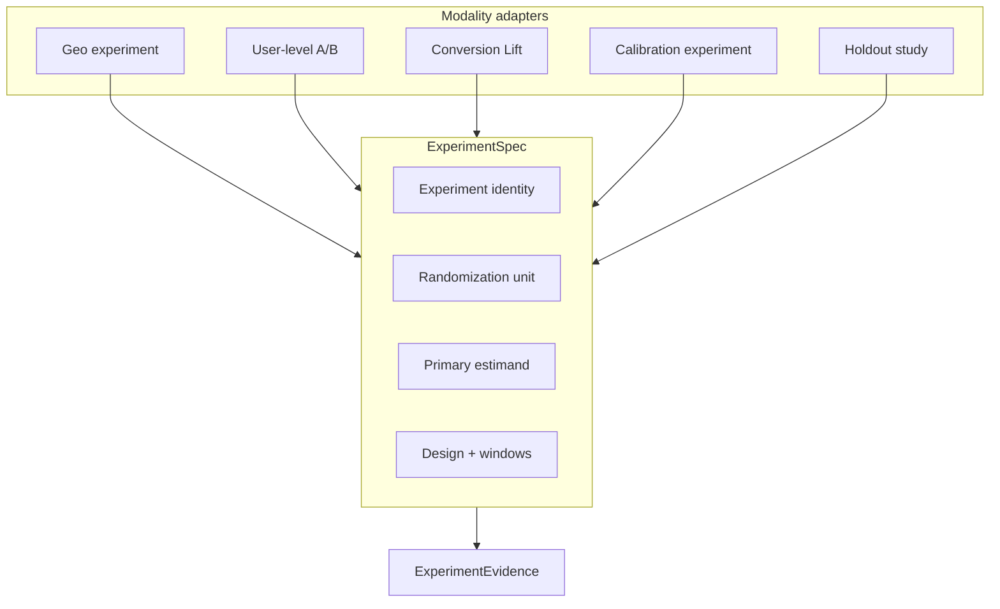
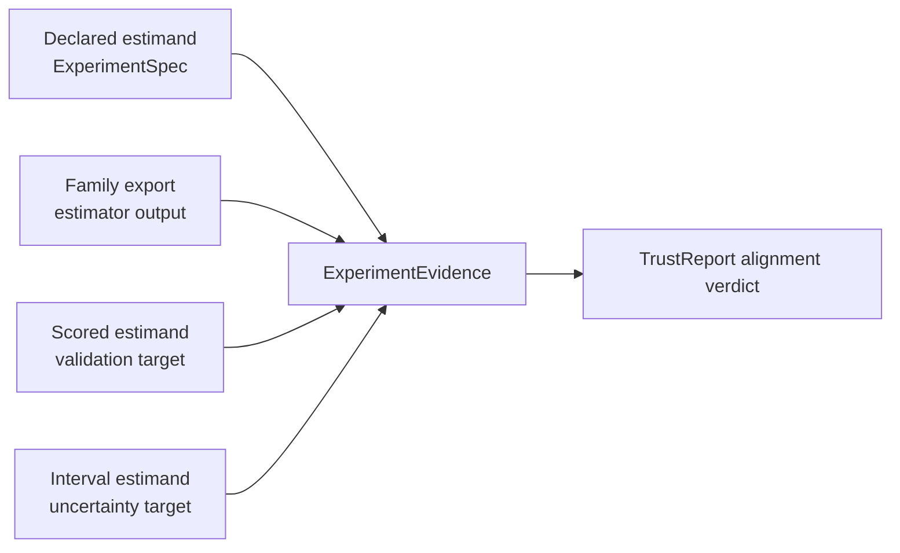
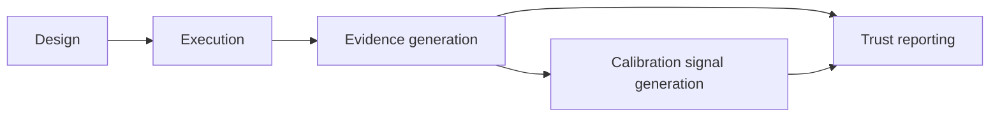

# Track B — ExperimentSpec architecture 001

**Document ID:** TRACK-B-EXPERIMENT-SPEC-001  
**Status:** architecture design — planning artifact only  
**Last updated:** 2026-05-20  
**Package version:** 0.2.1 (current implementation)  

**Related:** [`TRACK_B_ARCHITECTURE_PLAN.md`](TRACK_B_ARCHITECTURE_PLAN.md) · [`EXPERIMENTATION_PLATFORM_VISION.md`](EXPERIMENTATION_PLATFORM_VISION.md) · [`TRACK_A_COMPLETION_REVIEW_001.md`](TRACK_A_COMPLETION_REVIEW_001.md) · [`PHASE13_GOVERNANCE_DECISION_001.md`](PHASE13_GOVERNANCE_DECISION_001.md) · [`PHASE15_GOVERNANCE_DECISION_001.md`](PHASE15_GOVERNANCE_DECISION_001.md) · [`ROADMAP_V4.md`](ROADMAP_V4.md) · [`DEFERRED_WORK_REGISTRY.md`](DEFERRED_WORK_REGISTRY.md)

This document defines the **canonical experiment specification concept** — the declarative contract for what a study is **before** any measurement runs. It is **architecture design only**. It does **not** implement code, schemas, APIs, GeoX changes, or governance policy changes.

---

## 1. Purpose

### Why ExperimentSpec exists

Experimentation platforms fail at scale when each modality (geo tests, A/B tests, conversion lift, MMM holdouts) carries its own implicit study definition. Today, GeoX encodes treatment geos, dates, and panel shape in product configuration; recovery scoring assumes `relative_att_post` without always declaring it; and future modalities would repeat the same ambiguity with different field names.

**ExperimentSpec exists to:**

| Problem | How ExperimentSpec addresses it |
|---------|--------------------------------|
| **Silent estimand consensus** | Forces explicit primary and secondary estimands before measurement |
| **Cross-modality false equivalence** | Separates randomization unit, treatment definition, and estimand — geo ATT ≠ user conversion lift |
| **Evidence that cannot compose** | Provides a stable identity and design contract that `ExperimentEvidence`, `DiagnosticSummary`, `CalibrationSignal`, and `TrustReport` reference |
| **Governance without product coupling** | Records measurement plan boundaries (allowed estimators, inference modes, geometry classes) without executing them |
| **MMM and adaptive workflows** | Gives holdout/replay and calibration experiments the same declarative shell as live geo or A/B studies |

ExperimentSpec is the **first contract** in the Track B stack ([`TRACK_B_ARCHITECTURE_PLAN.md`](TRACK_B_ARCHITECTURE_PLAN.md) §3). It owns **intent** — not outcomes, not trust verdicts, not calibration results.

### Platform-level scope

ExperimentSpec is **not** a GeoX panel configuration object with extra fields. It is the **modality-neutral study declaration** that GeoX, future A/B tooling, conversion lift pipelines, MMM calibration replay, and conversational design assistants must all populate — each through modality-specific adapters, one shared conceptual shape.

**Track A foundation:** [`TRACK_A_COMPLETION_REVIEW_001.md`](TRACK_A_COMPLETION_REVIEW_001.md) confirms governed trust boundaries (Phase 13/15), estimand semantics (INV-003), and geometry classes are documented sufficiently to **draft** ExperimentSpec for geo while reserving formal estimand registry work (DEF-011) for a later artifact.

---

## 2. Unified experiment taxonomy

All platform experiments fall into a **shared taxonomy**. Modality determines which fields are required and which adapters apply; the conceptual object is the same.

### Geo experiment

| Aspect | Description |
|--------|-------------|
| **Definition** | Causal study where **markets, geos, or regions** are assigned to treatment or control; outcomes observed on a panel over pre/post windows |
| **Randomization unit** | Geo / market / region (possibly nested in hierarchy) |
| **Typical estimands** | `relative_att_post`, ATT, absolute incremental revenue on geo panel |
| **Platform status today** | **Implemented** — `panel_exp` measurement; design often implicit in GeoX/MIP config |
| **Governance context** | Phase 13/15 bound inference modes, geometry classes (single- vs multi-treated), aggregation semantics (INV-003) |

Geo experiments are the **reference adapter** for Track B because Track A characterized their measurement instruments. ExperimentSpec must make implicit geo contracts **explicit** (estimand, aggregation mode, geometry class) without changing GeoX behavior during transition.

### User-level A/B

| Aspect | Description |
|--------|-------------|
| **Definition** | Randomized experiment on **users, sessions, or devices** with treatment and control arms; outcome measured at user or session granularity |
| **Randomization unit** | User / session / device |
| **Typical estimands** | Δμ (mean shift), absolute lift, conversion rate delta, revenue per user |
| **Platform status today** | **Not implemented** — Track C; contracts first in Track B |
| **Governance context** | INV-020 (unified estimand registry), INV-025 (SRM / assignment integrity), INV-024 (sequential testing) |

A/B specs must **not** silently map business “lift” to geo `relative_att_post`. Primary estimand and outcome scale are mandatory.

### Conversion Lift

| Aspect | Description |
|--------|-------------|
| **Definition** | User-randomized incrementality study measuring **incremental conversions or revenue** attributable to ad exposure, often with ghost-ad or exposure-opportunity logging |
| **Randomization unit** | User + **exposure opportunity** (not merely user assignment) |
| **Typical estimands** | Incremental conversions, incremental revenue, iROAS (when bridged to MMM) |
| **Platform status today** | **Not implemented** — Track C; INV-026 exposure semantics |
| **Governance context** | External methodologies (e.g. industry conversion lift practice) inform **semantics only** — not certification without OC archives |

Conversion Lift is distinct from simple A/B: eligibility for incrementality depends on **exposure logging contract**, not assignment alone.

### Calibration experiment

| Aspect | Description |
|--------|-------------|
| **Definition** | Study whose **primary purpose** is to produce or refresh **calibration evidence** for a measurement configuration — recovery battery, production-tier OC run, or characterization matrix — rather than to answer a one-off business hypothesis |
| **Randomization unit** | Inherited from underlying modality (geo panel, synthetic DGP, or replay cohort) |
| **Typical estimands** | Same as underlying instrument (e.g. `relative_att_post` for geo recovery) plus explicit **scored estimand** for validation |
| **Platform status today** | **Partial** — Run 001/002 and Phase 11–15 archives exist; not yet unified under ExperimentSpec |
| **Governance context** | INV-017 archive lifecycle; Phase 13 eligibility frozen at `SCM_UnitJackKnife` |

Calibration experiments share the ExperimentSpec shell but declare **`study_purpose: calibration`** (conceptual) so TrustReport and CalibrationSignal do not treat them as business lift claims.

### Holdout study

| Aspect | Description |
|--------|-------------|
| **Definition** | **Withheld population or cohort** used to validate model predictions, MMM incrementality, or long-run counterfactual claims — may be geo holdout, user holdout, or aggregate replay window |
| **Randomization unit** | Cohort / holdout cell / aggregate replay unit |
| **Typical estimands** | Holdout lift vs model prediction, calibrated contribution, posterior incrementality |
| **Platform status today** | **Not implemented** as first-class modality — conceptual; DEF-012 MMM bridge |
| **Governance context** | Freshness rules, replay discipline, `incompatible_estimand` when MMM transform missing |

Holdout studies bridge **live experimentation** and **MMM calibration**. ExperimentSpec records holdout assignment rules and which upstream experiments inform the replay.

### Taxonomy summary

| Modality | Randomization unit | Primary use | Track |
|----------|-------------------|-------------|-------|
| Geo experiment | Geo / market | Market-level causal measurement | A (implemented) + B |
| User-level A/B | User / session | Product/feature lift | C (future) |
| Conversion Lift | User + exposure opportunity | Ad incrementality | C (future) |
| Calibration experiment | Modality-dependent | OC / recovery evidence | A archives → B |
| Holdout study | Cohort / holdout | MMM validation / replay | C + DEF-012 |

---

## 3. Core concepts

These concepts appear in **every** ExperimentSpec regardless of modality. They are defined at platform level; adapters supply modality-specific detail.

### Experiment identity

Stable, auditable identification of the study **design intent**, not a single measurement run.

| Concept | Role |
|---------|------|
| **Study ID** | Platform-unique identifier across modalities |
| **Version** | Immutable version of the spec; supersession links to prior versions |
| **Modality** | One of: geo, ab, conversion_lift, calibration, holdout (conceptual enum — not finalized here) |
| **Study purpose** | Business hypothesis vs calibration vs holdout validation |
| **Freshness / supersession** | Prior studies this spec replaces, extends, or conflicts with |

Identity enables experiment memory, calibration exchange, and TrustReport stale/superseded outcomes without conflating reruns with new designs.

### Randomization unit

The **unit at which treatment is assigned** — the foundation of causal interpretation and DiagnosticSummary checks.

| Unit type | Modalities | Review hooks |
|-----------|------------|--------------|
| Geo / market | Geo experiments | Panel geometry, interference, donor pool |
| User / session | A/B | Assignment integrity, SRM (INV-025) |
| Exposure opportunity | Conversion Lift | Eligibility logging (INV-026) |
| Cohort / holdout | Holdout, MMM replay | Holdout governance, replay rules |
| Synthetic panel cell | Calibration on DGP | Scenario battery ID, not business population |

**Rule:** Randomization unit is **declared**, not inferred from outcome granularity. A geo panel with user-level outcomes still randomizes at **geo**.

### Treatment definition

What **treatment** means for assigned units — intervention, exposure rule, or holdout exclusion.

| Element | Description |
|---------|-------------|
| **Treatment arms** | Named arms with assignment fractions or explicit unit lists |
| **Intervention description** | Human-readable + structured tags (spend change, product launch, ad exposure rule) |
| **Assignment mechanism** | Random, stratified, matched market, synthetic DGP parameter |
| **Treatment start / end** | Calendar or relative period boundaries |
| **Exclusions** | Units ineligible for treatment or analysis |

For geo: treated geos, treatment dates, spend or policy change. For conversion lift: exposure rule and ghost-ad eligibility. For holdout: withheld cohort definition.

### Control definition

What **counterfactual or comparison** population supports the estimand.

| Element | Description |
|---------|-------------|
| **Control arms** | Donor geos, control users, ghost-ad holdouts, or model baseline |
| **Donor / control selection rule** | Algorithmic (SCM weights), simple control mean, synthetic control pool |
| **Pre-period requirements** | Minimum pre-treatment windows (e.g. DID pretrend discipline) |
| **Control integrity constraints** | No contamination, minimum control count (e.g. Placebo ≥5 controls — Phase 15) |

Control definition is **estimand-relative**: SCM donor pool ≠ A/B control arm ≠ MMM holdout baseline, but each must be declared.

### Primary estimand

The **single business-facing quantity** the study is designed to estimate — the anchor for TrustReport and MMM compatibility.

Examples by modality:

| Modality | Example primary estimands |
|----------|---------------------------|
| Geo | `relative_att_post`, geo-level ATT |
| A/B | Conversion rate delta, revenue per user lift |
| Conversion Lift | Incremental conversions, incremental revenue |
| Holdout / MMM | Calibrated contribution, holdout lift vs model |
| Calibration | Declared estimand under test (often `relative_att_post` for geo recovery) |

**Primary estimand is mandatory.** Missing primary estimand → spec incomplete → downstream `incompatible_estimand` in TrustReport (DEF-018).

### Secondary estimands

Additional quantities estimated or reported **without** changing the primary contract.

| Role | Examples |
|------|----------|
| **Diagnostic** | Per-geo effects, cumulative absolute ATT (DID), path-level means |
| **Exploratory** | Subgroup lifts, lag windows, iROAS when primary is incremental conversions |
| **Validation** | Scored estimand B vs canonical truth A (INV-003) — for calibration specs |

Secondary estimands must **not** silently become primary in ExperimentEvidence or product copy. Each carries explicit **priority: secondary** and optional **compatibility: non_mmm** flags (conceptual).

### Analysis window

Time boundaries for **outcome measurement and inference**, distinct from treatment duration.

| Window | Description |
|--------|-------------|
| **Pre-period** | Baseline for balance, pretrend, donor fit |
| **Post-period** | Primary inference window for primary estimand |
| **Lag / attribution window** | Conversion lift: conversions attributed within N days of exposure |
| **Warm-up / cool-down** | Excluded periods adjacent to treatment switch |

Analysis window attaches to **estimands**: primary estimand names which windows apply. DID pretrend uses pre-period; `relative_att_post` uses post path mean per INV-003 operational stack.

### Target population

The **population of inference** — who or what the estimand generalizes to.

| Modality | Target population examples |
|----------|---------------------------|
| Geo | Treated geos, national rollout extrapolation (if declared), panel universe |
| A/B | All assigned users, intent-to-treat vs per-protocol (must declare) |
| Conversion Lift | Exposed-eligible users, not all randomized users |
| Holdout | Holdout cohort representing future spend or national scale |

Target population interacts with **feasibility constraints** (DEF-010): MDE and power assumptions apply to this population, not an implicit superset.

---

## 4. Required fields

Conceptual field inventory only — **no schema implementation**, no JSON/protobuf names finalized. Fields group by responsibility; implementers map groups to storage later.

### Identity and versioning

| Field (conceptual) | Required | Description |
|--------------------|----------|-------------|
| `study_id` | Yes | Platform-unique study identifier |
| `spec_version` | Yes | Monotonic spec version |
| `modality` | Yes | Geo, ab, conversion_lift, calibration, holdout |
| `study_purpose` | Yes | Business, calibration, holdout_validation, feasibility_probe |
| `created_at` / `author` | Yes | Audit metadata |
| `supersedes` / `conflicts_with` | No | Links to prior spec versions or overlapping studies |
| `tags` / `portfolio_id` | No | Organizational grouping |

### Design and assignment

| Field (conceptual) | Required | Description |
|--------------------|----------|-------------|
| `randomization_unit` | Yes | Unit type + granularity |
| `treatment_definition` | Yes | Arms, intervention, assignment rule |
| `control_definition` | Yes | Control arms, donor rules, baselines |
| `assignment_mechanism` | Yes | Random, stratified, matched, synthetic |
| `treatment_window` | Yes | Start/end of intervention |
| `analysis_windows` | Yes | Pre, post, lag windows tied to estimands |
| `target_population` | Yes | Population of inference |
| `interference_assumptions` | Yes | SUTVA level, spillover review flags (DEF-004) |
| `geometry_class` | Conditional | Single-treated vs multi-treated vs user-count — **required for geo** (Phase 13/15) |

### Estimand declaration

| Field (conceptual) | Required | Description |
|--------------------|----------|-------------|
| `primary_estimand` | Yes | Registry reference or structured estimand object |
| `primary_estimand_aggregation` | Yes | Pooled path, cell mean, unit-level — INV-003 semantics |
| `secondary_estimands` | No | List with explicit secondary priority |
| `outcome_definition` | Yes | Metric, scale (relative, absolute, count, currency) |
| `estimand_time_rule` | Yes | How time aggregates (path mean, post mean, cumulative) |
| `transformations_allowed` | No | CUPED, variance reduction — only if contract preserved (INV-022) |

### Measurement plan (declarative only)

| Field (conceptual) | Required | Description |
|--------------------|----------|-------------|
| `measurement_families_allowed` | Conditional | Estimator families permitted (SCM, TBR, DID, …) |
| `inference_modes_allowed` | Conditional | UnitJackKnife, BRB, KFold, Placebo, … with geometry constraints |
| `inference_geometry_constraints` | Conditional | e.g. Placebo: single_treated_only (Phase 15) |
| `maturity_ceiling` | No | Max catalog maturity permitted for this study |
| `waiver_requirements` | No | Pretrend override, expert-review export discipline |
| `calibration_scenario_ref` | Conditional | For calibration specs: DGP / battery ID |

### Feasibility and constraints

| Field (conceptual) | Required | Description |
|--------------------|----------|-------------|
| `mde_target` | No | Minimum detectable effect for planning |
| `power_assumptions` | No | Alpha, baseline variance, duration |
| `budget_constraints` | No | Spend or sample limits |
| `minimum_duration` | No | Governance minimum before readout |
| `feasibility_assessment_ref` | No | Link to future feasibility engine output (DEF-010) |

### Compatibility and downstream use

| Field (conceptual) | Required | Description |
|--------------------|----------|-------------|
| `mmm_calibration_intent` | No | Whether evidence may feed MMM; requires transform contract (DEF-012) |
| `trust_report_profile` | No | Intended business action (launch, budget shift, model refresh) |
| `export_discipline` | Conditional | e.g. placebo_band vs confidence_interval labeling (Phase 15) |

### Explicit non-fields

ExperimentSpec does **not** contain: point estimates, intervals, p-values, calibration pass/fail, TrustReport outcomes, or registry eligibility state. Those belong to downstream contracts.

---

## 5. Estimand contract

### How estimands attach to experiments

Every ExperimentSpec **binds** one primary estimand (and optional secondaries) through a **declarative contract** with four layers — aligned with Track A operational semantics ([`PHASE12_INV003_AGGREGATION_SEMANTICS_001.md`](PHASE12_INV003_AGGREGATION_SEMANTICS_001.md)):

| Layer | Owner | Meaning |
|-------|-------|---------|
| **Declared estimand** | ExperimentSpec | What the study claims to measure for business decisions |
| **Family export** | ExperimentEvidence (from measurement) | What the chosen estimator/test actually estimates |
| **Scored estimand** | ExperimentEvidence + calibration | What validation/recovery optimizes (today: B-like `_path_relative_att`) |
| **Interval estimand** | ExperimentEvidence | What uncertainty bands cover; includes interval **type** (CI vs `placebo_band`) |

**Alignment rule:** TrustReport emits `supported_*` only when declared, family export, scored (if applicable), and interval estimands are **consistent within declared aggregation semantics** — or waivers are documented. Misalignment → `incompatible_estimand` (DEF-018).

### Aggregation semantics (INV-003)

ExperimentSpec must declare **aggregation mode** for relative geo estimands:

| Mode (conceptual) | Description | When to declare |
|-------------------|-------------|-----------------|
| **Cell relative (A)** | Canonical treated-cell relative ATT | Validation truth reference |
| **Pooled-path relative (B)** | Time-first pool then relative — operational default | Geo recovery and interval extraction |
| **Aggregate pooled (C)** | Variant pooling rules | When distinct from B |
| **Absolute / cumulative (D, E)** | Different scale | Secondary or DID — **not** interchangeable with relative primary without transform |

On **homogeneous relative** default DGP, A ≈ B — operational stack is coherent. On **heterogeneous multi-treated** or **absolute DGP**, spec must declare which mode is primary or TrustReport marks `inconclusive` / `incompatible_estimand` (DEF-009, DEF-018).

### Relationship to MIP Estimand object

MIP (GeoX UI and related product surfaces) is expected to expose an **Estimand** object — user-facing selection of “what this study measures.” ExperimentSpec **references** that object; it does not duplicate product UI state.

| Concern | ExperimentSpec | MIP Estimand object |
|---------|----------------|---------------------|
| **Authority** | Platform canonical contract for evidence chain | Product presentation and design-time selection |
| **Scope** | All modalities | Initially geo-forward; extends to A/B/CLS labels |
| **Registry** | Links to platform estimand registry entry (INV-020, DEF-011) | Displays registry label, help text, compatibility badges |
| **Aggregation** | Declares aggregation mode explicitly | Must not hide pooled vs cell semantics |
| **Validation** | Binds scored + interval estimand expectations for calibration specs | Shows maturity / calibration scope badges from CalibrationSignal |

**Integration pattern (conceptual):**

1. User selects estimand in MIP → maps to registry ID + aggregation mode.  
2. GeoX adapter builds ExperimentSpec with `primary_estimand` = registry reference.  
3. Measurement produces ExperimentEvidence with family export and interval type.  
4. TrustReport compares MIP-facing label to archived alignment flags — not to silent defaults.

Until the registry exists (DEF-011), geo ExperimentSpec may use **`relative_att_post` + `relative_att_post_path_mean`** as a documented subset — with explicit note that this is **not** a universal lift label for other modalities.

### Inference mode and estimand coupling

Phase 13/15 require ExperimentSpec measurement plan to record **inference mode constraints** that affect estimand interpretation:

| Inference mode | Estimand / uncertainty coupling |
|----------------|--------------------------------|
| UnitJackKnife | CI for `relative_att_post`; null-monitor scope only |
| Placebo | `placebo_band` — **not** CI semantics (Phase 15) |
| BRB / KFold | Aligned relative CI when geometry supported; lift detection not calibrated |
| DID | Point path; relative CI policy closed unsupported (DEF-003) |

Spec declares allowed modes; evidence records which ran. Mismatch (e.g. Placebo requested on multi-treated geo) → execution failure or `unsupported_geometry` in diagnostics — not silent relabeling.

---

## 6. Compatibility rules

Rules for mapping modality-specific design into ExperimentSpec **without** breaking GeoX/MIP or blocking future modalities.

### GeoX

| Rule | Rationale |
|------|-----------|
| **Adapter, not rewrite** | GeoX panel config maps into ExperimentSpec; existing cards/bundles remain valid during transition |
| **Explicit `relative_att_post`** | Close DEF-009 gap — implicit estimand becomes declared |
| **Geometry class required** | Single- vs multi-treated drives Placebo, KFold trust boundaries (Phase 13/15) |
| **Measurement plan mirrors catalog** | Allowed estimator × inference pairs respect VALIDATION_COVERAGE + Phase 13 |
| **No maturity promotion via spec** | Spec cannot set `production_safe` or expand eligibility |
| **Backward compatible views** | ExperimentEvidence wraps today’s JSON facets; spec version linked in provenance |

GeoX compatibility is **Track B priority one** — first adapter, first provenance links, no product break.

### A/B

| Rule | Rationale |
|------|-----------|
| **User/session randomization unit mandatory** | Distinct from geo panel |
| **Primary estimand cannot default to geo relative ATT** | INV-020 |
| **Separate CalibrationSignal path** | A/B OC archives independent of Run 001 |
| **SRM / assignment integrity in DiagnosticSummary** | INV-025 — spec declares expected assignment fractions |
| **Intent-to-treat vs per-protocol explicit** | Target population field |

A/B ExperimentSpec is **draftable now**, executable only in Track C.

### Conversion Lift

| Rule | Rationale |
|------|-----------|
| **Exposure-opportunity unit** | Separate from user assignment alone (INV-026) |
| **Eligibility logging contract in treatment definition** | Ghost-ad / opportunity semantics |
| **Lag window in analysis_windows** | Attribution distinct from A/B instant conversion |
| **TrustReport distinguishes CLS from geo ATT** | No cross-modality lift equivalence |
| **iROAS as secondary unless primary** | MMM bridge requires transform (DEF-012) |

### MMM calibration

| Rule | Rationale |
|------|-----------|
| **Holdout / replay in holdout modality or `study_purpose`** | Cohort randomization semantics |
| **`mmm_calibration_intent` flag** | Declares downstream MMM feed intent |
| **Experiment-to-MMM resolver required** | Raw lift ≠ calibrated contribution (DEF-012, INV-023) |
| **CalibrationSignal + OC archives as inputs** | Not single-run point estimates |
| **`incompatible_estimand` when transform missing** | TrustReport blocks silent MMM feed |
| **Freshness / supersession** | Model refresh vs stale experiment evidence |

MMM **consumes** ExperimentEvidence from geo/CLS/holdout specs; calibration **replay** specs declare which upstream studies and archives inform the update.

### Cross-modality matrix

| ExperimentSpec concern | GeoX | A/B | CLS | MMM calibration |
|------------------------|------|-----|-----|-----------------|
| Randomization unit | geo | user/session | user + exposure | cohort/holdout |
| Primary estimand | relative ATT (today) | Δμ / conversion delta | incremental conversions | calibrated contribution |
| Aggregation declared | **Required** | Required | Required | Required |
| Inference / measurement plan | Partial (implemented) | Future | Future | Replay rules only |
| CalibrationSignal | Partial | Future | Future | Consumes upstream |
| Phase 13/15 boundaries | **Active** | N/A today | N/A today | Scope-only |

---

## 7. Lifecycle

ExperimentSpec participates in five lifecycle stages. Spec is **immutable per version**; amendments create new `spec_version`.

### Design

| Activity | ExperimentSpec role |
|----------|---------------------|
| Hypothesis and estimand selection | Author completes primary estimand, aggregation, target population |
| Feasibility review | MDE, duration, budget constraints attached (advisory — DEF-010) |
| Measurement plan selection | Allowed families and inference modes with geometry constraints |
| Governance preview | Expert-review vs research-only paths visible before run |
| MIP / design UI | User edits map to spec fields; version stamped at commit |

**Exit:** Spec version **frozen** for execution. Changes require new version and supersession link.

### Execution

| Activity | ExperimentSpec role |
|----------|---------------------|
| Assignment / treatment launch | Treatment and control definitions executed per spec |
| Data collection | Analysis windows clock; assignment integrity monitored |
| Adapter enforcement | GeoX runs only configs permitted by measurement plan (product policy — future) |

ExperimentSpec is **not** execution logic — orchestration systems **read** spec; they do not live inside it.

### Evidence generation

| Activity | ExperimentSpec role |
|----------|---------------------|
| Measurement run | Produces ExperimentEvidence referencing `study_id` + `spec_version` |
| Alignment flags | Evidence compares family export, scored, interval to spec declarative layers |
| Provenance | Package version, timestamp, geometry class echo spec |

Evidence without matching spec version → TrustReport `stale` or `incompatible_estimand`.

### Calibration signal generation

| Activity | ExperimentSpec role |
|----------|---------------------|
| Recovery / OC runs | Calibration-purpose specs declare scenario battery + scored estimand |
| CalibrationSignal | Links to spec’s measurement plan and geometry class |
| Eligibility scope | Signal respects spec’s inference mode — not broader than Phase 13 registry |

For business geo studies, calibration signals may reference **archived** calibration specs (Run 001 class), not rerunning recovery per study.

### Trust reporting

| Activity | ExperimentSpec role |
|----------|---------------------|
| TrustReport composition | Declared estimand from spec vs evidence + diagnostics + calibration |
| Outcome taxonomy | `supported_*`, `inconclusive`, `incompatible_estimand`, `underpowered`, etc. (INV-021) |
| Deferred gaps | Spec assumptions vs DEF-xxx limits surfaced in narrative |
| Human governance | Spec’s `trust_report_profile` informs intended use — not auto-approve |

TrustReport **never overrides** spec estimand — it judges alignment and scope.

---

## 8. Non-goals

This document **does not**:

| Non-goal | Notes |
|----------|-------|
| **Implement code** | No modules, classes, or migrations |
| **Define storage schema** | No JSON, protobuf, or database DDL |
| **Define APIs** | No REST, gRPC, or SDK endpoints |
| **Modify GeoX** | Adapter mapping is future work |
| **Modify governance policies** | Eligibility, maturity, release gates unchanged |
| **Finalize field names or enums** | Deferred to implementation spec (Track B B1+) |
| **Implement execution logic** | Assignment, scheduling, data pipelines out of scope |
| **Replace ExperimentEvidence, DiagnosticSummary, CalibrationSignal, or TrustReport** | Separate architecture docs |
| **Close DEF or INV items** | Registry entries remain open until triggered |
| **Certify estimators or inference modes** | Phase 13/15 boundaries preserved |
| **Assign `production_safe`** | Frozen policy |
| **Expand `NOMINAL_CALIBRATION_ELIGIBLE_CONFIGS`** | Remains `SCM_UnitJackKnife` only |

This document **does**:

- Define **platform-level** ExperimentSpec purpose and taxonomy  
- Specify **core concepts** and **conceptual required fields**  
- Bind estimands to experiments with **MIP Estimand** integration pattern  
- State **compatibility rules** for GeoX, A/B, Conversion Lift, MMM  
- Describe **lifecycle** placement in the evidence stack  
- Enable **Track B B1** implementation planning (geo adapter first)  

---

## Appendix A — GeoX today → ExperimentSpec mapping (illustrative)

| GeoX / panel_exp today (implicit) | ExperimentSpec concept (target) |
|-----------------------------------|----------------------------------|
| Treatment geos + dates | `treatment_definition` + `treatment_window` |
| Donor / control geos | `control_definition` |
| Panel shape (n_geos, n_treated) | `geometry_class` + `target_population` |
| Implicit `relative_att_post` | `primary_estimand` + `primary_estimand_aggregation` |
| Estimator + inference in API | `measurement_families_allowed` + `inference_modes_allowed` |
| Missing aggregation mode | **Gap — must declare** (DEF-009) |
| Recovery scoring B vs truth A | `secondary_estimands` or calibration spec `scored_estimand` |
| Placebo on multi-treated panel | Spec should forbid or flag `unsupported_geometry` (Phase 15) |

---

## Appendix B — Governance cross-links

| Source | ExperimentSpec implication |
|--------|---------------------------|
| Phase 13 | Geometry + inference constraints in measurement plan; no eligibility in spec |
| Phase 15 | Placebo: single_treated_only; `placebo_band` export discipline |
| INV-003 | Aggregation mode declaration mandatory for geo relative estimands |
| TRACK_A_COMPLETION_REVIEW_001 | Draft-ready; registry subset acceptable for geo MVP |
| DEF-009, DEF-011, DEF-012 | Estimand registry, MMM resolver — future spec extensions |
| DEF-010 | Feasibility fields optional until engine exists |

---

## Appendix C — Success criterion

**Architecture achieved when:**

1. A reader understands **why** ExperimentSpec exists as a modality-neutral study contract — not a GeoX config clone.  
2. **Geo, A/B, Conversion Lift, calibration, and holdout** studies map to one taxonomy with clear adapter roles.  
3. **Estimand attachment** is explicit across declared, family, scored, and interval layers — with MIP Estimand integration described.  
4. **Compatibility rules** preserve GeoX/MIP stability while enabling future modalities.  
5. **Lifecycle** placement relative to evidence, calibration, and trust is unambiguous.  
6. Implementers can proceed to **ExperimentEvidence architecture** without re-deciding spec scope.

**Suggested next artifact:** `TRACK_B_EXPERIMENT_EVIDENCE_001.md` (companion contract) or Track B B1 geo adapter spec.

---

*Planning artifact TRACK-B-EXPERIMENT-SPEC-001. Architecture design only — no code, schemas, APIs, or policy changes.*
