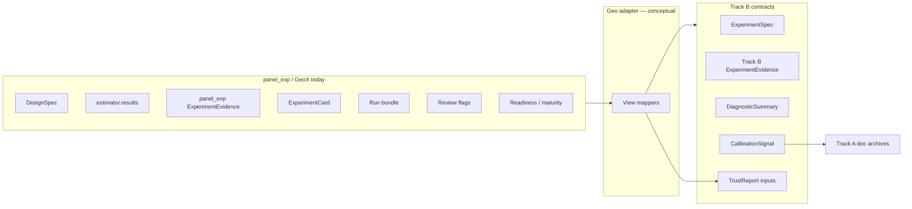

# Track B — Geo adapter architecture 001

**Document ID:** TRACK-B-GEO-ADAPTER-001  
**Status:** architecture planning — B1a deliverable  
**Last updated:** 2026-05-20  
**Package version:** 0.2.1 (current implementation)  

**Related:** [`TRACK_B_ARCHITECTURE_REVIEW_001.md`](TRACK_B_ARCHITECTURE_REVIEW_001.md) · [`TRACK_B_EXPERIMENT_SPEC_001.md`](TRACK_B_EXPERIMENT_SPEC_001.md) · [`TRACK_B_EXPERIMENT_EVIDENCE_001.md`](TRACK_B_EXPERIMENT_EVIDENCE_001.md) · [`TRACK_B_DIAGNOSTIC_SUMMARY_001.md`](TRACK_B_DIAGNOSTIC_SUMMARY_001.md) · [`TRACK_B_CALIBRATION_SIGNAL_001.md`](TRACK_B_CALIBRATION_SIGNAL_001.md) · [`TRACK_B_TRUST_REPORT_001.md`](TRACK_B_TRUST_REPORT_001.md) · [`TRACK_A_COMPLETION_REVIEW_001.md`](TRACK_A_COMPLETION_REVIEW_001.md) · [`PHASE13_GOVERNANCE_DECISION_001.md`](PHASE13_GOVERNANCE_DECISION_001.md) · [`PHASE15_GOVERNANCE_DECISION_001.md`](PHASE15_GOVERNANCE_DECISION_001.md) · [`DEFERRED_WORK_REGISTRY.md`](DEFERRED_WORK_REGISTRY.md)

This document defines how **existing GeoX / `panel_exp` artifacts** map into the **Track B contract stack** without changing estimator behavior, inference, eligibility, or export formats in this phase. **Architecture planning only** — no code, schema finalization, APIs, or artifact removal.

---

## 0. Terminology — naming collision

The codebase already defines **`panel_exp.evidence.ExperimentEvidence`** (design + optional inference readout). Track B defines **`ExperimentEvidence`** as the platform **measurement contract**. This document uses:

| Term | Meaning |
|------|---------|
| **Track B contract** | Platform abstraction from TRACK_B_*_001 docs |
| **`panel_exp` artifact** | Existing class, JSON export, or doc archive in the package today |
| **Geo adapter** | Conceptual mapping layer (future module) — **views**, not rewrites |

Unless qualified, **ExperimentEvidence** below means the **Track B contract**.

---

## 1. Executive purpose

The **Geo adapter** is the **migration bridge** from today’s working geo experimentation stack to Track B. GeoX and `panel_exp` already produce rich outputs — estimator `results`, design specs, evidence JSON, experiment cards, run bundles, calibration archives, review flags, and advisory readiness — but these are **fragmented** across six overlapping summary layers ([`OPEN_INVESTIGATIONS.md`](OPEN_INVESTIGATIONS.md)).

The adapter’s job:

1. **Map** existing artifacts into Track B contracts **without** rewriting GeoX internals first.  
2. **Preserve** backward compatibility — cards, bundles, and `results` keys remain valid.  
3. **Expose** one logical contract stack for TrustReport composition later.  
4. **Make implicit contracts explicit** — estimand, interval semantics, geometry, calibration scope — per Phase 13/15 and [`TRACK_B_ARCHITECTURE_REVIEW_001.md`](TRACK_B_ARCHITECTURE_REVIEW_001.md).



**Not in scope:** implementing the adapter, finalizing JSON schema, or changing what estimators attach to `results` by default.

---

## 2. Adapter-first principle

| Principle | Implication |
|-----------|-------------|
| **Existing artifacts stay unchanged initially** | `run_analysis` default keys, bundle shape, card markdown, recovery runners unchanged in B1a |
| **Adapter maps into Track B views** | One logical Track B object; many legacy **views** |
| **Track B does not rewrite GeoX first** | No mandatory refactor of `GeoExperimentDesign`, analyzers, or card builder before adapter exists |
| **Read-only governance mirrors** | Eligibility, maturity catalog, Phase 13/15 boundaries — **cite**, never override |
| **Explicit over silent** | Adapter surfaces `UNKNOWN` estimand, missing diagnostics, unsupported geometry — does not infer |
| **Additive transition** | New adapter exports optional until MIP/product adopts TrustReport views |

**Anti-pattern:** Replacing `build_experiment_card` with a breaking schema v2 before adapter parity is proven.

---

## 3. Existing GeoX artifact inventory

### Core measurement and design

| Artifact | Location / entry point | Role today |
|----------|------------------------|------------|
| **Estimator `results`** | `analyzer.results` after `run_analysis` | Point/path `y`, `y_hat`, `y_lower`, `y_upper`, treatment effects, DID contracts |
| **`InferenceResult`** | `panel_exp.inference_result` | Typed interval semantics (`IntervalType`, including `PLACEBO_BAND`) |
| **`DesignSpec`** | `panel_exp.spec` | Geo design contract: periods, assignment, `TargetEstimand`, `UncertaintyContract`, interference |
| **`DesignEvidence`** | `panel_exp.evidence` | Assignment + validation snapshot |
| **`panel_exp ExperimentEvidence`** | `panel_exp.evidence.ExperimentEvidence.build` | Combined design (+ optional inference) export; `evidence_version` 1.0 |
| **`InferenceEvidence`** | `panel_exp.evidence` | Inference-only facet when split |
| **Geo design pipeline** | `panel_exp.design.geo_runner.run_geo_experiment_design` | Assignment → validation → evidence → MDE |

### Human-readable and portable exports

| Artifact | Location | Role today |
|----------|----------|------------|
| **`ExperimentCard`** | `panel_exp.artifacts.experiment_card` | Markdown/card readout from evidence |
| **`build_experiment_card`** | Same | Factory from `panel_exp ExperimentEvidence` |
| **Run artifact bundle** | `panel_exp.artifacts.run_bundle` | JSON bundle: evidence, card, calibration, readiness, interference |
| **`BUNDLE_VERSION`** | `run_bundle.py` | 1.0 — ordered keys for export |

### Policy, maturity, readiness (advisory)

| Artifact | Location | Role today |
|----------|----------|------------|
| **`readiness_assessment`** | `panel_exp.policy.readiness` | Non-blocking decision readiness profile |
| **`maturity_evidence`** | `panel_exp.validation.maturity_evidence` | Links catalog maturity to calibration/recovery metrics |
| **`EstimatorMetadata` / maturity** | `panel_exp.method_metadata`, registry | Catalog labels — **not** Track B CalibrationSignal |
| **`CalibrationReport`** | `panel_exp.validation.calibration_report` | A/A and recovery metrics for reports — not Run 001 archive |

### Diagnostics and contracts

| Artifact | Location | Role today |
|----------|----------|------------|
| **Review flags** | `panel_exp.diagnostics.review_flags` | Opt-in via `build_estimator_review` |
| **`build_estimator_review`** | `panel_exp.diagnostics.review` | Diagnostics + flags; `DIAGNOSTICS_VERSION` 1.0 |
| **DID pretrend contract** | `results["did_pretrend_contract"]`, `DID.py` | warn/fail/ok pretrend discipline |
| **DID interval policy** | `results["did_interval_policy"]`, `did_interval_policy.py` | Relative ATT interval unsupported |
| **Interference review** | `build_interference_review`, `spec.InterferenceReview` | Design-level spillover metadata |
| **Analysis contract merge** | `evidence._merge_analysis_contract` | Maps `TargetEstimand`, `UncertaintyContract` onto inference metadata |

### Validation and calibration archives

| Artifact | Location | Role today |
|----------|----------|------------|
| **RecoveryRunner outputs** | `panel_exp.validation.recovery_runner` | Scenario batteries, scored estimand |
| **Nominal calibration** | `panel_exp.validation.nominal_calibration` | Eligibility checks, skip reasons |
| **Production nominal calibration** | `production_nominal_calibration.py` | Run 001 class harness |
| **Track A doc archives** | `docs/CALIBRATION_RUN_*.md`, Phase 11–15 | Authoritative OC + governance |
| **Validation summary** | On design/evidence payloads | Post-assignment validation checks |

### Six overlapping summary layers (OPEN_INVESTIGATIONS)

| # | Layer | Primary artifact |
|---|-------|------------------|
| 1 | Estimator results | `analyzer.results` |
| 2 | Evidence JSON | `panel_exp ExperimentEvidence` |
| 3 | Experiment card | `ExperimentCard` / markdown |
| 4 | Run bundle | `build_run_artifact_bundle` |
| 5 | Readiness / maturity block | `readiness_assessment`, `maturity_evidence` |
| 6 | Calibration / recovery docs | Run 001/002, Phase archives |

**Adapter target:** one **logical** Track B stack; six layers become **views** (§9).

---

## 4. Mapping to ExperimentSpec

Track B **ExperimentSpec** = declarative study intent **before** measurement. Geo adapter draws primarily from **`DesignSpec`** + geo experiment configuration — not from post-hoc `results`.

### Field mapping (conceptual)

| Track B ExperimentSpec (contract) | `panel_exp` source | Notes / gaps |
|-----------------------------------|-------------------|--------------|
| `study_id` | `DesignSpec.experiment_id` | Direct |
| `modality` | Constant `geo` | Adapter sets |
| `study_purpose` | Infer: business unless recovery context | Recovery runs → `calibration` — context flag needed |
| `randomization_unit` | Geo / market | From geo design; unit column metadata |
| `treatment_definition` | Assignment arms, treated geos, `experiment_period` | `GeoExperimentDesign` whitelists/blacklists |
| `control_definition` | Control arms, donor pool rules | Design assignment output |
| `assignment_mechanism` | `DesignSpec.design_method` | e.g. balanced randomization |
| `treatment_window` | `experiment_period` (`TimePeriod`) | |
| `analysis_windows` | `pre_period`, `experiment_period` | Post window may be open-ended |
| `target_population` | Treated geos in assignment | Panel universe from panel config |
| `primary_estimand` | `DesignSpec.target_estimand` (`TargetEstimand`) | **Gap:** default `UNKNOWN` if unset — adapter must not silently map to `relative_att_post` |
| `primary_estimand_aggregation` | Often **implicit** | **Gap:** map `relative_att_post_path_mean` when estimand is relative — document INV-003 mode B |
| `secondary_estimands` | Not first-class today | Optional from DID cumulative metadata |
| `interference_assumptions` | `DesignSpec.interference`, spillover notes | |
| `geometry_class` | Derived: `n_treated` from panel | single_treated vs multi_treated — **adapter computation** |
| `measurement_families_allowed` | Implicit in analyzer choice | From run context, not always on spec |
| `inference_modes_allowed` | Implicit in `inference=` argument | |
| `inference_geometry_constraints` | Phase 15 Placebo, Phase 13 KFold | Adapter attaches **policy refs** when mode known |
| `mmm_calibration_intent` | Not on DesignSpec today | **Gap** — default false |
| `trust_report_profile` | Not on DesignSpec today | **Gap** — optional future field |

### DesignSpec strengths

- Already has **`TargetEstimand`** and **`UncertaintyContract`** enums aligned with Track B estimand/interval discipline ([`spec.py`](../panel_exp/spec.py)).  
- **`content_hash()` / `spec_hash`** supports spec versioning lineage.

### Adapter rules (ExperimentSpec)

1. **Never upgrade `TargetEstimand.UNKNOWN` to `relative_att_post` silently.**  
2. **Declare aggregation mode** when primary estimand is relative and multi-geo.  
3. **Compute `geometry_class`** from panel at spec-build time; store on adapter output.  
4. **Recovery/calibration runs** use same mapper with `study_purpose: calibration`.

---

## 5. Mapping to ExperimentEvidence

Track B **ExperimentEvidence** = immutable **measurement record** after analysis. Primary sources: **`analyzer.results`**, **`InferenceResult`**, **`panel_exp ExperimentEvidence`**, inference metadata merge.

### Field mapping (conceptual)

| Track B ExperimentEvidence (contract) | `panel_exp` source | Notes |
|---------------------------------------|-------------------|--------|
| `evidence_id` | Generate stable ID | From experiment_id + run timestamp + config hash |
| `study_id`, `spec_version` | `experiment_id`, `spec_hash` | `DesignSpec.content_hash()` |
| `modality` | `geo` | Adapter constant |
| **Family export / point** | `results` treatment effect, path aggregates | Estimator-specific extraction |
| **Scored estimand ref** | Recovery context: `relative_att_post` | Business run: reference spec primary |
| **Interval estimand** | `inference_metadata`, recovery interval fields | |
| `path_interval_type` | `InferenceResult.interval_type` → string | **Critical:** `placebo_band` vs CI |
| `interval_lower` / `interval_upper` | `y_lower`, `y_upper`, scalar CIs | |
| `inference_mode` | `inference` class name / registry string | e.g. UnitJackKnife, Placebo |
| `measurement_instrument_id` | Compose from estimator + inference + geometry | **Gap:** catalog in B3 — interim convention §11 |
| `geometry_class_at_run` | `panel_data` treated count | |
| Alignment flags | Compare spec `TargetEstimand` vs export vs interval | `_merge_analysis_contract` helpers |
| `lift_detection_calibrated` | Default **`false`** | Read CalibrationSignal — never infer from run |
| `calibration_signal_id` | Lookup by instrument_id | Static catalog from Track A docs (B3) |
| `diagnostics_requested` | Whether `build_estimator_review` was called | |
| Raw diagnostic inputs | `review_flags`, `did_*`, attached diagnostics | For DiagnosticSummary builder |
| `package_version` | `ExperimentEvidence.package_version` | |
| Lineage | `assignment_hash`, `input_data_hash`, supersession | From evidence payload |

### Estimator `results` keys (by family)

| Content | Typical keys | Track B facet |
|---------|--------------|---------------|
| Paths | `y`, `y_hat`, `y_lower`, `y_upper` | Measurement outputs (by reference) |
| DID pretrend | `did_pretrend_contract` | Diagnostic input |
| DID policy | `did_interval_policy` | Interval alignment fact |
| Review flags | `review_flags` (opt-in) | Diagnostic input |
| Inference metadata | On evidence / merged | Interval + estimand alignment |

### Relationship to `panel_exp ExperimentEvidence`

| Aspect | Strategy |
|--------|----------|
| **Not a 1:1 rename** | Legacy object = design + inference **export**; Track B contract = **measurement-focused** with alignment + calibration refs |
| **Migration** | Adapter **projects** legacy JSON into Track B shape; legacy JSON remains valid view |
| **Inference attach** | When only design evidence exists, Track B evidence = **not_assessable** for inference claims |

### Adapter rules (ExperimentEvidence)

1. **Preserve `IntervalType.PLACEBO_BAND`** — never relabel as confidence interval.  
2. **Surface DID `did_relative_att_interval_unsupported`** on alignment flags.  
3. **Attach `skip_reason` mirror** when config ineligible — from nominal_calibration, not adapter invention.  
4. **Do not embed TrustReport outcomes** or eligibility state as authoritative.

---

## 6. Mapping to DiagnosticSummary

Track B **DiagnosticSummary** = **derived** from ExperimentEvidence raw diagnostic inputs + spec cross-check — **deterministic**, no re-estimation.

### Facet mapping

| DiagnosticSummary facet | `panel_exp` sources | Availability |
|-------------------------|---------------------|--------------|
| **Pretrend / parallel trends** | `did_pretrend_contract`; `pretrend_violation` review flag | DID only |
| **Donor / weight health** | `high_donor_concentration`, `donor_instability` | SCM/SDID; unavailable others with reason |
| **Residual drift** | `residual_drift` review flag | Path counterfactual families |
| **Fold instability** | `fold_instability` | TBRRidge + KFold |
| **Placebo / null-reference** | `path_interval_type == placebo_band`; placebo band width vs point | When Placebo inference |
| **Spillover / interference** | `build_interference_review`, validation spillover checks | Design review — DEF-004 limits |
| **Geometry warnings** | `n_treated`, Placebo/KFold unsupported | Compare to Phase 15/13 |
| **Estimand mismatch** | Evidence alignment flags vs spec | |
| **Interval alignment** | Interval estimand vs spec; DID policy | |
| **Aggregation mismatch** | Heterogeneity flags (future) | DEF-009 — partial today |
| **Expert-review checklist** | `review_flag_support`, diagnostics_requested | |

### Builder inputs (future B2a)

```
DiagnosticSummary = build_diagnostic_summary(
    track_b_experiment_spec,
    track_b_experiment_evidence,
)
```

| Input on evidence | Maps to |
|-------------------|---------|
| `review_flags` + `review_flag_support` | Donor, residual, fold, pretrend facets |
| `did_pretrend_contract` | Pretrend facet (DID) |
| `did_interval_policy` | Interval alignment facet |
| Interference packet on artifacts | Spillover facet |
| Alignment flags | Estimand / interval facets |
| `diagnostics_requested: false` | Checklist gap — informational |

### Adapter rules (DiagnosticSummary)

1. **Reference evidence flags** — do not recompute pretrend in adapter.  
2. **Propagate `unavailable` + reason** from `classify_review_flag_support`.  
3. **No trust outcomes** on this object.  
4. **Readiness assessment is not DiagnosticSummary** — separate legacy input to TrustReport only.

---

## 7. Mapping to CalibrationSignal

Track B **CalibrationSignal** = **composed historical instrument evidence** — not produced by a live geo run. Geo adapter **loads static catalog entries** keyed by `measurement_instrument_id`, populated from Track A archives.

### Archive → instrument → signal (geo catalog sketch)

| Track A source | Instruments covered | Signal facets |
|----------------|---------------------|---------------|
| [`CALIBRATION_RUN_001.md`](CALIBRATION_RUN_001.md) | SCM_UnitJackKnife, TBRRidge_BRB, TBRRidge_Kfold | null/positive metrics, production tier |
| [`CALIBRATION_RUN_002.md`](CALIBRATION_RUN_002.md) | TBRRidge_BRB post-fix | supersedes Run 001 BRB interpretation |
| Phase 11 / [`SCM_JACKKNIFE_CHARACTERIZATION_001.md`](SCM_JACKKNIFE_CHARACTERIZATION_001.md) | SCM_UnitJackKnife | geometry matrix, width/power |
| Phase 12 / INV-007, fix validation | TBRRidge_Kfold | geometry, post-fix runnable |
| [`PHASE14_AUGSYNTH_CHARACTERIZATION_001.md`](PHASE14_AUGSYNTH_CHARACTERIZATION_001.md) | AugSynthCVXPY_Point, AugSynthCVXPY_UnitJackKnife | spillover DEF-004 |
| [`PHASE15_PLACEBO_CHARACTERIZATION_001.md`](PHASE15_PLACEBO_CHARACTERIZATION_001.md) | SCM_Placebo, TBRRidge_Placebo | single-treated, placebo_band |
| [`PHASE13_GOVERNANCE_DECISION_001.md`](PHASE13_GOVERNANCE_DECISION_001.md) | SCM JK, BRB, Kfold | usage_boundary, eligibility posture |
| [`PHASE15_GOVERNANCE_DECISION_001.md`](PHASE15_GOVERNANCE_DECISION_001.md) | Placebo paths | null-reference role |
| [`DEFERRED_WORK_REGISTRY.md`](DEFERRED_WORK_REGISTRY.md) | Per instrument | `def_refs`, known_exclusions |

### Adapter behavior

| Step | Action |
|------|--------|
| 1 | Parse run config → `measurement_instrument_id` |
| 2 | Lookup pre-composed **CalibrationSignal catalog entry** (B3 doc/registry) |
| 3 | Attach `calibration_signal_id`, `usage_boundary_mirror`, `def_refs` to Track B ExperimentEvidence |
| 4 | If unknown instrument → evidence records missing signal; TrustReport → `not_assessable` for calibration-backed claims |

**Not from live run:** `CalibrationReport`, `maturity_evidence`, `readiness_assessment` — these are **advisory legacy** inputs; they **must not** replace CalibrationSignal OC scope. Adapter may cross-link as supplementary view only.

### Interim instrument ID convention (until B3 catalog)

```
geo.{EstimatorFamily}.{InferenceMode}.{interval_estimand}.{geometry_class}
```

Examples:

- `geo.SyntheticControl.UnitJackKnife.relative_att_post.multi_treated_default`  
- `geo.SyntheticControl.Placebo.relative_att_post.single_treated_only`  
- `geo.TBRRidge.BlockResidualBootstrap.relative_att_post.multi_treated_default`

---

## 8. Mapping to TrustReport

The adapter **supplies TrustReport inputs** — it does **not** emit trust outcomes.

### Input bundle (conceptual)

| TrustReport input | Adapter source |
|-------------------|----------------|
| ExperimentSpec view | §4 mapper from `DesignSpec` + geo config |
| ExperimentEvidence view | §5 mapper from results + evidence |
| DiagnosticSummary view | §6 builder output |
| CalibrationSignal view | §7 catalog lookup |
| DEF citations | Union of signal `def_refs` + dimension-triggered DEFs |
| Intended use | Spec `trust_report_profile` when present; else explicit caller intent |

### Legacy artifacts → TrustReport (view only)

| Legacy artifact | TrustReport role |
|-----------------|------------------|
| **ExperimentCard** | **Deprecated as truth** — render from TrustReport + DiagnosticSummary later (B6) |
| **readiness_assessment** | **Input hint only** — demoted; must not override CalibrationSignal |
| **maturity_evidence** | Catalog maturity display — **not** certification |
| **CalibrationReport** | Recovery A/A context — not Run 001 substitute |

### Adapter rules (TrustReport inputs)

1. Adapter module ends at **input bundle** — TrustReport composer is **B4** (separate).  
2. **Never set `primary_outcome`** in adapter.  
3. Pass **`diagnostics_requested`** and **`lift_detection_calibrated: false`** through for composer rules.  
4. Include **human governance footer placeholders** in composer spec, not adapter.

---

## 9. Artifact consolidation strategy

### Current state: many-artifact world

Multiple partially overlapping exports describe the same run with **different emphasis** — card narrative, bundle portability, evidence audit hash, raw results tensors, readiness tone, calibration snippets.

**Problem:** Reviewer fatigue, conflicting narratives, implicit estimand ([`TRACK_B_ARCHITECTURE_REVIEW_001.md`](TRACK_B_ARCHITECTURE_REVIEW_001.md) AB-4).

### Target state: one contract stack, many views

| Track B contract | Canonical role | Legacy views (read-only projections) |
|------------------|----------------|--------------------------------------|
| **ExperimentSpec** | Design intent | `DesignSpec`, geo config subset on evidence |
| **ExperimentEvidence** | Measurement + alignment | `results`, `panel_exp ExperimentEvidence`, bundle `evidence` |
| **DiagnosticSummary** | This-run quality | review flags, DID contracts, interference review |
| **CalibrationSignal** | Historical OC | Phase docs + Run 001/002 — **not** live bundle calibration block alone |
| **TrustReport** | Trust synthesis | ExperimentCard conclusions (transitional) |

### Migration stages

| Stage | Scope | User-visible change |
|-------|-------|---------------------|
| **M0 — Today** | Six layers independent | None |
| **M1 — Adapter spec (B1a)** | This document | None in code |
| **M2 — Optional adapter export (B3)** | Add `track_b_views` sidecar on bundle | Opt-in JSON facet |
| **M3 — Schema draft (B2)** | Document field names; no break | None |
| **M4 — Composer (B4)** | TrustReport from views in tests | Internal/dev |
| **M5 — MIP integration (B6)** | Card renders TrustReport narrative | Copy change; legacy keys remain |
| **M6 — Deprecation** | Card/bundle as primary truth | **Future** — requires product decision |

### Backward compatibility expectations

| Expectation | Detail |
|-------------|--------|
| **`evidence_version` 1.0** | Unchanged until explicit major bump |
| **Bundle key order** | Preserved |
| **Default `results` keys** | No new required keys from adapter |
| **Existing tests** | Must pass without adapter enabled |
| **Track B views additive** | New keys/namespaces only until M6 |

---

## 10. Adapter boundaries

The Geo adapter **must not**:

| Prohibition | Rationale |
|-------------|-----------|
| **Reinterpret estimands silently** | DEF-009, DEF-018; `TargetEstimand.UNKNOWN` stays unknown |
| **Convert placebo bands to confidence intervals** | Phase 15 export discipline |
| **Promote inference methods** | No maturity/eligibility upgrade |
| **Override eligibility** | Registry authoritative — mirror only |
| **Hide unsupported geometry** | Placebo/KFold multi-treated failures visible |
| **Collapse diagnostics into trust verdicts** | DiagnosticSummary ≠ TrustReport |
| **Assign trust scores or `production_safe`** | Frozen policy |
| **Treat readiness pass as lift support** | Readiness demoted in B0 |
| **Treat null FPR = 0 as package calibration** | DEF-015 |
| **Rescale DID cumulative intervals to relative ATT** | DEF-003 policy |
| **Mutate estimator or inference outputs** | Read-only mapping |

The adapter **may**:

- Compute derived **geometry_class** and alignment **flags** from existing fields.  
- Attach **static** CalibrationSignal catalog references.  
- Mark **`diagnostics_requested: false`** explicitly.  
- Emit **`UNKNOWN`** where source data is incomplete.

---

## 11. Open issues

| ID | Issue | Impact | Target phase |
|----|-------|--------|--------------|
| **OI-1** | **Instrument ID catalog** | Evidence ↔ signal linkage | **B3a** — doc/registry from Track A |
| **OI-2** | **Estimand registry (DEF-011, INV-020)** | Full cross-modality estimands | **B3b** — geo subset for B2 MVP |
| **OI-3** | **`panel_exp ExperimentEvidence` naming collision** | Implementer confusion | B2 schema: rename views (`legacy_evidence` vs `measurement_evidence`) |
| **OI-4** | **Aggregation mode not on DesignSpec** | Heterogeneous multi-geo DEF-009 | B2 spec extension or adapter default with explicit flag |
| **OI-5** | **Artifact versioning** | `evidence_version`, `bundle_version`, Track B contract version — alignment policy | B2 schema draft |
| **OI-6** | **Legacy card compatibility** | Card markdown implies conclusions | B6 MIP guidelines |
| **OI-7** | **`trust_report_profile` missing** | Outcome depends on intended use | Optional spec field B2 |
| **OI-8** | **INV-031 before TrustReport runtime** | Conservatism narrative completeness | B7 — not B3 adapter |
| **OI-9** | **Future A/B adapter** | Separate modality mapper | Track C — architecture slots exist |
| **OI-10** | **Sixth layer: recovery JSON files** | Calibration ExperimentEvidence vs business evidence | B1b consolidation |

**None block B1a completion** (this document).

---

## 12. Recommended implementation sequence

Aligned with [`TRACK_B_ARCHITECTURE_REVIEW_001.md`](TRACK_B_ARCHITECTURE_REVIEW_001.md) §10 and B1a authorization.

| Phase | Focus | Deliverable | Depends on |
|-------|-------|-------------|------------|
| **B0** | Contract architecture + review | TRACK_B_*_001 + architecture review | ✅ Complete |
| **B1a** | **Geo adapter spec** | **This document** | B0 ✅ |
| **B1b** | Artifact consolidation design | Primary/supplementary matrix; recovery JSON role; bundle sidecar shape | B1a |
| **B2** | Minimal dataclass/schema **draft** | Geo subset field list; version policy; naming for legacy vs Track B | B1a, B1b |
| **B3** | Adapter **prototype** | Read-only mappers: DesignSpec→Spec view, results→Evidence view; static signal catalog loader | B2 draft, B3a catalog doc |
| **B4** | **Contract tests** | Golden fixtures: five governed instruments → expected alignment flags, diagnostic facets, TrustReport **inputs** (not outcomes) | B3 |
| **B2a** | DiagnosticSummary builder spec | Facet registry + deterministic builder | B1a |
| **B2b** | Trust outcome enum mapping | Vision ↔ TrustReport categories | B0 TrustReport |
| **B3a** | CalibrationSignal catalog | Instrument IDs + archive refs (doc) | B1a §7 |
| **B3b** | Estimand registry draft | Geo-first registry | INV-003 |
| **B4 composer** | TrustReport composer spec | Pseudocode synthesis rules | B2b, B3a |
| **B5** | Schema MVP implementation | Versioned geo business path | B2, B3, B4 tests |
| **B6** | MIP / GeoX integration | TrustReport views; card demotion | B5 |
| **B7** | Runtime TrustReport + signal refresh | After INV-031 archive | B6 |

### B1a exit criteria (this document)

- [x] Artifact inventory documented  
- [x] Mappings to all five Track B contracts  
- [x] Consolidation strategy and compatibility expectations  
- [x] Adapter boundaries and open issues  
- [x] Implementation sequence through B4  

**Next immediate artifact:** **B1b** — artifact consolidation design doc, or **B3a** — CalibrationSignal instrument catalog (can parallelize).

---

## 13. Non-goals

This document **does not**:

| Non-goal | Notes |
|----------|-------|
| **Implement code** | No adapter module in B1a |
| **Finalize schema** | Field names conceptual |
| **Create APIs** | No export endpoints |
| **Remove or break artifacts** | Cards, bundles, evidence unchanged |
| **Change estimator / inference behavior** | Read-only mapping |
| **Change eligibility, maturity, release gates** | Governance frozen |
| **Introduce trust scores** | Prohibited |
| **Produce TrustReport outcomes** | Composer is B4+ |
| **Close DEF/INV items** | Cited only |

This document **does**:

- Define the **Geo adapter** as the safe migration bridge  
- Inventory **existing GeoX artifacts** and map them to Track B  
- Specify **consolidation stages** and **compatibility**  
- List **boundaries** and **open issues**  
- Authorize **B1b → B4** implementation planning  

---

## Appendix A — Quick reference: artifact → contract

| `panel_exp` artifact | Primary Track B contract | Secondary |
|---------------------|------------------------|-----------|
| `DesignSpec` | ExperimentSpec | — |
| Geo assignment / periods | ExperimentSpec | ExperimentEvidence provenance |
| `analyzer.results` | ExperimentEvidence | DiagnosticSummary inputs |
| `InferenceResult` | ExperimentEvidence | — |
| `panel_exp ExperimentEvidence` | ExperimentEvidence (legacy view) | ExperimentSpec facets |
| Review flags / estimator review | DiagnosticSummary | ExperimentEvidence inputs |
| DID pretrend / interval policy | DiagnosticSummary | ExperimentEvidence alignment |
| Interference review | DiagnosticSummary | ExperimentSpec interference |
| Phase 11–15 + Run 001/002 docs | CalibrationSignal | — |
| `readiness_assessment` | TrustReport legacy hint | Not canonical |
| `maturity_evidence` | Display only | Not CalibrationSignal |
| `ExperimentCard` | TrustReport/card **view** | DiagnosticSummary readable facet |
| Run bundle | Container for multiple **views** | — |

---

## Appendix B — Governed instrument adapter checklist

For each characterized geo instrument, B4 contract tests should verify adapter output includes:

| Instrument | Spec geometry | Evidence interval type | Signal ref | Critical boundary |
|------------|---------------|------------------------|------------|-------------------|
| SCM_UnitJackKnife | multi_treated | confidence_interval | Run 001 + Phase 11 | null_monitor_only |
| TBRRidge_BRB | multi_treated | confidence_interval | Run 002 | positive_oc_failed |
| TBRRidge_Kfold | multi_treated | confidence_interval when aligned | INV-007 + fix | runnable_not_trusted |
| AugSynthCVXPY_Point | multi_treated | none | Phase 14 | point_only |
| SCM_Placebo | single_treated | **placebo_band** | Phase 15 | not CI; single-treated |

---

## Appendix C — Success criterion

**B1a succeeds when:**

1. A reader understands the Geo adapter as **bridge**, not rewrite.  
2. **All major GeoX artifacts** are inventoried and mapped.  
3. **Track B contracts** receive clear, honest mappings with gaps labeled.  
4. **Consolidation and compatibility** strategy enables safe migration.  
5. **Adapter boundaries** prevent Phase 13/15 violations.  
6. **B1b–B4 sequence** is actionable without destabilizing the working package.

**Conclusion:**

> The Geo adapter architecture defines a **safe migration path** from existing `panel_exp` / GeoX outputs to the Track B stack. **Implementation planning for B1b and B2 may proceed** without changing production artifact behavior.

---

*Planning artifact TRACK-B-GEO-ADAPTER-001. B1a complete. No code, schema, or policy changes.*
