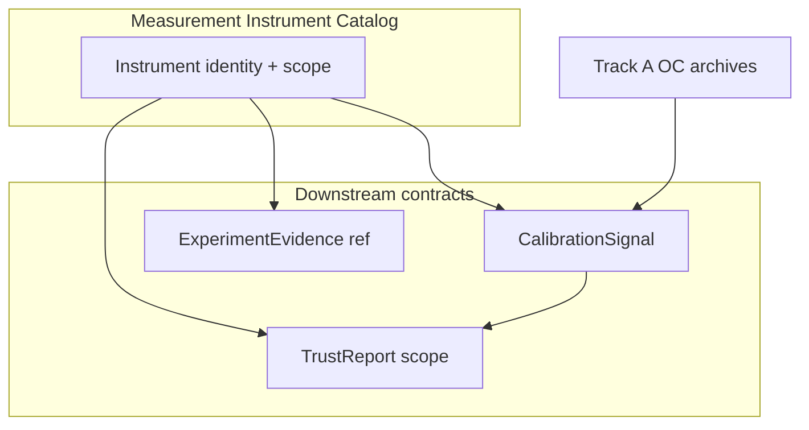
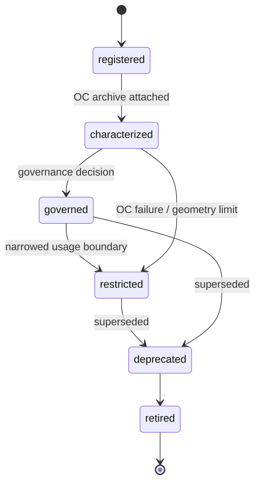

# Track B — measurement instrument catalog architecture 001

**Document ID:** TRACK-B-MEASUREMENT-INSTRUMENT-CATALOG-001  
**Status:** architecture design — B3a deliverable  
**Last updated:** 2026-05-20  
**Package version:** 0.2.1 (current implementation)  

**Related:** [`TRACK_B_CALIBRATION_SIGNAL_001.md`](TRACK_B_CALIBRATION_SIGNAL_001.md) · [`TRACK_B_TRUST_REPORT_001.md`](TRACK_B_TRUST_REPORT_001.md) · [`TRACK_B_GEO_ADAPTER_001.md`](TRACK_B_GEO_ADAPTER_001.md) · [`TRACK_B_ARTIFACT_CONSOLIDATION_001.md`](TRACK_B_ARTIFACT_CONSOLIDATION_001.md) · [`TRACK_A_COMPLETION_REVIEW_001.md`](TRACK_A_COMPLETION_REVIEW_001.md) · [`PHASE13_GOVERNANCE_DECISION_001.md`](PHASE13_GOVERNANCE_DECISION_001.md) · [`PHASE15_GOVERNANCE_DECISION_001.md`](PHASE15_GOVERNANCE_DECISION_001.md) · [`OPEN_INVESTIGATIONS.md`](OPEN_INVESTIGATIONS.md) · [`DEFERRED_WORK_REGISTRY.md`](DEFERRED_WORK_REGISTRY.md)

This document defines the **canonical Measurement Instrument Catalog** — the stable platform abstraction that anchors **CalibrationSignal**, **ExperimentEvidence** references, and **TrustReport** scope. **Architecture design only.** No code, schema, API, runtime registry, eligibility, maturity, release-gate, or CalibrationSignal content changes in this phase.

---

## 1. Executive purpose

### Why measurement instruments exist

Track A characterized **estimator × inference × geometry × estimand/interval** combinations — not estimator families alone. Phase 13 and Phase 15 govern **configs** (`SCM_UnitJackKnife`, `TBRRidge_BlockResidualBootstrap`, `SCM_Placebo`), not “SCM” or “TBRRidge” in the abstract.

The **Measurement Instrument Catalog** is the **stable identity layer** that answers:

> **Which exact measurement configuration does archived evidence describe — and what claims may attach to it?**

Without a catalog:

- CalibrationSignal lacks a **key** to compose and version.  
- ExperimentEvidence cannot **reference** historical OC unambiguously.  
- TrustReport cannot **scope** lift vs null-monitor claims to the instrument actually used.  
- Geo adapter cannot map `run_analysis` configs to governed boundaries ([`TRACK_B_GEO_ADAPTER_001.md`](TRACK_B_GEO_ADAPTER_001.md) §7).

### Why estimators are insufficient

| Estimator-only thinking | Failure mode |
|-------------------------|--------------|
| “SCM is characterized” | Hides Placebo vs UnitJackKnife semantics (Phase 15) |
| “TBRRidge is production-ready” | Conflates BRB, KFold, point path — different OC and geometry |
| “AugSynth is expert-review” | Point-only vs JK differ; spillover DGP bias (Phase 14) |
| “DID works on geo panels” | Relative interval policy closed (DEF-003) |
| Catalog maturity label | VALIDATION_COVERAGE ≠ instrument OC scope |

**Estimator** = algorithm family in the method catalog.  
**Measurement instrument** = **governed unit of evidence** for a specific modality, inference mode, geometry, and uncertainty semantics.



---

## 2. Instrument definition

A **measurement instrument** is the **smallest governed unit** of calibration and trust scope. It is composed of six dimensions — **all required** for catalog entry (conceptual):

| Dimension | Description | Geo example |
|-----------|-------------|-------------|
| **Modality** | Experiment randomization and analysis paradigm | `geo` |
| **Estimator** | Point-estimation / counterfactual family | `SyntheticControl`, `TBRRidge`, `AugSynthCVXPY`, `DID` |
| **Inference method** | Uncertainty procedure (or `none` for point-only) | `UnitJackKnife`, `BlockResidualBootstrap`, `KFold`, `Placebo`, `bootstrap` |
| **Geometry assumptions** | Assignment shape the OC archive covers | `multi_treated_default`, `single_treated_only` |
| **Estimand family** | Point and scored estimand contract | `relative_att_post` (path mean), `cumulative_att` (DID intervals) |
| **Interval semantics** | Type and target of uncertainty bands | `confidence_interval` + `relative_att_post`; `placebo_band`; `none` |

**Optional catalog metadata (non-identity):** recovery config key, package version at archive, evidence tier, governance decision refs — attached to **CalibrationSignal**, keyed by instrument ID.

### Identity vs configuration

| Concept | Scope |
|---------|--------|
| **Instrument** | Stable platform identity — OC scope boundary |
| **Run config** | Notebook/API kwargs for one execution |
| **CalibrationSignal** | Composed historical evidence **for one instrument** (may version) |

One instrument → one or more **CalibrationSignal versions** over time (e.g. BRB post-Run-002 supersedes pre-fix interpretation). Instrument ID **stable**; signal version **monotonic**.

---

## 3. Instrument identity

### Conceptual identity rules

1. **Modality is part of ID** — geo instruments do not inherit A/B OC.  
2. **Inference is part of ID** — SCM + JK ≠ SCM + Placebo.  
3. **Geometry is part of ID when OC is geometry-bound** — Placebo single-treated ≠ default multi-treated.  
4. **Interval semantics are part of ID** — `placebo_band` ≠ `confidence_interval`.  
5. **Estimand family is part of ID when interval/path scale differs** — DID cumulative ≠ relative ATT.  
6. **Point-only paths use `inference=none`** and `interval_semantics=none`.  
7. **IDs are immutable** — behavior change → new instrument ID or explicit **instrument version** suffix (see §9).

### ID format (conceptual — not implementation)

```
{modality}.{estimator_family}.{inference_method}.{point_estimand}.{geometry_class}.{interval_type}
```

Normalization rules (planning):

- Lowercase snake segments; estimator names match registry short names.  
- `inference=none` → segment `point_only`.  
- `geometry_class` omitted only when archive explicitly covers all geo geometries on default DGP (rare).  
- Optional **`@v1`** suffix when instrument definition changes without new estimator (post-fix KFold geometry).

### Worked identity examples

| Human name | Conceptual instrument ID |
|------------|---------------------------|
| SCM + UnitJackKnife | `geo.synthetic_control.unit_jackknife.relative_att_post.multi_treated_default.confidence_interval` |
| SCM + Placebo | `geo.synthetic_control.placebo.relative_att_post.single_treated_only.placebo_band` |
| TBRRidge + BRB | `geo.tbrridge.block_residual_bootstrap.relative_att_post.multi_treated_default.confidence_interval` |
| TBRRidge + KFold | `geo.tbrridge.kfold.relative_att_post.multi_treated_default.confidence_interval` |
| TBRRidge + Placebo | `geo.tbrridge.placebo.relative_att_post.single_treated_only.placebo_band` |
| AugSynthCVXPY + Point | `geo.augsynth_cvxpy.point_only.relative_att_post.multi_treated_default.none` |
| AugSynthCVXPY + UnitJackKnife | `geo.augsynth_cvxpy.unit_jackknife.relative_att_post.multi_treated_default.confidence_interval` |
| DID + Bootstrap | `geo.did.bootstrap.relative_att_post.multi_treated_default.cumulative_att_interval` |
| Future: A/B + CUPED | `ab.frequentist_test.cuped_adjusted.conversion_rate_delta.user_level.confidence_interval` |
| Future: Conversion Lift | `conversion_lift.exposure_randomized.ghost_ad_eligible.incremental_conversions.exposure_opportunity.confidence_interval` |

### Recovery config key mapping (geo — advisory alias)

| Recovery / config key | Catalog instrument (primary) |
|-----------------------|--------------------------------|
| `SCM_UnitJackKnife` | SCM + UnitJackKnife ID above |
| `TBRRidge_BlockResidualBootstrap` | TBRRidge + BRB ID above |
| `TBRRidge_Kfold` | TBRRidge + KFold ID above |
| `AugSynthCVXPY_Point` | AugSynthCVXPY + Point ID above |
| `AugSynthCVXPY_UnitJackKnife` | AugSynthCVXPY + JK ID above |
| `SCM_Placebo` | SCM + Placebo ID above (not in RecoveryRunner registry today) |

Aliases are **lookup helpers** — instrument ID is canonical.

---

## 4. Instrument lifecycle

Instrument lifecycle describes **catalog entry maturity** — related to but **not identical** to CalibrationSignal lifecycle ([`TRACK_B_CALIBRATION_SIGNAL_001.md`](TRACK_B_CALIBRATION_SIGNAL_001.md) §4) or VALIDATION_COVERAGE maturity.



| Catalog state | Meaning | CalibrationSignal relation |
|---------------|---------|----------------------------|
| **registered** | Identity defined; no OC | No signal or exploratory signal only |
| **characterized** | OC archive exists | Signal `characterized` lifecycle |
| **governed** | Production OC + governance decision | Signal `governed` |
| **restricted** | Usable under explicit boundary | Signal `restricted` |
| **deprecated** | Superseded ID or interpretation | Old signal versions deprecated |
| **retired** | No new TrustReport references | Signals archived |

### Relationship to governance decisions

| Source | Catalog effect |
|--------|----------------|
| [`PHASE13_GOVERNANCE_DECISION_001.md`](PHASE13_GOVERNANCE_DECISION_001.md) | SCM JK governed; BRB/KFold restricted |
| [`PHASE15_GOVERNANCE_DECISION_001.md`](PHASE15_GOVERNANCE_DECISION_001.md) | SCM Placebo governed (single-treated); TBRRidge Placebo characterized |
| KFold reconciliation addendum | KFold instrument scope updated — same ID, new signal version |
| Future governance | New state transition — **no auto-promotion** from catalog alone |

### Relationship to deferred work and investigations

| Mechanism | Catalog role |
|-----------|--------------|
| **DEF-xxx** on instrument entry | `known_exclusions`, `def_refs` — mandatory for TrustReport |
| **OPEN_INVESTIGATIONS** | `investigation_refs` — e.g. INV-030 on JK family, INV-031 cross-mode |
| **Revisit triggers** | Document when instrument scope may expand — not automatic |

Investigations **do not** add instruments to governed state without OC + governance.

---

## 5. Instrument scope

### What validity claims attach to instruments

Claims attach **only** through **CalibrationSignal** + **TrustReport** composition — the catalog defines **which instrument** those signals describe.

| Claim class | Requires on instrument | Example |
|-------------|------------------------|---------|
| **Null-monitor viability** | `null_oc_passed` on signal; usage_boundary permits | SCM UnitJackKnife |
| **Expert-review point path** | Point recovery OC | AugSynthCVXPY Point |
| **Null-reference diagnostic** | `placebo_band` + geometry scope | SCM Placebo single-treated |
| **Null-viable intervals (not eligible)** | null OC + restricted boundary | TBRRidge BRB post Run 002 |
| **Runnable execution** | Execution metrics only — **weakest** | TBRRidge KFold multi-treated post-fix |

### What claims do **not** attach to instruments

| Non-claim | Rationale |
|-----------|-----------|
| **`production_safe`** | Frozen — not catalog field |
| **Package-wide nominal calibration** | DEF-015 — only eligible config is SCM JK null monitor |
| **Lift-detection calibration** | Default **false** unless positive OC + governance (none today on geo battery) |
| **Estimator maturity promotion** | VALIDATION_COVERAGE separate |
| **Eligibility registry membership** | Code registry authoritative — catalog **mirrors** |
| **Business study success** | ExperimentEvidence + TrustReport — not instrument catalog |
| **MMM calibrated contribution** | Requires transform instrument (DEF-012) — not raw geo ATT |
| **Cross-estimator interchange** | DEF-014 — each instrument scoped independently |

### Scenario-class separation (mandatory)

For every characterized geo inference instrument on recovery battery:

| Scenario class | Separate signal facet |
|----------------|----------------------|
| **Null** (`recovery_null_effect`) | FPR, null coverage |
| **Positive** (`recovery_positive_effect`) | Power, positive coverage — **does not upgrade null pass to lift claim** |

---

## 6. Instrument compatibility

### ExperimentEvidence

| Rule | Detail |
|------|--------|
| **Every business geo run** should resolve `measurement_instrument_id` | From estimator + inference + geometry + interval type |
| **Unknown config** | `instrument_id: unknown` — TrustReport `not_assessable` for calibration-backed claims |
| **Evidence references signal by ID + version** | Not embedded OC matrices |
| **Mis-match** | Spec/plan vs actual instrument → `plan_violation` on evidence |

### CalibrationSignal

| Rule | Detail |
|------|--------|
| **One primary signal per instrument** at a time (active version) | Historical versions retained |
| **Catalog entry is parent** | Signal `measurement_instrument_id` must match catalog |
| **Catalog does not duplicate signal metrics** | Catalog = identity + scope; signal = OC composition |

### TrustReport

| Rule | Detail |
|------|--------|
| **Trust scope = instrument scope ∩ live evidence ∩ intended use** | Same instrument, different outcomes for null-screen vs lift launch |
| **Catalog `prohibited_claims`** feed TrustReport boundaries | Phase 13/15 |
| **Catalog does not emit outcomes** | TrustReport composer only |

### Geo adapter ([`TRACK_B_GEO_ADAPTER_001.md`](TRACK_B_GEO_ADAPTER_001.md))

Adapter **resolves** runtime config → catalog `measurement_instrument_id` → loads active CalibrationSignal version.

---

## 7. Existing GeoX catalog

All entries below are **geo modality**, **`relative_att_post` point/scored estimand** unless noted. **Nominal eligibility** mirrors registry — unchanged by this document.

### Tier 1 — Governed instruments (production OC + governance)

#### `geo.synthetic_control.unit_jackknife.relative_att_post.multi_treated_default.confidence_interval`

| Field | Value |
|-------|--------|
| **Alias** | `SCM_UnitJackKnife` |
| **Catalog state** | **governed** |
| **Governed role** | Expert-review; **null-monitor only** |
| **CalibrationSignal** | Run 001 + Phase 11; Phase 13 |
| **Trust boundary** | Null FPR=0, coverage≈1; **power=0** on positive (DEF-013) |
| **Eligibility mirror** | **In registry** — sole `NOMINAL_CALIBRATION_ELIGIBLE_CONFIGS` member |
| **Known exclusions** | Not lift detector; not package-wide calibration (DEF-015); donor-sensitivity width (INV-030) |
| **def_refs** | DEF-013, DEF-015, DEF-021 (research) |

#### `geo.synthetic_control.placebo.relative_att_post.single_treated_only.placebo_band`

| Field | Value |
|-------|--------|
| **Alias** | `SCM_Placebo` |
| **Catalog state** | **governed** |
| **Governed role** | Expert-review **null-reference / diagnostic** |
| **CalibrationSignal** | Phase 15 production n=100 single-treated |
| **Trust boundary** | `placebo_band` only — **not CI**; FPR=0; power=0; multi-treated **100% failure** |
| **Eligibility mirror** | **Excluded** |
| **Known exclusions** | Default DGP multi-geo; lift detection; RecoveryRunner unwired (DEF-020) |
| **def_refs** | DEF-020, DEF-013 (cross-mode) |

---

### Tier 2 — Restricted instruments (OC + explicit boundaries)

#### `geo.tbrridge.block_residual_bootstrap.relative_att_post.multi_treated_default.confidence_interval`

| Field | Value |
|-------|--------|
| **Alias** | `TBRRidge_BlockResidualBootstrap` |
| **Catalog state** | **restricted** |
| **Governed role** | Expert-review; **null-viable**; not lift-calibrated |
| **CalibrationSignal** | Run 001 (historical) + Run 002 post-fix; Phase 13 |
| **Trust boundary** | Null sane post-fix; positive under-coverage (DEF-002); power=0 |
| **Eligibility mirror** | **Excluded** — `brb_bounds_inverted_run001` (historical) |
| **Known exclusions** | Re-eligibility requires positive OC; not interchangeable with SCM JK |
| **def_refs** | DEF-002 |

#### `geo.tbrridge.kfold.relative_att_post.multi_treated_default.confidence_interval`

| Field | Value |
|-------|--------|
| **Alias** | `TBRRidge_Kfold` |
| **Catalog state** | **restricted** |
| **Governed role** | Research-only / **runnable-not-trusted** on default DGP |
| **CalibrationSignal** | Run 001 failures + INV-007 + post-fix validation; Phase 13 + reconciliation |
| **Trust boundary** | Post-fix: 0% failure multi-treated; positive OC fails; **not trusted** for calibration |
| **Eligibility mirror** | **Excluded** — `kfold_multi_treated_unsupported_run001` |
| **Known exclusions** | Production-tier n≥100 OC not archived; single-treated exploratory only |
| **def_refs** | DEF-001 |

#### `geo.augsynth_cvxpy.point_only.relative_att_post.multi_treated_default.none`

| Field | Value |
|-------|--------|
| **Alias** | `AugSynthCVXPY_Point` |
| **Catalog state** | **restricted** |
| **Governed role** | Expert-review **point-only** |
| **CalibrationSignal** | Phase 14 production + matrix |
| **Trust boundary** | Excellent point recovery; **no aligned interval** for lift claims |
| **Eligibility mirror** | **Excluded** |
| **Known exclusions** | Spillover DGP material bias (DEF-004); RecoveryRunner unwired (DEF-019) |
| **def_refs** | DEF-004, DEF-019 |

---

### Tier 3 — Characterized instruments (OC archive; not governed for broad claims)

#### `geo.augsynth_cvxpy.unit_jackknife.relative_att_post.multi_treated_default.confidence_interval`

| Field | Value |
|-------|--------|
| **Alias** | `AugSynthCVXPY_UnitJackKnife` |
| **Catalog state** | **characterized** |
| **Governed role** | Null-monitor **style** — mirrors SCM JK conservatism |
| **CalibrationSignal** | Phase 14 JK track |
| **Trust boundary** | Null pass; power=0; not registry eligible |
| **Known exclusions** | Not SCM JK eligibility; spillover DGP (DEF-004) |
| **def_refs** | DEF-013 pattern, DEF-004 |

#### `geo.tbrridge.placebo.relative_att_post.single_treated_only.placebo_band`

| Field | Value |
|-------|--------|
| **Alias** | `TBRRidge_Placebo` |
| **Catalog state** | **characterized** |
| **Governed role** | Expert-review diagnostic — **secondary to SCM Placebo** |
| **CalibrationSignal** | Phase 15 characterization tier n=30 only |
| **Trust boundary** | Same `placebo_band` semantics; single-treated; power=0 |
| **Known exclusions** | No production n=100 archive; do not treat as stronger than SCM Placebo |
| **def_refs** | DEF-020 |

#### `geo.did.bootstrap.relative_att_post.multi_treated_default.cumulative_att_interval`

| Field | Value |
|-------|--------|
| **Alias** | `DID_Bootstrap` (policy) |
| **Catalog state** | **characterized** (partial) |
| **Governed role** | Expert-review **point path**; relative interval **unsupported** |
| **CalibrationSignal** | Policy + recovery smoke — DEF-016 OC deferred |
| **Trust boundary** | `did_relative_att_interval_unsupported`; pretrend contract applies |
| **Known exclusions** | No relative-ATT interval calibration; cumulative scale only (DEF-003) |
| **def_refs** | DEF-003, DEF-016 |

---

### Tier 4 — Registered / unsupported (catalog honesty entries)

| Instrument ID (conceptual) | Catalog state | Governed role | Trust boundary |
|----------------------------|---------------|---------------|----------------|
| `geo.tbr.placebo.*.single_treated_only.placebo_band` | **registered** | **Unsupported** | 100% failure — aggregated-control policy (Phase 15) |
| `geo.augsynth.probe.*` (non-CVXPY) | **registered** | Research probe | Phase 14 n=10 only — not primary |
| `geo.synthetic_did.*` | **registered** | Research-only | Unwired recovery (DEF-005) |
| `geo.bayesian_tbr.*` | **registered** | Research-only | DEF-006 |
| `geo.trop.*` | **registered** | Research-only | Smoke only (DEF-007) |
| `geo.mtgp.*` | **registered** | Research-only | No OC (DEF-007) |

**Catalog includes unsupported entries** so TrustReport can emit **`not_assessable`** / **`unsupported`** with explicit scope — not silent absence.

---

### Geo catalog summary table

| Tier | Count | TrustReport typical use |
|------|-------|-------------------------|
| Governed | 2 | Null-monitor / null-reference with archived scope |
| Restricted | 4 | Expert-review with prominent limits |
| Characterized | 3 | Point or diagnostic with OC-backed limits |
| Registered unsupported | 5+ | Block or research-only paths |

---

## 8. Future Track C catalog

### Entry rules (A/B, Conversion Lift, holdout, MMM)

| Rule | Detail |
|------|--------|
| **New modality prefix** | `ab.`, `conversion_lift.`, `holdout.`, `mmm_replay.` |
| **No inheritance from geo Run 001** | Separate CalibrationSignal paths |
| **Independent OC archive required** | Before `characterized` or above |
| **Governance decision for `governed`** | Same promotion chain as Track A |
| **Investigation gates** | INV-020 estimand · INV-021 TrustReport · INV-022 feasibility · INV-023 MMM · INV-024 sequential · INV-025 SRM · INV-026 exposure |

### Planned instrument classes (conceptual — not in catalog until OC)

| Class | Modality | Key dimensions | Investigations |
|-------|----------|----------------|----------------|
| **Classical A/B frequentist** | `ab` | user/session geometry; conversion or revenue estimand | INV-020, INV-025 |
| **A/B + CUPED** | `ab` | CUPED transform declared on spec | INV-022 |
| **SRM diagnostic bundle** | `ab` | assignment integrity — **diagnostic instrument**, not lift | INV-025 |
| **Sequential test** | `ab` | alpha spending on spec | INV-024 |
| **Google Conversion Lift style** | `conversion_lift` | exposure-opportunity; ghost-ad / PSA controls | INV-026 |
| **Incremental conversions / iROAS** | `conversion_lift` | lag windows; eligibility logging | INV-020, INV-023 |
| **Holdout replay** | `holdout` | cohort geometry; upstream evidence refs | DEF-012 |
| **MMM calibrated contribution** | `mmm_replay` | transform from experiment estimand | INV-023 |

External methodologies (e.g. industry conversion lift practice) inform **semantics only** — catalog entries require **archived OC**, not vendor certification.

### Cross-modality composition

TrustReport for MMM intake may reference **multiple instrument IDs** (geo lift + CLS + holdout) — catalog entries link via **`upstream_instrument_refs`** (future field on holdout/MMM instruments).

---

## 9. Open questions

| ID | Question | Impact | Target |
|----|----------|--------|--------|
| **OQ-1** | **Instrument versioning** — `@v2` suffix vs new ID when post-fix KFold changes scope? | Signal supersession | B2 schema draft |
| **OQ-2** | **Instrument evolution** — who authorizes catalog state transitions? | Governance process | ROADMAP_V5 + registry editorial |
| **OQ-3** | **Cross-modality equivalence** — can two IDs share one CalibrationSignal? | **No** by default — DEF-014 | Track C |
| **OQ-4** | **Catalog storage** — markdown doc vs generated JSON from archives? | B3 implementation | B4 adapter |
| **OQ-5** | **SCM point-only instrument** — separate ID without inference? | Point paths implicit today | Optional entry if product needs |
| **OQ-6** | **Alias stability** — `SCM_UnitJackKnife` vs long ID in bundles | Human ergonomics | B2 dual-write |
| **OQ-7** | **Deprecated BRB Run 001 signal** — same instrument ID, deprecated signal version? | Already planned | CalibrationSignal doc |
| **OQ-8** | **INV-031 completion** — update `governed_interpretation` text on all Tier 1–3 inference instruments? | Narrative only | B7 |
| **OQ-9** | **Single catalog for diagnostic-only instruments** (SRM bundle)? | Track C architecture | INV-025 |

---

## 10. Non-goals

This document **does not**:

| Non-goal | Notes |
|----------|-------|
| **Implement code** | No resolver module, no JSON file in repo |
| **Create runtime registry** | Catalog is architecture; registry PR is later |
| **Define JSON schema** | B2 separate |
| **Create APIs** | No endpoints |
| **Modify CalibrationSignal content** | References catalog IDs only |
| **Change eligibility** | `SCM_UnitJackKnife` only — mirrored |
| **Change maturity labels** | VALIDATION_COVERAGE unchanged |
| **Change release gates** | Out of scope |
| **Close DEF/INV items** | Cited on entries |

This document **does**:

- Define **why** instruments exist and why estimators are insufficient  
- Specify **identity rules** and **lifecycle**  
- Document **scope** and **compatibility** with Evidence, Signal, TrustReport  
- Catalog **all characterized geo instruments** with roles and exclusions  
- Sketch **Track C entry** rules  
- Provide **stable anchor** for B2 schema and B4 adapter prototype  

---

## Appendix A — Catalog entry template (conceptual)

Each catalog entry (future machine-readable):

| Field | Required |
|-------|----------|
| `measurement_instrument_id` | Yes |
| `display_name` | Yes |
| `aliases` | Optional (recovery keys) |
| `modality`, `estimator`, `inference`, `geometry`, `estimand`, `interval_type` | Yes |
| `catalog_state` | Yes |
| `governed_role` | Yes |
| `usage_boundary` | Yes |
| `active_calibration_signal_id` | When characterized+ |
| `evidence_tier` | When characterized+ |
| `def_refs`, `investigation_refs` | When applicable |
| `known_exclusions`, `prohibited_claims` | Yes for Tier 1–3 |
| `nominal_eligibility_mirror` | When applicable |
| `source_artifacts` | When characterized+ |

---

## Appendix B — Signal catalog index (geo active versions)

| instrument_id (short) | Active signal (conceptual) | Primary archives |
|----------------------|----------------------------|------------------|
| SCM + UnitJackKnife | `cs-geo-scm-jk-001` | Run 001, Phase 11, Phase 13 |
| SCM + Placebo | `cs-geo-scm-plac-001` | Phase 15, Phase 15 gov |
| TBRRidge + BRB | `cs-geo-tbr-brb-002` | Run 002, Phase 13 (supersedes Run 001 interpretation) |
| TBRRidge + KFold | `cs-geo-tbr-kf-001` | INV-007, fix validation, Phase 13 |
| AugSynthCVXPY + Point | `cs-geo-as-point-001` | Phase 14 |
| AugSynthCVXPY + JK | `cs-geo-as-jk-001` | Phase 14 |
| TBRRidge + Placebo | `cs-geo-tbr-plac-001` | Phase 15 (characterization) |
| DID + Bootstrap | `cs-geo-did-boot-001` | Policy, partial recovery |

Signal IDs are **planning placeholders** — not implemented artifacts.

---

## Appendix C — Success criterion

**B3a succeeds when:**

1. **Measurement instruments** are defined as distinct from estimators.  
2. **Identity rules** and examples cover geo and future Track C.  
3. **Lifecycle, scope, and compatibility** with CalibrationSignal and TrustReport are clear.  
4. **All characterized geo instruments** are cataloged with governed roles, trust boundaries, and exclusions.  
5. **Open questions** on versioning and cross-modality equivalence are recorded.  
6. The catalog is a **stable anchor** for adapter dual-write (M2) and contract tests (B5).

**Conclusion:**

> The Measurement Instrument Catalog architecture is **defined and ready** to anchor CalibrationSignal composition, ExperimentEvidence references, and TrustReport scope — **without** implementing a runtime registry or changing governance.

**Suggested next artifacts:** B2 contract schema draft (geo subset) · B4 adapter prototype using catalog IDs · INV-031 synthesis (parallel, enriches interpretation text).

---

*Planning artifact TRACK-B-MEASUREMENT-INSTRUMENT-CATALOG-001. B3a complete. No implementation, registry, or policy changes.*
