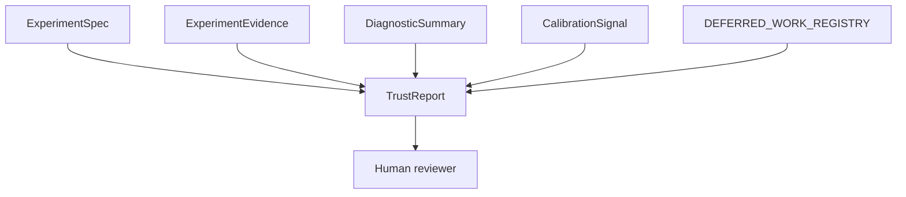
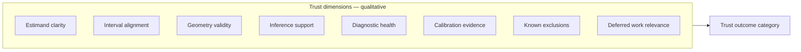

# Track B — TrustReport architecture 001

**Document ID:** TRACK-B-TRUST-REPORT-001  
**Status:** architecture design — planning artifact only  
**Last updated:** 2026-05-20  
**Package version:** 0.2.1 (current implementation)  

**Related:** [`TRACK_B_EXPERIMENT_SPEC_001.md`](TRACK_B_EXPERIMENT_SPEC_001.md) · [`TRACK_B_EXPERIMENT_EVIDENCE_001.md`](TRACK_B_EXPERIMENT_EVIDENCE_001.md) · [`TRACK_B_DIAGNOSTIC_SUMMARY_001.md`](TRACK_B_DIAGNOSTIC_SUMMARY_001.md) · [`TRACK_B_CALIBRATION_SIGNAL_001.md`](TRACK_B_CALIBRATION_SIGNAL_001.md) · [`TRACK_B_ARCHITECTURE_PLAN.md`](TRACK_B_ARCHITECTURE_PLAN.md) · [`TRACK_A_COMPLETION_REVIEW_001.md`](TRACK_A_COMPLETION_REVIEW_001.md) · [`PHASE13_GOVERNANCE_DECISION_001.md`](PHASE13_GOVERNANCE_DECISION_001.md) · [`PHASE15_GOVERNANCE_DECISION_001.md`](PHASE15_GOVERNANCE_DECISION_001.md) · [`EXPERIMENTATION_PLATFORM_VISION.md`](EXPERIMENTATION_PLATFORM_VISION.md) · [`OPEN_INVESTIGATIONS.md`](OPEN_INVESTIGATIONS.md) · [`DEFERRED_WORK_REGISTRY.md`](DEFERRED_WORK_REGISTRY.md)

This document defines the **TrustReport contract** — the reviewer-facing trust synthesis over ExperimentSpec, ExperimentEvidence, DiagnosticSummary, and CalibrationSignal. It is **architecture design only**. It does **not** implement code, APIs, schemas, release gates, trust scores, maturity labels, eligibility changes, or governance policy changes.

---

## 1. Executive purpose

### What TrustReport is

**TrustReport** is the **canonical trust synthesis** — a structured, narrative assessment that tells a reviewer **what the platform knows, what it does not know, and what limits apply** when interpreting a study for a declared business purpose. It is:

| Role | Description |
|------|-------------|
| **Trust synthesis** | Composes design intent, measurement, run quality, and historical instrument evidence into one honest assessment |
| **Reviewer aid** | Surfaces alignment, diagnostics, calibration scope, and deferred gaps with limits as prominent as passes |
| **Decision support artifact** | Informs human judgment on launch, budget, model refresh, or expert-review export — **does not decide** |



**Core philosophy** ([`EXPERIMENTATION_PLATFORM_VISION.md`](EXPERIMENTATION_PLATFORM_VISION.md)): **inconclusive ≠ no effect**. TrustReport distinguishes absence of evidence from evidence of absence. Limits and deferrals are first-class content — not footnotes.

### What TrustReport is not

| Not this | Why |
|----------|-----|
| **Experiment result** | Point, interval, paths → ExperimentEvidence |
| **Estimator certification** | OC archives + governance → CalibrationSignal; promotion is separate policy chain |
| **`production_safe` label** | Frozen — no TrustReport field assigns it |
| **Release gate** | Gates may *read* TrustReport; TrustReport does not implement gating (§10) |
| **Trust score** | No numeric composite index (§10) |
| **Maturity label** | VALIDATION_COVERAGE unchanged |
| **Eligibility registry** | `NOMINAL_CALIBRATION_ELIGIBLE_CONFIGS` unchanged |
| **Automated approval** | Advisory only; human retains accountability |

### Platform role

TrustReport is the **honesty layer** for MIP/GeoX UI, MMM intake, agents, and portfolio review — replacing implicit pass/fail tone from experiment cards and readiness profiles as the **canonical trust narrative** ([`TRACK_B_ARCHITECTURE_PLAN.md`](TRACK_B_ARCHITECTURE_PLAN.md) §7).

Track B contract stack completion:

```
ExperimentSpec → ExperimentEvidence → DiagnosticSummary
                                      ↘
CalibrationSignal ───────────────────→ TrustReport
```

**INV-021 note:** User-randomized and cross-modality outcome refinements remain in [`OPEN_INVESTIGATIONS.md`](OPEN_INVESTIGATIONS.md) — this document ratifies **core taxonomy**; Track C may extend categories without changing synthesis architecture.

---

## 2. Inputs

TrustReport is **derived** — always produced from upstream contracts plus deferred-work context. It owns **interpretation and outcome categories**, not raw facts.

### Composition model

```
TrustReport = synthesize(
    ExperimentSpec,           # declared claim
    ExperimentEvidence,       # measurement + alignment facts
    DiagnosticSummary,        # this-run quality
    CalibrationSignal,        # historical instrument scope
    DEFERRED_WORK_REGISTRY,   # known platform limits
    trust_intent              # optional: intended use from spec
)
```

### ExperimentSpec inputs

| Spec facet | TrustReport use |
|------------|-----------------|
| `primary_estimand` + aggregation | Anchor for alignment verdict |
| `modality`, randomization unit | Modality-appropriate rules |
| `study_purpose` | Business vs calibration vs holdout — scopes outcome interpretability |
| `measurement_plan` | Expected instrument; plan violation detection |
| `geometry_class` (when declared) | Geometry validity dimension |
| `interference_assumptions` | Spillover narrative context |
| `trust_report_profile` / intended action | Frames which outcomes are relevant (launch vs null screen) |
| `spec_version` | Stale/superseded detection with evidence |

**Rule:** TrustReport **summarizes** declared intent — does not redefine estimand.

### ExperimentEvidence inputs

| Evidence facet | TrustReport use |
|----------------|-----------------|
| Point + interval | Direction and precision for outcome (when scope permits) |
| Alignment flags | Estimand / interval / scale dimensions |
| `path_interval_type` | Placebo vs CI discipline |
| `lift_detection_calibrated` | Lift claim feasibility |
| `measurement_instrument_id` | Match to CalibrationSignal |
| `calibration_signal_id` + version | Scope + stale calibration |
| Failure / skip metadata | `not_assessable` paths |
| Provenance | Freshness, package version |

**Rule:** TrustReport **interprets** evidence — does not duplicate full measurement tensors.

### DiagnosticSummary inputs

| Diagnostic facet | TrustReport use |
|------------------|-----------------|
| Trust-modifier facets | Diagnostic health dimension; highlights |
| Informational facets | Context in narrative — rarely sole outcome driver |
| Expert-review checklist | Completeness — diagnostics requested vs omitted |
| Waiver visibility | `supported_with_limitations` when waived |
| `characterized_limit_refs` | Links INV-030/031 context into narrative |

**Rule:** Single review flag **never** alone determines outcome (DiagnosticSummary §5).

### CalibrationSignal inputs

| Signal facet | TrustReport use |
|--------------|-----------------|
| `usage_boundary` | Calibration evidence dimension |
| `scope_of_validity` | What historical OC covers |
| Scenario sub-states (`null_oc_passed`, `positive_oc_failed`) | Lift vs null-monitor claims |
| `lift_detection_calibrated` | Blocks `supported` for lift when false |
| `governed_interpretation`, `prohibited_claims` | Narrative limits |
| `def_refs` | Cross-link to deferred work section |
| `lifecycle_state` | Exploratory → `not_assessable` for strong claims |

**Rule:** TrustReport **consumes** signal — does not redefine instrument OC (§7).

### DEFERRED_WORK_REGISTRY inputs

| Registry facet | TrustReport use |
|----------------|-----------------|
| Active DEF entries linked from signal or dimensions | Known exclusions section |
| `why deferred`, `risk if not addressed` | Narrative honesty |
| **Not** disposition management | Registry authority unchanged (§8) |

### Optional context (not separate contracts)

| Input | Use |
|-------|-----|
| `OPEN_INVESTIGATIONS.md` | Agent/citation context — not automatic TrustReport sections |
| Human waiver notes on evidence | Limitation narrative |
| Freshness policy | `stale` outcome when triggered |

---

## 3. Trust dimensions

TrustReport organizes assessment along **dimensions** — qualitative facets of the synthesis. Dimensions are **described, not scored**. No weights, no 0–100 index, no traffic-light aggregate.



### Dimension reference

| Dimension | Question asked | Primary inputs |
|-----------|----------------|----------------|
| **Estimand clarity** | Is the declared claim explicit and matched to measurement? | Spec primary estimand; evidence alignment flags; INV-003 aggregation |
| **Interval alignment** | Does uncertainty mean what the claim assumes? | Evidence interval estimand, `path_interval_type`; DID policy |
| **Geometry validity** | Is the run within instrument + inference geometry scope? | Spec geometry; evidence geometry; signal `known_exclusions` |
| **Inference support** | Does the inference mode support the intended claim type? | Evidence inference record; signal usage_boundary; Phase 13/15 |
| **Diagnostic health** | Is this run's quality acceptable for the claim? | DiagnosticSummary trust modifiers |
| **Calibration evidence** | What do archives permit for this instrument? | CalibrationSignal lifecycle + scenario sub-states |
| **Known exclusions** | What is explicitly out of scope? | Signal `prohibited_claims`, `scope_of_validity` |
| **Deferred work relevance** | Which platform gaps touch this assessment? | DEF refs from signal + dimension triggers |

### Dimension → narrative (not score)

Each dimension produces **structured prose blocks**:

| Block type | Example |
|------------|---------|
| **supports** | “Declared `relative_att_post` aligns with family export and interval estimand.” |
| **limits** | “Historical OC shows zero lift-detection power on recovery battery (DEF-013).” |
| **unknown** | “Diagnostics not requested — pretrend status unavailable.” |
| **excluded** | “Placebo on multi-treated panel outside archived geometry (Phase 15).” |

**No dimension rollup score.** Outcome category (§4) is a ** categorical judgment** from dimension blocks + intended use — not a weighted sum.

---

## 4. Trust outcomes

Trust outcomes are **conceptual categories** — not numeric scores, not maturity labels, not eligibility states. A TrustReport has **one primary outcome** plus optional **secondary qualifiers** and **modality-specific extensions** (INV-021).

### Primary outcome taxonomy (platform core)

| Outcome | Meaning | Typical conditions |
|---------|---------|-------------------|
| **`supported`** | Under declared estimand and intended use, evidence **supports** the directional claim within calibration scope | Alignment true; diagnostics no blocking modifiers; signal permits claim type; interval excludes zero in lift direction when lift claim intended |
| **`supported_with_limitations`** | Evidence supports a **bounded** claim — waivers, narrow calibration scope, or expert-review-only usage | Pretrend waiver; null-monitor-only with null-screen intent; point-only with no interval lift claim |
| **`inconclusive`** | **Insufficient evidence** for the intended claim — **not** “no effect” | Zero power context; wide intervals including zero; underpowered design; heterogeneous aggregation without contract |
| **`unsupported`** | Evidence **contradicts** claim, or measurement **incompatible** with declared estimand | `incompatible_estimand`; scale mismatch; placebo_band treated as lift CI; geometry outside scope with failed run |
| **`not_assessable`** | Trust synthesis **cannot run responsibly** — missing inputs or exploratory-only calibration | No spec estimand; evidence/spec version mismatch; exploratory signal only for strong claims; total measurement failure |

### Directional refinements (optional qualifiers)

When outcome is `supported` or `supported_with_limitations`, direction may be qualified **without changing category**:

| Qualifier (conceptual) | Meaning |
|------------------------|---------|
| `direction_positive` | Point and applicable interval favor positive incremental effect |
| `direction_negative` | Favors negative incremental effect |
| `direction_null_consistent` | Consistent with null — **distinct from inconclusive** when null-screen is intended use |

**Vision alignment:** [`EXPERIMENTATION_PLATFORM_VISION.md`](EXPERIMENTATION_PLATFORM_VISION.md) uses `supported_positive` / `supported_negative` — mappable to `supported` + directional qualifier in implementation.

### Specialized outcomes (cross-reference — same architecture)

These map to primary categories but preserve governed vocabulary:

| Specialized label | Maps to | Source |
|-------------------|---------|--------|
| `incompatible_estimand` | `unsupported` | DEF-018, alignment flags |
| `calibration_unavailable` | `not_assessable` or `inconclusive` | Missing/stale signal — intent-dependent |
| `underpowered` | `inconclusive` | Spec MDE + feasibility (INV-022 future) |
| `stale` | `not_assessable` | Superseded evidence/spec |
| `interference_detected` | `unsupported` or `supported_with_limitations` | Requires estimator backing (DEF-004) — today design review only → usually limitation narrative |

### Outcome selection rules (conceptual)

1. **Check assessability** — missing spec/evidence/signal → `not_assessable`.  
2. **Check compatibility** — estimand/interval/geometry mismatch → `unsupported`.  
3. **Match intended use to calibration scope** — null-monitor instrument + lift launch claim → `inconclusive` or `unsupported`, not `supported`.  
4. **Apply diagnostics** — blocking modifiers → downgrade to `supported_with_limitations` or `inconclusive`.  
5. **Apply evidence direction** — only if steps 1–4 permit directional claim.

**Phase 13/15 hard rules:**

| Situation | Outcome constraint |
|-----------|-------------------|
| SCM JK null pass + positive lift launch | **`inconclusive`** for lift — not `supported` (DEF-013) |
| Placebo positive coverage = 1 | **`inconclusive`** for lift — not `supported` (Phase 15) |
| BRB null pass + lift claim | **`inconclusive`** — positive OC failed (DEF-002) |
| KFold on default DGP + calibration claim | **`not_assessable`** or **`unsupported`** for trusted calibration — runnable ≠ trusted |

---

## 5. Narrative generation

TrustReport narrative is **structured explanation** — not a score, not a single adjective. Every report includes three narrative obligations.

### Narrative structure (conceptual sections)

| Section | Content |
|---------|---------|
| **1. Study claim summary** | From ExperimentSpec — what was intended, modality, primary estimand, intended use |
| **2. What supports trust** | Dimension blocks with citations to evidence, diagnostics, calibration archives |
| **3. What reduces trust** | Trust modifiers, misalignments, geometry exclusions, waived failures |
| **4. What remains unknown** | Missing diagnostics, exploratory calibration, open investigations, uncharacterized instruments |
| **5. Deferred platform limits** | DEF-xxx summaries relevant to this assessment |
| **6. Outcome statement** | Primary category + qualifiers + explicit non-claims |
| **7. Human governance footer** | Advisory only; no automated decisioning; inconclusive ≠ no effect |

### What supports trust (examples)

| Support type | Narrative pattern |
|--------------|-------------------|
| Estimand alignment | “Family export and interval estimand match declared `relative_att_post` (aggregation mode B).” |
| Point quality | “Point estimate direction consistent with declared estimand; recovery-class accuracy on similar DGPs (evidence + signal).” |
| Null screening | “For null-monitor intent: SCM UnitJackKnife archived null FPR = 0 at n≥100 (Run 001, Phase 11).” |
| Diagnostic pass | “Pre-period residual drift ok; donor concentration within review thresholds.” |
| Expert-review discipline | “Pretrend warn with documented waiver — point interpreted under waiver (DiagnosticSummary).” |

### What reduces trust (examples)

| Reduction type | Narrative pattern |
|----------------|-------------------|
| Lift claim on null-monitor instrument | “Intervals conservative by design; archived positive power = 0 — lift detection not supported (DEF-013, CalibrationSignal).” |
| Interval semantics | “Placebo band is null-reference envelope, not confidence interval for ATT (Phase 15).” |
| Geometry | “Multi-treated Placebo outside archived OC — geometry not assessable for placebo claims.” |
| Aggregation | “Heterogeneous multi-geo panel — pooled vs cell estimand drift possible (DEF-009).” |
| Spillover | “Partial interference declared; no spillover-adjusted estimator (DEF-004) — incrementality may be overstated.” |

### What remains unknown (examples)

| Unknown type | Narrative pattern |
|--------------|-------------------|
| Opt-in diagnostics | “Review flags not requested — donor health not assessed this run.” |
| Track C modality | “A/B SRM not yet characterized — assignment integrity unknown.” |
| MMM bridge | “No experiment-to-MMM transform OC — calibrated contribution not assessable (DEF-012).” |
| INV-031 pending | “Cross-mode conservatism synthesis not yet archived — lift narrative uses Phase 13 boundaries only.” |

### Narrative constraints

| Constraint | Rationale |
|------------|-----------|
| **Cite archives** | Run 001, Phase 11–15, governance decisions — not “well calibrated” without source |
| **Limits ≥ passes** | At least one limit or exclusion when signal has `def_refs` |
| **No unsourced promotion** | Agents must ground on TrustReport sections + linked docs |
| **Plain language + IDs** | Human-readable prose with `def_refs`, archive IDs for audit |
| **No composite score** | Prohibited |

---

## 6. Trust boundaries

Trust boundaries are **hard semantic fences** — violations drive `unsupported` or constrain outcomes regardless of point estimate direction.

### Unsupported geometry

| Boundary | Source | TrustReport behavior |
|----------|--------|---------------------|
| Placebo on multi-treated panel | Phase 15 — 100% NotImplemented | `unsupported` or `not_assessable` for Placebo claims; cite geometry |
| Placebo outside single-treated OC | Signal `known_exclusions` | Limit narrative; block lift from Placebo alone |
| KFold multi-treated pre-fix failure | Historical; post-fix runnable | Distinguish **run completed** vs **calibration trusted** — Phase 13 + DEF-001 |
| Instrument geometry ⊄ signal scope | CalibrationSignal | `calibration_unavailable` / `not_assessable` for out-of-scope claims |

### Estimand mismatch

| Boundary | Source | TrustReport behavior |
|----------|--------|---------------------|
| Declared ≠ family export | Evidence alignment flags | `unsupported` — `incompatible_estimand` |
| Absolute business question vs relative measurement | DEF-018 | `unsupported` without transform |
| Aggregation undeclared on heterogeneous multi-geo | DEF-009 | `inconclusive` minimum |
| Silent geo ATT on A/B study | INV-020 future | `unsupported` when modalities mixed |

### Interval mismatch

| Boundary | Source | TrustReport behavior |
|----------|--------|---------------------|
| `placebo_band` interpreted as lift CI | Phase 15 | `unsupported` |
| DID cumulative interval vs relative ATT claim | DEF-003, `did_relative_att_interval_unsupported` | Interval not supporting relative lift claim — `supported_with_limitations` (point) or `unsupported` (interval lift) |
| Interval estimand ≠ declared | Evidence flags | `unsupported` |
| Null envelope includes zero on positive (Placebo) | INV-031 H7 | **`inconclusive`** for lift — not failure |

### Calibration gaps

| Boundary | Source | TrustReport behavior |
|----------|--------|---------------------|
| No CalibrationSignal for instrument | Missing reference | `not_assessable` for calibration-backed claims |
| Exploratory lifecycle only | Signal state | Strong claims → `not_assessable` |
| Stale signal version | Evidence pin mismatch | `stale` qualifier → `not_assessable` until refreshed |
| Package-wide calibration implied | DEF-015 | Prohibit — only SCM JK null monitor eligible |
| Positive OC failed on instrument | DEF-002, DEF-013 | Lift claims → `inconclusive` |

### Spillover concerns

| Boundary | Source | TrustReport behavior |
|----------|--------|---------------------|
| No spillover term in estimators | DEF-004 | Design review + AugSynth spillover DGP bias — **`supported_with_limitations`** at best for geo incrementality |
| `interference_detected` outcome | Requires estimator backing | **Not emitted** from design review alone today — limitation narrative instead |
| AugSynth on contamination DGP | Phase 14 | Material point bias documented — limitation |

### Deferred validity regions

Regions where platform **explicitly defers** strong claims — TrustReport must **surface**, not hide:

| Region | DEF / INV | Default outcome impact |
|--------|-----------|------------------------|
| Lift detection on geo recovery battery | DEF-013, INV-031 | `inconclusive` for lift |
| BRB positive calibration | DEF-002 | `inconclusive` for interval lift |
| KFold trusted calibration | DEF-001 | `not_assessable` for trusted calibration |
| DID relative intervals | DEF-003 | Point may be `supported_with_limitations`; interval lift `unsupported` |
| MMM feed without resolver | DEF-012, INV-023 | `not_assessable` for MMM |
| Jackknife alternatives | DEF-021, INV-030 | Informational — does not upgrade current JK path |

---

## 7. Relationship to CalibrationSignal

| Principle | Implication |
|-----------|-------------|
| **Historical scope lives on signal** | OC metrics, usage_boundary, lifecycle — authoritative on instrument |
| **TrustReport interprets against live claim** | Same signal → different outcome if intent is null-screen vs lift launch |
| **No redefinition** | TrustReport must not contradict `governed_interpretation` or invent eligibility |
| **Separate scenario classes** | Null OC pass does not upgrade lift outcome (Phase 13) |
| **Reference by ID** | `calibration_signal_id` + version on evidence → pinned scope |

### Consumption pattern

```
1. Resolve measurement_instrument_id from evidence
2. Load CalibrationSignal (or detect missing/stale)
3. Compare intended use (spec) to usage_boundary + positive_oc sub-states
4. Populate calibration evidence dimension + known exclusions
5. Select outcome category — signal does not emit outcome
```

### Common misreadings TrustReport must prevent

| Misreading | TrustReport correction |
|------------|------------------------|
| “Calibrated because null FPR = 0” | Null-monitor scope only unless lift OC archived |
| “Placebo coverage = 1 on positive = lift” | `inconclusive` — null-envelope semantics |
| “BRB fixed = production ready” | Restricted — positive under-coverage (DEF-002) |
| “KFold runs = trusted” | Runnable-not-trusted — DEF-001 |
| “Eligible config = package calibrated” | DEF-015 — single config, null monitor only |

---

## 8. Relationship to Deferred Work Registry

TrustReport **surfaces** relevant DEF entries; it **does not** manage registry lifecycle.

| TrustReport role | Registry role |
|------------------|-----------------|
| Quote `why deferred` and `risk if not addressed` in narrative | Authoritative disposition |
| Link DEF IDs from CalibrationSignal `def_refs` + dimension triggers | Maintain entries |
| Explain how DEF limits this study's claims | Revisit triggers for future work |
| **Never** close, reopen, or change DEF status | Governance process only |

### Surfacing rules

| When | Action |
|------|--------|
| Signal includes `def_refs` | **Mandatory** DEF section entries |
| Dimension hits known gap (e.g. spillover) | Include DEF-004 even if not on signal |
| Outcome is `inconclusive` due to deferred OC | Cite DEF-002 / DEF-013 with mechanism |
| No relevant DEF | Section omitted — not “all clear platform-wide” |

**Distinction:** DEF explains **platform** limits; DiagnosticSummary explains **this run**. Both appear in TrustReport when applicable.

---

## 9. Future A/B and Conversion Lift compatibility

TrustReport architecture is **modality-neutral** — future modalities add **inputs and boundary rules**, not a separate trust stack.

### Extension model

| Layer | Extension approach |
|-------|-------------------|
| ExperimentSpec | User/session unit, exposure rules, sequential design params |
| ExperimentEvidence | Arm stats, SRM inputs, exposure eligibility counts |
| DiagnosticSummary | Balance, SRM, peeking facets |
| CalibrationSignal | A/B- and CLS-specific instrument signals |
| TrustReport | Same dimensions, outcomes, narrative — modality-specific boundary table |

### A/B: CUPED, SRM, sequential tests

| Topic | TrustReport handling (future) |
|-------|------------------------------|
| **CUPED** | Estimand clarity dimension — variance reduction valid only if estimand contract preserved (INV-022); mismatch → `unsupported` |
| **SRM** | Diagnostic health + assignment integrity; dedicated SRM instrument signal (INV-025); SRM fail → `unsupported` or `inconclusive` by severity |
| **Sequential testing** | Inference support dimension — alpha spending must be declared on spec; undeclared peeking → `supported_with_limitations` or `unsupported` (INV-024) |
| **Geo OC inheritance** | **Forbidden** — A/B claims require A/B CalibrationSignal |

### Conversion Lift (CLS)

| Topic | TrustReport handling |
|-------|---------------------|
| **Exposure opportunity logging** | Geometry validity — incrementality requires eligible exposure (INV-026); missing → `not_assessable` |
| **Ghost-ad semantics** | Narrative in inference support; external methodology informs labels only |
| **Incremental conversions vs geo ATT** | Estimand clarity — cross-modality equivalence **unsupported** |
| **Google Conversion Lift style** | Same outcome taxonomy — no vendor certification without archived OC |

### Holdouts and MMM calibration

| Topic | TrustReport handling |
|-------|---------------------|
| **Holdout replay** | Study purpose on spec; upstream evidence refs in narrative; freshness → `stale` |
| **MMM calibrated contribution** | Requires transform + DEF-012 resolver; raw lift → `not_assessable` for MMM feed |
| **Conflict detection** | Future: `unsupported` when model implied lift contradicts experiment under shared estimand |
| **CalibrationSignal chain** | Holdout TrustReport consumes experiment signals by reference — no redefinition |

### INV-021 (user-randomized semantics)

Track C may add outcome qualifiers (e.g. exposure-eligible population). **Core categories unchanged:** supported · supported_with_limitations · inconclusive · unsupported · not_assessable.

---

## 10. Non-goals

This document **does not**:

| Non-goal | Notes |
|----------|-------|
| **Trust scores** | No 0–100, stars, grades, or weighted index |
| **Release gates** | Gates are separate concept — may read TrustReport, not defined here |
| **Automatic approvals** | No auto-launch, auto-budget, auto-MMM feed |
| **Estimator promotion** | Promotion policy chain unchanged |
| **Maturity labels** | VALIDATION_COVERAGE untouched |
| **Eligibility changes** | Registry remains `SCM_UnitJackKnife` only |
| **Workflow orchestration** | No pipeline, CI gate, or product feature flags |
| **Implementation schema / APIs / code** | Architecture only |
| **Modify governance policies** | Phase 13/15 preserved |
| **Close DEF or INV items** | References only |

This document **does**:

- Define TrustReport as **trust synthesis** for human reviewers  
- Specify **inputs**, **dimensions**, **outcomes**, and **narrative** obligations  
- Document **trust boundaries** from Track A governance  
- Clarify relationships to **CalibrationSignal** and **DEF registry**  
- Extend to **A/B, CLS, holdout, MMM** without semantic fork  
- Provide **worked examples** for governed geo instruments  

---

## 11. Worked examples

Illustrative TrustReport reasoning for existing governed instruments — **outcome categories only, no scores**. Intended uses vary; outcomes shown for stated intent.

### SCM_UnitJackKnife — null monitor

**Setup:** Geo study; spec intent = **conservative null screen** on `relative_att_post`; SCM + UnitJackKnife; default multi-treated; diagnostics ok; signal = governed null_monitor_only.

| Dimension | Assessment |
|-----------|------------|
| Estimand clarity | Aligned |
| Interval alignment | CI aligned to relative_att_post |
| Geometry validity | Within signal scope |
| Inference support | Null-monitor intent matches usage_boundary |
| Diagnostic health | No blocking modifiers |
| Calibration evidence | Run 001 + Phase 11 null FPR = 0 |
| Known exclusions | Not a lift detector (DEF-013) |
| Deferred relevance | DEF-013, DEF-015 |

**Outcome:** **`supported_with_limitations`** — null-screen intent supported; **`direction_null_consistent`** if interval includes zero appropriately.

**If intent were positive lift launch:** **`inconclusive`** — positive power = 0 archived; explicitly **not** “no effect.”

**Narrative excerpt:** “Null monitoring supported by production-tier OC. Positive lift detection not supported by archived intervals (DEF-013). This is expected instrument behavior, not a run failure.”

---

### TBRRidge_BRB — restricted after Run 002

**Setup:** Geo study; intent = **positive lift** for budget decision; TBRRidge + BRB; null diagnostics ok; signal = restricted, positive_oc_failed.

| Dimension | Assessment |
|-----------|------------|
| Estimand clarity | Aligned |
| Interval alignment | Aligned relative CI — but narrow on positive DGP |
| Inference support | Null viable; lift not calibrated |
| Calibration evidence | Run 002 null pass; positive coverage = 0 |
| Deferred relevance | DEF-002 |

**Outcome:** **`inconclusive`** for lift claim — accurate point may be noted in narrative under inference support, but **not** `supported` for launch.

**Narrative excerpt:** “BRB null behavior sane post Run 002. Intervals too narrow for positive-scenario coverage on recovery-class DGP (DEF-002). Budget launch on interval significance alone is not supported.”

---

### TBRRidge_KFold — runnable but not trusted

**Setup:** Geo study; intent = **nominal calibration confidence**; TBRRidge + KFold; multi-treated panel; post-fix run completes; signal = restricted, runnable-not-trusted.

| Dimension | Assessment |
|-----------|------------|
| Geometry validity | Run completes post-fix — execution ok |
| Calibration evidence | No production OC trust on default DGP; eligibility excluded |
| Inference support | fold_instability warn if diagnostics run — optional |
| Deferred relevance | DEF-001 |

**Outcome:** **`not_assessable`** for trusted calibration claim; if intent were exploratory point review with diagnostics ok → **`supported_with_limitations`** (point only, no calibration trust).

**Narrative excerpt:** “KFold executes on multi-treated geometry after fix but remains outside trusted calibration scope (Phase 13, DEF-001). Runnable ≠ trusted.”

---

### AugSynthCVXPY — point-only

**Setup:** Geo study; intent = **expert-review point estimate**; AugSynthCVXPY point path (no inference); spillover partial interference declared; signal = point_only + DEF-004.

| Dimension | Assessment |
|-----------|------------|
| Estimand clarity | Aligned on default DGP |
| Interval alignment | None — point-only path |
| Diagnostic health | Spillover design review — limitation |
| Calibration evidence | Phase 14 point recovery strong; spillover DGP bias archived |
| Deferred relevance | DEF-004, DEF-019 |

**Outcome:** **`supported_with_limitations`** for point direction under expert review — **not** `supported` for interval lift or MMM feed.

**Narrative excerpt:** “Point recovery characterized on standard DGP. No aligned interval for lift claims. Partial interference and spillover stress bias documented (DEF-004, Phase 14 contamination cell).”

---

### SCM Placebo — null-reference diagnostic

**Setup:** Geo study; **single-treated** panel; intent = **placebo null-reference check**; SCM + Placebo; `placebo_band` on evidence; signal = null_reference_diagnostic, single_treated_only.

| Dimension | Assessment |
|-----------|------------|
| Interval alignment | placebo_band — not ATT CI |
| Geometry validity | Within single-treated OC |
| Inference support | Matches null-reference intent |
| Calibration evidence | Phase 15 null FPR = 0; positive power = 0 |
| Deferred relevance | DEF-020 |

**Outcome:** **`supported_with_limitations`** for null-reference diagnostic intent.

**If intent were lift detection:** **`inconclusive`** — intervals include zero on positive by design (Phase 15).

**If multi-treated panel:** **`not_assessable`** for Placebo claims — unsupported geometry.

**Narrative excerpt:** “Placebo band is a null-reference envelope (Phase 15), not a confidence interval for incremental lift. Suitable for expert-review comparison when geometry is single-treated.”

---

## Appendix A — TrustReport document shape (conceptual, not schema)

| Field (conceptual) | Description |
|--------------------|-------------|
| `trust_report_id` | Unique report ID |
| `evidence_id`, `spec_version` | Provenance |
| `generated_at` | Timestamp |
| `primary_outcome` | Category from §4 |
| `outcome_qualifiers` | Direction, stale, etc. |
| `dimension_narratives` | supports / limits / unknown per dimension |
| `diagnostic_highlights` | From DiagnosticSummary |
| `calibration_scope_summary` | From CalibrationSignal — quoted, not redefined |
| `deferred_work_citations` | DEF IDs + one-line risk |
| `human_governance_footer` | Advisory disclaimer |
| `archive_citations` | Run 001, Phase docs as needed |

---

## Appendix B — Today → TrustReport mapping (GeoX transition)

| Today | TrustReport role |
|-------|------------------|
| Experiment card conclusions | **View** — must align with TrustReport outcome |
| Readiness assessment | **Input** — demoted from primary truth |
| Implicit “significant effect” copy | Replaced by outcome category + narrative |
| Phase 13/15 boundaries | Encoded in boundaries + examples |
| No DEF surfacing | **Mandatory** when relevant |

---

## Appendix C — Track B stack completion

| Contract | Role in TrustReport |
|----------|---------------------|
| ExperimentSpec | Declared claim anchor |
| ExperimentEvidence | Measurement facts |
| DiagnosticSummary | This-run quality |
| CalibrationSignal | Historical instrument scope |
| DEFERRED_WORK_REGISTRY | Platform limit citations |
| **TrustReport** | **Synthesis + outcome + narrative** |

**Suggested follow-on (optional, not required for architecture closure):**

- Track B B1 geo adapter spec (views, not rewrite)  
- `ROADMAP_V5.md` re-audit after schema MVP planning  
- INV-031 synthesis before TrustReport **implementation** in code  

---

## Appendix D — Success criterion

**Architecture achieved when:**

1. TrustReport is defined as **trust synthesis** — not result, certification, production_safe, or gate.  
2. **Inputs** from all four Track B contracts + DEF registry are specified.  
3. **Dimensions** are qualitative — **no scores**.  
4. **Outcome categories** cover supported · supported_with_limitations · inconclusive · unsupported · not_assessable.  
5. **Narrative** obligations explain supports, reductions, and unknowns.  
6. **Trust boundaries** encode Phase 13/15 and DEF limits.  
7. **Worked examples** show reasoning for five governed geo instruments.  
8. **Modality-neutral** extension path for A/B, CLS, holdout, MMM is clear.

**Track B architecture document set (B0):** ExperimentSpec · ExperimentEvidence · DiagnosticSummary · CalibrationSignal · **TrustReport** — complete for planning phase.

---

*Planning artifact TRACK-B-TRUST-REPORT-001. Architecture design only — no code, schemas, scores, gates, or policy changes.*
