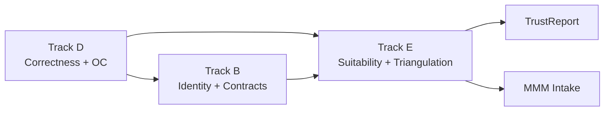

# Track E — Method Suitability & Triangulation Framework 001

**Document ID:** TRACK-E-SUITABILITY-TRIANGULATION-001  
**Type:** Framework ADR (E0)  
**Status:** **E0–E6 complete** (documentation + contract tests) — E7 production implementation deferred  
**Date:** 2026-06-01  
**Lane:** Research / governance bridge (pre-MMM)  

**Related:** [`TRACK_B_MEASUREMENT_INSTRUMENT_CATALOG_001.md`](TRACK_B_MEASUREMENT_INSTRUMENT_CATALOG_001.md) · [`TRACK_B_ESTIMAND_REGISTRY_001.md`](TRACK_B_ESTIMAND_REGISTRY_001.md) · [`TRACK_D_METHOD_INVENTORY_AND_ROBUSTNESS_MATRIX_001.md`](TRACK_D_METHOD_INVENTORY_AND_ROBUSTNESS_MATRIX_001.md) · [`ROADMAP_ALIGNMENT_GATE.md`](ROADMAP_ALIGNMENT_GATE.md) · M2.2 TrustReport · Track D D1–D3 audits

---

## 1. North star

GeoX produces **governed causal evidence**, not raw estimator outputs. MMM and planning consume evidence only when it passes **instrument-level** suitability, triangulation, and conflict rules.

**Governance correction ([ROADMAP-DESIGN-READOUT-UPDATE-001](ROADMAP_DESIGN_READOUT_UPDATE_001.md)):** Suitability and OC are **design-method × geometry-mode × measurement-instrument** specific. **SCM+UnitJackKnife** is the current **reference null-monitor branch** for fixed-window unit-level D5 OC—not the universal GeoX readout, not platform-wide MDE, and not lift detection. Track E E1/E2 must issue **separate cards** for TBRRidge+KFold, BRB, DID+bootstrap, AugSynth, placebo, and geo `PowerAnalysis` diagnostic path, each with its own D5 evidence before promotion.

**Track E governs:**

- Which methods are **suitable** for a given test’s data geometry and diagnostics  
- How **multiple Measurement Instruments** on the same test are **compared** (triangulation)  
- How **conflicts** are classified and surfaced in TrustReport  
- When evidence may become **CalibrationSignal** vs remain TrustReport-only / diagnostic / blocked  

**Track E does not:** prove estimator math (Track D), define export contracts (Track B), or implement MMM intake.

---

## 2. Measurement Instrument reminder

The trusted object is **not** an estimator alone and **not** an inference mode alone.

| Dimension | Example |
|-----------|---------|
| Modality | `geo` |
| Estimator | `SyntheticControl`, `TBRRidge`, `DID` |
| Inference | `UnitJackKnife`, `Placebo`, `Kfold`, `BlockResidualBootstrap` |
| Geometry | `single_treated_only`, `multi_treated_default` |
| Estimand | `geo.relative_att_post.pooled_path.relative` |
| Interval semantics | `confidence_interval`, `placebo_band`, `cumulative_att_interval`, `none` |

**Config alias** (e.g. `SCM_UnitJackKnife`) resolves to one full instrument ID.

---

## 3. Method Suitability Diagnostics

Diagnostics inform suitability; they do **not** auto-promote trust.

| Diagnostic | What it measures | Typical failure signal |
|------------|------------------|------------------------|
| Pre-period fit quality | SCM/TBR pre RMSE, R² | Poor donor match |
| Pre-trend stability | Drift, break tests | DID pretrend risk |
| Donor pool quality | N donors, concentration, corr filter | Sparse/unstable donors |
| Treated–control overlap | Balance, SMD | Selection bias |
| Geo heterogeneity | Unit-level dispersion | Pooled estimand risk |
| Treatment intensity heterogeneity | Effect variance across units | Cell-mean vs pooled divergence |
| Sparse treated units | Count, coverage | Unstable inference |
| Multi-treated geometry | Aggregation mode | KFold/JK/placebo scope |
| Post-period outliers | Robust z-scores | Interval inflation |
| Structural breaks / shifting trends | Break tests | AugSynth / SCM risk |
| Seasonality | Spectral / seasonal amp | TBR mis-specification |
| Residual autocorrelation | ACF on residuals | BRB block length risk |
| Coefficient instability | Ridge path / fold variance | TBRRidge instability |
| Fold stability | KFold path variance | DEF-001 geometry |
| Placebo feasibility | n_control, aggregation | Multi-treated blocked |
| Jackknife stability | LOO width concentration | Donor dominance |
| Spillover risk | Interference flags | AugSynth bias |
| Signal-to-noise / MDE | Power vs target lift | Underpowered test |
| Estimand alignment | Declared vs exported vs interval | Scale mismatch (DEF-003) |
| Scale alignment | Relative vs cumulative vs absolute | DID vs SCM compare error |
| Missing uncertainty | No intervals / wrong semantics | Point-only configs |
| Evidence freshness | CalibrationSignal age | Stale OC |

### 3.1 Diagnostic families (design-readout program)

**Authoritative inventory:** [`TRACK_E_E1_SUITABILITY_DIAGNOSTIC_INVENTORY_001.md`](TRACK_E_E1_SUITABILITY_DIAGNOSTIC_INVENTORY_001.md) — families **E-DES-WIN**, **E-SCM-DONOR**, **E-DES-MCELL**, **E-DES-GEO**, **E-INST-OC**, **E-ESTIMAND**, **E-CONFLICT**, **E-MMM**.

Summary (see E1 for full IDs and D5 links). From D5-POW-001d and [ROADMAP-DESIGN-READOUT-UPDATE-001](ROADMAP_DESIGN_READOUT_UPDATE_001.md):

**E-DES-WIN** (window / assignment stability)

| ID | Diagnostic |
|----|------------|
| E-DES-WIN-001 | Assignment stability across pre-period lengths |
| E-DES-WIN-002 | Pre-balance stability across windows |
| E-DES-WIN-003 | Readout FPR stability across windows |
| E-DES-WIN-004 | Post-period length adequacy |
| E-DES-WIN-005 | Fixed-window requirement for governed readout OC |

**E-SCM-DONOR** (donor sensitivity — SCM+JK branch)

| ID | Diagnostic |
|----|------------|
| E-SCM-DONOR-001 | Minimum donor/control count |
| E-SCM-DONOR-002 | Donor concentration / max donor weight |
| E-SCM-DONOR-003 | Leave-one-donor-out stability |
| E-SCM-DONOR-004 | Donor pool overlap with treated markets |
| E-SCM-DONOR-005 | Donor feasibility after whitelist/blacklist/constraints |
| E-SCM-DONOR-006 | Donor sensitivity by region/spend/channel constraints |

**E-DES-MCELL** (multi-cell geometry — not a design method)

| ID | Diagnostic |
|----|------------|
| E-DES-MCELL-001 | Method supports `n_test_grps > 1` |
| E-DES-MCELL-002 | Requested cell-count feasibility |
| E-DES-MCELL-003 | Per-cell balance quality |
| E-DES-MCELL-004 | Shared-control adequacy |
| E-DES-MCELL-005 | Per-cell donor/control count |
| E-DES-MCELL-006 | Per-cell UnitJackKnife feasibility (SCM+JK branch) |
| E-DES-MCELL-007 | Per-cell null FPR / null-monitor coverage |
| E-DES-MCELL-008 | Treatment-cell conflict / directional disagreement |
| E-DES-MCELL-009 | Multiple-comparison warning |
| E-DES-MCELL-010 | Minimum viable controls per cell |
| E-DES-MCELL-011 | No pooled multi-cell claim without governed pooling rule |
| E-DES-MCELL-012 | Recommended / maximum feasible cell count |

**Rules:** No naive averaging across instruments. No pooled multi-cell lift claim without governed pooling rule. No direct MMM feed outside CalibrationSignal and TrustReport governance.

---

## 4. Method Suitability Cards (summary)

**Authoritative cards:** [`TRACK_E_E2_METHOD_DESIGN_SUITABILITY_CARDS_001.md`](TRACK_E_E2_METHOD_DESIGN_SUITABILITY_CARDS_001.md) — design methods, geometry modes, measurement instruments, combination matrix.

**E2 delivered:** Each card includes design method identity, geometry mode (`single_cell`, `multi_cell`, `supergeo`, `trimmed_population`), compatible/incompatible readout instruments, window requirements, pre-period and donor diagnostics, shared-control adequacy (multi-cell), method-specific D5 OC evidence, and output role (CalibrationSignal / TrustReport-only / diagnostic-only / restricted / blocked) plus MMM implication.

### SCM + Unit Jackknife (`SCM_UnitJackKnife`) — reference null-monitor branch

| Field | Guidance |
|-------|----------|
| **Role** | **Reference readout** for D5 fixed-window unit-level null-monitor OC — **not** universal GeoX readout |
| **Good when** | ≥2 control units (JK), stable pre-fit, fixed chronological windows (D5-POW-001d) |
| **Risky when** | Donor concentration, poor pre-fit, 2-row aggregation proxy (D5-POW-001c), interval-excludes-zero as “power” (001b) |
| **Required diagnostics** | E-SCM-DONOR-*; E-DES-WIN-*; per-cell E-DES-MCELL-* when multi_cell |
| **Compatible geometries** | Unit-level `single_cell`; limited `multi_cell` with **per-cell** reporting only |
| **Incompatible geometries** | 2-row geo power panel; supergeo clusters |
| **Compatible estimands** | `relative_att_post` (pooled path) for **null monitor** only |
| **Failure modes** | Not lift detection; not platform MDE (001a optimistic_proxy for geo power) |
| **Track B role** | **null_monitor_only**; calibration-eligible |
| **D5 OC** | 001b null-monitor; 001d windows; **001e** design-method null FPR ✅ |

### SCM + Placebo (`SCM_Placebo`)

| Field | Guidance |
|-------|----------|
| **Good when** | Single-treated, ≥5 controls |
| **Risky when** | Multi-treated default DGP |
| **Interval semantics** | `placebo_band` — **not CI** |
| **Track B role** | **diagnostic_only** / null-reference |
| **D5 OC** | Phase 15 single-treated archive |

### TBRRidge + KFold / BRB

| Field | Guidance |
|-------|----------|
| **Good when** | Seasonal panels, sufficient pre periods |
| **Risky when** | Multi-treated without geometry fix validation |
| **Track B role** | **restricted** / runnable-not-trusted |
| **D5 OC** | DEF-001, DEF-002; not calibration-eligible today |

### DID + Bootstrap

| Field | Guidance |
|-------|----------|
| **Good when** | Parallel trends credible, panel DID structure |
| **Risky when** | Relative-ATT interval claims |
| **Interval estimand** | `cumulative_att` — not `relative_att_post` CI |
| **Track B role** | **restricted**; point path only for relative claims |

### AugSynth point / JK

| Field | Guidance |
|-------|----------|
| **Point** | Characterized; spillover DGP risk |
| **JK** | Mirrors SCM conservatism; **not** registry eligible without separate OC |

### Placebo (generic)

| Field | Guidance |
|-------|----------|
| **Role** | Null-reference diagnostic |
| **Never** | Lift detection or CalibrationSignal without single-treated OC |

### Unit Jackknife (primitive)

| Field | Guidance |
|-------|----------|
| **Shared primitive** | `unit_jk` — INV-D3-001 fix on `y_hat` anchor |
| **Governance** | Per **estimator × inference** instrument only |

### KFold / BRB / Bootstrap / Conformal

| Field | Guidance |
|-------|----------|
| **Status** | See Track D INF rows; card detail in **E2** |

---

## 5. Triangulation Output Model

**Authoritative schema:** [`TRACK_E_E3_TRIANGULATION_SCHEMA_001.md`](TRACK_E_E3_TRIANGULATION_SCHEMA_001.md)

Per-test **evidence profile** row (summary — see E3 for full contract):

| Field | Description |
|-------|-------------|
| `method_id` | Internal method key |
| `measurement_instrument_id` | Full catalog ID |
| `estimator_family` | SCM, TBRRidge, DID, … |
| `inference_family` | UnitJackKnife, Placebo, … |
| `point_estimate` | Governed point on declared estimand |
| `interval` | Bounds + `interval_semantics` |
| `estimand_id` | Registry ID |
| `geometry_status` | in_scope / out_of_scope / partial |
| `suitability_diagnostics` | Facet list + severities |
| `trust_role` | null_monitor / diagnostic / restricted / … |
| `known_restrictions` | DEF/INV refs |
| `conflict_status` | see §6 |
| `calibration_signal_eligibility` | bool + reason |

---

## 6. Conflict Taxonomy

**Fixtures:** [`TRACK_E_E4_TRUSTREPORT_CONFLICT_FIXTURES_001.md`](TRACK_E_E4_TRUSTREPORT_CONFLICT_FIXTURES_001.md) · [`tests/fixtures/track_e_conflicts/`](../../tests/fixtures/track_e_conflicts/)

| Class | Definition | TrustReport posture |
|-------|------------|---------------------|
| **benign_disagreement** | Methods differ within noise; same estimand/geometry | Inconclusive / note |
| **power_disagreement** | All underpowered; intervals wide | Underpowered profile |
| **estimand_disagreement** | Relative vs cumulative vs cell-mean | **incompatible** — block compare |
| **geometry_disagreement** | Single- vs multi-treated scope | partial export / not_assessable |
| **diagnostic_only_disagreement** | Placebo vs CI semantics | Do not compare as lift |
| **outlier_sensitive_disagreement** | One method driven by outliers | Flag robustness |
| **trend_break_disagreement** | Pre-trend / break drives split | Follow-up design |
| **high_trust_directional_conflict** | Governed instruments disagree on sign | **severe** — expert review |
| **severe_conflict** | Incompatible estimand + opposite signs | Exclude from MMM; require new test |

**Rule:** No averaging conflicting point estimates without a governed aggregation rule (none by default).

---

## 7. TrustReport Mapping (E4)

**Golden fixtures:** E4 dispositions (`directional_support_with_caveats`, `method_conflict_warning`, `cell_level_conflict`, …) — see E4 doc.

| Situation | Alignment / trust guidance |
|-----------|----------------------------|
| High-trust agreement | Same estimand, in-scope geometry, compatible semantics → may support `null_viability` only if boundary allows |
| High vs low trust disagreement | Weight by instrument tier (governed > restricted > characterized) |
| All underpowered | `inconclusive`; no lift claim |
| Invalid geometry | `not_assessable` or `partial` |
| Estimator disagreement from data | Surface diagnostic facets; not auto-fail |
| Inference disagreement (CI vs placebo) | **incompatible** for interval-backed lift |
| Missing SE / wrong semantics | `unsupported` |
| Stale evidence | `not_assessable` for calibration-backed claims |
| Conflicting directional evidence | `divergent` / `inconclusive`; block MMM |

Existing composer rules in `trust_report.py` remain authoritative until E6 fixtures extend them.

---

## 8. MMM Consumption Rules

**Policy:** [`TRACK_E_E5_CALIBRATIONSIGNAL_ELIGIBILITY_POLICY_001.md`](TRACK_E_E5_CALIBRATIONSIGNAL_ELIGIBILITY_POLICY_001.md)

| Path | Criteria |
|------|----------|
| **CalibrationSignal** | Instrument governed + estimand match + interval semantics match + freshness + conflict rules pass + D5 OC archived |
| **TrustReport-only** | Useful diagnostic or restricted OC; not decision-grade |
| **Exclude** | Blocked geometry, estimand mismatch, severe conflict |
| **Forbidden** | Direct feed from research-only Track D artifacts without promotion bridge |
| **Forbidden** | Averaging conflicting estimates without governed rule |

---

## 9. Relationship to Existing Tracks

| Track | Owns |
|-------|------|
| **B** | Instrument IDs, adapter, TrustReport boundary, gold fixtures |
| **D** | Math audit, INF/EST status, D5 simulations |
| **E** | Suitability, triangulation, conflict interpretation, MMM-readiness policy |

---

## 10. Initial status table (2026-06-01)

| Instrument | Suitability | Triangulation role | CalibrationSignal | Notes |
|------------|-------------|-------------------|-------------------|-------|
| `SCM_UnitJackKnife` | Suitable with donor/pre-fit checks | Primary **null monitor** | Eligible; null_monitor_only | INV-D3-001 **fix accepted** (002b) |
| `SCM_Placebo` | Single-treated only | Null-reference diagnostic | Excluded | Multi-treated blocked |
| `TBRRidge_Kfold` | Restricted | Secondary; high conflict risk | Excluded | DEF-001 |
| `TBRRidge_BlockResidualBootstrap` | Restricted | Null-viable characterization | Excluded | DEF-002 |
| `DID_Bootstrap` | Restricted | Point directional only | Excluded | DEF-003 cumulative intervals |
| `AugSynthCVXPY_Point` | Characterized | Point triangulation only | Excluded | No aligned interval |
| Registry Bayesian | Blocked | Do not triangulate | Excluded | Not full MCMC |

---

## 11. Open questions

| ID | Question |
|----|----------|
| **E-OQ-1** | How to score suitability without false precision? |
| **E-OQ-2** | Rule-based conflict classification first vs ML? |
| **E-OQ-3** | Minimum D5 OC for CalibrationSignal eligibility expansion? |
| **E-OQ-4** | Multiple eligible CalibrationSignals per channel/test — precedence rules? |
| **E-OQ-5** | Weak signal vs method failure — operational thresholds? |
| **E-OQ-6** | TBRRidge JK after shared `unit_jk` fix — separate D5 before any trust upgrade? |

---

## 12. Roadmap (Track E)

| Phase | Deliverable | Status |
|-------|-------------|--------|
| **E0** | This framework ADR | **This document** |
| **E1** | Suitability diagnostic inventory | ✅ [`TRACK_E_E1_SUITABILITY_DIAGNOSTIC_INVENTORY_001.md`](TRACK_E_E1_SUITABILITY_DIAGNOSTIC_INVENTORY_001.md) |
| **E2** | Full method suitability cards | ✅ [`TRACK_E_E2_METHOD_DESIGN_SUITABILITY_CARDS_001.md`](TRACK_E_E2_METHOD_DESIGN_SUITABILITY_CARDS_001.md) |
| **E3** | Triangulation evidence schema | ✅ [`TRACK_E_E3_TRIANGULATION_SCHEMA_001.md`](TRACK_E_E3_TRIANGULATION_SCHEMA_001.md) |
| **E4** | Conflict taxonomy + TrustReport mapping fixtures | ✅ [`TRACK_E_E4_TRUSTREPORT_CONFLICT_FIXTURES_001.md`](TRACK_E_E4_TRUSTREPORT_CONFLICT_FIXTURES_001.md) |
| **E5** | CalibrationSignal eligibility policy | ✅ [`TRACK_E_E5_CALIBRATIONSIGNAL_ELIGIBILITY_POLICY_001.md`](TRACK_E_E5_CALIBRATIONSIGNAL_ELIGIBILITY_POLICY_001.md) |
| **E6** | TrustReport composer tests (E4 fixtures) | ✅ [`tests/track_e/test_e6_e4_conflict_fixtures.py`](../../tests/track_e/test_e6_e4_conflict_fixtures.py) |
| **E7** | Production triangulation + TrustReport integration | Deferred |

**Recommended program order:** … **E3/E4** ✅ → **E5/E6** ✅ → **E7** (production integration) → D5-DES-SUPERGEO-001 / … → MMM integration.

### E1 / E2 scope (complete)

| Phase | Deliverable |
|-------|-------------|
| **E1** | ✅ Eight families; D5 a–e artifact map — [`TRACK_E_E1_...`](TRACK_E_E1_SUITABILITY_DIAGNOSTIC_INVENTORY_001.md) |
| **E2** | ✅ Design, geometry, instrument cards + matrix — [`TRACK_E_E2_...`](TRACK_E_E2_METHOD_DESIGN_SUITABILITY_CARDS_001.md) |

**Explicit:** SCM+JK is **one** instrument card (`INST-001`). D5-POW-001e supports suitability evidence only—not MDE, lift, or MMM. **supergeos** / **trimmedmatch** are `characterization_required`, not omitted.

---

## 13. Sign-off (E0)

| Role | Statement |
|------|-----------|
| **Track E E0** | Framework documented; **no code** |
| **Production** | Unchanged |
| **MMM** | Not integrated |

---

*TRACK-E-SUITABILITY-TRIANGULATION-001 v0.4.0 — E5/E6 complete — 2026-06-01*
