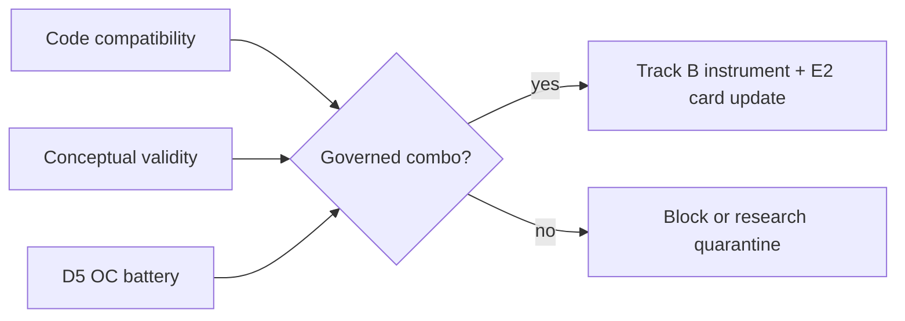
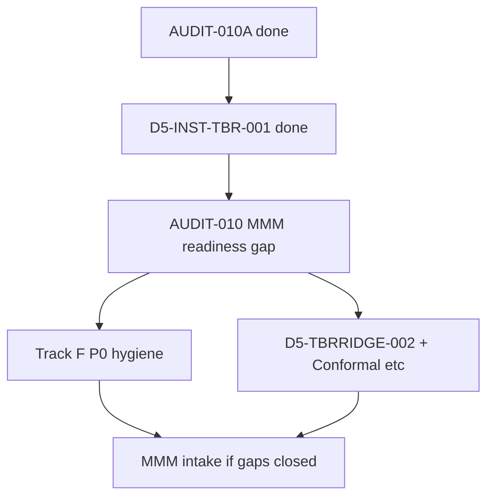

# Track F — Estimator / inference completion plan 001

**Document ID:** TRACK-F-ESTIMATOR-INFERENCE-COMPLETION-PLAN-001  
**Type:** Implementation roadmap (planning only — no code changes in this package)  
| **Status:** **draft v1** — AUDIT-010 ✅; P0 ✅; ~~TBRRidge-002~~ ✅; next **AugSynth Conformal**  
**Date:** 2026-06-02  
**Lane:** Implementation planning bridge — Track D/E evidence → governed fixes  
**Branch / baseline:** `fix-kfold-multitreated-geometry` @ post `TRACK-D-CONCEPTUAL-VALIDITY-AUDIT-001`

---

## ADR decision record

| Field | Value |
|-------|--------|
| **Context** | Track D has completed inventory (AUDIT-001), curated compatibility (COMBO-AUDIT-001), conceptual validity (CONCEPTUAL-VALIDITY-001), and partial OC (AUGSYNTH, PLACEBO, TBRRIDGE, 001e). Gaps remain between **what runs**, **what is valid**, and **what may be governed in production**. |
| **Decision** | Track F converts audit findings into a **prioritized implementation roadmap**: fix, block, adapter, interface cleanup, inference cleanup, research quarantine, OC candidates, and promotion criteria. **No fixes in this document.** |
| **Consequences** | Engineering work is sequenced P0→P3; AUDIT-010 consumes this plan as intake checklist; MMM remains blocked until AUDIT-010 gaps close. |
| **Alternatives rejected** | Blind Cartesian OC of 192 cells; promoting probe-success combos without conceptual + OC gates; treating COMBO `valid_candidate` as production-ready. |

---

## 1. Authoritative inputs

| Input | Status | Role in Track F |
|-------|--------|-----------------|
| [`D5_INST_AUDIT_001`](track_d/D5_INST_AUDIT_001_REPORT.md) | ✅ | 13 estimators × 9 inference modes × 8 geometries; probe matrix |
| [`D5_INST_COMBO_AUDIT_001`](track_d/D5_INST_COMBO_AUDIT_001_REPORT.md) | ✅ | 30 curated tuples; fix vs block vs OC |
| [`TRACK_D_CONCEPTUAL_VALIDITY_AUDIT_001`](TRACK_D_CONCEPTUAL_VALIDITY_AUDIT_001.md) | ✅ | Literature fidelity; blocking deviations |
| [`D5_INST_AUGSYNTH_001`](track_d/D5_INST_AUGSYNTH_001_REPORT.md) | ✅ | AugSynthCVXPY point/JK diagnostic comparator |
| [`D5_INST_AUGSYNTH_KFOLD_001`](track_d/D5_INST_AUGSYNTH_KFOLD_001_REPORT.md) | ✅ | AugSynthCVXPY + Kfold restricted diagnostic |
| **D5-INST-TBR-001** | ✅ | Aggregate class TBR OC — point/Kfold restricted; JK blocked on agg2 |
| **D5-INST-TBRRIDGE-002** | ✅ | P2 TBRRidge inference OC — blocked / unverified / INV-015 |
| **AUDIT-010** | ✅ | MMM readiness/gap closed — `not_ready_continue_track_f` |

**Binding governance (unchanged until separate PR):**

- `NOMINAL_CALIBRATION_ELIGIBLE_CONFIGS = {"SCM_UnitJackKnife"}` — **null_monitor_only**
- CalibrationSignal = MMM ingress only; TrustReport = trust layer only
- Synthetic OC pass ≠ conceptual validity ≠ production promotion

---

## 2. Executive summary

Track F organizes work into **four workstreams** that must align before a combo may graduate:

| Workstream | Count (curated 30) | Track F action |
|------------|-------------------:|----------------|
| **Already characterized** | 9 | Maintain; guard regressions |
| **Valid OC candidate** | 6 | Schedule batteries + interface fixes where needed |
| **Implemented but unvalidated** | 5 | Fix probe failures or document intentional block |
| **Invalid by interface** | 5 | **Block** or **interface cleanup** (explicit decision per row) |
| **Invalid by geometry** | 3 | **Remain blocked** or design-only adapters |
| **Research only** | 2 | Quarantine; no production wiring |

**P0 blockers (Track F — address after AUDIT-010 gap list, not before TBR-001):** `full_model` SCM/AugSynth production guard · recovery_runner TBR→TBRRidge mislabel · registry `Bayesian` ≠ BayesianTBR MCMC · DID relative ATT CI policy · TBR aggregate OC (TBR-001).

---

## 3. Combination disposition matrix (curated 30)

Legend: **FIX** = implement + OC · **BLOCK** = remain forbidden · **ADAPT** = geometry adapter · **CLEAN-E** = estimator interface · **CLEAN-I** = inference wrapper · **R&D** = research lane · **HOLD** = characterized; no promotion

| Estimator | Inference | Geometry | COMBO status | Track F disposition | Target tier |
|-----------|-----------|----------|--------------|---------------------|-------------|
| AugSynthCVXPY | point | single_cell | already_characterized | **HOLD** | diagnostic TrustReport |
| AugSynthCVXPY | JK | single_cell | already_characterized | **HOLD** | diagnostic TrustReport |
| AugSynthCVXPY | Kfold | single_cell | ~~valid_candidate~~ characterized | **HOLD** | restricted diagnostic |
| AugSynthCVXPY | BRB | single_cell | invalid_by_interface | **CLEAN-I** then decide | block unless catalog+concept |
| AugSynthCVXPY | Conformal | single_cell | valid_candidate | **FIX** + OC | restricted / block MMM |
| AugSynthCVXPY | Placebo | single_treated | invalid_by_interface | **BLOCK** (no catalog support) | blocked |
| TBR | point | aggregate_2row | valid_candidate | **HOLD** | restricted diagnostic |
| TBR | JK | aggregate_2row | implemented_but_unvalidated | **BLOCK** on agg2 | blocked (1 control) |
| TBR | JKP | aggregate_2row | valid_candidate | **HOLD** unverified | restricted / not governed |
| TBR | Kfold | aggregate_2row | valid_candidate | **HOLD** | restricted diagnostic |
| TBR | Placebo | aggregate_2row | invalid_by_interface | **BLOCK** (impl blocks TBR) | blocked |
| TBR | point | single_cell | invalid_by_geometry | **BLOCK** | blocked |
| TBRRidge | Kfold | single_cell | already_characterized | **HOLD** | restricted |
| TBRRidge | BRB | single_cell | already_characterized | **HOLD** | restricted |
| TBRRidge | Kfold | aggregate_2row | already_characterized | **HOLD** | geo-power diagnostic |
| TBRRidge | JK | single_cell | implemented_but_unvalidated | **FIX** + TBRRIDGE-002 | restricted |
| TBRRidge | Placebo | single_treated | invalid_by_interface | **BLOCK** (probe failed) | blocked |
| TBRRidge | Conformal | single_cell | implemented_but_unvalidated | **FIX** + TBRRIDGE-002 | restricted / block MMM |
| TBRRidge | TimeSeriesKfold | single_cell | valid_candidate | **FIX** + TBRRIDGE-002 | restricted diagnostic |
| TBRRidge | Bayesian | single_cell | implemented_but_unvalidated | **BLOCK** prod (INV-015) | research quarantine |
| TBRRidge | JKP | single_cell | implemented_but_unvalidated | **FIX** + TBRRIDGE-002 | restricted |
| BayesianTBR | Bayesian | single_cell | research_only | **R&D** | blocked production |
| BayesianTBR | mcmc_native | single_cell | invalid_by_interface | **R&D** (no registry mode) | research only |
| TROP | point | single_cell | research_only | **R&D** | blocked production |
| DID | native bootstrap | single_cell | already_characterized | **HOLD** + DEF-003 guard | restricted |
| SCM | JK | single_cell | already_characterized | **HOLD** + full_model guard | null_monitor_only |
| SCM | Placebo | single_treated | already_characterized | **HOLD** | diagnostic_only |
| SCM | Placebo | multi_treated | already_characterized | **BLOCK** (100% blocked OC) | blocked |
| SCM | JK | supergeo | invalid_by_geometry | **BLOCK** readout | design-only |
| SCM | JK | trimmed | invalid_by_geometry | **BLOCK** readout | design-only |

---

## 4. §1 — Missing combinations to **fix**

These tuples are **conceptually plausible** (or blocking hygiene) and should be implemented, clarified, or OC'd — not left in ambiguous `implemented_but_unvalidated` state.

### P0 — Blocking hygiene (post AUDIT-010; no promotion)

| ID | Gap | Status | Implementation |
|----|-----|--------|----------------|
| **F-P0-001** | `full_model=True` SCM/AugSynth fits post-period columns | ✅ | `panel_exp/governance/instrument_contract.py` — `full_model_export_block_reason` |
| **F-P0-002** | `recovery_runner` key `"TBR"` uses TBRRidge factory | ✅ | `runner.py`, `recovery_runner.py` — `class_tbr_recovery_factory` |
| **F-P0-003** | Registry `Bayesian` on BayesianTBR ≠ NUTS MCMC | ✅ | INV-015 helpers + `method_metadata` known_limitations |
| **F-P0-004** | DID relative ATT CI unsupported vs SCM | ✅ | `did_interval_policy.py` (existing) + tests |
| **F-P0-005** | Placebo = inference/falsification, not estimator | ✅ | `assert_not_placebo_as_estimator`; inference catalog rationale |
| **F-P0-006** | Multi-cell per-cell only unless `pooling_rule_id` | ✅ | `multi_cell_pooling_block_reason` + tests |

**Tests:** [`tests/governance/test_track_f_p0_hygiene.py`](../../tests/governance/test_track_f_p0_hygiene.py)

**Next:** Track F **P2** — ~~TBRRidge-002~~ ✅ → **AugSynth Conformal (003)** — not promotion.

### P2 — TBRRidge remaining inference (~~D5-INST-TBRRIDGE-002~~ ✅)

| Inference | Outcome |
|-----------|---------|
| UnitJackKnife / JKP / Conformal | **blocked_interface** on 001e unit panel |
| TimeSeriesKfold | **callable_unverified_interval_semantics** |
| Bayesian (registry) | **blocked_production_policy** (INV-015) |
| Kfold / BRB | **already_characterized_restricted** (001 context) |

### P2 — Valid candidates (AugSynth next)

| Combo | Battery | Fix scope |
|-------|---------|-----------|
| `AugSynthCVXPY + Kfold + single_cell` | ~~D5-AUGSYNTH-KFOLD-001~~ ✅ | OC complete — remain restricted diagnostic |
| `AugSynthCVXPY + Conformal + single_cell` | **D5-INST-AUGSYNTH-003** (next) | Exchangeability caveat; not MMM |
| ~~`TBRRidge + TimeSeriesKfold + single_cell`~~ | ~~D5-TBRRIDGE-002~~ ✅ | Callable; unverified intervals — restricted only |

### P2 — TBRRidge interface failures (deferred implementation)

| Combo | TBRRIDGE-002 outcome |
|-------|----------------------|
| `TBRRidge + UnitJackKnife + single_cell` | **blocked_interface** — broadcast on multi-treated path |
| `TBRRidge + Conformal + single_cell` | **blocked_interface** |
| `TBRRidge + Bayesian + single_cell` | **blocked_production_policy** (INV-015) |
| `TBRRidge + JKP + single_cell` | **blocked_interface** |

### P3 — Interface clarification (fix only if product requires)

| Combo | Decision |
|-------|----------|
| `AugSynthCVXPY + BRB + single_cell` | Either add to `inference_support` catalog with AugSynth-specific bootstrap defaults **or** explicit **BLOCK** in catalog (preferred until concept doc) |

---

## 5. §2 — Combinations that **remain blocked**

Permanent or policy blocks — do **not** schedule OC for production/MMM.

| Category | Combos / patterns | Rationale |
|----------|-------------------|-----------|
| **Geometry-invalid** | TBR on unit multi-control; SCM+JK on supergeo/trim as **estimator readout** | Wrong method family for geometry (COMBO + CV-001) |
| **Interface-blocked** | TBR+Placebo; TBRRidge+Placebo; AugSynthCVXPY+Placebo (catalog) | Placebo semantics require SCM-style single-treated donors; TBR blocked in `run_placebo` |
| **Multi-treated placebo** | SCM+Placebo on multi_treated natural | PLACEBO-001: 100% blocked |
| **Pooled multi-cell** | Any pooled SCM+JK / placebo / lift across cells | MCELL + E2: per-cell only |
| **MMM / CalibrationSignal** | All combos except `SCM_UnitJackKnife` null_monitor | E5 policy unchanged |
| **Registry Bayesian** | TBRRidge+Bayesian; BayesianTBR+Bayesian for governed exports | INV-015 |
| **Research estimators** | TROP, SyntheticDID, MTGP, BayesianTBR MCMC path | research_only maturity |
| **Lift / MDE claims** | TBRRidge Kfold/BRB as platform MDE; JK as lift detector | CV-001 + 001a optimistic_proxy |

**AUDIT-010 action:** Encode this block list in MMM intake validator (documentation + contract tests — separate PR).

---

## 6. §3 — **Geometry adapters** required

Adapters translate design assignment → panel shape expected by estimator. **Not** estimators themselves.

| Adapter ID | From | To | Estimators | Priority |
|------------|------|-----|------------|----------|
| **F-GEO-001** | Unit-level markets | **Aggregate 1×1** (sum treated / sum control) | Class **TBR** only | **P1** — exists in 001c path; must be **named, tested, and separated from TBRRidge** |
| **F-GEO-002** | Multi-treated assignment | **Per-unit treated paths** (no pooling) | SCM, AugSynthCVXPY, TBRRidge unit | **P1** — MCELL discipline already documented; enforce in export |
| **F-GEO-003** | Multi_cell k≥2 | **Per-cell unit panels** (control-only donors per cell) | SCM+JK, AugSynth point/JK | **HOLD** — D5-MCELL characterized |
| **F-GEO-004** | Geo power orchestrator | **2-row TBRRidge panel** | TBRRidge + Kfold | **HOLD** — document as **power diagnostic**, not TBR |
| **F-GEO-005** | supergeo / trimmed populations | **Design-only panels** | None for SCM+JK readout | **BLOCK** — separate D5-DES-* OC only |
| **F-GEO-006** | Single-treated subset | **Placebo-eligible panel** (≥5 donors) | SCM + Placebo | **HOLD** — PLACEBO-001 |

**Non-goal:** One universal adapter that collapses unit and aggregate readouts into a single instrument.

---

## 7. §4 — **Estimator interface cleanup**

| ID | Issue | Required change | Blocks |
|----|-------|-----------------|--------|
| **F-EIF-001** | TBR vs TBRRidge naming collision | Distinct factories in recovery_runner, validation runners, and Track B aliases | TBR-001, AUDIT-010 |
| **F-EIF-002** | `full_model` flag on SCM/AugSynth | Default false in production exports; warn or block true | MMM, TrustReport |
| **F-EIF-003** | `method_metadata.inference_support` gaps | Align catalog with `impl.py` reality (AugSynth BRB/Placebo) | COMBO invalid_by_interface rows |
| **F-EIF-004** | BayesianTBR class vs registry mode | Split symbols: `BayesianTBRNUTS` vs deprecated registry shortcut | INV-015 |
| **F-EIF-005** | DID bootstrap not in registry | Document `estimator_native_bootstrap` as only DID path; block registry bootstrap on DID | DEF-003 |
| **F-EIF-006** | Geo PowerAnalysis labels | Product/docs: TBRRidge on agg2, **not** class TBR | 001a/001c, INST-007 |
| **F-EIF-007** | AugSynth base vs AugSynthCVXPY | Either deprecate base AugSynth from geo exports or parity tests | Low priority P3 |

---

## 8. §5 — **Inference wrapper cleanup**

| ID | Issue | Required change | Affects |
|----|-------|-----------------|--------|
| **F-IIF-001** | `run_placebo` blocks `TBR` class | **Intentional** — document; do not "fix" unless placebo theory for agg TBR is written | TBR+Placebo blocked |
| **F-IIF-002** | AugSynth family in BRB (`_is_scm` paths) | Explicit AugSynth bootstrap defaults or catalog exclusion | AugSynth+BRB |
| **F-IIF-003** | Registry `Bayesian` JAX quantiles | Remove from governed configs or bridge to MCMC posterior | BayesianTBR, TBRRidge+Bayesian |
| **F-IIF-004** | JK vs JKP aggregation semantics | Document estimand path per estimator; fix TBRRidge JKP probe failure | TBRRidge+JKP |
| **F-IIF-005** | Conformal exchangeability in panels | Panel-aware conformal score or block from geo exports | Conformal combos |
| **F-IIF-006** | `path_interval_type` consistency | Placebo=`placebo_band`; JK diagnostic CI; DID cumulative | TrustReport gating |
| **F-IIF-007** | Kfold multi-treated residual aggregation | Document geometry in instrument card when n_treated>1 | TBRRidge/AugSynth Kfold |
| **F-IIF-008** | TimeSeriesKfold vs Kfold | Clarify registry routing; OC TimeSeriesKfold candidate | TBRRidge+TimeSeriesKfold |

---

## 9. §6 — **Research-only** quarantine

| Estimator / path | Inference | Production action |
|------------------|-----------|-------------------|
| **BayesianTBR** / Horseshoe | NUTS native | Keep in research module; optional D5-BAYESIANTBR-001 |
| **BayesianTBR** | Registry `Bayesian` | **Block** from Track B export |
| **TROP** | point (internal) | No registry inference; block MMM intake |
| **SyntheticDID** | — | Tests only |
| **MTGP** | — | No geo instrument |
| **AugSynth** (non-CVXPY base) | point/Kfold/Conformal | Unvalidated; do not export until parity with CVXPY path |
| **TBRAutoSARIMAX** | — | Expert review; no D5 battery scheduled |

**Quarantine criteria:** `research_only` maturity in AUDIT-001 **or** conceptual audit `research_only` **or** COMBO `research_only`.

---

## 10. §7 — **Production candidates after OC**

Candidates may graduate to **governed production diagnostics** (TrustReport roles) — **not** MMM unless CalibrationSignal policy changes.

| Candidate instrument | Preconditions | Max TrustReport role | CalibrationSignal |
|---------------------|---------------|----------------------|-------------------|
| **SCM_UnitJackKnife** | full_model guard (F-P0-001); 001e + MCELL OC maintained | null_monitor reference | **null_monitor_only** (existing) |
| **SCM_Placebo** | single-treated geometry only | diagnostic_only | neither |
| **AugSynthCVXPY_Point** | AUGSYNTH-001 maintained | diagnostic comparator | neither |
| **AugSynthCVXPY + JK** | AUGSYNTH-001; spillover on card | diagnostic_only | neither |
| **TBR aggregate + point** | TBR-001 ✅; F-GEO-001 | restricted diagnostic | neither |
| **TBR aggregate + Kfold** | TBR-001 ✅ | restricted diagnostic | neither |
| **AugSynthCVXPY + Kfold** | AUGSYNTH-KFOLD-001 ✅; conceptual restricted OK | restricted diagnostic | neither |
| **TBRRidge_Kfold / BRB** | TBRRIDGE-001 ✅ maintained | restricted (existing) | neither |
| **TBRRidge + TimeSeriesKfold** | TBRRIDGE-002 ✅ | restricted diagnostic | neither |
| **DID_Bootstrap** | DEF-003 enforced in export | restricted | neither |

**Not production candidates (even after OC):** TBRRidge+Bayesian · Conformal on geo panels (unless exchangeability addressed) · any pooled multi-cell combo · TROP · BayesianTBR.

**AUDIT-010 update slot:** When TBR-001 and AUDIT-010 complete, revise this table with **approved intake list** and **explicit MMM block list**.

---

## 11. §8 — **Promotion criteria** (per candidate tier)

### Tier A — Null-monitor reference (`SCM_UnitJackKnife`)

| Criterion | Required evidence |
|-----------|-------------------|
| Conceptual validity | CV-EST-SCM + CV-INF-JK: aligned_with_deviation; null-monitor role only |
| Code compatibility | COMBO already_characterized; probe success on unit geometry |
| OC | 001b/e, D3, MCELL per-cell where applicable |
| Interface | F-P0-001 full_model guard merged |
| Track B | Instrument card INST-001; `null_monitor_only` CalibrationSignal |
| Promotion outcome | **Maintain** — not expanded to lift or MMM |

### Tier B — Diagnostic comparator (AugSynthCVXPY point/JK, SCM Placebo)

| Criterion | Required evidence |
|-----------|-------------------|
| Conceptual validity | CV-001 §5.2 / §6.3; placebo_band ≠ CI |
| OC | AUGSYNTH-001 / PLACEBO-001 ✅ |
| Geometry | single_cell or single_treated per card |
| TrustReport | diagnostic_only role; triangulation input only |
| CalibrationSignal | **Forbidden** |
| Promotion outcome | **TrustReport diagnostic** — no MMM |

### Tier C — Restricted aggregate / ridge diagnostics (TBR agg, TBRRidge Kfold/BRB/TSKfold)

| Criterion | Required evidence |
|-----------|-------------------|
| Conceptual validity | CV-001 §5.3–5.4; TBR ≠ TBRRidge documented |
| OC | TBR-001 and/or TBRRIDGE-002 with fixed windows |
| Estimand bridge | Separate Track B alias; E-ESTIMAND-* diagnostics pass |
| Geometry adapter | F-GEO-001 for TBR; no unit-panel TBR |
| Forbidden | Platform MDE; CalibrationSignal; SCM+JK equivalence claims |
| Promotion outcome | **restricted** TrustReport only after OC + AUDIT-010 gap closure |

### Tier D — Blocked from production promotion

| Criterion | Action |
|-----------|--------|
| research_only maturity | Quarantine; AUDIT-010 block list |
| invalid_by_interface without concept doc | **Do not fix** unless product spec written |
| invalid_by_geometry | **Do not adapter** for estimator readout |
| INV-015 registry Bayesian | Block until MCMC bridge or removal |

### Universal gates (all tiers)

1. **COMBO** row not `invalid_by_*` (or explicit unblock ADR)  
2. **CONCEPTUAL-VALIDITY** deviation not `blocking` for target claim class  
3. **D5 OC battery** pass on declared DGP + geometry  
4. **Track E E2** card updated with OC artifact links  
5. **AUDIT-010** entry approved for MMM intake (Tier A null-monitor only today for CalibrationSignal)  
6. **No promotion** from literature name or probe success alone  

---

## 12. Implementation sequence

| Phase | Deliverables | Exit criterion |
|-------|--------------|----------------|
| **P1** | ~~TBR-001~~ ✅ report + F-GEO-001 + F-EIF-001 | Point/Kfold OC'd; JK blocked; JKP unverified |
| **P1.5** | AUDIT-010 report | MMM block list + approved diagnostic set; **Appendix A = all 30 COMBO tuples** ([`AUDIT-010_mmm_readiness_gap.md`](audits/AUDIT-010_mmm_readiness_gap.md)) |
| **P0 (post AUDIT-010)** | F-P0-001…004 PRs | AUDIT-010 checklist hygiene items addressed |
| **P2** | TBRRIDGE-002; AugSynth Conformal; remaining COMBO valid_candidates | Promote to Tier B/C or re-block |
| **P3** | AugSynth BRB catalog decision; base AugSynth | Optional; no MMM impact |

**Note:** AugSynthCVXPY+Kfold OC ([`D5_INST_AUGSYNTH_KFOLD_001`](track_d/D5_INST_AUGSYNTH_KFOLD_001_REPORT.md)) completed **before** TBR-001 as research characterization; remains **restricted diagnostic**, not a promotion.

---

## 13. Open decisions for AUDIT-010

**AUDIT-010 deliverable structure (mandatory):**

1. **Executive summary** — major evidence families only (grouped table); illustrative, not authoritative for per-tuple coverage.
2. **Appendix A** — full 30-row matrix: estimator × inference × geometry × COMBO status × conceptual validity × D5 OC × Track E/B × Track F disposition × CalibrationSignal × MMM readiness × reason. **No tuple may be omitted.** Reconcile against COMBO-AUDIT-001, CONCEPTUAL-VALIDITY-001, and Track F §3.

Charter + pre-reconciled Appendix A: [`audits/AUDIT-010_mmm_readiness_gap.md`](audits/AUDIT-010_mmm_readiness_gap.md).

| ID | Question | Default recommendation |
|----|----------|------------------------|
| **F-OD-001** | Allow AugSynthCVXPY+Conformal in exports? | **No** until exchangeability OC |
| **F-OD-002** | Fix or permanently block AugSynth+BRB? | **Block** until catalog+concept ADR |
| **F-OD-003** | TBRRidge+JK as triangulation peer to SCM+JK? | **No** — restricted diagnostic only |
| **F-OD-004** | Expand CalibrationSignal beyond SCM JK? | **No** in AUDIT-010 scope |
| **F-OD-005** | Class TBR in geo PowerAnalysis? | **No** — keep TBRRidge on agg2 |

---

## 14. Traceability

| Track F ID | Source finding |
|------------|----------------|
| F-P0-001 | D2 INV-D2-001; CV-FIND blocking |
| F-P0-002 | D5-AUD-FIND-004; CV-FIND-004 |
| F-P0-003 | INV-015; D5-COMBO-FIND-004 |
| F-GEO-001 | D5-COMBO-FIND-001; CV-EST-TBR |
| F-IIF-001 | COMBO TBR+Placebo invalid_by_interface |
| F-OD-003 | D5-TBRRIDGE-001 scale ≠ SCM+JK |

---

## 15. Stop condition (planning)

Track F v1 is **complete as a planning artifact** when:

1. All 30 COMBO tuples have a **FIX / BLOCK / HOLD / R&D** disposition (§3).  
2. P0–P2 sequence and promotion tiers are defined (§11–§12).  
3. AUDIT-010 open decisions are listed (§13).  

**Implementation stop condition (future):** AUDIT-010 reports **approved MMM intake set** and **closed gaps** — Appendix A proves all 30 tuples accounted for — then Track F v2 reconciles §7 with live production configs.

---

**Related:** [`ROADMAP_V4.md`](ROADMAP_V4.md) · [`MIP_AUDIT_REGISTRY.md`](MIP_AUDIT_REGISTRY.md) · [`TRACK_D_METHOD_INVENTORY_AND_ROBUSTNESS_MATRIX_001.md`](TRACK_D_METHOD_INVENTORY_AND_ROBUSTNESS_MATRIX_001.md) · [`TRACK_E_E2_METHOD_DESIGN_SUITABILITY_CARDS_001.md`](TRACK_E_E2_METHOD_DESIGN_SUITABILITY_CARDS_001.md)

*TRACK-F-ESTIMATOR-INFERENCE-COMPLETION-PLAN-001 v1.0.0 — planning only; no code changes.*
