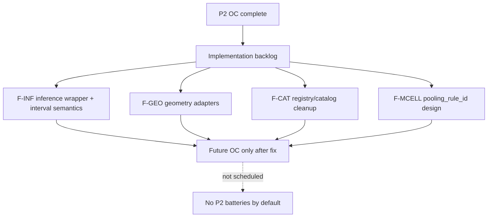

# TRACK-F-P2-CLOSEOUT-001 — Track F P2 formal closeout

**Document ID:** TRACK-F-P2-CLOSEOUT-001  
**Type:** Governance closeout — docs only  
**Status:** **closed**  
**Date:** 2026-06-03  
**Lane:** Track F implementation planning bridge  
**Verdict:** **Track F P2 formally closed** — no additional OC batteries scheduled unless an implementation fix reopens a candidate  
**Promotion:** **Not authorized** · **MMM ingress:** **Blocked** · **CalibrationSignal expansion:** **No**

**Prerequisites:** AUDIT-010 ✅ (`not_ready_continue_track_f`) · Track F P0 ✅ · D5-INST-TBRRIDGE-002 ✅ · D5-INST-AUGSYNTH-003 ✅

**Related:** [`TRACK_F_ESTIMATOR_INFERENCE_COMPLETION_PLAN_001.md`](TRACK_F_ESTIMATOR_INFERENCE_COMPLETION_PLAN_001.md) · [`AUDIT-010_mmm_readiness_gap.md`](audits/AUDIT-010_mmm_readiness_gap.md) · [`ROADMAP_V4.md`](ROADMAP_V4.md)

---

## 1. Executive summary

Track F **P2 characterization batteries are complete**. TBRRidge-002 and AugSynth Conformal (003) were the final scheduled P2 OC runs. All findings that remain open are **implementation backlog items**, not missing batteries.

| Phase | Status | Outcome |
|-------|--------|---------|
| **P0 hygiene** | ✅ Complete | F-P0-001…006 guards in `instrument_contract.py` |
| **P1 class TBR** | ✅ Complete | Aggregate 1×1 restricted diagnostic (TBR-001) |
| **P1.5 AUDIT-010** | ✅ Closed | `not_ready_continue_track_f`; Appendix A = 30 tuples |
| **P2 TBRRidge-002** | ✅ Complete | JK/JKP/Conformal **blocked_interface**; TimeSeriesKfold **callable_unverified** |
| **P2 AugSynth Conformal** | ✅ Complete | **callable_unverified_interval_semantics** — negative HW, 100% null exclude |
| **Prior AugSynth Kfold** | ✅ Complete | **characterized_restricted** diagnostic comparator |
| **Promotion** | ❌ Not authorized | No CalibrationSignal or MMM ingress |

**Next lane:** **Implementation backlog** (F-INF, F-GEO, F-CAT, F-MCELL) — **stop adding batteries** until a fix reopens a candidate.

---

## 2. P2 battery results (summary)

### 2.1 D5-INST-TBRRIDGE-002

**Verdict:** `remain_restricted_no_promotion`

| Inference | Disposition | Notes |
|-----------|-------------|-------|
| UnitJackKnife | **blocked_interface** | Broadcast shape on multi-treated TBRRidge path |
| JKP | **blocked_interface** | Same interface failure |
| Conformal | **blocked_interface** | Same interface failure |
| TimeSeriesKfold | **callable_unverified_interval_semantics** | 100% negative HW; 100% null interval-exclusion FPR |
| Bayesian (registry) | **blocked_production_policy** | INV-015 |
| Kfold / BRB (context) | **already_characterized_restricted** | TBRRIDGE-001 |

**Artifact:** [`D5_INST_TBRRIDGE_002_REPORT.md`](track_d/D5_INST_TBRRIDGE_002_REPORT.md)

### 2.2 D5-INST-AUGSYNTH-003 (Conformal)

**Verdict:** `callable_unverified_interval_semantics` · overall `remain_restricted_no_promotion`

| Metric @ null (001e, n_mc=14) | Value |
|-------------------------------|-------|
| Feasibility | 100% (13/14; 1 thin-donor block) |
| `path_interval_type` | `conformal_interval` |
| Negative half-width rate | **100%** |
| Null interval-exclusion FPR | **100%** |
| Context: AugSynth JK/Kfold null FPR | **0%** |

**Conformal semantics recorded:** pre-period residual rank score; exchangeability assumption; level y/ŷ units; **diagnostic-only** — not governed uncertainty on this battery.

**Artifact:** [`D5_INST_AUGSYNTH_003_REPORT.md`](track_d/D5_INST_AUGSYNTH_003_REPORT.md)

### 2.3 Prior context (not re-run in P2)

| Battery | Verdict | Role |
|---------|---------|------|
| **D5-INST-AUGSYNTH-KFOLD-001** | `remain_restricted_diagnostic_comparator` | AugSynth Kfold — `confidence_interval`; null FPR 0 |
| **D5-INST-AUGSYNTH-001** | diagnostic_only | AugSynth point/JK characterized comparator |
| **D5-INST-TBR-001** | restricted aggregate diagnostic | Class TBR 1×1 — not TBRRidge |

---

## 3. Appendix A reconciliation (30 tuples)

Post-P2 updates to [`AUDIT-010`](audits/AUDIT-010_mmm_readiness_gap.md) Appendix A:

| ID | Pre-P2 bucket | Post-P2 bucket | Change |
|----|---------------|----------------|--------|
| **A05** | `valid_candidate_pending_OC` | **`callable_unverified_interval_semantics`** | AUGSYNTH-003 ✅ |
| **A16** | `implemented_but_unvalidated` | **`blocked_interface`** | TBRRIDGE-002 ✅ |
| **A18** | `implemented_but_unvalidated` | **`blocked_interface`** | TBRRIDGE-002 ✅ |
| **A19** | `valid_candidate_pending_OC` | **`callable_unverified_interval_semantics`** | TBRRIDGE-002 ✅ |
| **A21** | `implemented_but_unvalidated` | **`blocked_interface`** | TBRRIDGE-002 ✅ |

All other rows unchanged. **No tuple omitted.** Roll-up updated in AUDIT-010.

### Post-P2 disposition roll-up

| Bucket | Tuple IDs | Count |
|--------|-----------|------:|
| `already_characterized` | A01, A02, A13, A14, A15, A25, A26, A27 | 8 |
| `characterized_restricted` | A03, A07, A10 | 3 |
| `callable_unverified_interval_semantics` | A05, A19 | 2 |
| `blocked_interface` | A16, A18, A21 | 3 |
| `invalid_by_interface` | A04, A06, A11, A17, A23 | 5 |
| `invalid_by_geometry` | A12, A29, A30 | 3 |
| `implemented_but_unvalidated` | A09 | 1 |
| `research_only` | A22, A24 | 2 |
| `blocked` | A08, A20, A28 | 3 |

**Total:** 30

---

## 4. Remaining findings → implementation backlog

All open items are classified below. **No additional P2 OC batteries** unless a fix moves a row back to `valid_candidate_pending_OC`.

### 4.1 Keep blocked (policy / geometry / catalog)

| Item | Tuples / scope | Rationale |
|------|----------------|-----------|
| MMM default ingress | All except null-monitor reference | AUDIT-010 `not_ready_continue_track_f` |
| CalibrationSignal expansion | All except `SCM_UnitJackKnife` | E5 policy |
| Registry Bayesian on TBRRidge | A20 | INV-015 |
| TBR + UnitJackKnife on agg2 | A08 | 1 control row geometry |
| SCM + Placebo multi-treated | A28 | PLACEBO-001 100% block |
| SCM + JK on supergeo/trim | A29, A30 | Design-only geometry |
| TBR on unit panel | A12 | Invalid geometry |
| Placebo on TBR / TBRRidge / AugSynthCVXPY | A06, A11, A17 | Catalog / impl block |
| AugSynthCVXPY + BRB | A04 | Not in `inference_support` (F-OD-002: block until ADR) |
| Pooled multi-cell without `pooling_rule_id` | Global | F-P0-006 |
| Research estimators | A22, A24 | BayesianTBR, TROP |

### 4.2 Implementation fix needed

| ID | Lane | Finding | Source | Reopens OC? |
|----|------|---------|--------|-------------|
| **F-INF-001** | F-INF | Conformal interval band sign / y_upper/y_lower transform — negative HW on AugSynthCVXPY + TBRRidge TimeSeriesKfold | AUGSYNTH-003, TBRRIDGE-002 | Yes — Conformal, TimeSeriesKfold |
| **F-INF-002** | F-INF | TBRRidge multi-treated residual shape — JK/JKP/Conformal broadcast failure | TBRRIDGE-002 A16/A18/A21 | Yes — after interface fix |
| **F-INF-003** | F-INF | Interval semantics contract — document and test `path_interval_type` vs half-width sign | D3 + P2 batteries | Prerequisite for any governed export |
| **F-GEO-001** | F-GEO | Geometry adapter hardening — unit vs aggregate vs multi-treated readout contracts | COMBO + CV-001 | Per adapter |
| **F-CAT-001** | F-CAT | Registry/catalog cleanup — inference_support vs impl.py parity; base AugSynth vs CVXPY | COMBO-AUDIT-001 | Catalog ADRs |
| **F-CAT-002** | F-CAT | AugSynthCVXPY + BRB — explicit BLOCK in catalog or add with concept doc (F-OD-002) | A04 | After ADR only |
| **F-P0-004** | F-INF | DID relative ATT CI policy enforcement | P0 (guard exists) | Separate lane |

### 4.3 Research-only (no production path)

| Item | Notes |
|------|-------|
| BayesianTBR MCMC native | A23 — no registry mode |
| TROP point | A24 — no registry inference |
| Base AugSynth (non-CVXPY) | Unvalidated; do not export until CVXPY parity |

### 4.4 Future OC after fix (not scheduled now)

| Combo | Current status | Trigger to reopen battery |
|-------|----------------|----------------------------|
| TBRRidge + UnitJackKnife | blocked_interface | F-INF-002 fix + new D5 battery |
| TBRRidge + Conformal | blocked_interface | F-INF-002 fix + new D5 battery |
| TBRRidge + JKP | blocked_interface | F-INF-002 fix + new D5 battery |
| TBRRidge + TimeSeriesKfold | callable_unverified | F-INF-001 fix + re-OC |
| AugSynthCVXPY + Conformal | callable_unverified | F-INF-001 fix + re-OC |
| Class TBR + JKP | implemented_but_unvalidated | F-INF-003 + optional re-OC |

### 4.5 Promotion candidate — not authorized

| Path | Status |
|------|--------|
| Any combo → CalibrationSignal | **Not authorized** |
| Any combo → MMM ingress | **Not authorized** |
| AugSynth / TBRRidge / TBR → governed lift | **Not authorized** |
| SCM + JK beyond null_monitor | **Not authorized** in AUDIT-010 scope |

---

## 5. Next implementation lanes

| Lane | Scope | Priority items |
|------|-------|----------------|
| **F-INF** | Inference wrapper and interval semantics fixes | F-INF-001 Conformal/TSKF band sign · F-INF-002 TBRRidge multi-treated shape · F-INF-003 interval contract tests |
| **F-GEO** | Geometry adapters | Unit vs aggregate vs multi-treated readout hardening (F-GEO-001) |
| **F-CAT** | Registry/catalog cleanup | inference_support parity · AugSynth BRB ADR (F-OD-002) · base AugSynth quarantine |
| **F-MCELL** | Multi-cell pooling | Design `pooling_rule_id` **only if** product ever requires pooled multi-cell claims |

**Rule:** Do **not** schedule new D5 OC batteries until an F-INF/F-GEO/F-CAT fix explicitly reopens a COMBO row.

---

## 6. Open decisions (closed at P2 closeout)

| ID | Decision | Result |
|----|----------|--------|
| **F-OD-001** | AugSynthCVXPY+Conformal in exports? | **No** — interval semantics fail |
| **F-OD-002** | AugSynth+BRB? | **Block** until catalog+concept ADR |
| **F-OD-003** | TBRRidge+JK as SCM+JK peer? | **No** — restricted diagnostic only |
| **F-OD-004** | Expand CalibrationSignal? | **No** |
| **F-OD-005** | Class TBR in geo PowerAnalysis? | **No** |

---

## 7. Stop condition (met)

| Criterion | Status |
|-----------|--------|
| Track F P2 formally closed | ✅ |
| TBRRidge-002 + AUGSYNTH-003 summarized | ✅ |
| 30-row Appendix A reconciled | ✅ |
| Findings split into backlog categories | ✅ |
| Implementation lanes defined (F-INF, F-GEO, F-CAT, F-MCELL) | ✅ |
| No additional P2 OC batteries scheduled | ✅ |
| Promotion not authorized | ✅ |

**Next lane:** **Track F implementation backlog** — start with **F-INF-001** (interval semantics and inference wrapper contract).

---

## 8. Traceability

| Artifact | Role |
|----------|------|
| [`D5_INST_TBRRIDGE_002_results.json`](track_d/archives/D5_INST_TBRRIDGE_002_results.json) | TBRRidge P2 OC |
| [`D5_INST_AUGSYNTH_003_results.json`](track_d/archives/D5_INST_AUGSYNTH_003_results.json) | AugSynth Conformal P2 OC |
| [`D5_INST_AUGSYNTH_KFOLD_001_results.json`](track_d/archives/D5_INST_AUGSYNTH_KFOLD_001_results.json) | AugSynth Kfold context |
| [`D5_INST_TBR_001_results.json`](track_d/archives/D5_INST_TBR_001_results.json) | Class TBR context |
| [`instrument_contract.py`](../panel_exp/governance/instrument_contract.py) | P0 guards |

*TRACK-F-P2-CLOSEOUT-001 v1.0.0 — P2 closed; implementation backlog is the active lane.*
