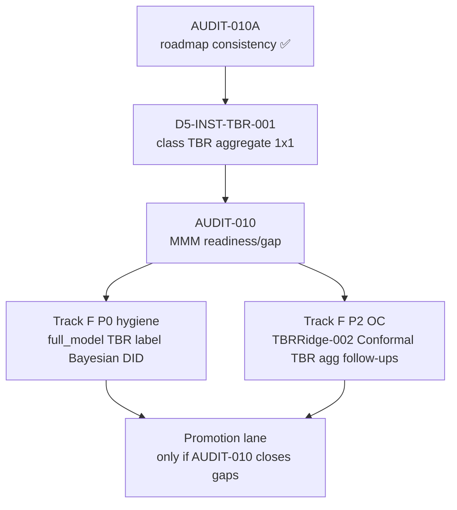

# AUDIT-010A — Roadmap consistency pre-MMM gate

**Audit ID:** AUDIT-010A  
**Type:** Roadmap / governance consistency audit (pre-MMM readiness)  
**Date:** 2026-06-02  
**Branch / baseline:** `fix-kfold-multitreated-geometry` @ `ebc899c` (post Track F + D5-INST-AUGSYNTH-KFOLD-001)  
**Lane:** Governance / documentation only — **not** a production or MMM promotion gate  

**Related:** [`AUDIT-010`](AUDIT-010_mmm_readiness_gap.md) (planned MMM **readiness/gap** audit — **Appendix A = 30-tuple authoritative matrix**) · [`TRACK_F_ESTIMATOR_INFERENCE_COMPLETION_PLAN_001.md`](TRACK_F_ESTIMATOR_INFERENCE_COMPLETION_PLAN_001.md)

---

## ADR decision record

| Field | Value |
|-------|--------|
| **Context** | Since AUDIT-009, the program completed D5 design geometry (MCELL, supergeo, trim), full estimator/inference inventory, COMBO compatibility audit, conceptual validity audit, Track F implementation planning, and AugSynthCVXPY+Kfold OC. AUDIT-010 was reframed from promotion gate → **MMM readiness/gap**. Material drift risk before D5-INST-TBR-001. |
| **Decision** | Run AUDIT-010A now; apply **minor documentation corrections**; publish corrected next-step sequence. |
| **Consequences** | D5-INST-TBR-001 and AUDIT-010 proceed on aligned docs; Track F P0 hygiene explicitly **follows** AUDIT-010, not before TBR-001. |
| **Alternatives rejected** | Skipping audit and proceeding to TBR-001; treating AUDIT-010A as MMM approval. |

---

## 1. Executive summary

**Overall verdict:** `continue_with_minor_corrections`

The roadmaps are **substantially aligned** on the core governance story:

- **MMM ingestion is blocked** until AUDIT-010 gaps close.
- **CalibrationSignal** remains **`SCM_UnitJackKnife` null_monitor_only**.
- **AugSynthCVXPY** point/JK/Kfold are **diagnostic/restricted comparators**, not MMM candidates.
- **Class TBR** aggregate path is **pending D5-INST-TBR-001**.
- **BayesianTBR / TROP** remain **research_only**.
- **supergeo / trimmedmatch** remain **characterization_required** for flat SCM+JK readout.
- **Multi-cell** remains **per-cell only**.

**Corrections required (14 findings, all doc-level):** stale “Next: D5-MCELL” lines; ROADMAP_DESIGN §13 Kfold still labeled `valid_candidate`; Track F sequence diagram implied **P0 hygiene before TBR-001**; ROADMAP_V4 next steps omitted completed Kfold OC and AUDIT-010A; scattered “before MMM intake promotion” wording without readiness/gap qualifier.

**No blockers** to starting **D5-INST-TBR-001** after this audit’s doc fixes land.

---

## 2. Scope and inputs

| Input | Role |
|-------|------|
| [`ROADMAP_V4.md`](ROADMAP_V4.md) | Primary program sequence |
| [`MIP_AUDIT_REGISTRY.md`](MIP_AUDIT_REGISTRY.md) | Audit index + D5 checkpoints |
| [`ROADMAP_DESIGN_READOUT_UPDATE_001.md`](ROADMAP_DESIGN_READOUT_UPDATE_001.md) | Design × geometry × instrument framing |
| [`TRACK_D_METHOD_INVENTORY_AND_ROBUSTNESS_MATRIX_001.md`](TRACK_D_METHOD_INVENTORY_AND_ROBUSTNESS_MATRIX_001.md) | D inventory |
| [`TRACK_E_METHOD_SUITABILITY_AND_TRIANGULATION_001.md`](TRACK_E_METHOD_SUITABILITY_AND_TRIANGULATION_001.md) | E program |
| [`TRACK_E_E2_METHOD_DESIGN_SUITABILITY_CARDS_001.md`](TRACK_E_E2_METHOD_DESIGN_SUITABILITY_CARDS_001.md) | Instrument cards |
| [`TRACK_F_ESTIMATOR_INFERENCE_COMPLETION_PLAN_001.md`](TRACK_F_ESTIMATOR_INFERENCE_COMPLETION_PLAN_001.md) | Implementation plan |
| [`TRACK_D_CONCEPTUAL_VALIDITY_AUDIT_001.md`](TRACK_D_CONCEPTUAL_VALIDITY_AUDIT_001.md) | Literature fidelity |
| D5-INST-* reports (AUDIT, COMBO, AUGSYNTH, AUGSYNTH-KFOLD, TBRRIDGE, PLACEBO) | OC evidence |
| D5-MCELL, D5-DES-SUPERGEO, D5-DES-TRIM reports | Geometry OC |

**Non-goals:** Production code; estimator/inference changes; TrustReport; MMM ingestion; promotion.

---

## 3. Audit checklist (14 checks)

| # | Check | Result | Notes |
|---|-------|--------|-------|
| 1 | **Sequence:** TBR-001 → AUDIT-010 (readiness/gap) → Track F P0 → P2 OC | **minor_fix** | Track F §12 diagram had P0→TBR; corrected |
| 2 | **No doc implies MMM ingestion now allowed** | **pass** | All primary docs block MMM pending AUDIT-010 |
| 3 | **CalibrationSignal beyond SCM+JK null-monitor** | **pass** | E5 + nominal registry unchanged |
| 4 | **AugSynth point/JK/Kfold diagnostic/restricted** | **pass** | E2 INST-004 + KFOLD-001 report aligned |
| 5 | **Normal TBR pending D5-INST-TBR-001** | **pass** | COMBO + CV-001 + Track F agree |
| 6 | **BayesianTBR / TROP research_only** | **pass** | AUDIT-001 + COMBO + CV-001 |
| 7 | **supergeo / trim characterization_required** | **pass** | E2 GEO-003/004; D5-DES-* complete |
| 8 | **Multi-cell per-cell only** | **pass** | MCELL-001 + E2 GEO-002 |
| 9 | **TBR ≠ TBRRidge** | **pass** | Documented; **F-P0-002** recovery_runner still open |
| 10 | **Registry Bayesian ≠ BayesianTBR MCMC** | **pass** | INV-015; COMBO research_only |
| 11 | **DID bootstrap deferred/restricted** | **pass** | DEF-003; deferred D5-INST-DID-001 |
| 12 | **Track E statuses match D5/Track F** | **pass** | Minor Part C3 COMBO wording updated |
| 13 | **Open follow-ups tracked** | **minor_fix** | Stale MCELL “Next” lines in registry |
| 14 | **Priority order defensible** | **pass** | Corrected sequence in §5 |

---

## 4. Findings register

| ID | Severity | Finding | Correction |
|----|----------|---------|------------|
| **010A-FIND-001** | medium | Track F §12 mermaid: `P0 → TBR → AUDIT-010` implies hygiene before TBR-001 | Reorder to TBR-001 → AUDIT-010A → AUDIT-010 → Track F P0 → P2 |
| **010A-FIND-002** | low | `MIP_AUDIT_REGISTRY` AUDIT-009 / SUPERGEO / TRIM **Next:** still cite D5-MCELL (✅ done) | Update to instrument/TBR/AUDIT-010 chain |
| **010A-FIND-003** | low | `ROADMAP_DESIGN_READOUT` §13: AugSynth+Kfold still **valid OC candidate** | Mark **characterized restricted** (KFOLD-001 ✅) |
| **010A-FIND-004** | low | `ROADMAP_V4` Track D next steps omit ~~AUGSYNTH-KFOLD-001~~ and AUDIT-010A | Add completed Kfold + this audit |
| **010A-FIND-005** | low | `ROADMAP_V4` periodic audit cadence: “before MMM intake” without readiness/gap | Clarify “before MMM intake **readiness/gap audit**” |
| **010A-FIND-006** | low | `AUDIT-009` follow-up: “MMM intake promotion” | Clarify readiness/gap framing |
| **010A-FIND-007** | info | `ROADMAP_V4` Phase 13 “TBRRidge promotion decision” marked **Complete** | Add cross-note: historical governance doc; **not** current MMM/promotion path — superseded by Track D/E/F + AUDIT-010 |
| **010A-FIND-008** | info | `D5_INST_AUDIT_001` tested list omits AugSynthCVXPY+Kfold | Optional cross-link only; not blocking |
| **010A-FIND-009** | info | E2 Part C3: generic “COMBO valid_candidate needs OC” | Kfold row closed; Conformal/TBR combos still open |
| **010A-FIND-010** | info | Track F P2 still lists AUGSYNTH-KFOLD under post-AUDIT-010 bucket | Kfold OC **pre-TBR** is valid (research); P2 bucket = TBRRidge-002 + Conformal |

**No finding** implied early MMM promotion, CalibrationSignal expansion, or AugSynth MMM candidacy.

---

## 5. Corrected next-step sequence (authoritative after 010A)

| Step | Work | Gate type |
|------|------|-----------|
| **0** | ~~AUDIT-010A~~ ✅ | Roadmap consistency |
| **1** | ~~D5-INST-TBR-001~~ ✅ | Research OC — aggregate class TBR only |
| **2** | **AUDIT-010** | MMM **readiness/gap** — executive summary + **Appendix A (30 tuples)** per [`AUDIT-010_mmm_readiness_gap.md`](AUDIT-010_mmm_readiness_gap.md) |
| **3** | **Track F P0** | Implementation hygiene (not automatic promotion) |
| **4** | **Track F P2 OC** | TBRRidge-002; AugSynth Conformal; remaining COMBO valid_candidates |
| **5** | **Promotion lane** | Separate governed milestones **only if** AUDIT-010 prerequisites met |

**Explicit non-steps:** MMM ingestion · CalibrationSignal expansion · `production_safe` labels · treating diagnostic comparators as MMM candidates.

---

## 6. Cross-track alignment matrix

| Topic | Track D | Track E | Track F | AUDIT-010 |
|-------|---------|---------|---------|-----------|
| SCM+JK | null-monitor reference (001e) | INST-001 suitable_with_caveats | HOLD | null_monitor_only intake candidate |
| AugSynth point/JK | diagnostic (AUGSYNTH-001) | INST-004 diagnostic_only | HOLD | diagnostic only |
| AugSynth Kfold | restricted (KFOLD-001) | INST-004 restricted | HOLD | diagnostic only |
| TBRRidge Kfold/BRB | restricted (TBRRIDGE-001) | INST-002/003 restricted | HOLD | restricted diagnostic |
| Class TBR | **pending TBR-001** | not carded | FIX P1 | gap until OC |
| MMM | blocked | CalibrationSignal only | blocked | readiness/gap audit |
| supergeo/trim | design OC done | characterization_required | BLOCK readout | block flat SCM+JK |

**Verdict:** No material disagreement after corrections.

---

## 7. AUDIT-010 readiness inputs (for step 2)

AUDIT-010 should consume:

1. [`TRACK_F_ESTIMATOR_INFERENCE_COMPLETION_PLAN_001.md`](TRACK_F_ESTIMATOR_INFERENCE_COMPLETION_PLAN_001.md) — FIX/BLOCK/HOLD matrix  
2. [`TRACK_D_CONCEPTUAL_VALIDITY_AUDIT_001.md`](TRACK_D_CONCEPTUAL_VALIDITY_AUDIT_001.md) — blocking deviations  
3. [`D5_INST_COMBO_AUDIT_001_REPORT.md`](track_d/D5_INST_COMBO_AUDIT_001_REPORT.md) — curated compatibility  
4. **D5-INST-TBR-001** report (when complete)  
5. Completed instrument OC: 001e, PLACEBO, AUGSYNTH, AUGSYNTH-KFOLD, TBRRIDGE, MCELL, supergeo, trim  

**AUDIT-010 is not:** a promotion gate · a CalibrationSignal expansion · MMM green-light by default.

---

## 8. Corrections applied (this audit package)

| Document | Change |
|----------|--------|
| [`ROADMAP_V4.md`](ROADMAP_V4.md) | Next steps + periodic audit wording + Phase 13 historical note |
| [`MIP_AUDIT_REGISTRY.md`](MIP_AUDIT_REGISTRY.md) | AUDIT-010A row; stale Next lines; last updated |
| [`ROADMAP_DESIGN_READOUT_UPDATE_001.md`](ROADMAP_DESIGN_READOUT_UPDATE_001.md) | §13 Kfold status; §15 AUDIT-010A |
| [`TRACK_F_ESTIMATOR_INFERENCE_COMPLETION_PLAN_001.md`](TRACK_F_ESTIMATOR_INFERENCE_COMPLETION_PLAN_001.md) | §12 sequence corrected |
| [`TRACK_E_E2_METHOD_DESIGN_SUITABILITY_CARDS_001.md`](TRACK_E_E2_METHOD_DESIGN_SUITABILITY_CARDS_001.md) | Part C3 COMBO note refined |

---

## 9. Stop condition (met)

The audit states the roadmap is **internally consistent** after minor corrections and publishes the **corrected next-step sequence** (§5). **Proceed to D5-INST-TBR-001.**

---

*AUDIT-010A v1.0.0 — docs-only; baseline `ebc899c`*
