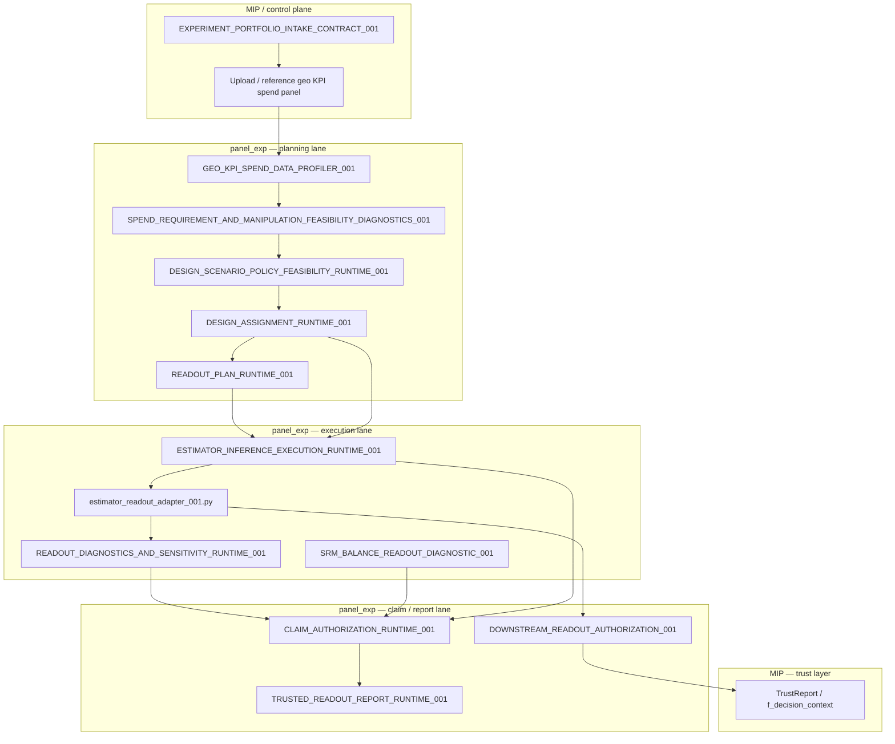

# GEOX_READOUT_DATAFLOW_AND_SPEND_EXTRACTION_PROCESS_AUDIT_001

**Artifact ID:** `GEOX_READOUT_DATAFLOW_AND_SPEND_EXTRACTION_PROCESS_AUDIT_001`  
**Type:** Lightweight process audit (docs only)  
**Lane:** Lane B — Final trusted readout / spend / ROI readiness  
**Date:** 2026-07-09  
**Base commit:** `96326d9` (Add TBRRidge claim authorization boundary audit)  
**Prerequisite:** [`FINAL_TEST_RESULTS_EXISTING_ARTIFACT_REUSE_AUDIT_001.md`](FINAL_TEST_RESULTS_EXISTING_ARTIFACT_REUSE_AUDIT_001.md)  
**Final verdict:** `NEEDS_EXISTING_MODULE_REUSE`  
**Recommended next artifact:** `GEOX_FINAL_TEST_RESULTS_SPEND_AND_ROI_READINESS_CONTRACT_001`

---

## Search commands used

```bash
cd /workspace/panel_exp
git status --short
git log --oneline --decorate -10

grep -R "readout\|trusted readout\|TRUSTED_READOUT\|ESTIMATOR_INFERENCE_EXECUTION\|estimator_readout_adapter\|CLAIM_AUTHORIZATION\|GEO_KPI_SPEND_DATA\|spend\|budget\|campaign\|ROI\|ROAS\|cost per\|lift\|incremental\|counterfactual\|delta_mu\|observed\|post period\|test_start\|test_end\|assignment\|treatment_cell\|control\|geo_id\|date filter\|window" docs panel_exp tests -n || true

find . -maxdepth 5 -type f | grep -Ei "readout|report|result|spend|budget|campaign|roi|roas|lift|incremental|counterfactual|assignment|window|adapter|contract|runtime|profiler|claim" || true

# Targeted follow-up
grep -R "post.?test\|post_test\|test_window\|planned_test_start\|spend_delta\|actual.*spend\|treatment_spend" docs panel_exp tests -n || true
```

---

## 1. Audit purpose

This audit maps the **operational dataflow** for how KPI and spend data enter readout, how post-test spend would be filtered and aggregated, which existing modules own each step, and what gaps remain — **before** implementing `GEOX_FINAL_TEST_RESULTS_SPEND_AND_ROI_READINESS_CONTRACT_001`.

It answers:

- What path does KPI data take from user/MIP input to final trusted readout?
- What spend capabilities exist today (planning vs post-test)?
- Which deterministic steps for post-test spend extraction are implemented vs missing?
- Where should MIP orchestrate vs where `panel_exp` validates?

---

## 2. Existing readout pipeline

### End-to-end flow (as implemented today)



### Module owners

| Layer | Owner artifact / module | Role |
|---|---|---|
| **Trusted report assembly** | `TRUSTED_READOUT_REPORT_CONTRACT_001` / `trusted_readout_report_runtime_001.py` | Assembles governed final report packet from claim auth + evidence bundles. **No spend/ROI sections today.** |
| **Estimator execution outputs** | `ESTIMATOR_INFERENCE_EXECUTION_RUNTIME_001` | Produces `instrument_execution_results` with `effect_estimate_report`, `uncertainty_report`, `claim_boundary_report`. Requires `assignment_artifact`, panel data contract, estimand reference. |
| **Readout adapter** | `estimator_readout_adapter_001.py` + `readout_boundary_builder_001.py` | Routes native estimator results → governed `ReadoutEvidence` (`point_estimate`, interval, estimand, metadata). |
| **Claim authorization** | `CLAIM_AUTHORIZATION_CONTRACT_001` / `claim_authorization_runtime_001.py` | Decides authorized/restricted/blocked claim types (`ROI_CLAIM`, `INCREMENTAL_LIFT_CLAIM`, etc.). All ROI/lift flags **false**. |
| **KPI/spend profiling** | `GEO_KPI_SPEND_DATA_CONTRACT_AND_PROFILER_SPEC_001` + `geo_kpi_spend_data_profiler_001.py` | Schema/coverage/missingness for geo×date×KPI×spend panel. **Pre-period diagnostics; not post-test spend extraction.** |
| **Spend planning diagnostics** | `SPEND_REQUIREMENT_AND_MANIPULATION_FEASIBILITY_DIAGNOSTICS_001` | Pre-period baseline inventory, `required_spend_delta`, manipulation feasibility (go-dark/heavy-up/etc.). |
| **Estimand registry** | `TRACK_B_ESTIMAND_REGISTRY_001.md` | Canonical estimand IDs (incremental revenue, iROAS bridge, holdout, dosage). |
| **Inference readout semantics** | `INFERENCE_READOUT_SEMANTICS_001.md` | Definitions: observed outcome, counterfactual, point estimate, lift, interval target, null decision. |
| **Readout planning** | `READOUT_PLAN_RUNTIME_001` | Plans instrument stack, prerequisites (`trusted_readout_report_required`), claim scope caveats (dosage/ROI blocked). |
| **Downstream gate** | `DOWNSTREAM_READOUT_AUTHORIZATION_001` | Blocks TrustReport/MMM/production/export without governed readout. |
| **Trust interpretation** | `panel_exp/track_b/trust_report.py`, `f_decision_context.py` | MIP-level trust outcomes; separate from numeric final report. |

---

## 3. User/MIP input collection process

### What should MIP ask at readout time?

Per `EXPERIMENT_PORTFOLIO_INTAKE_CONTRACT_001` and upstream reuse audit, MIP should already have (or re-request if missing):

| Input | When needed | Source contract |
|---|---|---|
| Full geo×date×KPI×spend panel **or** governed data-source reference | Always for spend-aware readout | `GEO_KPI_SPEND_DATA_CONTRACT_*` |
| `assignment_artifact` / unit allocations | Always for execution + spend-by-cell | `DESIGN_ASSIGNMENT_RUNTIME_001` |
| `test_start` / `test_end` (or `planned_test_start_date` + duration) | Post-period filtering | Design spec / experiment metadata |
| Declared estimand + KPI name/unit | Metric mapping | `TRACK_B_ESTIMAND_REGISTRY_001`, readout plan |
| `currency`, `channel`/`campaign` scope | Spend aggregation + ROI | `GEO_KPI_SPEND_DATA_CONTRACT_*` |
| Experiment type / contrast type (go-dark, heavy-up, dosage, reallocation, holdout) | Spend baseline policy | Design scenario / method suitability handoff |
| Claim requests (point estimate, lift, ROI) | Trusted readout sections | `CLAIM_AUTHORIZATION_*` |

MIP should **not** infer feasibility or authorize claims from intake answers alone.

### Required inputs by output type

| Output | Required inputs |
|---|---|
| **KPI lift (absolute)** | Panel KPI data, assignment artifact, post window, governed execution result (`effect_estimate_report` / `delta_mu` via adapter) |
| **KPI lift (%)** | Above + counterfactual baseline or declared fractional estimand + `INFERENCE_READOUT_SEMANTICS_001` scale rules |
| **Cost-per / CPA** | Above + **post-test spend evidence** (`spend_delta` or treatment/control spend totals) — **not implemented** |
| **ROAS** | Incremental revenue estimand + spend_delta + revenue/KPI value mapping — **blocked** (`roi_claim_authorized=false`) |
| **ROI** | Incremental profit + spend_delta + margin mapping + ROI governance — **blocked** |

### Upload vs data-source reference

| Mode | Supported today | Claim ceiling |
|---|---|---|
| **Upload** (full panel CSV/DataFrame) | Yes — `profile_geo_kpi_spend_data(rows=...)` | Downstream diagnostics when profiler passes |
| **Sample schema upload** | Yes | Schema only; no final spend readiness |
| **Ballpark** | Yes | Provisional only |
| **Existing data-source reference** (warehouse/API) | **Contract-level only** — no runtime resolver in `panel_exp` | **MIP_ORCHESTRATION_GAP** — MIP must fetch and pass rows |

Both are expected patterns: MIP resolves the source; `panel_exp` validates the normalized row panel.

### Missing-input messages MIP should return

Derived from runtime failure packets and readiness reports (no single MIP prompt contract exists yet — `LLM_REPORT_GROUNDING_AND_CLAIM_BOUNDARY_CONTRACT_001` is future):

| Missing input | Suggested user-facing message | Owner signal |
|---|---|---|
| No KPI/spend panel | "Upload geo-level KPI and spend history (sample OK) or connect a data source." | `GeoKpiSpendDataProfileReport.profiler_status=BLOCKED` |
| No assignment artifact | "Provide treatment/control assignment per geo unit." | `assignment_artifact_status=MISSING` |
| No test window | "Specify test start and end dates for post-period readout." | `test_window_status=not_specified` |
| No spend column | "Spend column required for cost-per/ROI; missing spend is not zero." | `spend_column_present=false` |
| Mixed currency | "Declare currency mapping before ROI/ROAS." | `currency_status=mixed_currency` |
| Sample/ballpark only | "Full panel required for final spend evidence; current mode is provisional." | `sample_schema_mode` / `ballpark_mode` flags |
| ROI requested | "ROI/ROAS claims are not authorized in current governance state." | `roi_claim_authorized=false` |
| No governed execution | "Run governed estimator execution before final readout." | `CLAIM_BLOCKED_BY_MISSING_EXECUTION` |

---

## 4. panel_exp input validation process

| Validation target | Existing owner | What is checked | Gap |
|---|---|---|---|
| **KPI dataset schema** | `geo_kpi_spend_data_profiler_001.py` | `geo_unit_id`, date, `kpi_value`; grain detection; missingness; duplicates | Post-period KPI rows not separately validated for readout |
| **Spend dataset schema** | Same profiler + `SpendDiagnosticsColumnMapping` | `spend_value`, geo, date; optional `cell_id`, `channel`, `campaign`, `currency`, `period_role` | `test_window_start/end` config exists but **not used to filter** |
| **Experiment metadata** | `readout_plan_runtime_001.py`, execution runtime | `design_id`, estimand reference, instrument IDs, claim scope | No unified `experiment_metadata` packet for readout |
| **Treatment/control assignment** | `assignment_panel_integrity_runtime_001.py`, execution runtime | `assignment_artifact`, `unit_allocations`, integrity gate | Spend join by cell **not wired** to execution |
| **Time windows** | Profiler (`planned_test_start_date` overlap warning); spend diagnostics (`_derive_baseline_window` pre-period only) | Pre-period baseline window derived; post-period **not extracted** | **RUNTIME_GAP** for post-test window spend |
| **Geo scope** | Profiler `GeoUnitInventoryReport`; execution `assignment_artifact_reference` | Eligible geos, coverage | Spend aggregation by assigned geos only — **not implemented** |
| **Treatment cell / campaign / channel scope** | Spend diagnostics groups by `cell_id`, `channel`; design scenario per-cell spend | Planning-time summaries | Post-test filter by campaign/channel — **not implemented** |
| **Currency / value mapping** | Profiler currency detection; spend diagnostics `currency_status` | Single vs mixed currency warning | No FX conversion; ROI margin mapping **not implemented** |

---

## 5. Post-test spend extraction process

### Deterministic steps — implemented vs missing

| Step | Status | Existing module | Notes |
|---|---|---|---|
| 1. **Identify spend source** | **Partial** | MIP intake + `GEO_KPI_SPEND_DATA_PROFILER_001` | Profiler accepts uploaded rows; no warehouse connector in package |
| 2. **Validate spend schema** | **Yes** | `profile_geo_kpi_spend_data()` + `_build_readiness()` | Column mapping, missing≠zero, grain, currency |
| 3. **Map date column** | **Yes** | `SpendDiagnosticsColumnMapping.date`, profiler `ColumnMappingReport` | `_parse_date()` |
| 4. **Filter to test/post period** | **No** | Config fields `test_window_start`, `test_window_end` exist in `SpendRequirementManipulationFeasibilityConfig` | Only sets `test_window_status`; **never passed to `_weekly_spend_totals()`** |
| 5. **Filter to experiment geo scope** | **No** | Assignment artifact has `unit_allocations` | No spend×assignment join runtime |
| 6. **Join treatment/control/cell assignment** | **No** | `cell_id`, `cell_role` columns recognized in spend diagnostics | Used for pre-period grouping only, not post-test contrast |
| 7. **Aggregate spend by required level** | **Partial (pre-period only)** | `_weekly_spend_totals()`, `_build_baseline_inventory()` | Aggregates by overall/geo/cell/channel in **baseline window** |
| 8. **Compute actual_treatment_spend** | **No** | — | Not in any runtime |
| 9. **Compute/validate counterfactual_or_BAU_spend** | **Partial (planning)** | Design scenario `baseline_spend`/`proposed_spend`; spend diagnostics `baseline_mean_weekly_spend` | Planning values only; not post-test observed BAU |
| 10. **Compute spend_delta** | **Partial (planning)** | `required_spend_delta` (user/MMM/advisory); design `_compute_achieved_contrast()` on **proposed** spends | Formulas exist for planning; **no observed post-test spend_delta** |
| 11. **Emit spend readiness status** | **Partial** | `SpendDataReadinessReport`, `BaselineSpendInventoryReport` | Readiness for **planning/power** lane, not final readout |

### Closest reusable primitives (do not reimplement)

```python
# Pre-period date filter (spend_requirement_and_manipulation_feasibility_diagnostics_001.py)
_derive_baseline_window()  # dates < planned_test_start_date OR explicit baseline window

# Windowed weekly aggregation (reusable for post-test if test_window passed)
_weekly_spend_totals(rows, cfg, window_start=..., window_end=..., group_key=..., group_value=...)

# Planning contrast formulas (design_scenario_policy_feasibility_runtime_001.py)
_compute_achieved_contrast(contrast_type, treatment, comparison)
# GO_DARK: comparison_proposed - treatment_proposed
# HEAVY_UP: treatment_proposed - comparison_proposed
# DOSAGE: high - low
# REALLOCATION: source/destination policy dependent
```

**Conclusion:** Post-test spend extraction is a **CONTRACT_GAP + RUNTIME_GAP**. Planning lane owns pre-period baseline and proposed-spend contrast math; no module applies that math to observed post-test rows joined to assignment.

---

## 6. Spend baseline policy by experiment type

Formulas below reflect **existing planning-lane semantics** (`design_scenario_policy_feasibility_runtime_001.py`, `spend_requirement_and_manipulation_feasibility_diagnostics_001.py`). Post-test observed variants are **not implemented** — shown as intended policy for the readiness contract.

| Experiment type | Required spend baseline | spend_delta formula (planning / intended post-test) | Blocking gaps |
|---|---|---|---|
| **go-dark** | BAU/control `baseline_spend` or pre-period mean weekly spend (`max_reducible_spend`) | Planning: `comparison_proposed − treatment_proposed`; post-test intended: `BAU_observed − treatment_observed` in test window | No post-test filter; manipulated BAU → `ESTIMAND_SHIFT_REQUIRED` |
| **heavy-up** | Pre-period `baseline_mean_weekly_spend` | Planning: `treatment_proposed − comparison_proposed`; post-test intended: `treatment_observed − BAU_observed` | Historical support checks only on planning values |
| **holdout** | Holdout cell vs exposed BAU (`holdout.incremental_revenue.*` estimand) | Intended: `exposed_spend − holdout_spend` or opportunity-cost BAU | Holdout spend semantics placeholder in estimand registry (INV-023) |
| **dosage** | Low vs high policy spend levels (`low_spend_policy`, `high_spend_policy`) | `high − low` (dosage_delta) | Standard incrementality blocked; `DOSAGE_CONTRAST_ESTIMAND_REQUIRED` |
| **reallocation** | Source channel reduction + destination increase; requires `budget_source_channel` / `budget_destination_channel` | Policy-dependent; planning uses `abs(treatment − comparison)` or source/dest rules | `BUDGET_REALLOCATION_MAPPING_INCOMPLETE` if mapping missing; blocks simple ROI |

---

## 7. Metric output readiness logic

| Output metric | Required inputs | Owner | Blocked status |
|---|---|---|---|
| **absolute_increment** | Governed `point_estimate` / `delta_mu`, estimand declaration, assignment, post window | `ESTIMATOR_INFERENCE_EXECUTION_RUNTIME_001` + adapter | Available at diagnostic/restricted levels; production blocked by catalog/promotion |
| **lift_pct** | `delta_mu` + counterfactual KPI or fractional estimand + scale semantics | `INFERENCE_READOUT_SEMANTICS_001` + readout mapper (implicit in adapter metadata) | `INCREMENTAL_LIFT_CLAIM` blocked (`incremental_lift_claim_authorized=false`) |
| **cost_per_incremental_kpi** | `delta_mu` + **post-test `spend_delta`** + currency | **No owner** — needs readiness contract + thin adapter | **BLOCKED** — no spend_delta at readout |
| **ROAS** | Incremental revenue + `spend_delta` + revenue/KPI bridge | Estimand `cls.incremental_roas.*`; claim auth | `roi_claim_authorized=false`; INV-023 MMM bridge |
| **ROI** | Incremental profit + `spend_delta` + margin mapping + ROI governance | Claim auth `ROI_CLAIM`; readout plan `roi_governance_status` | `CLAIM_BLOCKED_BY_ROI_GOVERNANCE`; `roi_computed=false` |

---

## 8. Ownership map

| Step | MIP owner? | panel_exp owner? | Existing module/artifact | Gap |
|---|---:|---:|---|---|
| User asks readout | **yes** | no | `EXPERIMENT_PORTFOLIO_INTAKE_CONTRACT_001` | No readout-specific intake branch |
| Collect/upload KPI | **yes** | no | Intake → profiler input | Data-source resolver is MIP |
| Collect/upload spend | **yes** | no | Same panel or separate spend feed | Post-test spend feed not distinguished |
| Schema validation | no | **yes** | `GEO_KPI_SPEND_DATA_PROFILER_001` | — |
| Date filtering (post-test) | no | **yes** (should be) | Config stub in spend diagnostics | **RUNTIME_GAP** — not implemented |
| Treatment assignment join | no | **yes** | `DESIGN_ASSIGNMENT_RUNTIME_001`, execution runtime | Spend×assignment join missing |
| Counterfactual estimation (KPI) | no | **yes** | Estimators + `estimator_readout_adapter_001.py` | — |
| spend_delta derivation | no | **yes** (should be) | Planning: spend diagnostics + design scenario | **RUNTIME_GAP** for observed spend |
| Final metric mapping | no | **yes** | Trusted readout + semantics + estimand registry | ROI/spend fields absent |
| Claim authorization | consumes | **yes** | `CLAIM_AUTHORIZATION_RUNTIME_001` | — |
| User explanation | **yes** | no | Future `LLM_REPORT_GROUNDING_*` | **MIP_ORCHESTRATION_GAP** |

---

## 9. Gap list

| Gap | Classification | Detail |
|---|---|---|
| Post-test spend window filter | **RUNTIME_GAP** | `test_window_start/end` unused for aggregation |
| Spend×assignment join | **RUNTIME_GAP** | No module joins spend rows to `unit_allocations` / `cell_id` for test period |
| `actual_treatment_spend` / observed `spend_delta` | **RUNTIME_GAP** | No computation anywhere |
| Post-test spend evidence contract | **CONTRACT_GAP** | Needed before `GEOX_FINAL_TEST_RESULTS_SPEND_AND_ROI_READINESS_CONTRACT_001` implementation |
| Readout-time MIP input resolver | **MIP_ORCHESTRATION_GAP** | No prompt contract for readout-specific missing inputs |
| Data-source reference (non-upload) | **MIP_ORCHESTRATION_GAP** | Package expects rows; MIP must fetch |
| Trusted readout spend/ROI sections | **CONTRACT_GAP** | Extend `TRUSTED_READOUT_REPORT_*` per reuse audit |
| ROI/ROAS claim authorization | **NO_GAP (intentionally blocked)** | Do not duplicate; keep `roi_claim_authorized=false` |
| Pre-period spend baseline | **NO_GAP** | `SPEND_REQUIREMENT_AND_MANIPULATION_FEASIBILITY_DIAGNOSTICS_001` |
| KPI execution path | **NO_GAP** | Execution runtime + adapter |
| Claim status ownership | **NO_GAP** | `CLAIM_AUTHORIZATION_RUNTIME_001` |
| Package vs MIP trust boundary | **DOC_ONLY_GAP** | Documented in reuse audit; TrustReport ≠ final numeric report |
| Holdout spend semantics | **OWNER_DECISION_GAP** | Estimand placeholder INV-023 |

---

## 10. Recommended implementation sequence

Ordered steps — **reuse existing modules; add thin contract + adapter only:**

1. **Define readout input requirements** — extend intake/readout handoff doc: required fields for KPI lift vs cost-per/ROI (assignment, test window, currency, channel scope). Artifact: `GEOX_FINAL_TEST_RESULTS_SPEND_AND_ROI_READINESS_CONTRACT_001` §input requirements.

2. **Define post-test spend evidence contract** — bind to `GEO_KPI_SPEND_DATA_*` schema, `SpendDiagnosticsColumnMapping`, assignment artifact refs, experiment-type baseline policy (§6 table). Explicitly separate planning `required_spend_delta` from observed `spend_delta`.

3. **Implement spend extraction/readiness adapter** — thin function reusing `_weekly_spend_totals()` + `_derive_baseline_window()` pattern with **test window** + assignment join; emit `PostTestSpendEvidenceReport` readiness status. **Not a new spend ingestion system.**

4. **Extend trusted readout contract** — optional spend evidence bundle + redaction rules in `TRUSTED_READOUT_REPORT_CONTRACT_001`; wire into runtime evidence IDs.

5. **Wire claim authorization statuses** — feed spend readiness into `ROI_CLAIM` / `INCREMENTAL_LIFT_CLAIM` evidence checks without changing authorization logic.

6. **Update MIP orchestration prompt/input resolver** — after `LLM_REPORT_GROUNDING_AND_CLAIM_BOUNDARY_CONTRACT_001` or interim MIP note: missing-input messages from §3.

---

## 11. Non-goals

Confirmed:

- [x] No new final-results owner (extend `TRUSTED_READOUT_REPORT_*`)
- [x] No new spend ingestion system unless no source exists (reuse uploaded panel / MIP-resolved rows)
- [x] No duplicated claim authorization
- [x] No ROI claim authorization
- [x] No production decisioning

Also: no code changed in this audit; no roadmap/governance changes; no git commit.

---

## 12. Final verdict

**`NEEDS_EXISTING_MODULE_REUSE`**

**Why not the other verdicts:**

| Verdict | Why not |
|---|---|
| `READY_FOR_THIN_READINESS_CONTRACT` | Close, but post-test extraction steps are unmapped in code — contract must reference concrete reuse targets first (this audit). |
| `BLOCKED_MISSING_READOUT_INPUT_OWNER` | Readout input owners exist (intake, profiler, execution, trusted readout). |
| `BLOCKED_MISSING_SPEND_SOURCE_OWNER` | Spend **source** exists (`GEO_KPI_SPEND_DATA_*`); gap is **post-test extraction**, not source. |
| `BLOCKED_PACKAGE_MIP_OWNERSHIP_UNCLEAR` | Ownership is clear: MIP collects/resolves; package validates/aggregates/authorizes. |

**Recommended next artifact:** `GEOX_FINAL_TEST_RESULTS_SPEND_AND_ROI_READINESS_CONTRACT_001` — thin contract specifying readout input requirements, post-test spend evidence bindings, experiment-type baseline policy, and trusted-readout extension points, reusing `GEO_KPI_SPEND_DATA_*`, `SPEND_REQUIREMENT_AND_MANIPULATION_FEASIBILITY_*` primitives, and `TRUSTED_READOUT_REPORT_*`.

---

## Return payload

| Item | Result |
|---|---|
| **Existing modules/artifacts** | `TRUSTED_READOUT_REPORT_*`, `ESTIMATOR_INFERENCE_EXECUTION_RUNTIME_001`, `estimator_readout_adapter_001.py`, `CLAIM_AUTHORIZATION_RUNTIME_001`, `GEO_KPI_SPEND_DATA_PROFILER_001`, `SPEND_REQUIREMENT_AND_MANIPULATION_FEASIBILITY_DIAGNOSTICS_001`, `DESIGN_SCENARIO_POLICY_FEASIBILITY_RUNTIME_001`, `DESIGN_ASSIGNMENT_RUNTIME_001`, `READOUT_PLAN_RUNTIME_001`, `INFERENCE_READOUT_SEMANTICS_001`, `TRACK_B_ESTIMAND_REGISTRY_001` |
| **Exact KPI dataflow** | MIP intake/upload → profiler schema validation → design/assignment → readout plan → execution runtime → adapter → diagnostics/SRM → claim authorization → trusted readout report |
| **Exact spend dataflow (today)** | Same panel → profiler → spend diagnostics (**pre-period baseline only**) → design scenario (**proposed spend**) → **stops**; not consumed by trusted readout or execution |
| **Post-test spend extraction** | **11-step process defined; steps 4–8 and 10 unimplemented**; steps 1–3, 9, 11 partial via planning lane |
| **Owner map** | §8 — MIP collects; package validates KPI path fully; spend post-test is package gap |
| **Gaps** | §9 — primary: `RUNTIME_GAP` (post-test filter/join/delta), `CONTRACT_GAP` (readiness + trusted readout extension), `MIP_ORCHESTRATION_GAP` (readout prompts) |
| **Safe to proceed?** | **Yes** — implement readiness **contract** next, then thin adapter reusing `_weekly_spend_totals` / `_compute_achieved_contrast` patterns; do not build new spend module |

---

## Files inspected (representative)

- `panel_exp/validation/geo_kpi_spend_data_profiler_001.py`
- `panel_exp/validation/spend_requirement_and_manipulation_feasibility_diagnostics_001.py`
- `panel_exp/validation/design_scenario_policy_feasibility_runtime_001.py`
- `panel_exp/validation/estimator_inference_execution_runtime_001.py`
- `panel_exp/validation/estimator_readout_adapter_001.py`
- `panel_exp/validation/trusted_readout_report_runtime_001.py`
- `panel_exp/validation/claim_authorization_runtime_001.py`
- `panel_exp/validation/readout_plan_runtime_001.py`
- `panel_exp/track_b/readout_evidence_wiring.py`
- `docs/track_d/GEO_KPI_SPEND_DATA_CONTRACT_AND_PROFILER_SPEC_001_REPORT.md`
- `docs/track_d/EXPERIMENT_PORTFOLIO_INTAKE_CONTRACT_001_REPORT.md`
- `docs/track_d/SPEND_REQUIREMENT_AND_MANIPULATION_FEASIBILITY_CONTRACT_001_REPORT.md`
- `docs/INFERENCE_READOUT_SEMANTICS_001.md`
- `docs/TRACK_B_ESTIMAND_REGISTRY_001.md`
- `docs/track_d/FINAL_TEST_RESULTS_EXISTING_ARTIFACT_REUSE_AUDIT_001.md`
- `tests/validation/test_spend_requirement_and_manipulation_feasibility_diagnostics_001.py`
